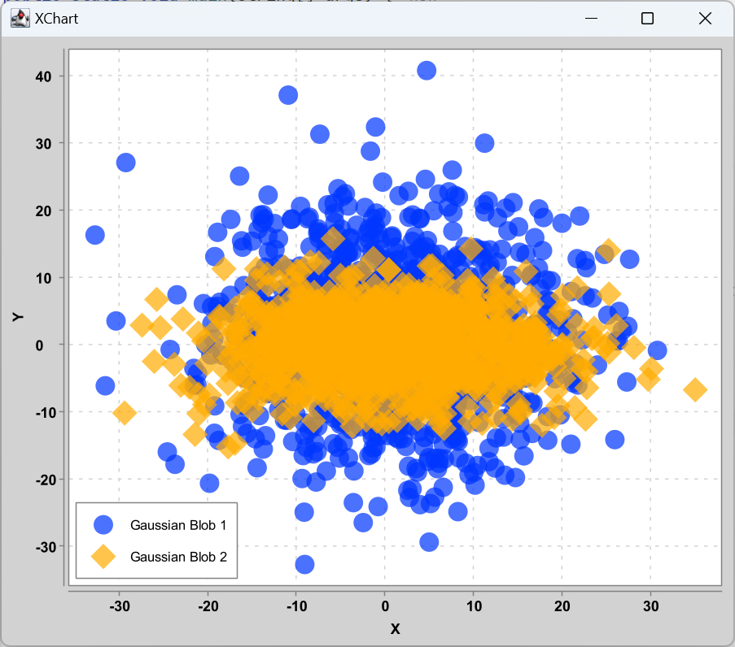

# XChart 指南

- [XChart 指南](#xchart-指南)
  - [1. 简单示例](#1-简单示例)
  - [2. 稍微复杂的示例](#2-稍微复杂的示例)
  - [3. 高级示例](#3-高级示例)
  - [4. Chart Types](#4-chart-types)
    - [4.1 XYChart](#41-xychart)
    - [4.2 CategoryChart](#42-categorychart)
    - [4.3 PieChart](#43-piechart)
    - [4.4 BubbleChart](#44-bubblechart)
    - [4.5 DialChart](#45-dialchart)
    - [4.6 RadarChart](#46-radarchart)
    - [4.7 OHLCChart](#47-ohlcchart)
    - [4.8 BoxChart](#48-boxchart)
    - [4.9 HeatMapChart](#49-heatmapchart)
  - [5. 实时 Chart](#5-实时-chart)
  - [6. 自定义样式](#6-自定义样式)
    - [6.1 Axis Tick Label](#61-axis-tick-label)
    - [6.2 Multiple Axes](#62-multiple-axes)
    - [6.3 缩放](#63-缩放)
    - [6.4 注释](#64-注释)
    - [6.5 Tool Tips](#65-tool-tips)
    - [6.6 Cursor](#66-cursor)
  - [7. Chart 主题](#7-chart-主题)

2024-06-13
@author Jiawei Mao
***

## 1. 简单示例

使用 `QuickChart` 创建 `XYChart` 实例，添加数据，然后显示会保存为图片：

```java
import org.knowm.xchart.BitmapEncoder;
import org.knowm.xchart.QuickChart;
import org.knowm.xchart.SwingWrapper;
import org.knowm.xchart.XYChart;

import java.io.IOException;

public class SimpleExample {
    public static void main(String[] args) throws IOException {

        double[] xData = new double[]{0.0, 1.0, 2.0};
        double[] yData = new double[]{2.0, 1.0, 0.0};

        // Create Chart
        XYChart chart = QuickChart.getChart("Sample Chart", "X", "Y", "y(x)",
                xData, yData);

        // Show it
        new SwingWrapper(chart).displayChart();

        // Save it
        BitmapEncoder.saveBitmap(chart, "./Sample_Chart",
                BitmapEncoder.BitmapFormat.PNG);

        // or save it in high-res
        BitmapEncoder.saveBitmapWithDPI(chart, "./Sample_Chart_300_DPI",
                BitmapEncoder.BitmapFormat.PNG, 300);
    }
}
```


## 2. 稍微复杂的示例

用 `XYChartBuilder` 创建 `XYChart`，设置样式，添加 series，设置 series 样式，然后显示图表。

```java
public class IntermediateExample {
    static final Random random = new Random();

    public static void main(String[] args) {
        // Create Chart
        XYChart chart = new XYChartBuilder()
                .width(600)
                .height(500)
                .title("Gaussian Blobs")
                .xAxisTitle("X")
                .yAxisTitle("Y")
                .build();

        // Customize Chart
       chart.getStyler().setDefaultSeriesRenderStyle(XYSeries.XYSeriesRenderStyle.Scatter);
        chart.getStyler().setChartTitleVisible(false);
        chart.getStyler().setLegendPosition(Styler.LegendPosition.InsideSW);
        chart.getStyler().setMarkerSize(16);

        // Series
        chart.addSeries("Gaussian Blob 1",
                getGaussian(1000, 1, 10),
                getGaussian(1000, 1, 10));
        XYSeries series = chart.addSeries("Gaussian Blob 2",
                getGaussian(1000, 1, 10),
                getGaussian(1000, 0, 5));
        series.setMarker(SeriesMarkers.DIAMOND);

        new SwingWrapper(chart).displayChart();
    }

    private static List<Double> getGaussian(int number, double mean, double std) {
        List<Double> seriesData = new LinkedList<>();
        for (int i = 0; i < number; i++) {
            seriesData.add(mean + std * random.nextGaussian());
        }

        return seriesData;
    }
}
```



## 3. 高级示例

使用 `XYChartBuilder` 创建 `XYChart`，设置 chart 样式，添加 series，将 chart 添加到 `XChartPanel`，将其嵌入 Java Swing 应用，在 GUI 中显示。

```java
public class AdvancedExample {
    public static void main(String[] args) {
        // Create Chart
        final XYChart chart = new XYChartBuilder()
                .width(600)
                .height(400)
                .title("Area Chart")
                .xAxisTitle("X")
                .yAxisTitle("Y")
                .build();

        // Customize Chart
        chart.getStyler().setLegendPosition(LegendPosition.InsideNE);
        chart.getStyler().setDefaultSeriesRenderStyle(XYSeriesRenderStyle.Area);

        // Series
        chart.addSeries("a", new double[]{0, 3, 5, 7, 9}, new double[]{-3, 5, 9, 6, 5});
        chart.addSeries("b", new double[]{0, 2, 4, 6, 9}, new double[]{-1, 6, 4, 0, 4});
        chart.addSeries("c", new double[]{0, 1, 3, 8, 9}, new double[]{-2, -1, 1, 0, 1});

        // Schedule a job for the event-dispatching thread:
        // creating and showing this application's GUI.
        javax.swing.SwingUtilities.invokeLater(() -> {
            // Create and set up the window.
            JFrame frame = new JFrame("Advanced Example");
            frame.setLayout(new BorderLayout());
            frame.setDefaultCloseOperation(WindowConstants.EXIT_ON_CLOSE);

            // chart
            JPanel chartPanel = new XChartPanel<>(chart);
            frame.add(chartPanel, BorderLayout.CENTER);

            // label
            JLabel label = new JLabel("Blah blah blah.", SwingConstants.CENTER);
            frame.add(label, BorderLayout.SOUTH);

            // Display the window.
            frame.pack();
            frame.setVisible(true);
        });
    }
}
```


动态图表：

- 调用 `XYChart` 实例的 `updateXYSeries` 更新数据；
- 调用 `XYChartPanel` 的 `revalidate()` 和 `repaint()` 重绘。

## 4. Chart Types

目前有 5 种主要类型的 chart，每种类型都有对应的 `ChartBuilder`, `Styler` 和 `Series`。

| Chart Type    | Builder              | Styler         | Series         | Allowed Data Types   | Default Series Render Style |
| ------------- | -------------------- | -------------- | -------------- | -------------------- | --------------------------- |
| XYChart       | XYChartBuilder       | XYStyler       | XYSeries       | Number, Date         | Line                        |
| CategoryChart | CategoryChartBuilder | CategoryStyler | CategorySeries | Number, Date, String | Bar                         |
| PieChart      | PieChartBuilder      | PieStyler      | PieSeries      | String               | Pie                         |
| BubbleChart   | BubbleChartBuilder   | BubbleStyler   | BubbleSeries   | Number, Date         | Round                       |
| DialChart     | DialChartBuilder     | DialStyler     | DialSeries     | double               | Round                       |
| RadarChart    | RadarChartBuilder    | RadarStyler    | RadarSeries    | double[]             | Round                       |
| OHLCChart     | OHLCChartBuilder     | OHLCStyler     | OHLCSeries     | OHLC with Date       | Candle                      |
| BoxChart      | BoxChartBuilder      | BoxStyler      | BoxSeries      | Number, Date, String | Box                         |
| HeatMapChart  | HeatMapChartBuilder  | HeatMapStyler  | HeatMapSeries  | Number, Date, String | --                          |

不同 Styler 包含特定 chart 类型的样式设置方法。

### 4.1 XYChart


`XYChart` 的 X 轴采用 `Number` 或 `Date` 数据类型，Y 轴采用 `Number` 数据类型。

对两个轴，都自动生成 tick-marks，均匀分布在整个数据范围。

Series Render Styles 包括：`Line`, `Scatter`, `Area`, `Step` 和 `StepArea`。

### 4.2 CategoryChart


`CategoryChart`  的 X 轴支持 Date, Number, String 数据类型，Y 轴为 Number 数据类型。

对 X 轴，每个 category 都有一个 tick-mark。

Series Render Styles 包括：`Bar`, `Line`, `Scatter`, `Area` 和 `Stick`。

### 4.3 PieChart


`PieChart` 采用 `String` 类型数据作为 slice-name，`Number` 类型数据作为 slice-value。

Series Render Styles 包括：`Pie`, `Donut`。

### 4.4 BubbleChart


`BubbleChart` ：

- X 轴数据类型：Date, Number
- Y 轴数据类型：Number

Series Render Style:

- `Round`
- `Square`

### 4.5 DialChart


`DialChart`：

- double：设置 dial pointer 位置
- String: 设置 label

### 4.6 RadarChart


`RadarChart`：

- `double[]`: 0 到 1 之间的值，用来设置数据位置；
- `String[]`：设置 labels

Render styles:

- `Polygon`
- `Circle`

### 4.7 OHLCChart


`OHLCChart`:

- X 轴：Date
- Y 轴：4 个 Number 数据

Series Render Styles:

- Candle
- HiLo

### 4.8 BoxChart


`BoxChart`：

- X 轴：String 数据（series-names）
- Y 轴：Number 数据

每个 box 从对应的 series 的 yData 计算。

通过 BoxChartBuilder 创建 BoxChart，设置样式，添加 series：

```java
// Create Chart
BoxChart chart =
        new BoxChartBuilder().title("box plot demo").build();

// Choose a calculation method
chart.getStyler().setBoxplotCalCulationMethod(BoxplotCalCulationMethod.N_LESS_1_PLUS_1);
chart.getStyler().setToolTipsEnabled(true);

// Series
chart.addSeries("boxOne",Arrays.asList(1,2,3,4));
new SwingWrapper<BoxChart>(chart).displayChart();
```

boxplot 的计算方式：

- "N_PLUS_1"：使用 $Q_i=i(n+1)/4$ 计算四分位数的位置，其中 $i=1,2,3$。n 表示数据个数，根据位置计算相应的四分位数；
- "N_LESS_1"：使用 $Q_i=i(n-1)/4$ 计算四分位数的位置，其中 $i=1,2,3$。n 表示数据个数，根据位置计算相应的四分位数；
- "NP"：使用 $np=i*n/4$ 计算四分位数的位置，其中 $i=1,2,3$。n 表示数据个数，如果 $np$ 不是整数，$Q_i=X[np+1]$，如果 $np$ 是整数，$Q_i=(X[np]+X[np+1])/2$；
- "N_LESS_1_PLUS_1"：$Q_i=i(n-1)/4+1$，其中 $i=1,2,3$，$n$ 是数据个数。

Interquartile range: $IQR=Q3-Q1$。

Upper whisker：$Q3+1.5*IQR=Q3+1.5*(Q3-Q1)$，如果 upper-whisker 大于 yData 最大值，则 upper-whisker 取 yData 最大值。

Lower whisker：$Q1-1.5*IQR=Q1-1.5*(Q3-Q1)$，如果 lower-whisker 小于 yData 最小值，则 lower-whisker 取 yData 最小值。

以 12, 15, 17, 19, 20, 23, 25, 28, 30, 33, 34, 35, 36, 37 共 14 个数据为例：

- "N_PLUS_1"：$Q_1$ 位置 $(14+1)/4=3.75$, 因此 $Q1=0.25*item3+0.75*item4=0.25*17+0.75*19=18.5$；
- "N_LESS_1"：$Q_1$ 位置 $(14-1)/4=3.25$，因此 $Q1=0.75*item3+0.25*item4=0.75*17+0.25*19=17.5$；
- "NP"：$Q_1$ 位置 $14/4=3.5$，因此 $Q1=item4=19$；
- "N_LESS_1_PLUS_1"：$Q1$ 位置 $(14-1)/4+1=4.25$，因此 $Q1=0.75*item4+0.25*item5=0.75*19+0.25*20=19.25$。

### 4.9 HeatMapChart


`HeatMapChart`：

- X 轴：Date, Number, String
- Y 轴：Date, Number, String

## 5. 实时 Chart


创建实时 Chart 非常简单，只需要：

- 通过 `XYChart` 实例调用 `updateXYSeries` 更新数据；
- 触发包含该 chart 的 `JPanel` 的重绘。

这适用于所有 Chart 类型，包括 `XYChart`, `CategoryChart`, `BubbleChart` 和`PieChart`。

示例使用 `SwingWrapper` 的 `repaintChart()` 方法间接调用 `XChartPanel` 的 `revalidate()` 和 `repaint()`：

```java
public class SimpleRealTime {
    public static void main(String[] args) throws Exception {
        double phase = 0;
        double[][] initdata = getSineData(phase);

        // Create Chart
        final XYChart chart = QuickChart.getChart("Simple XChart Real-time Demo", 
                                                  "Radians", "Sine", "sine", initdata[0], initdata[1]);

        // Show it
        final SwingWrapper<XYChart> sw = new SwingWrapper<XYChart>(chart);
        sw.displayChart();

        while (true) {

            phase += 2 * Math.PI * 2 / 20.0;

            Thread.sleep(100);

            final double[][] data = getSineData(phase);

            javax.swing.SwingUtilities.invokeLater(new Runnable() {

                @Override
                public void run() {
                    // 更新数据
                    chart.updateXYSeries("sine", data[0], data[1], null);
                    // 重绘
                    sw.repaintChart();
                }
            });
        }

    }

    private static double[][] getSineData(double phase) {

        double[] xData = new double[100];
        double[] yData = new double[100];
        for (int i = 0; i < xData.length; i++) {
            double radians = phase + (2 * Math.PI / xData.length * i);
            xData[i] = radians;
            yData[i] = Math.sin(radians);
        }
        return new double[][]{xData, yData};
    }
}
```

## 6. 自定义样式

所有的样式选项可能在两个位置：

1. Chart 的 `Styler`
2. series 的 `set` 方法

如下图所示：


### 6.1 Axis Tick Label

对包含坐标轴的 chart 类型，XChart 会自动创建 axis-tick-labels。

修改刻度位置：

```java
chart.getStyler().setXAxisTickMarkSpacingHint(spacingHint);
```

修改 axis-label：

```java
chart.getStyler().setDatePattern(datePattern)
chart.getStyler().setXAxisDecimalPattern(pattern);
chart.getStyler().setYAxisDecimalPattern(pattern);
```

也可以采用 calllback 函数自定义 axis-tick-labels。

例如，使用自定义 lambda 函数生成 x 轴的 tick-labels，该函数将 double tick-labels 转换为 String 类型：

```java
// set custom X-Axis tick labels
LocalDateTime startTime = LocalDateTime.of(2001, Month.JANUARY, 1, 0, 0, 0);
DateTimeFormatter xTickFormatter = DateTimeFormatter.ofPattern("LLL");
chart.getStyler().setxAxisTickLabelsFormattingFunction(x ->startTime.plusDays(x.longValue()).format(xTickFormatter));
```

将数字转换为英文单词作为 y 轴的 tick-labels：

```java
chart.getStyler().setyAxisTickLabelsFormattingFunction(x ->NumberWordConverter.convert(x.intValue()));
```

### 6.2 Multiple Axes

XChart 支持多个坐标轴。

Y offset 根据 series 的 Y-Axis 配置计算。轴上的最大 y 值只根据这个轴对应的 series 计算。

设置 y group：

```java
series.setYAxisGroup(axisGroup);   
```

手动修改 axisGroup 的最小值或最大值：

```java
((AxesChartStyler)chart.getStyler()).setYAxisMax(axisGroup, 200.0);
```

坐标轴可以绘制在左边（默认）或右边：

```java
chart.getStyler().setYAxisGroupPosition(axisGroup, Styler.YAxisPosition.Right);
```

设置 y 轴标题：

```java
chart.setYAxisGroupTitle(0,"A");
chart.setYAxisGroupTitle(1,"B");
```

### 6.3 缩放

对 XYChart 类型的图表，可以在 XChartPanel 上通过 x 轴范围选择拖放来方法，通过双击 chart 或单击重置来恢复缩放。


可用的缩放选项：

```java
chart.getStyler().setZoomEnabled(true);
chart.getStyler().setZoomResetButtomPosition(Styler.CardinalPosition.InsideS);
chart.getStyler().setZoomResetByDoubleClick(false);
chart.getStyler().setZoomResetByButton(true);
chart.getStyler().setZoomSelectionColor(new Color(0,0,192,128));
```

### 6.4 注释

对所有类型的 chart，可以在上面叠加一个或多个注释。目前支持以下注释类型：

- AnnotationLine
- AnnotationImage
- AnnotationText
- AnnotationTextPanel

下图包含 4 个 `AnnotationLine`，1 个 `AnnotationImage` 和 1 个 `AnnotationText`：


定位是相对 chart 的左下角，以及 `AnnotationImage` 或 `AnnotationText` 的中心。

 `AnnotationLine` 和`AnnotationText` 的样式设置选项：

```java
chart.getStyler().setAnnotationLineColor(Color.GREEN);
chart.getStyler().setAnnotationLineStroke(new BasicStroke(3.0f));
chart.getStyler().setAnnotationTextFont(new Font(Font.MONOSPACED, Font.ITALIC, 8));
chart.getStyler().setAnnotationTextFontColor(Color.BLUE);
```

下图包含 3 个 `AnnotationTextPanel`：


定位：chart 的左下角，`AnnotationTextPanel` 的左下角。

`AnnotationTextPanel` 的样式设置选项：

```java
chart.getStyler().setAnnotationTextPanelPadding(20);
chart.getStyler().setAnnotationTextPanelFont(new Font("Verdana", Font.BOLD, 12));
chart.getStyler().setAnnotationTextPanelBackgroundColor(Color.RED);
chart.getStyler().setAnnotationTextPanelBorderColor(Color.BLUE);
chart.getStyler().setAnnotationTextPanelFontColor(Color.GREEN);
```

### 6.5 Tool Tips

对所有 chart 类型，激活 tool-tips:

```java
chart.getStyler().setToolTipsEnabled(true);
```


tooltip 个性化选项：

```java
chart.getStyler().setToolTipsEnabled(true);
chart.getStyler().setToolTipsAlwaysVisible(true);
chart.getStyler().setToolTipFont( new Font("Verdana", Font.BOLD, 12));
chart.getStyler().setToolTipHighlightColor(Color.CYAN);
chart.getStyler().setToolTipBorderColor(Color.BLACK);
chart.getStyler().setToolTipBackgroundColor(Color.LIGHT_GRAY);
chart.getStyler().setToolTipType(Styler.ToolTipType.xAndYLabels);
```

示例：LineChart05.

### 6.6 Cursor

对 XYChart，可以在 XChartPanel 上添加交互光标：

```java
chart.getStyler().setCursorEnabled(true);
```


cursor 设置选项：

```java
chart.getStyler().setCursorEnabled(true);
chart.getStyler().setCursorColor(Color.GREEN);
chart.getStyler().setCursorLineWidth(30f);
chart.getStyler().setCursorFont(new Font("Verdana", Font.BOLD, 12));
chart.getStyler().setCursorFontColor(Color.ORANGE);
chart.getStyler().setCursorBackgroundColor(Color.BLUE);
chart.getStyler().setCustomCursorXDataFormattingFunction(x ->"hello xvalue: "+x);
chart.getStyler().setCustomCursorYDataFormattingFunction(y ->"hello yvalue divided by 2: "+y /2);
```

示例：LineChart09

## 7. Chart 主题

XChart 自带了三种主题：XChart (默认)，GGPlot2 和 Matlab。设置主题方法：

```java
XYChart chart = new XYChartBuilder().width(800).height(600).theme(ChartTheme.Matlab).build();
```


