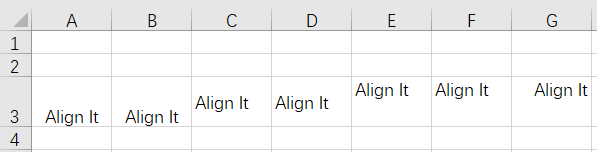

# poi-excel

2020-05-11, 14:01
***

## 简介

POI 提供了 HSSF 和 XSSF，分别用于 xls (Excel 97) 和 xlsx (Excel 2007 OOXML) 文件的读写。HSSF 和 XSSF 提供创建、修改和读写 EXCEL 电子表格的方法。包括：

- 提供了底层结构
- 只读高效事件模型 API
- 创建、读取和修改 XLS 文件的完整用户模型API

使用说明：

- 如果只是读取表格数据，推荐使用 `org.apache.poi.hssf.eventusermodel` 或 `org.apache.poi.xssf.eventusermodel` 包中的事件模型API，可减少内存占用
- 如果需要修改或生成 excel，则应该使用 usermodel API
- usermodel 比 eventusermodel 的内存占用高，但是使用起来更简单
- .xlsx 基于 XML 格式，相对基于二进制的 .xls 格式，占用更多内存
- sxssf 是基于流的API，在XSSF基础上限制了内存中Row的数目，从而减少内存消耗。

## SXSSF

> [!TIP]
>
> SXSSF 用于生成大型 .xlsx 文件。

POI 在 3.8-beta3 引入 SXSSF API，该 API 在 XSSF 基础上基于流构建，内存占用低，在**生成**非常大的电子表格时使用。SXSSF 通过限制可访问 row 的数目减少内存占用，而 XSSF 可以访问所有 rows。使用限制：

- 一次只能访问有限的行
- 不支持 `Sheet.clone()` 操作
- 不支持函数


在自动刷新模式，可以指定保存在内存中 row 的数量。当达到 row 限制，创建新的 row 会使索引最小的 row 写入磁盘，不能再访问。

也可以将窗口设置为动态增长，可以根据需要显式调用 `flushRows(int keepRows)` 来定期调整。

### 限制方法

构造时限制

```java
new SXSSFWorkbook(int windowSize)
```

调用方法限制:

```java
SXSSF.setRandomAccessWindowSize(int windowSize)
```

默认数值为100. 设置为 -1 表示无限制。
SXSSF 生成的临时文件，必须通过调用 dispose 方法清除。

SXSSFWorkbook 默认使用内联字符串，而不是共享字符串表（shared string table），这样效率高很多，因为内存中不需要预先保存内容，但是生成的文档，可能和某些客户端不兼容。

使用 shared string 保存文档中的字符串都是 unique 的，不过根据文档内容，使用 shared string 可能占据更多资源。

例：

```java
SXSSFWorkbook wb = new SXSSFWorkbook(100);
SXSSFSheet sh = wb.createSheet();
for (int rownum = 0; rownum < 1000; rownum++) {
    SXSSFRow row = sh.createRow(rownum);
    for (int cellnum = 0; cellnum < 10; cellnum++) {
        SXSSFCell cell = row.createCell(cellnum);
        String address = new CellReference(cell).formatAsString();
        cell.setCellValue(address);
    }
}

// Rows with rownum < 900 are flushed and not accessible
for (int rownum = 0; rownum < 900; rownum++) {
    Assert.assertNull(sh.getRow(rownum));
}

// ther last 100 rows are still in memory
for (int rownum = 900; rownum < 1000; rownum++) {
    Assert.assertNotNull(sh.getRow(rownum));
}

FileOutputStream out = new FileOutputStream("/temp/sxssf.xlsx");
wb.write(out);
out.close();

// dispose of temporary files backing this workbook on disk
wb.dispose();
```

注意最后 `dispose()` 调用删除临时文件。

## 功能索引

这部分包含基本的使用方法。

### 创建 Workbook

```java
// xls
Workbook wb = new HSSFWorkbook();
try (OutputStream fileOut = new FileOutputStream("workbook.xls")) {
    wb.write(fileOut);
}

// xlsx
Workbook wb = new XSSFWorkbook();
try (OutputStream fileOut = new FileOutputStream("workbook.xlsx")) {
    wb.write(fileOut);
}
```

### 创建 Sheet

```java
Workbook wb = new HSSFWorkbook(); // or new XSSFWorkbook();
Sheet sheet1 = wb.createSheet("new sheet");
Sheet sheet2 = wb.createSheet("second sheet");

// sheet name 最多 31 个字符，并且不能包含如下字符：
// 0x0000
// 0x0003
// colon (:)
// backslash (\)
// asterisk (*)
// question mark (?)
// forward slash (/)
// opening square bracket ([)
// closing square bracket (])

// 也可以使用 org.apache.poi.ss.util.WorkbookUtil
// #createSafeSheetName(String nameProposal) 创建有效 sheet-name，它将无效字符替换为空格
// 下面 returns " O'Brien's sales   "
String safeName = WorkbookUtil.createSafeSheetName("[O'Brien's sales*?]"); 
Sheet sheet3 = wb.createSheet(safeName);

try(OutputStream fileOut = new FileOutputStream("workbook.xls")){
    wb.write(fileOut);
}
```

### 创建 Cells

```java
Workbook wb = new HSSFWorkbook();
// Workbook wb = new XSSFWorkbook();
CreationHelper creationHelper = wb.getCreationHelper();
Sheet sheet = wb.createSheet("new sheet");

// Create a row and put some cells in it. Rows are 0 based.
Row row = sheet.createRow(0);
// Create a cell and put a value in it
Cell cell = row.createCell(0);
cell.setCellValue(1);

// or do it on one line
row.createCell(2).setCellValue(creationHelper.createRichTextString("This is a string"));

// write the output to a file
try (OutputStream fileOut = new FileOutputStream("workbook.xls")) {
    wb.write(fileOut);
}
```

### 创建 Date Cells

```java
Workbook wb = new HSSFWorkbook();
// Workbook wb = new XSSFWorkbook();
CreationHelper creationHelper = wb.getCreationHelper();
Sheet sheet = wb.createSheet("new sheet");

// Create a row and put some cells in it. Rows are 0 based.
Row row = sheet.createRow(0);

// 创建 cell，放入 date 值，但是该 cell 不是 date 样式
Cell cell = row.createCell(0);
cell.setCellValue(new Date());

// 第一个 cell 样式设置为 date。此时应该创建一个新的样式
// 修改已有样式会影响所有使用该样式的 cell
CellStyle cellStyle = wb.createCellStyle();
cellStyle.setDataFormat(creationHelper.createDataFormat().getFormat("m/d/yy h:mm"));
cell = row.createCell(1);
cell.setCellValue(new Date());
cell.setCellStyle(cellStyle);

//you can also set date as java.util.Calendar
cell = row.createCell(2);
cell.setCellValue(Calendar.getInstance());
cell.setCellStyle(cellStyle);

// Write the output to a file
try (OutputStream fileOut = new FileOutputStream("workbook.xls")) {
    wb.write(fileOut);
}
```

### 不同 cell 类型

```java
Workbook wb = new HSSFWorkbook();
Sheet sheet = wb.createSheet("new sheet");
Row row = sheet.createRow(2);
row.createCell(0).setCellValue(1.1);
row.createCell(1).setCellValue(new Date());
row.createCell(2).setCellValue(Calendar.getInstance());
row.createCell(3).setCellValue("a string");
row.createCell(4).setCellValue(true);
row.createCell(5).setCellType(CellType.ERROR);

// Write the output to a file
try (OutputStream fileOut = new FileOutputStream("workbook.xls")) {
    wb.write(fileOut);
}
```

### Files vs InputStreams

当打开一个 Excel 文件，可以使用 `File` 或 `InputStream` 创建 `Workbook`。使用 `File` 内存占用更低，使用 `InputStream` 则需要缓冲整个文件，更占用内存。

使用 `WorkbookFactory` 很容易区分两者：

```java
// Use a file
Workbook wb = WorkbookFactory.create(new File("MyExcel.xls"));

// Use an InputStream, needs more memory
Workbook wb = WorkbookFactory.create(new FileInputStream("MyExcel.xlsx"));
```

如果直接使用 `HSSFWorkbook` 或 `XSSFWorkbook`，则需要通过 `POIFSFileSystem` 或 `OPCPackage` 来完全控制生命周期（包括完成后关闭文件）。

```java
// HSSFWorkbook, File
POIFSFileSystem fs = new POIFSFileSystem(new File("file.xls"));
HSSFWorkbook wb = new HSSFWorkbook(fs.getRoot(), true);
....
fs.close();

// HSSFWorkbook, InputStream, needs more memory
POIFSFileSystem fs = new POIFSFileSystem(myInputStream);
HSSFWorkbook wb = new HSSFWorkbook(fs.getRoot(), true);

// XSSFWorkbook, File
OPCPackage pkg = OPCPackage.open(new File("file.xlsx"));
XSSFWorkbook wb = new XSSFWorkbook(pkg);
....
pkg.close();

// XSSFWorkbook, InputStream, needs more memory
OPCPackage pkg = OPCPackage.open(myInputStream);
XSSFWorkbook wb = new XSSFWorkbook(pkg);
....
pkg.close();
```

### 对齐

```java
public static void main(String[] args) throws Exception{
    Workbook wb = new XSSFWorkbook(); //or new HSSFWorkbook();
    Sheet sheet = wb.createSheet();
    Row row = sheet.createRow(2);
    row.setHeightInPoints(30);
    createCell(wb, row, 0, HorizontalAlignment.CENTER, VerticalAlignment.BOTTOM);
    createCell(wb, row, 1, HorizontalAlignment.CENTER_SELECTION, VerticalAlignment.BOTTOM);
    createCell(wb, row, 2, HorizontalAlignment.FILL, VerticalAlignment.CENTER);
    createCell(wb, row, 3, HorizontalAlignment.GENERAL, VerticalAlignment.CENTER);
    createCell(wb, row, 4, HorizontalAlignment.JUSTIFY, VerticalAlignment.JUSTIFY);
    createCell(wb, row, 5, HorizontalAlignment.LEFT, VerticalAlignment.TOP);
    createCell(wb, row, 6, HorizontalAlignment.RIGHT, VerticalAlignment.TOP);
    // Write the output to a file
    try (OutputStream fileOut = new FileOutputStream("xssf-align.xlsx")) {
        wb.write(fileOut);
    }
    wb.close();
}

/**
    * Creates a cell and aligns it a certain way.
    *
    * @param wb     the workbook
    * @param row    the row to create the cell in
    * @param column the column number to create the cell in
    * @param halign the horizontal alignment for the cell.
    * @param valign the vertical alignment for the cell.
    */
private static void createCell(Workbook wb, Row row, int column, 
		HorizontalAlignment halign, VerticalAlignment valign){
    Cell cell = row.createCell(column);
    cell.setCellValue("Align It");
    CellStyle cellStyle = wb.createCellStyle();
    cellStyle.setAlignment(halign);
    cellStyle.setVerticalAlignment(valign);
    cell.setCellStyle(cellStyle);
}
```

效果如下：



### 边框

```java
Workbook wb = new HSSFWorkbook();
Sheet sheet = wb.createSheet("new sheet");
// Create a row and put some cells in it. Rows are 0 based.
Row row = sheet.createRow(1);
// Create a cell and put a value in it.
Cell cell = row.createCell(1);
cell.setCellValue(4);

// Style the cell with borders all around.
CellStyle style = wb.createCellStyle();
// 底部细黑
style.setBorderBottom(BorderStyle.THIN);
style.setBottomBorderColor(IndexedColors.BLACK.getIndex());
// 左侧细绿
style.setBorderLeft(BorderStyle.THIN);
style.setLeftBorderColor(IndexedColors.GREEN.getIndex());
// 右侧细蓝
style.setBorderRight(BorderStyle.THIN);
style.setRightBorderColor(IndexedColors.BLUE.getIndex());
// 顶部黑虚线
style.setBorderTop(BorderStyle.MEDIUM_DASHED);
style.setTopBorderColor(IndexedColors.BLACK.getIndex());
cell.setCellStyle(style);
// Write the output to a file
try (OutputStream fileOut = new FileOutputStream("workbook.xls")) {
    wb.write(fileOut);
}
wb.close();
```


### 迭代 rows 和 cells

使用 `workbook.sheetIterator()`、`sheet.rowIterator()` 和 `row.cellIterator()` 生成迭代器，也可直接用 for 循环。需要注意的是，rowIterator 和 cellIterator 只迭代已创建的 row 或 cell，会跳过空 row 和 cell。

```java
for (Sheet sheet : wb) {
    for (Row row : sheet) {
        for (Cell cell : row) {
            // Do something here
        }
    }
}
```

### 迭代空 cell

`CellIterator` 会自动跳过空 cell，要访问空 cell，可以先获取索引信息，然后调用 `getCell(int, MissingCellPolicy)` 访问 cell。使用 `MissingCellPolicy` 设置如何处理 blank 或 null cell。

```java
// 确定要处理的 rows
int rowStart = Math.min(15, sheet.getFirstRowNum());
int rowEnd = Math.max(1400, sheet.getLastRowNum());
for (int rowNum = rowStart; rowNum < rowEnd; rowNum++) {
    Row r = sheet.getRow(rowNum);
    if (r == null) {
        // 该 row 为空，根据需要处理
        continue;
    }
    int lastColumn = Math.max(r.getLastCellNum(), MY_MINIMUM_COLUMN_COUNT);
    for (int cn = 0; cn < lastColumn; cn++) {
        Cell c = r.getCell(cn, Row.RETURN_BLANK_AS_NULL);
        if (c == null) {
            // The spreadsheet is empty in this cell
        } else {
            // Do something useful with the cell's contents
        }
    }
}
```

### 获得 cell 内容

要获得 cell 内容，首先要确定 cell 类型。

```java
DataFormatter formatter = new DataFormatter();
Sheet sheet1 = wb.getSheetAt(0);
for (Row row : sheet1) {
    for (Cell cell : row) {
        CellReference cellRef = new CellReference(row.getRowNum(), 
                                                  cell.getColumnIndex());
        System.out.print(cellRef.formatAsString()); // cell 引用，例如 A3
        System.out.print(" - ");
        // 获取 cell 值，应用格式化
        String text = formatter.formatCellValue(cell);
        System.out.println(text);
        // 也可以获取 cell 值，自己格式化
        switch (cell.getCellType()) {
            case CellType.STRING:
                System.out.println(cell.getRichStringCellValue().getString());
                break;
            case CellType.NUMERIC:
                if (DateUtil.isCellDateFormatted(cell)) {
                    System.out.println(cell.getDateCellValue());
                } else {
                    System.out.println(cell.getNumericCellValue());
                }
                break;
            case CellType.BOOLEAN:
                System.out.println(cell.getBooleanCellValue());
                break;
            case CellType.FORMULA:
                System.out.println(cell.getCellFormula());
                break;
            case CellType.BLANK:
                System.out.println();
                break;
            default:
                System.out.println();
        }
    }
}
```

### 文本提取

使用 `ExcelExtractor` 提取文本：

```java
try (InputStream inp = new FileInputStream("workbook.xls")) {
    HSSFWorkbook wb = new HSSFWorkbook(new POIFSFileSystem(inp));
    ExcelExtractor extractor = new ExcelExtractor(wb);
    extractor.setFormulasNotResults(true);
    extractor.setIncludeSheetNames(false);
    String text = extractor.getText();
    wb.close();
}
```

### 填充和颜色

```java
Workbook wb = new XSSFWorkbook();
Sheet sheet = wb.createSheet("new sheet");
// Create a row and put some cells in it. Rows are 0 based.
Row row = sheet.createRow(1);

// 背景色：Aqua
CellStyle style = wb.createCellStyle();
style.setFillBackgroundColor(IndexedColors.AQUA.getIndex());
style.setFillPattern(FillPatternType.BIG_SPOTS);
Cell cell = row.createCell(1);
cell.setCellValue("X");
cell.setCellStyle(style);

// 前景色：Orange
style = wb.createCellStyle();
style.setFillForegroundColor(IndexedColors.ORANGE.getIndex());
style.setFillPattern(FillPatternType.SOLID_FOREGROUND);
cell = row.createCell(2);
cell.setCellValue("X");
cell.setCellStyle(style);
// Write the output to a file
try (OutputStream fileOut = new FileOutputStream("workbook.xls")) {
    wb.write(fileOut);
}
wb.close();
```

### 合并 cell

```java
Workbook wb = new HSSFWorkbook();
Sheet sheet = wb.createSheet("new sheet");

Row row = sheet.createRow(1);
Cell cell = row.createCell(1);
cell.setCellValue("This is a test of merging");
sheet.addMergedRegion(new CellRangeAddress(
        1, //first row (0-based)
        1, //last row  (0-based)
        1, //first column (0-based)
        2  //last column  (0-based)
));
// Write the output to a file
try (OutputStream fileOut = new FileOutputStream("workbook.xls")) {
    wb.write(fileOut);
}
wb.close();
```

### 字体

```java
Workbook wb = new HSSFWorkbook();
Sheet sheet = wb.createSheet("new sheet");

// Create a row and put some cells in it. Rows are 0 based.
Row row = sheet.createRow(1);

// Create a new font and alter it.
Font font = wb.createFont();
font.setFontHeightInPoints((short) 24);
font.setFontName("Courier New");
font.setItalic(true);
font.setStrikeout(true);

// Fonts are set into a style so create a new one to use.
CellStyle style = wb.createCellStyle();
style.setFont(font);

// Create a cell and put a value in it.
Cell cell = row.createCell(1);
cell.setCellValue("This is a test of fonts");
cell.setCellStyle(style);

// Write the output to a file
try (OutputStream fileOut = new FileOutputStream("workbook.xls")) {
    wb.write(fileOut);
}
wb.close();
```

> [!NOTE]
>
> workbook 支持最大字体数为 32767，在应用中应该重用字体，而不是为每个 cell 创建字体，例如：

错误示范：

```java
for (int i = 0; i < 10000; i++) {
    Row row = sheet.createRow(i);
    Cell cell = row.createCell(0);

    CellStyle style = workbook.createCellStyle();
    Font font = workbook.createFont();
    font.setBoldweight(Font.BOLDWEIGHT_BOLD);
    style.setFont(font);
    cell.setCellStyle(style);
}
```

正确示范：

```java
CellStyle style = workbook.createCellStyle();
Font font = workbook.createFont();
font.setBoldweight(Font.BOLDWEIGHT_BOLD);
style.setFont(font);
for (int i = 0; i < 10000; i++) {
    Row row = sheet.createRow(i);
    Cell cell = row.createCell(0);
    cell.setCellStyle(style);
}
```

### 自定义颜色

- HSSF

```java
HSSFWorkbook wb = new HSSFWorkbook();
HSSFSheet sheet = wb.createSheet();
HSSFRow row = sheet.createRow(0);
HSSFCell cell = row.createCell(0);
cell.setCellValue("Default Palette");

// 从标准调色板中挑选一个颜色
HSSFCellStyle style = wb.createCellStyle();
style.setFillForegroundColor(HSSFColor.LIME.index);
style.setFillPattern(FillPatternType.SOLID_FOREGROUND);

HSSFFont font = wb.createFont();
font.setColor(HSSFColor.RED.index);
style.setFont(font);

cell.setCellStyle(style);

// save with the default palette
try (OutputStream out = new FileOutputStream("default_palette.xls")) {
    wb.write(out);
}
//now, let's replace RED and LIME in the palette
// with a more attractive combination
// (lovingly borrowed from freebsd.org)
cell.setCellValue("Modified Palette");
//creating a custom palette for the workbook
HSSFPalette palette = wb.getCustomPalette();
//replacing the standard red with freebsd.org red
palette.setColorAtIndex(HSSFColor.RED.index,
        (byte) 153,  //RGB red (0-255)
        (byte) 0,    //RGB green
        (byte) 0     //RGB blue
);
//replacing lime with freebsd.org gold
palette.setColorAtIndex(HSSFColor.LIME.index, (byte) 255, (byte) 204, (byte) 102);
//save with the modified palette
// note that wherever we have previously used RED or LIME, the
// new colors magically appear
try (out = new FileOutputStream("modified_palette.xls")) {
    wb.write(out);
}
```

- XSSF

```java
XSSFWorkbook wb = new XSSFWorkbook();
XSSFSheet sheet = wb.createSheet();
XSSFRow row = sheet.createRow(0);
XSSFCell cell = row.createCell( 0);
cell.setCellValue("custom XSSF colors");

XSSFCellStyle style1 = wb.createCellStyle();
style1.setFillForegroundColor(new XSSFColor(new java.awt.Color(128, 0, 128), new DefaultIndexedColorMap()));
style1.setFillPattern(FillPatternType.SOLID_FOREGROUND);
```


## 数据格式化

例如：

```java
Workbook wb = new HSSFWorkbook();
Sheet sheet = wb.createSheet("format sheet");
CellStyle style;
DataFormat format = wb.createDataFormat();
Row row;
Cell cell;
int rowNum = 0;
int colNum = 0;
row = sheet.createRow(rowNum++);
cell = row.createCell(colNum);
cell.setCellValue(11111.25);

style = wb.createCellStyle();
style.setDataFormat(format.getFormat("0.0"));
cell.setCellStyle(style);
row = sheet.createRow(rowNum++);
cell = row.createCell(colNum);
cell.setCellValue(11111.25);
style = wb.createCellStyle();
style.setDataFormat(format.getFormat("#,##0.0000"));
cell.setCellStyle(style);
try (OutputStream fileOut = new FileOutputStream("workbook.xls")) {
    wb.write(fileOut);
}
wb.close();
```

## 参考

- https://poi.apache.org/components/spreadsheet/index.html
