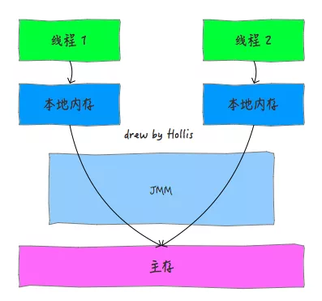
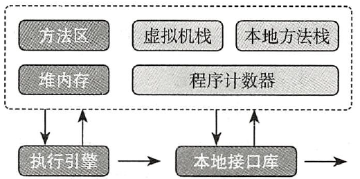
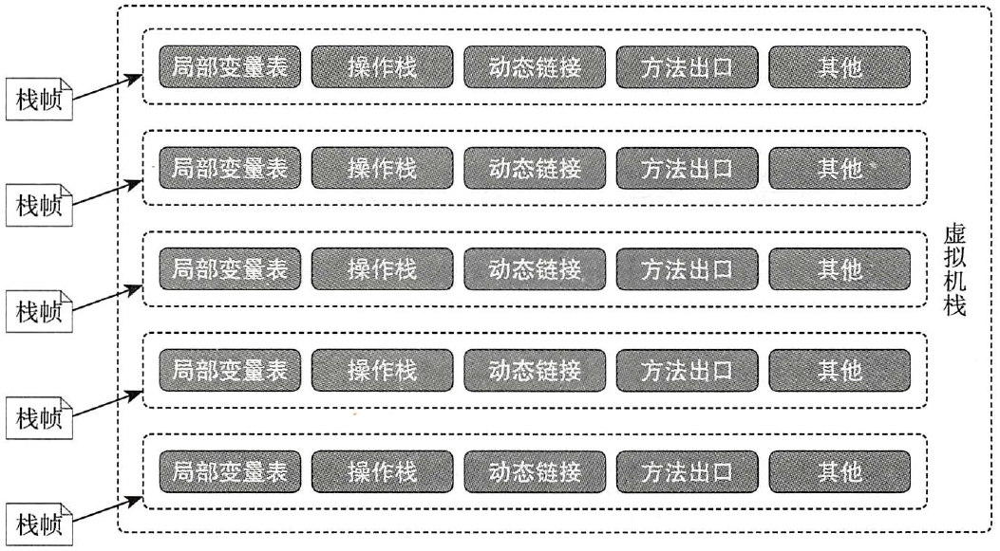
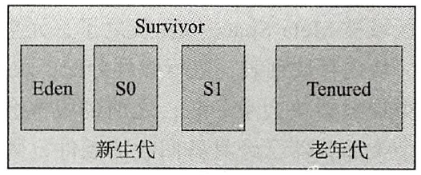

# JVM Memory Model

创建 Java 的主要动机是 WOTA（Write once, run anywhere），为了实现该特性，Sun 创建了 Java 虚拟机（JVM）。JVM 对 OS 底层进行了抽象，运行编译的 Java 代码。JVM 是 JRE 的核心，现在还出现了许多基于 JVM 的语言，如 Scala, Groovy, JRuby, Closure 等。

计算机内存模型是解决多线程场景下并发问题的一个重要规范。其具体的实现在不同的编程语言上可能有所不同。Java内存模型（Java Memory Model ,JMM）是一种符合内存模型规范的机制和规范，JMM 屏蔽了各种硬件和操作系统的访问差异的，保证了Java程序在各种平台下对内存的访问效果一致。

提到Java内存模型，一般指的是JDK 5 开始使用的新的内存模型，主要由JSR-133: JavaTM Memory Model and Thread Specification 描述。感兴趣的可以参看下这份[PDF文档](http://www.cs.umd.edu/~pugh/java/memoryModel/jsr133.pdf)。

JMM 规定所有变量都存储在主内存，每条线程还有自己的工作内存，线程的工作内存保存了该线程用到的变量的主内存副本拷贝，线程对变量的所有操作都必须在工作内存中进行，而不能直接读写主内存。不同的线程之间也无法直接访问对方工作内存中的变量，线程间变量的传递均需要自己的工作内存和主存之间进行数据同步进行。

而JMM就作用于工作内存和主存之间数据同步过程。他规定了如何做数据同步以及什么时候做数据同步。如下所示：

这里面提到的主内存和工作内存，读者可以简单的类比成计算机内存模型中的主存和缓存的概念。特别需要注意的是，主内存和工作内存与JVM内存结构中的Java堆、栈、方法区等并不是同一个层次的内存划分，无法直接类比。《深入理解Java虚拟机》中认为，如果一定要勉强对应起来的话，从变量、主内存、工作内存的定义来看，主内存主要对应于Java堆中的对象实例数据部分。工作内存则对应于虚拟机栈中的部分区域。

所以，JMM是一种规范，目的是解决由于多线程通过共享内存进行通信时，存在的本地内存数据不一致、编译器会对代码指令重排序、处理器会对代码乱序执行等带来的问题。目的是保证并发编程场景中的原子性、可见性和有序性。

## JMM 的实现

## 程序计数器

程序计数器用于存放当前线程要执行的字节码指令、分支、循环、跳转和异常处理等信息。

一个处理器一次只能执行一个线程的指令，为了能够在CPU时间片轮转切换上下文之后顺利回到正确的执行位置，每个线程都需要具有一个独立的程序计数器，各个线程之间互不影响，因此JVM将这一块内存区设置为线程私有。

## 虚拟机栈

虚拟机栈也是线程私有，它的生命周期和线程相同，在JVM运行时创建。在线程执行时，方法的执行会创建栈帧（stack frame）用于存放局部变量表、操作栈、动态链接、方法出口等信息，如下图所示：

方法的调用，对应栈帧在虚拟机中的压栈和弹栈过程。

每个线程在创建时，JVM 都会为其创建对应的虚拟机栈，虚拟机栈的大小可以通过 `-xss` 配置，方法的调用是栈帧被压入和弹出的过程。同样的机栈，如果局部变量表等占用的内存越小，则可以压入的栈帧就越多。一般将栈帧内存的大小称为宽度，而栈帧的数量则称为虚拟机栈的深度。

## 本地方法栈

Java 提供了调用本地方法的接口（Java Native Interface, JNI）。在线程执行过程中，经常会遇到调用JNI方法的情况，如网络通信、文件操作的底层。JVM 为本地方法所划分的内存区域就是**本地方法栈**，这块内存区域自由度非常高，完全靠不同的JVM厂商来实现，Java 虚拟机规范并未给出强制的规定，同样它也是线程私有的内存区域。

## 堆内存

堆内存是 JVM 中最大的 一块内存区，被所有的线程共享，Java 在 运行期间创建的对象几乎都存放在该区域，该内存区也是垃圾回收重点照顾的区域，因此有时候堆内存也称为 “GC堆”。

堆内存可以进一步进行划分，如下图所示：

## 方法区

方法区事由所有线程共享的内存区，在 JVM 启动时创建，并由类加载器从字节码加载，主要用来存储已经被虚拟机加载的类信息、常量、静态变量、即时编译器（JIT）编译后的代码等数据。

方法区保存信息：

- 类信息（字段和方法数、超类名、接口名、版本等）
- 方法和构造函数的字节码
- 类加载时的运行时常量池

## 原子性

在Java中，为了保证原子性，提供了两个高级的字节码指令monitorenter和monitorexit。

因此，在Java中可以使用 `synchronized` 来保证方法和代码块内的操作是原子性的。

## 可见性

Java内存模型是通过在变量修改后将新值同步回主内存，在变量读取前从主内存刷新变量值的这种依赖主内存作为传递媒介的方式来实现的。

内存屏障，又称内存栅栏，是一个CPU指令，基本上它是一条这样的指令：

- 保证特定操作的执行顺序;
- 影响某些数据（或则是某条指令的执行结果）的内存可见性。

编译器和CPU能够重排序指令，保证最终相同的结果，尝试优化性能。插入一条Memory Barrier会告诉编译器和CPU：不管什么指令都不能和这条Memory Barrier指令重排序。

Memory Barrier所做的另外一件事是强制刷出各种CPU cache，如一个 Write-Barrier（写入屏障）将刷出所有在 Barrier 之前写入 cache 的数据，因此，任何CPU上的线程都能读取到这些数据的最新版本。

Java 中的 `volatile` 关键字是基于Memory Barrier实现的。如果一个变量是volatile修饰的，JMM会在写入这个字段之后插进一个Write-Barrier指令，并在读这个字段之前插入一个Read-Barrier指令。总体效果就是被其修饰的变量在被修改后可以立即同步到主内存，被其修饰的变量在每次是用之前都从主内存刷新。因此，可以使用 `volatile` 来保证多线程操作时变量的可见性。

除了 `volatile`，Java中的 `synchronized` 和 `final` 两个关键字也可以实现可见性。只不过实现方式不同，这里不再展开了。
