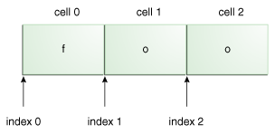

# 正则表达式

2025-03-17 add: examples ⭐
2025-03-14 update ⭐
2021-03-13 create
@author Jiawei Mao
***

## 简介

正则表达式根据特定的规则描述字符串的特征，可用于检索、编辑和操作文本数据。

如果你觉得正则表达式不难，那么要么你是一个天才，要么你不是地球人。正则表达式的语言很令人头疼，即使对经常使用它的人来说也是如此。由于难于读写，容易出错，所以找一种工具对正则表达式进行测试是很必要的。推荐 [regex101](https://regex101.com/)，一个很便捷的在线 regex 测试工具。

在 Java 中正则表达式相关的功能在 `java.util.regex` 包中。`java.util.regex`主要包括三个类：

- `Pattern`：表示编译后的正则表达式。`Pattern` 没有提供 public 构造函数，需要通过 `Pattern.compile` 工厂方法创建 `Pattern`；
- `Matcher`：负责解释 `Pattern`，并对输入字符串执行匹配操作。和 `Pattern` 一样，`Matcher` 也没有 public 构造函数，需要通过 `Pattern.matcher` 方法创建 `Matcher`；
- `PatternSyntaxException`：在正则表达式中出现语法错误时抛出的异常。

正则表达式辅助测试类：

```java
import java.util.regex.Matcher;
import java.util.regex.Pattern;

public class RegexTestHarness {
    public static void main(String[] args) {
        String regex = "foo";
        String text = "foo";
        Pattern pattern = Pattern.compile(regex);
        Matcher matcher = pattern.matcher(text);

        System.out.println("regex: " + regex);
        System.out.println("text to search: " + text);
        boolean found = false;
        while (matcher.find()) {
            System.out.printf("Found text \"%s\" in range [%d, %d].%n",
                    matcher.group(),
                    matcher.start(),
                    matcher.end()
            );
            found = true;
        }
        if (!found) {
            System.out.println("No match found.");
        }
    }
}
```

将 regex 替换为正则表达式，text 为输入文本，运行该测试类，即可显示匹配结果。

## 正则表达式语法

### 字符串常量

字符串常量，或字面量，是最基本的正则表达式形式。例如，正则表达式 "foo"，直接匹配字符串 "foo"：

```java
regex: foo
text to search: foo
Found text foo in range [0, 3].
```

显然匹配成功，匹配的 start-index 为 0，end-index 为 3。按照惯例，匹配范围包含 start-index，不包含 end-index。如下所示：



对个匹配情况：

```java
regex: foo
text to search: foofoofoo
Found text foo in range [0, 3].
Found text foo in range [3, 6].
Found text foo in range [6, 9].
```

其它特殊字面量如下所示：

| 正则表达式 | 匹配           |
| ---------- | -------------- |
| x          | 字符 x         |
| `\\`       | 反斜杠字符 `\` |
| `\0n`     | 八进制字符 `0n` (0 `<=` *n* `<=` 7) |
| `\0nn`     | 八进制字符 `0nn` (0 `<=` *n* `<=` 7) |
| `\0mnn`    | 八进制字符 `0mnn` (0 `<=` *m* `<=` 3, 0 `<=` *n* `<=` 7) |
| `\xhh`     | 十六进制字符 `0xhh`         |
| `\uhhhh`   | 十六进制字符 `0xhhhh`     |
| `\x{h...h}` | 十六进制字符 `0xh...h` ([`Character.MIN_CODE_POINT`](https://docs.oracle.com/javase/8/docs/api/java/lang/Character.html#MIN_CODE_POINT) <= `0x`*h...h* <= [`Character.MAX_CODE_POINT`](https://docs.oracle.com/javase/8/docs/api/java/lang/Character.html#MAX_CODE_POINT)) |
| `\t`          | 制表符 (`'\u0009'`)                            |
| `\n`          | 换行符 (`'\u000A'`)            |
| `\r`          | 回车符 (`'\u000D'`)            |
| `\f`          | 换页符 (`'\u000C'`)                     |
| `\a`          | 警报符 (`'\u0007'`)             |
| `\e`          | 转义符 (`'\u001B'`)                  |
| `\c`*x*       | 与 x 对应的控制符         |

> [!NOTE]
>
> `Character.MIN_CODE_POINT` 为 UNICODE 最小编码值，为 `U+0000`；
>
> `Character.MAX_CODE_POINT` 为 UNICDOE 最大编码值，为 `U+10FFFF`

### 元字符

`Pattern` 还支持许多影响匹配方式的特殊字符，这类字符称为**元字符**。Java 支持的元字符包括：

```
<([{\^-=$!|]})?*+.>
```

> [!NOTE]
>
> 在有些情况上面列出的有些字符不被视为元字符，但是，没有列出的字符肯定不是元字符。

以 `.` 为例：

```
regex: cat.
text to search: cats
Found text cats in range [0, 4].
```

`.` 可以匹配任意字符，所以 rege `cat.` 能与 "cats" 匹配成功。

有两种方式可以将元字符作为常规字符匹配：

- 在元字符前面加 `\` 进行转义
- 用 `\Q`  和 `\E` 将其括起来

`\Q` 和 `\E` 可以放在 regex 任何地方。

### 字符类

字符类，指一组包含在方括号内的字符。在下表中：左侧指定正则表达式字符类，右侧描述每个字符类匹配条件。

| 正则表达式 | 匹配 |
| ---------- | ---- |
| `[abc]`         | `a`, `b`, 或 `c` (simple class)         |
| `[^abc]`        | `a`, `b`, `c` 以外的字符 (negation) |
| `[a-zA-Z]`      | `a` 到 `z` ，和 `A` 到 `Z` 任意字符 inclusive (range) |
| `[a-d[m-p]]`    | `a` 到 `d`, 或 `m` 到 `p`，等价于: `[a-dm-p]` (union) |
| `[a-z&&[def]]`  | `d`, `e`, 或 `f` (intersection)                          |
| `[a-z&&[^bc]]`  | `a` 到`z`, `b` 和 `c` 除外，等价于: `[ad-z]` (subtraction) |
| `[a-z&&[^m-p]]` | `a` 到 `z`,  `m` 到 `p` 除外，等价于: `[a-lq-z]`(subtraction) |

- **简单类**：字符类的最简单形式是将一组字符并排放在 `[]` 中

例如：匹配单词 "bat", "cat", "rat"

```
regex: [bcr]at
text to search: bat
Found text bat in range [0, 3].

regex: [bcr]at
text to search: cat
Found text cat in range [0, 3].

regex: [bcr]at
text to search: rat
Found text rat in range [0, 3].

regex: [bcr]at
text to search: hat
No match found.
```

只有第一个字母与字符类 `[bcr]` 匹配，总体匹配才能成功。

匹配元音字母：

```
[aeuio]
```

- **否定**：匹配除列出的字符以外的所有字符，在字符类前面加入 `^` 元字符。

匹配除 `bat`, `cat`, `rat` 以外的所有以 `at` 结尾的单词。

```
regex: [^bcr]at
text to search: bat
No match found.

regex: [^bcr]at
text to search: cat
No match found.

regex: [^bcr]at
text to search: rat
No match found.

regex: [^bcr]at
text to search: hat
Found text hat in range [0, 3].
```

- **范围**：使用 `-` 元字符连接范围的起点和终点，可以指定一个范围

例如，`[1-5]` 匹配数字 1 到 5；`[a-h]` 匹配字母 'a' 到 'h'；还可以将不同范围放在同一个字符类中，例如 `[a-zA-Z]` 匹配所有的小写字母和大写字母。

```
regex: [a-c]
text to search: a
Found text a in range [0, 1].

regex: [a-c]
text to search: b
Found text b in range [0, 1].

regex: [a-c]
text to search: c
Found text c in range [0, 1].

regex: [a-c]
text to search: d
No match found.

regex: foo[1-5]
text to search: foo1
Found text foo1 in range [0, 4].

regex: foo[1-5]
text to search: foo5
Found text foo5 in range [0, 4].

regex: foo[1-5]
text to search: foo6
No match found.

regex: foo[^1-5]
text to search: foo1
No match found.

regex: foo[^1-5]
text to search: foo6
Found text foo6 in range [0, 4].
```

- **并集**：将多个字符类合并为一个，即取并集。将一个字符类嵌入另一个字符类，即可创建并集。例如 `[0-4[6-8]]` 匹配 0, 1, 2, 3, 4, 6, 7, 8 这些数字

```
regex: [0-4[6-8]]
text to search: 0
Found text 0 in range [0, 1].

regex: [0-4[6-8]]
text to search: 5
No match found.

regex: [0-4[6-8]]
text to search: 6
Found text 6 in range [0, 1].

regex: [0-4[6-8]]
text to search: 8
Found text 8 in range [0, 1].

regex: [0-4[6-8]]
text to search: 9
No match found.
```

- **交集**：用 `&&` 取两个字符类的交集。例如：`[0-9&&[345]]` 匹配 3, 4, 5

```
regex: [0-9&&[345]]
text to search: 3
Found text 3 in range [0, 1].

regex: [0-9&&[345]]
text to search: 4
Found text 4 in range [0, 1].

regex: [0-9&&[345]]
text to search: 5
Found text 5 in range [0, 1].

regex: [0-9&&[345]]
text to search: 2
No match found.

regex: [0-9&&[345]]
text to search: 6
No match found.
```

取两个范围的交集：

```
regex: [2-8&&[4-6]]
text to search: 3
No match found.

regex: [2-8&&[4-6]]
text to search: 4
Found text 4 in range [0, 1].

regex: [2-8&&[4-6]]
text to search: 5
Found text 5 in range [0, 1].

regex: [2-8&&[4-6]]
text to search: 6
Found text 6 in range [0, 1].

regex: [2-8&&[4-6]]
text to search: 7
No match found.
```

- **差集**：将一个字符类与另一个字符类的否取并集，即可得到差集。

例如：`[0-9$$[^345]]` 匹配 0-9 中除 3, 4, 5 以外的数字

```
regex: [0-9&&[^345]]
text to search: 2
Found text 2 in range [0, 1].

regex: [0-9&&[^345]]
text to search: 3
No match found.

regex: [0-9&&[^345]]
text to search: 4
No match found.

regex: [0-9&&[^345]]
text to search: 5
No match found.

regex: [0-9&&[^345]]
text to search: 6
Found text 6 in range [0, 1].

regex: [0-9&&[^345]]
text to search: 9
Found text 9 in range [0, 1].
```

### 预定义字符类

预定义字符类，提供了许多常用的字符类。在下表中，左侧的 regex 为右侧字符类的快捷表达方式。

建议尽量使用预定义字符类，更简洁，易于阅读。

| 正则表达式 | 说明                                                         |
| ---------- | ------------------------------------------------------------ |
| `.`        | 任意字符（根据配置，可以选择是否匹配换行符）                 |
| `\d`       | 数字: `[0-9]`                                                |
| `\D`       | 非数字: `[^0-9]`                                             |
| `\h`       | 水平空白字符: `[ \t\xA0\u1680\u180e\u2000-\u200a\u202f\u205f\u3000]` |
| `\H`       | 非水平空白字符: `[^\h]`                                      |
| `\s`       | 空白字符: `[ \t\n\x0B\f\r]`                                  |
| `\S`       | 非空白字符: `[^\s]`                                          |
| `\v`       | 垂直空白字符: `[\n\x0B\f\r\x85\u2028\u2029]`                 |
| `\V`       | 非垂直空白字符: `[^\v]`                                      |
| `\w`       | 单词字符: `[a-zA-Z_0-9]`                                     |
| `\W`       | 非单词字符: `[^\w]`                                          |

在[元字符](#元字符)中我们提到了转义的两种方式。以 `\` 开头的 regex 称为转义构造，使用使用字面量定义这类正则表达式，需要在前面再加一个 `\`。例如：

```java
private final String REGEX = "\\d"; // a single digit
```

这里，`\d` 为正则表达式，额外的 `\` 用于转义使得代码能够编译。

```
regex: .
text to search: @
Found text @ in range [0, 1].

regex: .
text to search: 1
Found text 1 in range [0, 1].

regex: .
text to search: a
Found text a in range [0, 1].

regex: \d
text to search: 1
Found text 1 in range [0, 1].

regex: \d
text to search: a
No match found.

regex: \D
text to search: 1
No match found.

regex: \D
text to search: a
Found text a in range [0, 1].

regex: \s
text to search:  
Found text " " in range [0, 1].

regex: \s
text to search: a
No match found.

regex: \S
text to search:  
No match found.

regex: \S
text to search: a
Found text "a" in range [0, 1].

regex: \w
text to search: a
Found text "a" in range [0, 1].

regex: \w
text to search: !
No match found.

regex: \W
text to search: a
No match found.

regex: \W
text to search: !
Found text "!" in range [0, 1].
```

在以上示例中，`.` 匹配任何字符，因此在三种情况均 match 成功：@, 数字和字母。余下示例演示其它预定义字符类：

- `\d` 匹配所有数字
- `\s` 匹配空格
- `\w` 匹配单词

大写字母则取相反情况：

- `\D` 匹配非数字
- `\S` 匹配非空格
- `\W` 匹配非单词字符

### POSIX 字符类

> 只支持 US-ASCII

| 正则表达式   | 匹配                                                   |
| ------------ | ------------------------------------------------------ |
| `\p{Lower}`  | A lower-case alphabetic character: `[a-z]`             |
| `\p{Upper}`  | An upper-case alphabetic character:`[A-Z]`             |
| `\p{ASCII}`  | All ASCII:`[\x00-\x7F]`                                |
| `\p{Alpha}`  | An alphabetic character:`[\p{Lower}\p{Upper}]`         |
| `\p{Digit}`  | A decimal digit: `[0-9]`                               |
| `\p{Alnum}`  | An alphanumeric character:`[\p{Alpha}\p{Digit}]`       |
| `\p{Punct}`  | Punctuation: One of `!"#$%&'()*+,-./:;<=>?@[\]^_`{|}~` |
| `\p{Graph}`  | A visible character: `[\p{Alnum}\p{Punct}]`            |
| `\p{Print}`  | A printable character: `[\p{Graph}\x20]`               |
| `\p{Blank}`  | A space or a tab: `[ \t]`                              |
| `\p{Cntrl}`  | A control character: `[\x00-\x1F\x7F]`                 |
| `\p{XDigit}` | A hexadecimal digit: `[0-9a-fA-F]`                     |
| `\p{Space}`  | A whitespace character: `[ \t\n\x0B\f\r]`              |

### java.lang.Character 类

| 正则表达式           | 匹配                                        |
| -------------------- | ------------------------------------------- |
| `\p{javaLowerCase}`  | 等价于 `java.lang.Character.isLowerCase()`  |
| `\p{javaUpperCase}`  | 等价于 `java.lang.Character.isUpperCase()`  |
| `\p{javaWhitespace}` | 等价于 `java.lang.Character.isWhitespace()` |
| `\p{javaMirrored}`   | 等价于 `java.lang.Character.isMirrored()`   |

### Unicode 相关类

| 正则表达式           | 匹配                                                         |
| -------------------- | ------------------------------------------------------------ |
| `\p{IsLatin}`        | A Latin script character ([script](https://docs.oracle.com/javase/8/docs/api/java/util/regex/Pattern.html#usc)) |
| `\p{InGreek}`        | A character in the Greek block ([block](https://docs.oracle.com/javase/8/docs/api/java/util/regex/Pattern.html#ubc)) |
| `\p{Lu}`             | An uppercase letter ([category](https://docs.oracle.com/javase/8/docs/api/java/util/regex/Pattern.html#ucc)) |
| `\p{IsAlphabetic}`   | An alphabetic character ([binary property](https://docs.oracle.com/javase/8/docs/api/java/util/regex/Pattern.html#ubpc)) |
| `\p{Sc}`             | A currency symbol                                            |
| `\P{InGreek}`        | Any character except one in the Greek block (negation)       |
| `[\p{L}&&[^\p{Lu}]]` | Any letter except an uppercase letter (subtraction)          |

### 边界匹配

除了匹配输入字符串，还可以指定在输入字符串哪里匹配。例如，可能希望找到每行开头或结尾出现的特定单词，对其它位置出现的该单词不感兴趣。通过边界匹配可以指定在字符串中匹配的位置。

| 字符 | 描述                     |
| ---- | ------------------------ |
| ^    | 行开头                   |
| $    | 行结尾                   |
| \b   | 单词边界（开头和结尾）   |
| \B   | 非单词边界               |
| \A   | 输入开头                 |
| \G   | 上次匹配的结尾           |
| \Z   | 输入结尾，对应换行符前面 |
| \z   | 输入结尾                 |

下面演示 `^` 和 `$` 的用法：

```
regex: ^dog$
text to search: dog
Found text "dog" in range [0, 3].

regex: ^dog$
text to search:        dog # 开头多了很多空格
No match found.

regex: \s*dog$ # 结尾 dog，前面匹配空格
text to search:              dog
Found text "             dog" in range [0, 16].

regex: ^dog\w* #开头 dog，后面匹配单词
text to search: dogblahblah
Found text "dogblahblah" in range [0, 11].
```

单词边界示例：

```
regex: \bdog\b
text to search: The dog plays in the yard.
Found text "dog" in range [4, 7].

regex: \bdog\b
text to search: The doggie plays in the yard.
No match found.
```

非单词边界示例：

```
regex: \bdog\B
text to search: The dog plays in the yard.
No match found.

regex: \bdog\B
text to search: The doggie plays in the yard.
Found text "dog" in range [4, 7].
```

要求在上次 match 的结尾处继续 match：

```
regex: dog
text to search: dog dog
Found text "dog" in range [0, 3].
Found text "dog" in range [4, 7].

regex: \Gdog
text to search: dog dog
Found text "dog" in range [0, 3].
```

第二个示例只找到一个 match，因为第二个 "dog" 不是在第一次 match 结尾开始。

### 数量词

数量词用于指定匹配出现的数目。如下表所示：

| Greedy  | Reluctant | Possessive | 说明           |
| ------- | --------- | ---------- | -------------- |
| X?      | X??       | X?+        | 匹配 0 或 1 次 |
| X*      | X*?       | X*+        | 匹配 0 或多次  |
| X+      | X+?       | X++        | 匹配至少 1 次  |
| X{n}    | X{n}?     | X{n}+      | 匹配 n 次      |
| X{n,}   | X{n, }?   | X{n, }+    | 匹配至少n次    |
| X{n, m} | X{n, m}?  | X{n, m}+   | 匹配 n 到 m 次 |

解释：

- Greedy：匹配前读取整个字符串，如果第一次匹配失败（整个输入字符串），减掉一个字符，再次匹配，重复进行直至匹配成功，或没有字符可减。根据量词的不同，最后可能尝试匹配 1 或 0 个字符。
- Reluctant：采用与 greedy 相反的方法，从字符串开头开始匹配，一次递增一个字符，最后才尝试匹配整个字符串。
- Possessive：直接匹配整个字符串，只尝试一次。

示例：

```
regex: .*foo # greedy
text to search: xfooxxxxxxfoo
Found text "xfooxxxxxxfoo" in range [0, 13].

regex: .*?foo # reluctant
text to search: xfooxxxxxxfoo
Found text "xfoo" in range [0, 4].
Found text "xxxxxxfoo" in range [4, 13].

regex: .*+foo # possessive
text to search: xfooxxxxxxfoo
No match found.
```

说明：

- 第一个为 greedy 量词 `.*` 匹配任意内容 0 或多次，后跟 "foo" 字符串。首先，`.*` 尝试整个输入字符串，匹配失败，因为 `.*` 匹配所有字符串后，余下缺少 "foo"。所以 matcher 回退一个字母，直到将 "foo" 留出来才匹配成功。
- 第二个为 reluctant 量词。`.*` 首先什么不匹配，由于输入字符串开头不是 "foo"，所以失败，`.*` 被迫匹配一个字符 'x'，触发第一次 match 0 到 4。接着继续处理输入字符串，直到末尾找到另一个 match 4 到 13。
- 第三个为 possessive 量词。`.*+` 直接消耗所有输入字符串，余下没有字符匹配 "foo"，因此失败。

示例：

```
regex: a?
text to search: # 这里是一个空字符串
Found text "" in range [0, 0].

regex: a*
text to search: 
Found text "" in range [0, 0].

regex: a+
text to search: 
No match found.
```

**零长度匹配（zero-length matches）**

`a?` 和 `a*` 都可以匹配空字符串，匹配位置 start 和 end 都是 0。因为输入长度为零，这类匹配称为**零长度匹配**。零长度匹配的情形有多种：

- 输入字符串为空
- 输入字符串起始
- 输入字符串结尾
- 输入字符串中任意挨着的两个字符串之间

零长度匹配很好识别，因为其 start 和 end 索引相同。例如:

```
regex: a?
text to search: a
Found text "a" in range [0, 1].
Found text "" in range [1, 1].

regex: a*
text to search: a
Found text "a" in range [0, 1].
Found text "" in range [1, 1].

regex: a+
text to search: a
Found text "a" in range [0, 1].
```

说明：上面三个正则表达式都可以匹配 "a"，但前面两个在 index 1 额外匹配空字符串。根据数量词的不同，字符最后的 "" 空白可能会，也可能不会触发匹配。

- 匹配字符串 "aaaaa"

```
regex: a?
text to search: aaaaa
Found text "a" in range [0, 1].
Found text "a" in range [1, 2].
Found text "a" in range [2, 3].
Found text "a" in range [3, 4].
Found text "a" in range [4, 5].
Found text "" in range [5, 5].

regex: a*
text to search: aaaaa
Found text "aaaaa" in range [0, 5].
Found text "" in range [5, 5].

regex: a+
text to search: aaaaa
Found text "aaaaa" in range [0, 5].
```

- 匹配字符串 "ababaaaab"

```
regex: a?
text to search: ababaaaab
Found text "a" in range [0, 1].
Found text "" in range [1, 1].
Found text "a" in range [2, 3].
Found text "" in range [3, 3].
Found text "a" in range [4, 5].
Found text "a" in range [5, 6].
Found text "a" in range [6, 7].
Found text "a" in range [7, 8].
Found text "" in range [8, 8].
Found text "" in range [9, 9].

regex: a*
text to search: ababaaaab
Found text "a" in range [0, 1].
Found text "" in range [1, 1].
Found text "a" in range [2, 3].
Found text "" in range [3, 3].
Found text "aaaa" in range [4, 8].
Found text "" in range [8, 8].
Found text "" in range [9, 9].

regex: a+
text to search: ababaaaab
Found text "a" in range [0, 1].
Found text "a" in range [2, 3].
Found text "aaaa" in range [4, 8].
```

`a?` 和 `a*` 依然会匹配零长度。

- 匹配正好 `n` 次

```
regex: a{3}
text to search: aa
No match found.

regex: a{3}
text to search: aaa
Found text "aaa" in range [0, 3].

regex: a{3}
text to search: aaaa
Found text "aaa" in range [0, 3].

regex: a{3}
text to search: aaaaaaaaa
Found text "aaa" in range [0, 3].
Found text "aaa" in range [3, 6].
Found text "aaa" in range [6, 9].
```

这里，`a{3}` 搜索 3 个 "a" 连续出现。

- 匹配至少 `n` 次，在后面加一个逗号

```
regex: a{3,}
text to search: aaaaaaaaa
Found text "aaaaaaaaa" in range [0, 9].
```

- 指定匹配上上限

```
regex: a{3,6}
text to search: aaaaaaaaa
Found text "aaaaaa" in range [0, 6].
Found text "aaa" in range [6, 9].
```

这里，第一次 match 在第 6 个字符停止，第二次 match 匹配余下字符。

#### group 和字符类的量词

量词除了用于字符，还可以用于字符类或 group，例如 `[abc]+` 匹配 a 或 b 或 c 至少 1次；`(abc)+` 匹配 group "abc" 至少 1 次。

示例：

```
regex: (dog){3}
text to search: dogdogdogdogdogdog
Found text "dogdogdog" in range [0, 9].
Found text "dogdogdog" in range [9, 18].

regex: dog{3}
text to search: dogdogdogdogdogdog
No match found.
```

`(dog){3}` 量词用于 group `(dog)`；删除括号后，量词用于字母 `g`，所有匹配失败。

类似的，也可以将量词用于整个字符类：

```
regex: [abc]{3}
text to search: abccabaaaccbbbc
Found text "abc" in range [0, 3].
Found text "cab" in range [3, 6].
Found text "aaa" in range [6, 9].
Found text "ccb" in range [9, 12].
Found text "bbc" in range [12, 15].

regex: abc{3}
text to search: abccabaaaccbbbc
No match found.
```

对前者，量词 `{3}` 用于整个字符类，后面则应用于字符 "c"。

### 逻辑运算符

| 正则表达式 | 匹配         |
| ---------- | ------------ |
| *XY*       | X 后面跟着 Y |
| *X*`|`*Y*  | X 或 Y       |
| `(`*X*`)`  | X 作为捕获组 |

### 换行符

换行符为 1 到 2 个标识输入字符序列 line 结束的字符。包括：

- `\n`
- `\r\n`
- `\r`
- `\u0085`
- `\u2028`：行分隔符
- `\u2029`：段分隔符

如果启用 `UNIX_LINES` 模式，则只有 `\n` 为视为 line 结束。

正则表达式 `.` 匹配换行符以外的所有字符，如果启用 `DOTALL` 则匹配所有字符。

正则表达式 `^` 和 `$` 默认忽略换行符，匹配整个输入序列的开始和结尾。如果启用 `MULTILINE` 模式，`^` 匹配输入开头，以及每个换行符后面位置（序列结尾除外）；`$` 匹配每个换行符前面的位置，以及输入序列结尾。

https://symbl.cc/cn/unicode-table

## group

捕获组，即将多个字符当作整体处理，用**括号**进行分组。

| 正则表达式               | 匹配                                                         |
| ------------------------ | ------------------------------------------------------------ |
| `(?<name>`*X*`)`         | *X*, 作为命名捕获组                                          |
| `(?:`*X*`)`              | *X*, 作为非捕获组                                            |
| `(?idmsuxU-idmsuxU) `    | 打开或关闭 match flags [i](https://docs.oracle.com/javase/8/docs/api/java/util/regex/Pattern.html#CASE_INSENSITIVE) [d](https://docs.oracle.com/javase/8/docs/api/java/util/regex/Pattern.html#UNIX_LINES) [m](https://docs.oracle.com/javase/8/docs/api/java/util/regex/Pattern.html#MULTILINE) [s](https://docs.oracle.com/javase/8/docs/api/java/util/regex/Pattern.html#DOTALL) [u](https://docs.oracle.com/javase/8/docs/api/java/util/regex/Pattern.html#UNICODE_CASE) [x](https://docs.oracle.com/javase/8/docs/api/java/util/regex/Pattern.html#COMMENTS) [U](https://docs.oracle.com/javase/8/docs/api/java/util/regex/Pattern.html#UNICODE_CHARACTER_CLASS) |
| `(?idmsux-idmsux:`*X*`)` | *X*, 指定 flag 的非命名捕获组                                |
| `(?=`*X*`)`              | 0 宽前向匹配                                                 |
| `(?!`*X*`)`              | 0 宽前向不匹配                                               |
| `(?<=`*X*`)`             | 0 宽后向匹配                                                 |
| `(?<!`*X*`)`             | 0 宽后向不匹配                                               |
| `(?>`*X*`)`              | X 作为独立的非捕获组                                         |

使用小括号指定一个捕获组后，匹配这个子表达式的文本可以通过反向引用调用。

### group 编号

每个 group 有一个编号，从左到右，以左括号为标识，第一个出现的 group 编号为1，以此类推。

例如，`((A)(B(C)))`包含 4 个 group，分别是：
1. `((A)(B(C)))`
2. `(A)`
3. `(B(C))`
4. `(C)`

`Matcher.groupCount` 方法可以查看 group 数。

group-0 表示整个正则表达式，不包含在 `groupCount` 中。

另外，以 `(?` 开头的为非捕获组，它们不捕获字符，也不在计数内。

`Matcher` 中以 group 编号为参数的方法：

- [`public int start(int group)`](https://docs.oracle.com/javase/8/docs/api/java/util/regex/Matcher.html#start-int-): 返回上一个 match 指定 group 捕获的子序列的 start-index
- [`public int end (int group)`](https://docs.oracle.com/javase/8/docs/api/java/util/regex/Matcher.html#end-int-): 返回上一个 match 指定 group 捕获的子序列的 end-index
- [`public String group (int group)`](https://docs.oracle.com/javase/8/docs/api/java/util/regex/Matcher.html#group-int-): 返回上一个 match 指定 group 捕获的子序列

### 命名 group

可以为分组命名（group-name），然后通过 group-name 进行反向引用。group-name 命名规则如下，首个字符必须为字母：

- 大小字母 'A' 到 'Z'
- 小写字母 'a' 到 'z'
- 数字 '0' 到 '9' 

命名分组依然有编号。

group 捕获的为最近 match 的子序列。

格式，将 `\w+` 的 group-name 指定为 `<name>`

```
(?<name>\w+)
```

### 通过编号获取分组（Java）

通过 `Matcher` 的 `groupCount()` 方法可以获得分组个数（不包括 group 0）。

分组相关方法：

| 方法                 | 功能                                                    |
|:---------------------|:-------------------------------------------------------|
| int start()          | 返回上一个匹配的起始索引                                   |
| int start(int group) | 返回上一个匹配编号对应捕获组匹配到的子字符串在字符串中的起始索引 |
| int end()            | 返回上一个匹配的终止索引                                   |
| int end(int group)   | 返回编号对应捕获组匹配到的子字符串在字符串中的终止索引         |
| group(int group)     | 返回编号对应捕获组匹配到的字符串                            |

### 反向引用

捕获组捕获的子序列可以通过反向引用（backreference）召回。反向引用语法：

| 正则表达式 | 匹配                        |
| ---------- | --------------------------- |
| `\n`       | 反向引用匹配的第 n 个 group |
| `\k<name>` | 引用命名捕获组 "name"       |

反向引用用于重复搜索前面某个 group 匹配到的文本。

例如：`(\d\d)`定义一个匹配两个数字的 group，在表达式后面可以用 `\1` 引用该 group。因此，`(\d\d)\1`，匹配两个数字后，后面跟着继续匹配两个相同的数字，`1212` 能匹配上，`1234` 匹配不上。

```
regex: (\d\d)\1
text to search: 1212
Found text "1212" in range [0, 4].

regex: (\d\d)\1
text to search: 1234
No match found.
```

对嵌套捕获组，反向引用的工作方式完全相同。

- 匹配重复单词

```
\b(\w+)\b\s+\1\b
```

- `\b(\w+)\b` 匹配一个单词，该 group 编号为 1
- `\s+` 匹配 1 或多个空白
- `\1`，匹配 group-1 匹配的内容

例如，匹配  "abba"：

```
(\w)(\w)\2\1
```

### 非捕获组

语法：`(?:)`

捕获分组，但是不分配编号。

## 锚点和零宽断言

锚点（Anchors）和零宽断言（zero-width assertions）用于匹配文本中的**位置**，而非文本。

零宽断言：要求文本满足指定条件才继续匹配。

| 格式       | 说明                | 要点    |
| -------- | ----------------- | ----- |
| (?=X)    | 断言匹配位置的右侧满足表达式 X  | 右侧匹配  |
| (?!X)    | 断言匹配位置的右侧不满足表达式 X | 右侧不匹配 |
| (?<=X)   | 断言匹配位置的左侧满足表达式 X  | 左侧匹配  |
| `(?<!X)` | 断言匹配位置的左侧不满足表达式 X | 左侧不匹配 |

说明：
- 正预测，指要求满足指定条件；负预测表示要求不满足指定条件；
- 先行，表示向前搜索；后发，表示向后搜索；
- 零宽度，表示匹配的内容宽度为零，即不匹配任何内容，只是对匹配结果的一个筛选规则。

**(?=X)**

匹配位置右侧满足表达式 `X`。

例如 `foo(?=bar)` 能匹配 `foobar`，不能匹配 `foobaz`。

**(?!X)**

匹配位置右侧不满足表达式 `X`。

例如 `foo(?!bar)` 不匹配 `foobar`，但匹配 `foobaz`

**(?<=X)**

匹配位置左侧满足表达式 `X`。

例如 `(?<=foo)bar` 匹配 `foobar`，不匹配 `fuubar`。

**`(?<!X)`**

同上，但是取否。

## API

### Pattern 

`Pattern` 表示编译好的正则表达式。

对 `String` 类型的正则表达式，首先必须编译为 `Pattern`，然后使用 `Pattern` 创建 `Matcher` 对象使用正则表达式匹配任何字符序列。匹配过程中涉及的所有状态都保存在 `Matcher` 中。

典型用法：

```java
Pattern p = Pattern.compile("a*b");
Matcher m = p.matcher("aaaaab");
boolean b = m.matches();
```

`Pattern` 也定义了一个 `matches` 方法，将上面编译正则表达式、匹配输入序列简化为一次调用：

```java
boolean b = Pattern.matches("a*b", "aaaaab");
```

不过该方法不能重复使用编译好的 `Pattern`，所以性能较低。

`Pattern` 属于 immutable，线程安全，不过 `Matcher` 不是线程安全的。

#### flags

| Flag                      | 等价表达式 | 功能                                                         |
| :------------------------ | ---------- | :----------------------------------------------------------- |
| `CANON_EQ`                | None       | 启用规范等价。以 unicode 字符 é 为例，其 code 为 U00E9。unicode 同时包含字符 e U0065 和上标 U0301，启用规范等价后，U00E9 与 U0065U0301 匹配。启用该 flag 会影响性能，默认 false |
| `CASE_INSENSITIVE`        | `(?i)`     | 不区分大小写。默认只支持 US-ASCII 字符。同时指定 `UNICODE_CASE` flag 使 Unicode 也不区分大小写。启用该 flag 会稍微降低性能 |
| `COMMENTS`                | `(?x)`     | 允许 pattern 包含空格和注释。在该模式，忽略空格，忽略以 # 开始到行末尾的注释 |
| `DOTALL`                  | `(?s)`     | `.` 匹配所有字符，包括换行符                                 |
| `LITERAL`                 | None       | 将 pattern 中的所有字符当作字面量处理。元字符和转义字符也没有特殊含义。`CASE_INSENSITIVE` 和 `UNICODE_CASE` 与该 flag 结合使用还用其它，其它 flag 全部失效 |
| `MULTILINE`               | `(?m)`     | 多行模式，`^` 和 `$` 也匹配每行的开头和结尾                  |
| `UNICODE_CASE`            | `(?u)`     | 启用 unicode 大小写识别                                      |
| `UNICODE_CHARACTER_CLASS` | None       | 启用预定义字符类和 POSIX 字符类的 Unicode 版本               |
| `UNIX_LINES`              | `(?d)`     | 启用 Unix 换行模式。在该模式下，`.`, `^` 和 `$` 仅将 `\n` 视为换行符 |

对多个 flags，使用 `|` 运算符进行连接。例如：

```java
Pattern.compile("[az]$", Pattern.MULTILINE | Pattern.UNIX_LINES);
```

或者通过 int 指定：

```java
final int flags = Pattern.CASE_INSENSITIVE | Pattern.UNICODE_CASE;
Pattern pattern = Pattern.compile("aa", flags);
```

- `CANON_EQ` 示例

```java
Pattern p1 = Pattern.compile("\u00E9");
Matcher m1 = p1.matcher("\u0065\u0301");
assertFalse(m1.matches());

Pattern p2 = Pattern.compile("\u00E9", Pattern.CANON_EQ);
Matcher m2 = p2.matcher("\u0065\u0301");
assertTrue(m2.matches());
```

- `CASE_INSENSITIVE`

```java
Pattern p1 = Pattern.compile("dog");
Matcher m1 = p1.matcher("This is a Dog");
assertFalse(m1.find());

Pattern p2 = Pattern.compile("dog", Pattern.CASE_INSENSITIVE);
Matcher m2 = p2.matcher("This is a Dog");
assertTrue(m2.find());

Pattern p3 = Pattern.compile("(?i)dog");
Matcher m3 = p3.matcher("This is a Dog");
assertTrue(m3.find());
```

- `COMMENTS`

该功能主要用于注释复杂的正则表达式。

```java
Pattern p1 = Pattern.compile("dog$  #check for word dog at end of text");
Matcher m1 = p1.matcher("This is a dog");
assertFalse(m1.find());

Pattern p2 = Pattern.compile("dog$  #check end of text", Pattern.COMMENTS);
Matcher m2 = p2.matcher("This is a dog");
assertTrue(m2.find());

Pattern p3 = Pattern.compile("(?x)dog$  #check end of text");
Matcher m3 = p3.matcher("This is a dog");
assertTrue(m3.find());
```

- `DOTALL`

```java
Pattern p1 = Pattern.compile("(.*)");
Matcher m1 = p1.matcher(
        "this is a text" + System.lineSeparator()
                + " continued on another line");
m1.find();
assertEquals("this is a text", m1.group(1));

Pattern p2 = Pattern.compile("(.*)", Pattern.DOTALL);
Matcher m2 = p2.matcher(
        "this is a text" + System.lineSeparator()
                + " continued on another line");
m2.find();
assertEquals(
        "this is a text" + System.lineSeparator()
                + " continued on another line", m2.group(1));

Pattern p3 = Pattern.compile("(?s)(.*)");
Matcher m3 = p3.matcher(
        "this is a text" + System.lineSeparator()
                + " continued on another line");
m3.find();
assertEquals(
        "this is a text" + System.lineSeparator()
                + " continued on another line", m3.group(1));
```

- `LITERAL`

```java
Pattern p1 = Pattern.compile("(.*)");
Matcher m1 = p1.matcher("text");
assertTrue(m1.find());

Pattern p2 = Pattern.compile("(.*)", Pattern.LITERAL);
Matcher m2 = p2.matcher("text");
assertFalse(m2.find());

Matcher m3 = p2.matcher("text(.*)");
assertTrue(m3.find());
assertEquals(4, m3.start());
assertEquals(8, m3.end());
assertEquals("(.*)", m3.group());
```

- `MULTILINE`

```java
Pattern p1 = Pattern.compile("dog$");
Matcher m1 = p1.matcher("This is a dog" + System.lineSeparator()
        + "this is a fox");
assertFalse(m1.find());

Pattern p2 = Pattern.compile("dog$", Pattern.MULTILINE);
Matcher m2 = p2.matcher("This is a dog" + System.lineSeparator()
        + "this is a fox");
assertTrue(m2.find());

Pattern p3 = Pattern.compile("(?m)dog$");
Matcher m3 = p3.matcher("This is a dog" + System.lineSeparator()
        + "this is a fox");
assertTrue(m3.find());
```

#### split

`split` 用于拆分字符串。示例：

```java
Pattern p = Pattern.compile(":");
String[] items = p.split("one:two:three:four:five");
for (String s : items) {
    System.out.println(s);
}
```

```
one
two
three
four
five
```

这里直接将字面量冒号 `:` 用作分隔符。下面使用一个数字作为分隔符：

```java
Pattern p = Pattern.compile("\\d");
String[] items = p.split("one9two4three7four1five");
for (String s : items) {
    System.out.println(s);
}
```

```
one
two
three
four
five
```

#### quote

```java
public static String quote(String s)
```

返回指定 `String` 的字面量形式。使用返回的 `String` 创建 `Pattern`，输入序列中的元字符或转义序列不赋予特殊含义，均作为字面量处理。

#### 与 String 等价的方法

| String 方法                 | Pattern 方法                           | 功能                       |
| --------------------------- | -------------------------------------- | -------------------------- |
| `str.matches(String regex)` | `Pattern.matches(regex, str)`          | 该字符串是否匹配指定 regex |
| `str.split(regex, n)`       | `Patterh.complie(regex).split(str, n)` | 拆分字符串                 |

### Matcher

`Matcher` 根据 `Pattern` 匹配字符串。通过 `Pattern.matcher` 方法创建 `Matcher`，创建后，可以使用 matcher 执行三类操作：

- `matches` 方法将整个输入序列与 pattern 匹配
- `lookingAt` 从字符串开头与 pattern 匹配
- `find` 扫描字符串，找到与 pattern 匹配的子序列

这三个方法都返回 `boolean`，匹配成功返回 `true`，否则返回 `false`。匹配成功时，可以通过 `Matcher` 查询匹配结果。

region 边界与 pattern 交互的方式可以通过 `useAnchoringBounds ` 和 `useTransparentBounds` 修改。

`Matcher` 还提供了用新字符串替换匹配的子序列的方法。可以使用 `appendReplacement ` 和 `appendTail`  将将结果收集到已有 string-buffer，或者直接使用 `replaceAll` 替换所有匹配的子序列。

matcher 的状态包括：

- 最近成功匹配的 start-index 和 end-index
- 每个捕获组的 start-index 和 end-index
- 总的子序列数目

matcher 在成功匹配之前查询会抛出 `IllegalStateException`。每次成功匹配都会更新其状态。

matcher 还有隐式状态，包括输入的字符序列和 `append` 位置，`append` 位置初始为 0，由 `appendReplacement` 方法更新。

调用 `reset()` 方法，或输入新的序列会重置 matcher 状态。重置 matcher 会重置其状态，并将 `append` 位置归0。

#### index 方法

索引方法提供匹配子序列的位置：

- `int start()`：上一个 match 的 start-index
- `int start(int group)`：上一个 match 指定 group 匹配的子序列的 start-index
- `int end()`：上一次匹配的 end-index
- `int end(int group)`：上一次 match 指定 group 匹配的子序列的 end-index，group-0 表示正则正则表达式，因此 `m.end(0)` 等价于 `m.end()`。

```java
Pattern p = Pattern.compile("\\bdog\\b");
Matcher m = p.matcher("dog dog dog doggie dogg");
int count = 0;
while (m.find()) {
    count++;
    System.out.println("Match number " + count);
    System.out.println("start(): " + m.start());
    System.out.println("end(): " + m.end());
}
```

```
Match number 1
start(): 0
end(): 3
Match number 2
start(): 4
end(): 7
Match number 3
start(): 8
end(): 11
```

该示例使用 `\b` 来确保 "dog" 是一个单独的单词。并通过 `start()` 和 `end()` 方法给出匹配的位置。

#### study 方法

study 方法返回 boolean 值，指示是否在好到指定 pattern：

- `boolean lookingAt`：从字符串起点开始与 regex 进行匹配
- `boolean find()`：从输入序列中寻找下一个与 regex 匹配的子序列
- `boolean find(int start)`：重置 matcher，然后从指定 index 开始查找与 regex 匹配的子序列
- `boolean matches()`：将整个输入序列与 regex 匹配

`matches` 和 `lookingAt` 都尝试将自定字符串与 regex 匹配。区别在于：

- `matches` 要求匹配整个输入字符串
- `lookingAt` 只需要匹配开头的一段

```java
Pattern p = Pattern.compile("foo");
Matcher m = p.matcher("fooooooooooooooooo");

System.out.println("lookingAt(): " + m.lookingAt());
System.out.println("matches(): " + m.matches());
```

```
lookingAt(): true
matches(): false
```

##### lookingAt

匹配字符串开头的片段。

```java
Pattern pattern = Pattern.compile("dog");
Matcher m1 = pattern.matcher("dogs are friendly");

assertTrue(m1.lookingAt());
assertFalse(m1.matches());

Matcher m2 = pattern.matcher("dog");
assertTrue(m2.matches());
```

##### find

```java
boolean find();
```

`find()` 方法查找下一个与 pattern 匹配的**子序列**。

该方法从 region 的开头开始；或者从上一次 `find()` 成功后且没有重置，第一个与 pattern 不匹配的字符开始。

匹配成功后，可以使用 `start`, `end`, `group` 方法查看匹配信息。例如：

```java
Pattern pattern = Pattern.compile("foo");
Matcher matcher = pattern.matcher("foofoo");

assertTrue(matcher.find()); // 匹配第一个 foo
assertEquals(0, matcher.start());
assertEquals(3, matcher.end());
assertEquals("foo", matcher.group());

assertTrue(matcher.find()); // 匹配第二个 foo
assertEquals(3, matcher.start());
assertEquals(6, matcher.end());
assertEquals("foo", matcher.group());

assertFalse(matcher.find()); // 没有匹配了
```

- 下面是 `find` 的另一个版本

```java
boolean find(int start);
```

`find(int start)` 重置 matcher，并从指定 `start` 开始查找匹配的子序列。

##### matches

```java
public boolean matches()
```

将整个 region 与 pattern 匹配，即要求整个序列完全匹配。

```java
Pattern pattern = Pattern.compile("\\d\\d\\d\\d");
Matcher m1 = pattern.matcher("goodbye 2019 and welcome 2020");
assertFalse(m1.matches());

Matcher m2 = pattern.matcher("2019");
assertTrue(m2.matches());
assertEquals(0, m2.start());
assertEquals("2019", m2.group());
assertEquals(4, m2.end());
assertTrue(m2.matches());
```

`matches()` 多次调用返回结果相同。

#### replace 方法

用于替换文本的方法：

- `Matcher appendReplacement(StringBuffer sb, String replacement)`：实现非终端 append-and-replace 操作
- `StringBuffer appendTail(StringBuffer sb)`：实现终端 append-and-replace 操作
- `String replaceAll(String replacement)`：替换输入序列中每个与 regex 匹配的子序列
- `String replaceFirst(String replacement)`：替换输入序列中第一个与 regex 匹配的子序列
- `static String quoteReplacement(String s)`：返回指定字符串的字面量形式。

##### replaceFirst & replaceAll

```java
public String replaceAll(String replacement);
public String replaceFirst(String replacement);
```

`replaceFirst` 和 `replaceAll` 找到匹配 regex 的子序列，将其替换为指定字符串。`replaceFirst` 只替换第一个，`replaceAll` 则替换所有。

- replaceFirst 示例

```java
Pattern p1 = Pattern.compile("dog");
Matcher m1 = p1.matcher(
        "dogs are domestic animals, dogs are friendly");
String newStr = m1.replaceFirst("cat");

assertEquals("cats are domestic animals, dogs are friendly", newStr);
```

- `replaceAll` 示例

```java
Pattern p2 = Pattern.compile("dog");
Matcher m2 = p2.matcher(
        "dogs are domestic animals, dogs are friendly");
String newStr2 = m2.replaceAll("cat");

assertEquals("cats are domestic animals, cats are friendly", newStr2);
```

- `replaceAll` 示例

```java
Pattern p = Pattern.compile("a*b");
Matcher m = p.matcher("aabfooaabfooabfoob");
String output = m.replaceAll("-");
System.out.println(output);
```

```
-foo-foo-foo-
```

`replaceFirst` 与 `replaceAll` 参数相同。

##### appendReplacement

```java
Matcher appendReplacement(StringBuffer sb, String replacement);
```

实现一个 non-terminal 的 append-and-replace 操作。该方法执行如下操作：

1. 从输入序列 `append` 位置开始读取字符，然后将其添加到指定 `StringBuffer`，在上一个 match 的前一个字符位置停止 （`start()-1` ）
2. 将给定的替换字符串添加到 `StringBuffer`
3. 将 matcher 的 `append` 位置设置为上一个 match 最后一个字符的位置+1，即 `end()`

`appendReplacement` 一般在循环中与 `appendTail` 和 `find` 结合使用:

- `find` 负责查找 match 子序列
- `appendTail` 负责将最后一次 match 后余下序列添加到 `StringBuffer`

示例 1：

```java
Pattern p = Pattern.compile("a*b");
String replace = "-";
String input = "aabfooaabfooabfoob";
Matcher m = p.matcher(input);
StringBuilder sb = new StringBuilder();
while (m.find()) {
    m.appendReplacement(sb, replace);
}
m.appendTail(sb);
System.out.println(sb.toString());
```

```
-foo-foo-foo-
```

示例 2：

```java
Pattern p = Pattern.compile("cat");
Matcher m = p.matcher("one cat two cats in the yard");
StringBuffer sb = new StringBuffer();
while (m.find()) {
	m.appendReplacement(sb, "dog");
}
m.appendTail(sb);
System.out.println(sb.toString());
```

```
one dog two dogs in the yard
```


替换字符串可能包含对上一个 match 捕获的子序列的引用：每个 `${name}` 或 `$g` 被 `group(name)` 或 `group(g)` 依次替换：

- 对 `$g`，`$` 后的第一个数字总是视为 group 引用的一部分，随后的数字如果能够与 g 组成正确的 group 引用，就加进去。group 引用只支持数字 '0' 到 '9'。
- 例如，如果 group-2 匹配的字符串 "foo"，那么替换字符串 "$2bar" 将导致 "foobar" 添加到 `StringBuffer`
- 通过转义 `\$` 可以将 `$` 作为字面量添加到替换字符串中

替换字符串中的 `\` 和 `$` 作为字面量可能导致结果不同。`$`  可能被视为对上一个 match 的捕获子序列的引用，`\` 可能被视为转义。

#### region

region 用于限制在输入字符串中匹配的区域。相关方法：

- `region(int start, int end)` 用于修改 region
- `regionStart()` 和 `regionEnd()` 用于查询 region

```java
Matcher region(int start, int end);
int regionStart();
int regionEnd();

Matcher useAnchoringBounds(boolean b)；
Matcher useTransparentBounds(boolean b)；
```

示例：

```java
Pattern pattern = Pattern.compile("(Bio)");
Matcher matcher = pattern.matcher("BioForBio Bio for Bio Biology");

System.out.println("Before changing region, Groups found are:");
while (matcher.find()) {
    System.out.println(matcher.start() + "\t" + matcher.group());
}

System.out.println();
System.out.println("After changing region, Groups found are: ");
matcher.region(0, 10);
while (matcher.find()) {
    System.out.println(matcher.start() + "\t" + matcher.group());
}
```

```
Before changing region, Groups found are:
0	Bio
6	Bio
10	Bio
18	Bio
22	Bio

After changing region, Groups found are: 
0	Bio
6	Bio
```

#### 查询

- 返回上一次 match 与 pattern 匹配的子序列

```java
public String group()
```

对 `Matcher` `m` 和输入序列 `s`，表达式 `m.group()` 与 `s.substring(m.start, m.end())` 等价。

对有些 pattern，如 `a*`，匹配空字符串。当 pattern 成功与空字符串匹配，`group()` 返回空字符串。

### PatternSyntaxException

`PatternSyntaxException` 异常类用于表示正则表达式中的语法错误。`PatternSyntaxException` 提供以下方法以辅助确定错误位置：

- `String getDescription()`：返回错误描述
- `int getIndex()`：返回错误 index
- `String getPattern()`：返回错误的正则表达式 pattern
- `String getMessage()`：返回一个包含语法错误和 index 的多行描述信息

```java
String regex = "?i)foo";
String input = "";

Pattern pattern = null;
Matcher matcher = null;

try {
    pattern = Pattern.compile(regex);
    matcher = pattern.matcher(input);
} catch (PatternSyntaxException pse) {

    System.out.printf("There is a problem with the regular expression!%n");
    System.out.printf("The pattern in question is: %s%n",
            pse.getPattern());
    System.out.printf("The description is: %s%n",
            pse.getDescription());
    System.out.printf("The message is: %s%n",
            pse.getMessage());
    System.out.printf("The index is: %s%n",
            pse.getIndex());
    System.exit(0);
}
boolean found = false;
while (matcher.find()) {
    System.out.printf("I found the text" +
                    " \"%s\" starting at " +
                    "index %d and ending at index %d.%n",
            matcher.group(),
            matcher.start(),
            matcher.end());
    found = true;
}
if (!found) {
    System.out.printf("No match found.%n");
}
```

```
There is a problem with the regular expression!
The pattern in question is: ?i)foo
The description is: Dangling meta character '?'
The message is: Dangling meta character '?' near index 0
?i)foo
^
The index is: 0
```

该错误是开头少了一个 '('。从输出可以看出，regex 开头有一个悬空的元字符，又缺少 '(' 引起。

## Unicode 支持

java 从 JDK 7 开始支持 Unicode 6.0.

### 匹配指定 code point

可以使用 `\uFFFF` 形式来匹配指定 unicode code point，其中 `FFFF` 为 code point 的十六进制值。例如，`\u6771` 对应 "東" 字。

另外，也可以使用 perl 样式 hex 语法 `\x{}`。例如：

```java
String hexPattern = "\x{" + Integer.toHexString(codePoint) + "}";
```

### Unicode 字符属性

每个 Unicode 字符除了值，还有其它属性。可以使用 `\p{prop}` 匹配一个字符是否属于自定分类。也可以使用 `\P{prop}` 判断指定字符不属于特定类别。

java 支持的三种属性类型为：scripts, blocks , general。

#### Scripts

判断一个 code point 是否属于指定 script，可以用 `script` 关键字，或 `sc` 简写。例如 `\p{script=Hiragana}`。也可以在 script-name 前面加 `IS` 前缀，例如 `\p{IsHiragana}`。

`Pattern`支持的有效 script-names 可以通过 `public static final Character.UnicodeScript forName(String scriptName)` 查询。

#### Blocks

block 可以通用 `block` 关键字，或 `blk` 简写形式指定，例如 `\p{block=Mongolian}`。也可以使用`In` 前缀，例如 `\p{InMongolian}`。

`Pattern` 支持的有效 block 名称通过 `public static final Character.UnicodeBlock forName(String blockName)` 查询。

#### General Category

category 可以使用浅灰 `Is` 指定。例如，`IsL` 匹配 unicode 字母。

也可以使用 `general_category` 关键字指定，或简写 `gc`。例如，使用 `general_category=Lu` 或 `gc=Lu` 匹配大写字母。

## 参考

- <https://docs.oracle.com/javase/tutorial/essential/regex/index.html>
- https://deerchao.cn/tutorials/regex/regex.htm
- 正则表达式测试网页工具 [regex101](https://regex101.com/)，**强烈推荐**
