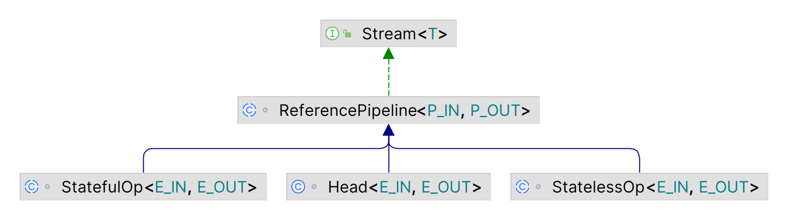

# Stream 概述

- [Stream 概述](#stream-概述)
  - [简介](#简介)
  - [操作通道](#操作通道)
  - [并行](#并行)
    - [无干扰](#无干扰)
    - [无状态](#无状态)
    - [副作用](#副作用)
  - [顺序](#顺序)
  - [约简操作](#约简操作)
  - [可变约简](#可变约简)
  - [约简、并发和顺序](#约简并发和顺序)
  - [结合律](#结合律)
  - [构造流的底层](#构造流的底层)
  - [从 Iterate 到 Stream](#从-iterate-到-stream)
  - [引用流](#引用流)
  - [参考](#参考)

2023-11-22, 21:31😀
@author Jiawei Mao
****

## 简介

`Stream`, `IntStream`, `LongStream`, `DoubleStream` 提供了对 `Object`, `int`, `long`, `double` 的流封装。

stream 和集合很像，允许转换和检索数据，但是也有所不同：

- `Stream` 不保存元素。`Stream` 不是数据结构，而是对数据源（如数据结构、数组、生成函数、IO 通道）的元素执行计算操作的操作流程；
- `Stream` 为函数式。Stream 操作不修改数据源，而是生成新的数据。例如，从集合中获得的 `Stream` 执行 `filter` 操作，该操作生成不包含滤掉元素的新 Stream，而不是从数据源集合中删除元素；
- `Stream` 操作都尽可能采用 *lazy* 模式，即在需要结果时才真正开始执行。流操作分为**中间操作**（intermediate，生成流）和**终端操作**（terminal，生成值或副作用），其中**中间操作**总是 lazy 的；
- 流可以是无限的。集合的大小必须有限，而流不需要。`limit(n)` 和 `findFirst()` 等短路操作可以在有限时间内完成对无限流的计算。
- 消耗品。流的元素在其生命周期中只被访问一次。和迭代器一样，要重新访问源的相同元素，需要生成一个新的流。

创建流的方式有许多，例如：

- 集合源：`Collection` 的 `stream()` 和 `parallelStream()` 方法；
- 数组源：`Arrays.stream(Object[])`；
- `Stream` 的工厂方法：如 `Stream.of(Object[])`, `IntStream.range(int, int)`, `Stream.iterate(Object, UnaryOperator)` 等；
- 文件源：`BufferedReader.lines()` 返回以文件 lines 为元素的流；
- 文件路径：通过 `Files` 中的方法可以获得以文件路径为元素的流；
- 随机数：通过 `Random.ints()` 获得随机数流；
- 其它源：JDK 中还有许多兼容 Stream 的方法，包括 `BitSet.stream()`, `Pattern.splitAsStream(java.lang.CharSequence)`, `JarFile.stream()` 等。

## 操作通道

流操作通道包含三部分：

- **源数据 [1]**：一个数据源，如集合、数组、生成函数或 I/O 通道；
- **中间操作 [0,)**：0 个或多个中间操作，如 `Stream.filter`, `Stream.map` 等；
- **终端操作**：如 `Stream.forEach`, `Stream.reduce` 等。

**中间操作**返回新的 `Stream`，中间操作总是 `lazy`。`filter()` 等中间操作创建一个新的流，在遍历时返回包含满足 predicate 的元素，但是，该遍历在执行终端操作时才开始。

**终端操作**，如 `Stream.forEach`, `IntStream.sum`，遍历流以生成值或产生副作用。执行终端操作后，流被消耗，无法再用，如果需要再次遍历相同的数据源，只能从数据源重新创建流。

- 终端操作几乎都是即时的（`eager`），在返回前遍历数据源并执行完计算管道；
- 终端操作 `iterator()` 和 `spliterator()` **除外**，当现有操作不足以完成任务，这两个操作为额外操作提供遍历管道。

**lazy** 操作的优点：

- `lazy` 操作可以提高效率：在 filter-map-sum 等管道中，可以将 filtering, mapping 和 summing 操作融合到单次数据迭代中，最小化中间状态；
- `lazy` 操作在没有必要时可以避免检查所有数据，例如找一个长度超过 1000 的字符串，该操作在找到所需字符串后，无序继续检查源数据的余下字符串。当源数据非常大或无限时，该功能非常有用。

**中间操作**可以进一步分为**无状态操作**和**有状态操作**：

- 无状态操作，如 `filter` 和 `map`，每个元素独立处理，元素之间互不干扰；
- 有状态操作，如 `distinct` 和 `sorted`，在处理新元素时可能需要结合处理过的元素的状态。

**有状态操作**在获得结果之前可能需要处理整个输入，如排序操作。因此，在**并行计算**中，包含有状态中间操作的管道可能需要多次遍历数据，或需要缓冲大量数据。中间操作完全是**无状态操作**的管道则只需要遍历一次数据，就能以最小的缓存完成串行或并行处理。

还有一类操作称为**短路操作**。包括：

- 将无限流转换为有限流的中间操作
- 对无限输入，能够在有限时间内完成的终端操作

对无限流，短路操作是必要的。

## 并行

使用显式 `for` 循环处理元素本质上是串行的。流通过将计算重构为聚合操作的管道实现并行。所有流操作都可以串行或并行执行。例如，`Collection`包含 `Collection.stream()` 和 `Collection.parallelStream()` 方法，分别生成串行流和并行流；`IntStream.range(int, int)` 虽然生成的是串行流，但调用 `BaseStream.parallel()` 即可并行化。例如，并行计算 `widgets` 的权重和：

```java
int sumOfWeights = widgets.parallelStream()
                          .filter(b -> b.getColor() == RED)
                          .mapToInt(b -> b.getWeight())
                          .sum();
```

流是串行还是并行执行，具体取决于调用终端操作时流的模式，通过 `isParallel()` 可以确定是否为并行模式；调用 `BaseStream.sequential()` 和 `BaseStream.parallel()` 可以修改执行方式。最近的串行或并行模式设置应用于整个流管道的执行。

除了明确标记为**不确定的操作**，如 `findAny()`，串行或并行不应该改变计算结果。

大多数流操作接受参数（**行为参数**），这些参数通常是 lambda 表达式。为了保证正确性，这些操作必须互不干扰，大多时候还必须无状态。这些参数为函数接口，如 `Function`，且通常是 lambda 表达式或方法引用。

### 无干扰

`Stream` 可以对各种数据源**并行**执行操作，包括 `ArrayList` 之类的非线程安全集合。但是有个前提：在执行流管道时**不干扰数据源**。除了 `iterator()` 和 `spliterator()`，管道操作在调用终端操作时开始执行，终端操作返回时结束。对大多数据源，防止干扰意味着在管道流执行期间**数据源不被修改**。不过有个例外，并发集合专门为并发修改设计，流管道执行期间也能修改。并发数据源的 `Spliterator` 属性值为 `CONCURRENT`。

因此，当数据源非并发时，流通道中的行为参数不应修改数据源。当行为参数修改**非并发数据源**，就称该行为参数**干扰数据源**。不干扰数据源的需求适用于所有管道，包括并行流和串行流。除非数据源为并发类型，否则在流管道执行期间修改数据源会抛出异常、得到错误答案或不一致行为。

在终端操作开始前可以修改数据源。例如：

```java
List<String> l = new ArrayList(Arrays.asList("one", "two"));
Stream<String> sl = l.stream();
l.add("three");
String s = sl.collect(joining(" "));
```

其中 `s` 会 "one two three"。

### 无状态

{width="600px"}

如果流操作的行为参数是有状态的，则流管道结果可能不确定或不正确。有状态 lambda 表达式（或实现函数接口的对象），其结果依赖于流管道执行期间可能发生变化的任何状态。以 `map()` 为例：

```java
Set<Integer> seen = Collections.synchronizedSet(new HashSet<>());
stream.parallel().map(e -> { if (seen.add(e)) return 0; else return e; })...
```

如果并行执行 mapping 操作，由于线程调度差异，多次运行，相同输入可能获得不同结果；而使用无状态 lambda 表达式，结果总是相同的。

!!! note
    从行为参数访问可变状态会带来安全性和性能问题：如果不同步对数据的访问，会出现数据争用；如果同步对该可变状态的访问，又可能因为争用而破坏并行性，即无法从并行中受益。最好的办法是完全**避免在流操作中使用有状态行为参数**。

### 副作用

不建议在流操作的行为参数中包含副作用，因为它们常会无意中违反无状态需求，以及其它线程安全隐患。

如果行为参数包含副作用，除非明确声明，否则不能保证：

- 这些副作用对其它线程可见；
- 同一流管道中对相同元素的不同操作在同一线程中执行；
- 甚至不能保证带副作用的行为参数被调用，因为流实现可以省略流管道中不影响计算结果的某些操作。

副作用的顺序可能不符合预期。即使管道生成结果的顺序与流源相同，如 `IntStream.range(0,5).parallel().map(x -> x*2).toArray()` 肯定生成 `[0, 2, 4, 6, 8]`，但不保证 mapping 函数应用于单个元素的顺序，也不能保证在哪个线程为给定元素执行行为参数。

副作用被取消也可能不符合预期。除了终端操作 `forEach` 和 `forEachOrdered`，如果跳过行为参数的执行不影响计算结果，行为操作的副作用可能不被执行。具体示例可以参考 `count` 操作的文档。

许多使用副作用的计算，都可以使用不含副作用的操作更安全、高效地表达，例如，使用 `reduction` 替换 mutable accumulators。但是，使用 `println()` 进行调试这类副作用通常无害。因为 JDK 提供了少出流操作，如 `forEach()` 和 `peek()`，专门用于副作用操作，不过应该谨慎使用它们。

下面演示如何将包含不恰当副作用的流管道转换为不包含副作用的流管道。下面的代码在字符串中搜索匹配指定正则表达式的字符串，并将匹配项放入列表中：

```java
ArrayList<String> results = new ArrayList<>();
stream.filter(s -> pattern.matcher(s).matches())
    .forEach(s -> results.add(s));  // Unnecessary use of side-effects!
```

这里不必要的使用了副作用。如果并行执行，线程不安全的 `ArrayList` 会导致结果不正确，到引入同步机制会导致争用，从而破坏并行的优势。此外，这里完全没有必要使用副作用，`forEach()` 可以替换为一个更安全、更高效、更适合的并行化的 reduction 操作：

```java
List<String> results =
    stream.filter(s -> pattern.matcher(s).matches())
        .toList();  // No side-effects!
```

## 顺序

流元素的顺序可以确定也可以不确定。流元素顺序是否确定取决于**数据源**和**中间操作**：

- 有些数据源（如 `List` 和数组）本质上是有序的，有些（如 `HashSet`）是无序的；
- 有些中间操作（如 `sorted()`）会将无序流转换为固定顺序，而有些中间操作（如 `BaseStream.unordered()`）会使有序流变得无序；
- 有些终端操作会忽略元素顺序，如 `forEach()`。

对有序流，大多数操作按元素顺序执行；如果数据源是包含 `[1, 2, 3]`，则执行 `map(x -> x*2)` 的结果必然是 `[2, 4, 6]`。但是，如果数据源没有确定的元素顺序，则值 `[2, 4, 6]` 的任何排列都是有效结果。

对**串行流**，元素顺序不影响性能，只影响确定性。如果流是有序的，在相同源上重复执行相同的流管道必然产生相同的结果；如果流是无序的，重复执行可能产生不同的结果。

对**并行流**，放宽元素顺序限制有时可以提高性能。有些聚合操作，如去重 `distinct()` 和分组约简 `Collectors.groupingBy()`，忽略元素顺序可以更有效地实现。而与顺序相关的操作，如 `limit()`，可能需要缓冲以确保元素顺序的正确性，从而破坏并行的效率。当流具有固定顺序，但我们不关注顺序时，显式调用 `unordered()` 打乱流元素顺序可能提高一些有状态操作或终端操作的并行性能。不过，大多数流管道，即使在排序约束下仍然可以有效地并行。

## 约简操作

约简操作（reduction），由称为折叠操作（fold），指通过重复应用合并操作，将一串输入元素汇总为单个值，如 sum 和 max 操作。Stream 类有多种形式的通用约简操作，即 `reduce()` 和 `collect()`，以及多个专用约简操作，如 `sum()`, `max()` 和 `count()`。

当然，这些操作可以很容易实现为简单的顺序，例如：

```java
int sum = 0;
for (int x : numbers) {
    sum += x;
}
```

优先选择约简操作而不是 for 循环的理由：

- 约简操作更抽象，它对整个流而不是单个元素进行操作；
- 如果处理元素的函数是 associative 和无状态的，正确构造的约简操作可以并行化。

例如，给定一串数字，计算它们的加和，可以按如下方式：

```java
int sum = numbers.stream().reduce(0, (x,y) -> x+y);
```

或者：

```java
int sum = numbers.stream().reduce(0, Integer::sum);
```

这些约简操作可以安全的并行运行，几乎不需要修改：

```java
int sum = numbers.parallelStream().reduce(0, Integer::sum);
```

约简操作的并行性很好，可以流实现可以并行对数据子集进行操作，然后将临时结果结合起来得到最终答案。reduce() 消除了并行约简操作的所有负担，不需要额外的同步，就能提供高效的并行实现。

"widgets" 示例展示了如何将将约简操作与其它操作结合起来替换 for 循环。如果 `widgets` 为 `Widget` 对象集合，`Widget` 有一个 `getWeight` 方法，可以按如下方式找到权重最大的 widget:

```java
OptionalInt heaviest = widgets.parallelStream()
                            .mapToInt(Widget::getWeight)
                            .max();
```

在约简操作的通用形式 `reduce` 操作中，元素类型 `<T>` 转换为 `<U>`，需要三个参数：

```java
<U> U reduce(U identity,
             BiFunction<U, ? super T, U> accumulator,
             BinaryOperator<U> combiner);
```

- `identity` 是约简操作的初始元素，如果输入元素个数为 0，它也是默认值；
- `accumulator` 函数以部分结果和下一个元素为参数，生成新的临时结果；
- `combiner` 函数合并两个 partial-results 为一个新的 partial-result，并行约简中是必需的。

`identity` 的值也是 `combiner` 的初始值，换句话说，对所有 `u`，`combiner.apply(identity, u)` 等于 `u`。另外，`combiner` 函数必须满足结合律（associative）并与 `accumulator` 兼容，即对所有 u 和 t，`combiner.apply(u, accumulator.apply(identity, t))` 必须 `equals()` `accumulator.apply(u, t)`。

三参数形式是二参数形式的推广，将 mapping 步骤合并到了 accumulation 步骤。我们可以用这种通用形式重新写上面的 widgets 示例：

```java
int sumOfWeights = widgets.stream()
                        .reduce(0,
                                (sum, b) -> sum + b.getWeight(),
                                Integer::sum);
```

显式的 map-reduce 形式可读性更好，因此通常应该首选。如果将 mapping 和 reducing 合并到单个函数可以进行大量优化，则可以使用 `reduce` 通用形式。

## 可变约简

可变约简操作将输入元素收集到一个可变容器，如 `Collection` 和 `StringBuilder`。

如果我们想要取字符串流，并将它们连接成一个长字符串，可以通过普通的约简操作来实现：

```java
String concatenated = strings.reduce("", String::concat)
```

我们会得到想要的结果，它甚至可以并行工作。然而，其性能不好。因为该实现会进行大量字符串复制，并且时间复杂度为 $O(n^2)$，n 为字符个数。更高效的方法是将字符串累计到 `StringBuilder` 中，即用可变容器收集字符串。我们可以使用与普通约简相同的技术来并行化可变约简。

可变约简操作为 `collect()`，因为它将所需的结果收集到一个容器（如 `Collection`） 中。`collect` 操作也需要三个参数：

- `supplier` 函数：用于创建结果容器的新实例
- `accumulator` 函数：将输入元素纳入容器中
- `combiner` 函数：合并两个容器的结果

`collect` 的形式与普通约简的通用形式非常相似：

```java
<R> R collect(Supplier<R> supplier,
              BiConsumer<R, ? super T> accumulator,
              BiConsumer<R, R> combiner);
```

与 reduce() 类似，以这种抽象方式表达的 collect 的可以直接并行化。例如，将流元素的 String 形式收集到 ArrayList 中，可以编写明显串行的 for 循环：

```java
ArrayList<String> strings = new ArrayList<>();
for (T element : stream) {
    strings.add(element.toString());
}
```

或者，使用可以并行的 `collect` 形式：

```java
ArrayList<String> strings = stream.collect(() -> new ArrayList<>(),
                                        (c, e) -> c.add(e.toString()),
                                        (c1, c2) -> c1.addAll(c2));
```

或者，将 mapping 操作从 accumulator 函数中提取出来，可以更简洁的表示为：

```java
List<String> strings = stream.map(Object::toString)
                            .collect(ArrayList::new, ArrayList::add, ArrayList::addAll);
```

这里，`supplier` 是 `ArrayList` 的构造函数，`accumulator` 将字符串元素添加到 `ArrayList`，`combiner` 使用 `ArrayList.addAll` 将一个容器的内容复制到另一个容器。

`collect` 的三个参数：`supplier`, `accumulator` 和 `combiner` 紧密耦合。我们可以使用 `Collector` 的抽象同时捕获这三部分内容。上面将字符串收集到 `List` 的示例可以用 `Collector` 重写为：

```java
List<String> strings = stream.map(Object::toString)
                            .collect(Collectors.toList());
```

将可变约简操作打包到 `Collector` 还有一个优点：可组合型（composability）。`Collectors` 包含许多预定义的 collectors 工厂方法，包含将一个 collector 转好为另一种 collector 的 combinators。例如，下面是一个计算工资总和的 collector：

```java
Collector<Employee, ?, Integer> summingSalaries
    = Collectors.summingInt(Employee::getSalary);
```

第二个类型参数 `?` 表示我们不关心这个 collector 使用的中间表示形式。如果希望按部门列出工资总和，可以在 `groupingBy` 中重用 `summingSalaries`：

```java
Map<Department, Integer> salariesByDept
    = employees.stream().collect(Collectors.groupingBy(Employee::getDepartment,
                                                    summingSalaries));
```

和常规约简操作一样，`collect()` 操作只有满足一定条件才能并行化。对任意 partial-collect，将其与空容器合并，必须生成等效的结果。即，对 partial-collect `p`，`p` 必须等价于 `combiner.apply(p, supplier.get())`。

此外，不管如何分隔计算，必须生成等效的结果。对输入元素 `t1` 和 `t2`，按如下方式计算的结果 `r1` 和 `r2` 必须等价：

```java
A a1 = supplier.get();
accumulator.accept(a1, t1);
accumulator.accept(a1, t2);
R r1 = finisher.apply(a1);  // result without splitting

A a2 = supplier.get();
accumulator.accept(a2, t1);
A a3 = supplier.get();
accumulator.accept(a3, t2);
R r2 = finisher.apply(combiner.apply(a2, a3));  // result with splitting
```

这里等价一般指 `Object.equals(Object)`，在某些情况下，忽略顺序差异。

## 约简、并发和顺序

对一些复杂的约简操作，如使用 `collect()` 生成 `Map`：

```java
Map<Buyer, List<Transaction>> salesByBuyer
    = txns.parallelStream()
        .collect(Collectors.groupingBy(Transaction::getBuyer));
```

并发执行可能会适得其反。这是因为对某些 `Map` 实现来说，合并 Map 是非常昂贵的操作。

但是，如果约简操作的结果容器是一个可以并发修改的集合，如 `ConcurrentHashMap`，此时，accumulator 的并行调用实际上可以将它们的结果并发存储到同一个共享容器中，从而消除 combiner 合并不同容器的需要。这可能互以提高并行执行的性能，称之为**并发约简**（concurrent reduction）。

支持并发约简的 `Collector` 被标记为 `Collector.Characteristics.CONCURRENT`。不过，并发收集也有缺点。如果多个线程并发地将就结果存储到共享容器中，则存储结果的顺序是不确定的。因此，只有当顺序不重要时才能使用并发约简。`Stream.collect(Collector)` 实现只有在满足如下情况才执行并发约简：

- 流是并发的；
- collector 具有 `Collector.Characteristics.CONCURRENT` 特征
- 流是无序的，或 collector 包含 `Collector.Characteristics.UNORDERED` 特征

使用 `BaseStream.unordered()` 可以确保流是无序的。例如：

```java
Map<Buyer, List<Transaction>> salesByBuyer
    = txns.parallelStream()
        .unordered()
        .collect(groupingByConcurrent(Transaction::getBuyer));
```

其中 `Collectors.groupingByConcurrent(java.util.function.Function<? super T, ? extends K>)` 是 `groupingBy` 的并发版本。

!!! note
    如果元素顺序很重要，就不能使用并发约简，并发插入无法保证顺序。此时只能使用串行约简或基于 merge 的并行约简（parallel reduction）。
    并发（concurrency）指处理多任务的能力。
    并行（parallel）指同时处理多个任务的能力。

## 结合律

如果操作符或函数 `op` 满足如下条件，就称其符合结合律：

```java
(a op b) op c == a op (b op c)
```

将其扩展为 4 项，可以看出结合律对并行的重要性：

```java
a op b op c op d == (a op b) op (c op d)
```

因此，我们可以并行计算 `(a op b)` 和 `(c op d)`，然后对结果调用 `op`。

涉及结合律的情况还有数字加法、最小和最大值，以及串联字符串。

## 构造流的底层

到目前为止，所有流的示例都使用 `Collection.stream()` 或 `Arrays.stream(Object[])` 这样的方法来创建流。这些创建流的方法如何实现的呢？

`StreamSupport` 类有许多用于创建流的方法，它们都使用某种形式的 `Spliterator`。`Spliterator` 是 `Iterator` 的并行版本，它描述一个支持串行遍历、批量遍历、以及将部分输入拆分到另一个 spliterator 并行处理的元素集合。所有流的底层都由 spliterator 驱动。

`Spliterator` 的实现有许多选择，几乎所有实现都是简单性和性能之间的权衡：

- 最简单，但是性能最差的是使用 `Spliterators.spliteratorUnknownSize(java.util.Iterator, int)`，这样的 `Spliterator` 也能工作，但是并行性能较差，因为没有底层数据源的大小，分割算法过于简单；
- 高质量的 `Spliterator` 提供均衡的、准确的大小信息，以及 `Spliterator` 的许多其它特征或数据，可用于优化执行；

可能数据源的 `Spliterator` 实现有一个额外的挑战：绑定数据的时间，因为数据可能在创建 `Spliterator` 和执行流管道之间发生变化。理想情况下，流的 `Spliterator` 应该报告一个 IMMUTABLE 或 CONCURRENT 特征；否则就是 late-binding。

如果数据源不能直接支持提供一个 `Spliterator`，它可以使用 Supplier 间接提供一个，然后通过 StreamSupport.stream 创建流。`Spliterator` 在流管道的终端操作开始执行后才从 `Supplier` 获得。

这些要求大大减少了数据源变化和流管道执行之间的潜在干扰。基于具有所需特征的 `Spliterator` 的流，或者那些使用 Supplier 的工厂方法，在终端操作开始之前不受数据源变化的影响。

## 从 Iterate 到 Stream

在处理集合时，通常会遍历元素。例如，计算书中长度大于 12 单词的数目：

```java
String contents = Files.readString(Path.of("alice.txt"));
List<String> words = List.of(contents.split("\\PL+"));
```

然后进行迭代：

```java
int count = 0;
for (String w : words) {
    if (w.length() > 12) count++;
}
```

使用 `Stream` 执行与迭代相同功能的操作：

```java
long count = words.stream()
        .filter(w -> w.length() > 12)
        .count();
```

将 `stream` 改为 `parallelStream`，上述操作就变成并行过滤和计数：

```java
long count = words.parallelStream()
        .filter(w -> w.length() > 12)
        .count();
```

代码解释：

- `stream()` 和 `parallelStream()` 为 `words` list 生成一个流
- `filter` 返回一个仅包含长度大于 12 单词的另一个流
- `count` 将流缩减为一个值

这是 stream 的典型工作流，可以将 stream 的操作分为三步：

1. 创建 stream
2. 指定将初始 stream 转换为其它 stream 的中间操作，可能包含多个步骤
3. 使用终端操作产生结果。该操作强制执行前面的 lazy 操作

**示例**

```java
URL resource = StreamTest.class.getResource("alice30.txt");
String contents = Files.readString(Path.of(resource.toURI()));
List<String> words = List.of(contents.split("\\PL+"));// \\PL+ 匹配所有非字符

long count = 0;
for (String w : words) {
    if (w.length() > 12) count++;
}
System.out.println(count);

count = words.stream().filter(w -> w.length() > 12).count();
System.out.println(count);

count = words.parallelStream().filter(w -> w.length() > 12).count();
System.out.println(count);
```

## 引用流

如果只使用中间操作，则可以对引用的流继续操作，如果包含终结操作，会导致流不再可用。

例如：

```java
Stream<String> stream = Stream.of("a", "b", "c")
                .filter(element -> element.contains("b"));
Optional<String> anyElement = stream.findAny();
```
然后再次使用该流：

```java
Optional<String> firstElement = stream.findFirst();
```

会抛出 `IllegalStateException`。即流不可重复使用。

## 参考

- https://docs.oracle.com/en/java/javase/17/docs/api/java.base/java/util/stream/package-summary.html