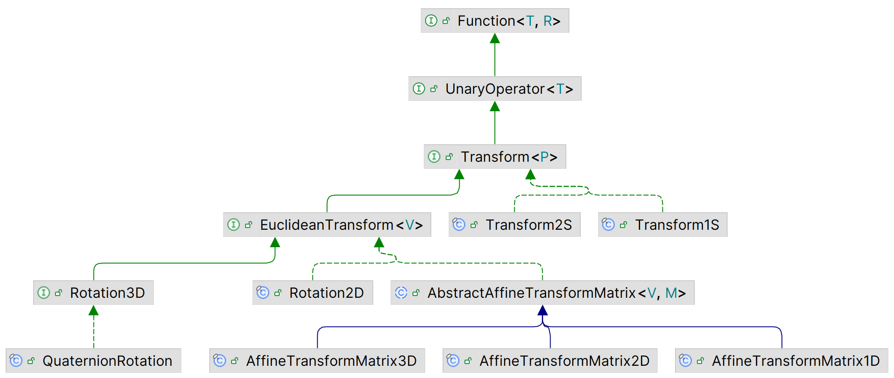
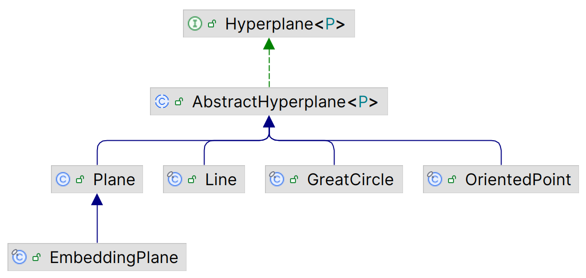

# 几何

## 简介

Commons Geometry 提供用于处理几何问题的类型和算法。其代码源自 commons-math 的 `org.apache.commons.math3.geometry` 包，但为了便于维护，已被分离到单独的项目中。此后，commons-geometry 经过多次改进，包括对核心接口和类的重构。

commons-geometry 包含如下几个子模块：

- [commons-geometry-core](https://commons.apache.org/proper/commons-geometry/commons-geometry-core/index.html) - 提供核心接口和类
- [commons-geometry-euclidean](https://commons.apache.org/proper/commons-geometry/commons-geometry-euclidean/index.html) - 提供 1D, 2D 和 3D 欧几里得空间相关的类
- [commons-geometry-spherical](https://commons.apache.org/proper/commons-geometry/commons-geometry-spherical/index.html) - 提供 1D 和 2D 球面空间相关的类
- [commons-geometry-io-core](https://commons.apache.org/proper/commons-geometry/commons-geometry-io-core/index.html) - 提供 IO 功能的核心类和接口
- [commons-geometry-io-euclidean](https://commons.apache.org/proper/commons-geometry/commons-geometry-io-euclidean/index.html) - 提供Euclidean 数据格式的 IO 操作，如 STL 和 OBJ 格式

除了这些模块，commons-geometry 源码仓库中还提供了 commons-geometry-examples 模块，包含许多示例代码。

## 概念

### 浮点数

commons-geometry 中所有浮点数都用 `double` 表示。

为了处理浮点计算中的精度维度，引入了 precision-context。precision-context 封装了浮点比较操作，该功能由 commons-numbers 库中的 `org.apache.commons.numbers.core.Precision.DoubleEquivalence` 类实现。

**示例**：使用 epsilon (tolerance) 来比较浮点数是否相等

```java
// create a precision instance with an epsilon (aka, tolerance) value of 1e-3
Precision.DoubleEquivalence precision = Precision.doubleEquivalenceOfEpsilon(1e-3);

// test for equality using the eq() method
precision.eq(1.0009, 1.0); // true; difference is less than epsilon
precision.eq(1.002, 1.0); // false; difference is greater than epsilon

// compare
precision.compare(1.0009, 1.0); // 0
precision.compare(1.002, 1.0); // 1
```

**equals() vs. eq()**

commons-geometry 中的许多类都提供了标准的 Java `equals()` 方法和 `eq()` 方法。`equals()` 方法测试对象之间是否严格相等，这要求两个对象中的浮点值必须完全相等，`equals()` 才会返回 `true`。

`eq()` 方法用于测试对象之间的近似相等性，由 `Precision.DoubleEquivalence` 进行评估。由于该近似性，该方法无法保证传递性，也无法与 `hashCode` 关联。当计算中的浮点错误可能导致值出现微小差异时，应使用 `eq()` 来测试对象相等性。

**示例**：演示 `equals()` 和 `eq()`

```java
Precision.DoubleEquivalence precision = Precision.doubleEquivalenceOfEpsilon(1e-6);

Vector2D v1 = Vector2D.of(1, 1); // (1.0, 1.0)
Vector2D v2 = Vector2D.parse("(1, 1)"); // (1.0, 1.0)

Vector2D v3 = Vector2D.of(Math.sqrt(2), 0).transform(
    AffineTransformMatrix2D.createRotation(0.25 * Math.PI)); // (1.0000000000000002, 1.0)

v1.equals(v2); // true - exactly equal
v1.equals(v3); // false - not exactly equal

v1.eq(v3, precision); // true - approximately equal according to the given precision context
```

### Transforms

几何变换就是映射点的函数。commons-geometry 使用 `Transform` 接口表示几何变换。相关实现如下所示，对支持的每种空间和维度都提供了实现：



`Transform` 的所有实现都必须满足以下要求：

1. 变换必须一对一。即空间中的每个点必须恰好映射到另一个点，这意味着该函数必须是可逆的。
2. 变换必须保持共线性。即如果一组点在变换前位于同一个超平面上，变换后也必须位于共一个超平面。例如，如果欧式 2D 点 a, b, c 位于直线 L 上，那么变换后的点 a', b', c' 必须位于直线 L' 上，其中 L' 是 L 的变换形式。
3. 变换必须保持平行性。变换前平行的超平面在变换后必须保持平行，相交的超平面在变换后必须保持相交。例如，在欧式空间中，使平行线在欧式空间中收敛到单个点的变换（如 3D 图形中创建透视点的投影变换）不满足该要求。然而，将正方形变成没有直角的菱形的变换满足次要求，因为构成正方形的两对平行线变换后仍然平行。

在欧式空间中满足上述要求的变换称为仿射变换，包括平移、旋转、反射、缩放及其任意组合操作。

### Hyperplane

**超平面**（hyperplane）是比其所在空间少一个维度的子空间。例如，在欧式三维空间中的超平面为二维平面。类似地，在欧式二维空间中的超平面是一维线。超平面将其所在空间划分为 3 个不同集合：

- 超平面一侧的点
- 超平面另一侧的点
- 超平面上的点

为了区分超平面两侧，一侧记为正面（plus），一侧记为反面（minus）。

一个点相对超平面的 offset 是指该点到超平面上最近点的距离。如果该点位于超平面的正面，则距离符号为正，否则为负。如果点位于超平面上，则 offset 为 0。

超平面在 commons-geometry 中扮演着关键角色，这不仅因为它们在几何学上的重要性，还因为它们是 region 类和算法的基础，如 BSP。超平面在代码中使用 `Hyperplane` 接口表示，每个空间和维度都有对应实现。用户无需实现该接口。相关类图如下所示：



### BSP Tree

二叉空间划分树（Binary Space Partitioning, BSP）是一种高效的空间划分方法。它提供一种非常灵活且强大的几何数据结构，可以表示从整个无限空间到简单的凸区域等各种对象。另外还有许多对 BSP 树执行操作的算法，如对点进行分类、计算表示区域的大小，对多面体执行布尔运算（并集、交集、差集、异或、补集）。

BSP-Tree 的主要原理是使用超平面对空间进行递归划分。理解该数据结构的最简单方法是遵循创建树的步骤。刚创建时，BSP-tree 只包含 root-node。该 node 为 leaf-node，代表整个空间。如果在该点插入一个超平面，超平面会将该 node 的空间划分为正面和反面。此时，root-node 被拆分为两个新的 leaf-node：一个 plus-node，一个 minus-node。plus-node 代表正面的一半空间，minus-nude 代表负面的一半空间。这些新的子节点可以继续被其它超平面切割，从而生成新的子节点，以此类推。通过这种方式，可以创建 BSP-tree 来表示任何基于超平面的空间划分。

BSP-tree 的基本形式不能表示多面体。为了表示多面体，必须在每个 leaf-node 存储额外的信息，即该 leaf-node 位于 shape 的内部还是外部。按照惯例，当切割 BSP-tree node 时，位于超平面的反面的 child-node 视为在 shape 内部，而位于正面的 child-node 视为在 shape 外面。例如，在欧式 3D 空间中，平面法线被认为指向平面的正方向，因此，当用平面切割 BSP-tree node 时，平面法线指向形状的外侧。在 commons-geometry 中，可以在插入树时传入 `RegionCutRule` 显式指定正面和反面，从而对树的结构进行细粒度控制。

commons-geometry 以及原 commons-math 中 BSP-tree 的开发主要来源 Bruce Naylor, John Amanatides 和William Thibault 的论文 [Merging BSP Trees Yields Polyhedral Set Operations](http://www.cs.yorku.ca/~amana/research/bsptSetOp.pdf)。

commons-geometry 中的 BSP-tree 使用 `BSPTree` 接口表示。该接口对每个支持的空间和维度都提供了实现。

**示例**：手动创建 BSP-Tree region

直接在 node 中插入超平面切割，创建一个表示单位正方形的 BSP-tree。为了保持树的平衡，在根节点处使用了对角线结构性切割。

```java
Precision.DoubleEquivalence precision = Precision.doubleEquivalenceOfEpsilon(1e-6);

// 创建一个表示空白空间的 tree
RegionBSPTree2D tree = RegionBSPTree2D.empty();

// nsert a "structural" cut, meaning a cut whose children have the same inside/outside
// status as the parent; this will help keep our tree balanced and limit its overall height
tree.getRoot().insertCut(Lines.fromPointAndDirection(Vector2D.ZERO, Vector2D.of(1, 1), precision),
        RegionCutRule.INHERIT);

RegionBSPTree2D.RegionNode2D currentNode;

// insert on the plus side of the structural diagonal cut
currentNode = tree.getRoot().getPlus();

currentNode.insertCut(Lines.fromPointAndDirection(Vector2D.ZERO, Vector2D.Unit.PLUS_X, precision));
currentNode = currentNode.getMinus();

currentNode.insertCut(Lines.fromPointAndDirection(Vector2D.of(1, 0), Vector2D.Unit.PLUS_Y, precision));

// insert on the plus side of the structural diagonal cut
currentNode = tree.getRoot().getMinus();

currentNode.insertCut(Lines.fromPointAndDirection(Vector2D.of(1, 1), Vector2D.Unit.MINUS_X, precision));
currentNode = currentNode.getMinus();

currentNode.insertCut(Lines.fromPointAndDirection(Vector2D.of(0, 1), Vector2D.Unit.MINUS_Y, precision));

// compute some tree properties
int count = tree.count(); // number of nodes in the tree = 11
int height = tree.height(); // height of the tree = 3
double size = tree.getSize(); // size of the region = 1
Vector2D centroid = tree.getCentroid(); // region centroid = (0.5, 0.5)
```

**示例**：创建 标准 BSP-tree region

下面使用标准方法创建 BSP-tree region，即在 tree 中插入超平面，形状与上例相同

```java
Precision.DoubleEquivalence precision = Precision.doubleEquivalenceOfEpsilon(1e-6);

// create a tree representing an empty space (nothing "inside")
RegionBSPTree2D tree = RegionBSPTree2D.empty();

// insert the hyperplane subsets
tree.insert(Arrays.asList(
            Lines.segmentFromPoints(Vector2D.ZERO, Vector2D.of(1, 0), precision),
            Lines.segmentFromPoints(Vector2D.of(1, 0), Vector2D.of(1, 1), precision),
            Lines.segmentFromPoints(Vector2D.of(1, 1), Vector2D.of(0, 1), precision),
            Lines.segmentFromPoints(Vector2D.of(0, 1), Vector2D.ZERO, precision)
        ));

// compute some tree properties
int count = tree.count(); // number of nodes in the tree = 9
int height = tree.height(); // height of the tree = 4
double size = tree.getSize(); // size of the region = 1
Vector2D centroid = tree.getCentroid(); // region centroid = (0.5, 0.5)
```

## 核心接口

commons-geometry 包含许多贯穿整个库的核心接口，通常遵循相同的实现模式。对每个空间和维度，有些接口始终使用单个类实现，有些接口可能有多个实现，还有一些接口是可选的。此外，每个空间和维度都有一个主工厂类，其中包含用于生成超平面和超平面子集的工厂方法。

每个支持的空间和维度包含：

- `Point`: 空间中的位置
- `Hyperplane`: 几何图元，用于划分空间
- `Vector` (如果适用)：通用向量接口
- 一个或多个实现
  - `HyperplaneSubset`: 表示超平面中点的子集，例如直线上的 1D 区间，或 3D 平面上的多边形区域。它是 `HyperplaneConvexSubset` base 接口，但不要求子集为凸的。因此可以表示非凸和不相交区域。实例大小可以有限或无限
  - `HyperplaneConvexSubset`：

## 参考

- https://commons.apache.org/proper/commons-geometry/index.html
- https://github.com/apache/commons-geometry