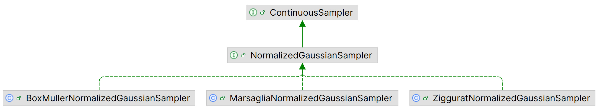

# Apache Commons RNG

2025-09-09⭐
@author Jiawei Mao
***
## 简介

Commons RNG 提供为随机数生成器。

目标是提供一个简单易用的 API，并在代码和 javadoc 中提供基本原理解释。其代码在 `org.apache.commons.math3.random` 包的基础上进行改进，并切断与 `java.util.Random` 的联系。

该工具包分为多个模块：

- Client-API (Java 8+)

提供用户接口。

- Core (Java 8+)

包含多个伪随机数生成器的实现。该模块中的代码旨在 commons-rng 内部使用，用户代码不应该直接访问。随着 Java 模块化的出现，该库的未来版本可能会强制通过 `RandomSource` 工厂类访问。

- Simple (Java 8+)

提供创建 commons-rng-core 模块中生成器的工厂方法。

- Sampling (Java 8+)

根据指定概率分布生成数字序列；从几何形状中抽样坐标；从集合中抽样等。相当于 commons-rng-client-api 的使用示例。

- **Examples**：commons-rng 还提供了各种示例程序，用于演示各种用法。这些示例不是库的一部分，可以在 github 源码仓库查看。主要包括：
  - examples-jhm: JMH 基准测试，使用 JMH 基准框架评测生成器的相对性能。
  - examples-stress: 压力测试，实现一个调用外部工具的 wrapper ，通过将生成器的输出提交给一系列压力测试来评估生成器的质量。
  - examples-sampling：概率密度，生成概率密度图
  - examples-jpms: JPMS 集成（java 11+)，展示如何使用各个模块
  - examples-quadrature: 使用 quasi-Montecarlo 积分估算 π 值

> [!TIP]
>
> 常规使用添加 commons-rng-simple 依赖项即可，需要抽样则额外添加 commons-rng-sampling。

## 使用概览

javadoc 提供了各个方法的详细说明。

### 创建 generator

随机数生成器通过 `RandomSource` 中定义的工厂方法实例化

```java
import org.apache.commons.rng.UniformRandomProvider;
import org.apache.commons.rng.simple.RandomSource;

UniformRandomProvider rng = RandomSource.XO_RO_SHI_RO_128_PP.create();
```

### 生成不同类型值

生成器可以从特定 java 类型指定范围随机选择值

```java
boolean isOn = rng.nextBoolean(); // "true" or "false".
```

```java
int n = rng.nextInt();         // Integer.MIN_VALUE <= n <= Integer.MAX_VALUE.
int m = rng.nextInt(max);      // 0 <= m < max.
int l = rng.nextInt(min, max); // min <= l < max.
```

```java
long n = rng.nextLong();         // Long.MIN_VALUE <= n <= Long.MAX_VALUE.
long m = rng.nextLong(max);      // 0 <= m < max.
long l = rng.nextLong(min, max); // min <= l < max.
```

```java
float x = rng.nextFloat();         // 0 <= x < 1.
float y = rng.nextFloat(max);      // 0 <= y < max.
float z = rng.nextFloat(min, max); // min <= z < max.
```

```java
double x = rng.nextDouble();         // 0 <= x < 1.
double y = rng.nextDouble(max);      // 0 <= y < max.
double z = rng.nextDouble(min, max); // min <= z < max.
```

### 随机 byte 数组

生成器可以用随机数填充指定 byte 数组

```java
byte[] a = new byte[47];
// The elements of "a" are replaced with random values from the interval [-128, 127].
rng.nextBytes(a);
```

```java
byte[] a = new byte[47];
// Replace 3 elements of the array (at indices 15, 16 and 17) with random values.
rng.nextBytes(a, 15, 3);
```

### primitive stream

生成器可以返回原始类型流

```java
IntStream s1 = rng.ints();         // [Integer.MIN_VALUE, Integer.MAX_VALUE]
IntStream s2 = rng.ints(max);      // [0, max)
IntStream s3 = rng.ints(min, max); // [min, max)
```

```java
LongStream s1 = rng.longs();         // [Long.MIN_VALUE, Long.MAX_VALUE]
LongStream s2 = rng.longs(max);      // [0, max)
LongStream s3 = rng.longs(min, max); // [min, max)
```

```java
DoubleStream s1 = rng.doubles();         // [0, 1)
DoubleStream s2 = rng.doubles(max);      // [0, max)
DoubleStream s3 = rng.doubles(min, max); // [min, max)
```

可以限制流的大小：

```java
// Roll a die 1000 times
int[] rolls = rng.ints(1000, 1, 7).toArray();
```

生成流的方法默认通过重复调用相关的 `next` 方法实现，可能有性能开销。可以使用 sampling 模块的实例创建高效的流，sampler 可以在构造时提前计算系数，加快计算速度。

- `UniformRandomProvider` 接口为除 `nextLong` 之外的所有生成方法提供了默认实现，新生成器必须只提供 64-bit 随机源

```java
UniformRandomProvider rng = new SecureRandom()::nextLong;
```

core 模块提供了 32-bit 和 64-bit 随机源的抽象类，以及接口中没有的其它功能。

### seed

为了生成可重复序列，在实例化生成器时必须提供 seed

```java
UniformRandomProvider rng = RandomSource.SPLIT_MIX_64.create(5776);
```

如果没有 seed，则隐式生成随机 seed。

`RandomSource` 提供了生成各种类型 seed 的方法。

```java
int seed = RandomSource.createInt();

long seed = RandomSource.createLong();

int[] seed = RandomSource.createIntArray(128); // Length of returned array is 128.

long[] seed = RandomSource.createLongArray(128); // Length of returned array is 128.
```

### seed 设置

- 以下任何类型都可以作为 seed 参数传递给 `create` 方法

  - `int` or `Integer`

  - `long` or `Long`

  - `int[]`

  - `long[]`

  - `byte[]`

```java
UniformRandomProvider rng = RandomSource.ISAAC.create(5776);

UniformRandomProvider rng = RandomSource.ISAAC.create(new int[] { 6, 7, 7, 5, 6, 1, 0, 2 });

UniformRandomProvider rng = RandomSource.ISAAC.create(new long[] { 0x638a3fd83bc0e851L, 0x9730fd12c75ae247L });
```

需要注意的是，在初始化时底层算法：

- 没有完全使用所有 seed 的内容
- 使用给定 seed 作为输入填充其内部状态（避免过于统一的初始状态）

这两种情况的输出都不是标准的，但在不同版本之间不变。

每个 RNG 实现都有一个native-seed，当传递给 `create` 的参数不是 native-type 时，会自动转换。转换会保留信息内容，但不固定（不同版本可能使用不同的转换方式）。

因此，为了保证在不同版本库中生成序列的可重复性，用户应使用本地 seeds：

```java
long seed = 9246234616L;
if (!RandomSource.TWO_CMRES.isNativeSeed(seed)) {
    throw new IllegalArgumentException("Seed is not native");
}
```

对每个可用实现，native-seed 类型在 javadoc 中有说明。

- 当对随机源实现参数化，自定义参数在 seed 后给出

```java
int seed = 96912062;
int first = 7; // Subcycle identifier.
int second = 4; // Subcycle identifier.
UniformRandomProvider rng = RandomSource.TWO_CMRES_SELECT.create(seed, first, second);
```

### 保存和恢复

generator 的当前状态可以保存并恢复

```java
import org.apache.commons.rng.RestorableUniformRandomProvider;
import org.apache.commons.rng.RandomProviderState;

RestorableUniformRandomProvider rng = RandomSource.XO_RO_SHI_RO_128_PP.create();
RandomProviderState state = rng.saveState();
double x = rng.nextDouble();
rng.restoreState(state);
double y = rng.nextDouble(); // x == y.
```

### 序列化

从 `create` 方法返回的 `UniformRandomProvider` 没有实现 `java.io.Serializable` 接口但是，如果已知 random-source 通信 channel 的两端，自定义序列化很容易。，

```java
import org.apache.commons.rng.RestorableUniformRandomProvider;
import org.apache.commons.rng.simple.RandomSource;
import org.apache.commons.rng.core.RandomProviderDefaultState;

RandomSource source = RandomSource.KISS; // Known source identifier.

RestorableUniformRandomProvider rngOrig = source.create(); // Original RNG instance.

// Save and serialize state.
RandomProviderState stateOrig = rngOrig.saveState(rngOrig);
ByteArrayOutputStream bos = new ByteArrayOutputStream();
ObjectOutputStream oos = new ObjectOutputStream(bos);
oos.writeObject(((RandomProviderDefaultState) stateOrig).getState());

// Deserialize state.
ByteArrayInputStream bis = new ByteArrayInputStream(bos.toByteArray());
ObjectInputStream ois = new ObjectInputStream(bis);
RandomProviderState stateNew = new RandomProviderDefaultState((byte[]) ois.readObject());

RestorableUniformRandomProvider rngNew = source.create(); // New RNG instance from the same "source".

// Restore original state on the new instance.
rngNew.restoreState(stateNew);
```

### jumpable generator

`JumpableUniformRandomProvider` 接口允许创建 generator 的  copy，并在单个 jump 中将 generator 的状态大步推多。这可用于创建一组 generators，这些 generators 生成的序列在 jump 长度内不会重叠，可用于并行计算

```java
import org.apache.commons.rng.UniformRandomProvider;
import org.apache.commons.rng.JumpableUniformRandomProvider;
import org.apache.commons.rng.simple.RandomSource;
import java.util.concurrent.ForkJoinPool;

RandomSource source = RandomSource.XO_RO_SHI_RO_128_SS; // Known to be jumpable.

JumpableUniformRandomProvider jumpable = (JumpableUniformRandomProvider) source.create();

// For use in parallel
int streamSize = 10;
jumpable.jumps(streamSize).forEach(rng -> {
    ForkJoinPool.commonPool().execute(() -> {
        // Task using the rng
    });
});
```

注意，这里 RNG 流的串行的。每个 RNG 在可能耗时任务中使用，，这些任务使用 executor-service 执行。

在上例中，已知源实现了 `JumpableUniformRandomProvider` 接口。但并非所有 generators 实现该接口，可以使用 `isJumpable()` 和 `isLongJumpable()` 来确定 `RandomSource` 是否可以跳转。

```java
import org.apache.commons.rng.simple.RandomSource;

public void initialise(RandomSource source) {
    if (!source.isJumpable()) {
        throw new IllegalArgumentException("Require a jumpable random source");
    }
    // ...
}
```

### spllitable

`SplittableUniformRandomProvider` 接口允许 generator 拆分为两个对象（原实例和新实例），每个对象都实现相同接口，并且可以无限递归拆分。该接口可用于分支数量未知的并行计算。这些 generators 提供对并行流的支持。需要注意的是，新建的 generator 生成的序列不可避免会与现有 generator 有关联。支持该接口的 generator 都在最大限度地减少实例之间的相关性。由并行流递归拆分的 generators 对其输出序列的碰撞具有鲁棒性

```java
import org.apache.commons.rng.UniformRandomProvider;
import org.apache.commons.rng.SplittableUniformRandomProvider;
import org.apache.commons.rng.simple.RandomSource;

RandomSource source = RandomSource.L64_X128_MIX; // Known to be splittable.

SplittableUniformRandomProvider splittable = (SplittableUniformRandomProvider) source.create();

// For use in parallel
int streamSize = 10;
jumpable.splits(streamSize).parallel().forEach(rng -> {
    // Task using the rng
});
```

注意，这里 RNG 流是并行的，每个 RNG 都用于可能耗时任务中，如果包含的流支持多线程，则该任务可以与其它任务并行。

在上例中，已知 source 实现了 `SplittableUniformRandomProvider` 接口。并非所有 generators 支持该功能，可以使用 `RandomSource` 的 `isSplittable()` 方法判断是否可拆分：

```java
import org.apache.commons.rng.simple.RandomSource;

public void initialise(RandomSource source) {
    if (!source.isSplittable()) {
        throw new IllegalArgumentException("Require a splittable random source");
    }
    // ...
}
```

### 分布

生成各种分布的随机值

```java
import org.apache.commons.rng.sampling.distribution.ContinuousSampler;
import org.apache.commons.rng.sampling.distribution.GaussianSampler;
import org.apache.commons.rng.sampling.distribution.ZigguratSampler;

ContinuousSampler sampler = GaussianSampler.of(ZigguratSampler.NormalizedGaussian.of(RandomSource.ISAAC.create()),
                                               45.6, 2.3);
double random = sampler.sample();
```

```java
import org.apache.commons.rng.sampling.distribution.DiscreteSampler;
import org.apache.commons.rng.sampling.distribution.RejectionInversionZipfSampler;

DiscreteSampler sampler = RejectionInversionZipfSampler.of(RandomSource.ISAAC.create(),
                                                           5, 1.2);
int random = sampler.sample();
```

#### Normal

标准正态分布的实现有三种，如下所示：

- Box-Muller 算法实现
- Marsaglia polar 算法实现，该算法是 Box-Muller 算法变体
- Ziggurat 算法实现



另外还有 `GaussianSampler` 类，以 `NormalizedGaussianSampler` 为参数，从任意正态分布采样。

#### 连续均匀分布

`ContinuousUniformSampler` 在指定范围均匀采样。

```java
public static SharedStateContinuousSampler of(UniformRandomProvider rng,
                                          double lo,
                                          double hi)
```


### Sampler

为基础类型 `int`, `long` 和 `double` 提供了 Sampler 接口。`samples` 方法使用 Java 8 Stream API 创建样本流

```java
import org.apache.commons.rng.sampling.distribution.PoissonSampler;
import org.apache.commons.rng.simple.RandomSource;

double mean = 15.5;
int streamSize = 100;
int[] counts = PoissonSampler.of(RandomSource.L64_X128_MIX.create(), mean)
                             .samples(streamSize)
                             .toArray();
```

```java
import org.apache.commons.rng.sampling.distribution.ZigguratSampler;
import org.apache.commons.rng.simple.RandomSource;

// Lower-truncated Normal distribution samples
double low = -1.23;
double[] samples = ZigguratSampler.NormalizedGaussian.of(RandomSource.L64_X128_MIX.create())
                                                     .samples()
                                                     .filter(x -> x > low)
                                                     .limit(100)
                                                     .toArray();
```

### SharedStateSampler

`SharedStateSampler` 接口允许使用 generator 创建一个 copy，副本仅共享 immutable 状态，可用于并行计算。

```java
import org.apache.commons.rng.UniformRandomProvider;
import org.apache.commons.rng.sampling.distribution.MarsagliaTsangWangDiscreteSampler;
import org.apache.commons.rng.sampling.distribution.SharedStateDiscreteSampler;
import org.apache.commons.rng.simple.RandomSource;

RandomSource source = RandomSource.XO_RO_SHI_RO_128_PP;

double[] probabilities = {0.1, 0.2, 0.3, 0.4};
SharedStateDiscreteSampler sampler1 = MarsagliaTsangWangDiscreteSampler.Enumerated.of(source.create(), probabilities);

// For use in parallel
SharedStateDiscreteSampler sampler2 = sampler1.withUniformRandomProvider(source.create());
```

所有 sampler 支持 `SharedStateSampler` 接口。

### 从集合抽样

从集合排列、组合、采样。

```java
import org.apache.commons.rng.sampling.PermutationSampler;
import org.apache.commons.rng.sampling.CombinationSampler;

// 3 elements from the (0, 1, 2, 3, 4, 5) tuplet.
int n = 6;
int k = 3;

// If the order of the elements matters.
PermutationSampler permutationSampler = new PermutationSampler(RandomSource.KISS.create(),
                                                               n, k);
// n! / (n - k)! = 120 permutations.
int[] permutation = permutationSampler.sample();

// If the order of the elements does not matter.
CombinationSampler combinationSampler = new CombinationSampler(RandomSource.KISS.create(),
                                                               n, k);
// n! / (k! (n - k)!) = 20 combinations.
int[] combination = combinationSampler.sample();
```

```java
import java.util.HashSet;
import org.apache.commons.rng.sampling.CollectionSampler;

HashSet<String> elements = new HashSet<>();
elements.add("Apache");
elements.add("Commons");
elements.add("RNG");

CollectionSampler<String> sampler = new CollectionSampler<>(RandomSource.MWC_256.create(),
                                                            elements);
String word = sampler.sample();
```

```java
import java.util.Arrays;
import java.util.List;
import org.apache.commons.rng.UniformRandomProvider;
import org.apache.commons.rng.sampling.ListSampler;

List<String> list = Arrays.asList("Apache", "Commons", "RNG");

UniformRandomProvider rng = RandomSource.XO_RO_SHI_RO_128_PP.create();

// Get 2 random items
int k = 2;
List<String> sample = ListSampler.sample(rng, list, k);

// Shuffle the list
ListSampler.shuffle(rng, list)
```

### 从几何形状抽样

支持从 Box, Ball, Line, Triangle, Tetrahedron 抽样

```java
import org.apache.commons.rng.sampling.shape.BoxSampler;

double[] lower = {1, 2, 3};
double[] upper = {15, 16, 17};
BoxSampler sampler = BoxSampler.of(RandomSource.KISS.create(),
                                   lower, upper);
double[] coordinate = sampler.sample();
double[][] coordinates = sampler.samples(100).toArray(double[][]::new);
```

### CompositeSamplers

`CompositeSamplers` 用于创建符合采样器，可以对返回相同类型的采样器进行加权组合。

下面使用三角形的长度作为权重，对三角形的边框进行均匀采样：

```java
import org.apache.commons.rng.sampling.shape.LineSampler;

UniformRandomProvider rng = RandomSource.JSF_64.create();

// Triangle vertices
double[] a = {1.23, 4.56};
double[] b = {6.78, 9.01};
double[] c = {3.45, 2.34};
// Line lengths
double ab = Math.hypot(a[0] - b[0], a[1] - b[1]);
double bc = Math.hypot(b[0] - c[0], b[1] - c[1]);
double ca = Math.hypot(c[0] - a[0], c[1] - a[1]);

ObjectSampler<double[]> sampler =
    CompositeSamplers.<double[]>newObjectSamplerBuilder()
        .add(LineSampler.of(rng, a, b), ab)
        .add(LineSampler.of(rng, b, c), bc)
        .add(LineSampler.of(rng, c, a), ca)
        .build(rng);

double[] coordinate = sampler.sample();

```

## library 布局

client-API 由 `org.apache.commons.rng` 中定义的类和接口组成：

- `UniformRandomProvider` 接口提供指定范围均匀分布的随机序列
- `RestorableUniformRandomProvider` 和 `RandomProviderState` 提供 "save/restore" API
- `JumpableUniformRandomProvider` 和 `LongJumpableUniformRandomProvider` 为并行计算提供 copy-jump API，适用于已知并行任务数的情况
- `SplittableUniformRandomProvider` 为并行计算提供 split API，适用于并行任务数未知的任务，例如使用 JDK 并行流执行任务

实例化 generators 的 API 在 `org.apache.commons.rng.simple` 包中。`RandomSource` enum 指定生成随机值序列的算法。

`org.apache.commons.rng.simple.internal` 包含初始化 generator 的类（seeding）。在应用中通常不直接使用，而是使用 `RandomSource` 中定义的方法：

- `RandomProviderDefaultState` 实现 `RandomProviderState` 接口，为通过 `RandomSource` 工厂方法创建的 `RestorableUniformRandomProvider` 实例提供 save/restore 功能
- `BaseProvider`：所有 RNG 实现的基类，包含所有实现共有的 `nextInt(int n)` 和 `nextLong(long n)` 方法
- `org.apache.commons.rng.core.util`
  - `NumberFactory`: 根据输出要求解释及合并随机源的输出，即 `UniformRandomProvider` 支持的 java 基础类型
  - `RandomStreams`：根据随机 seed 和随机源生成 stream
- `org.apache.commons.rng.core.source32`
  - `RandomIntSource`: 32-bit 随机生成算法
  - `IntProvider`: `RandomIntSource` 实现的基类
- `org.apache.commons.rng.core.source64`
  - `RandomLongSource`: 64-bit 随机生成算法
  - `LongProvider`: `RandomLongSource` 实现的基类

## 性能

下面介绍 RNG 实现的校准性能。所有运行在以下平台执行：

- CPU: Intel(R) Xeon(R) CPU E5-1680 v3 @ 3.20GHz
- Java version: 11.0.16 (build 11.0.16+8-post-Ubuntu-0ubuntu118.04)
- JVM: OpenJDK 64-Bit Server VM (build 11.0.16+8-post-Ubuntu-0ubuntu118.04, mixed mode, sharing)

使用 JMH 测量性能，测试代码在 Examples 中。

Timing 代表性能，结果的相对排序在不同 JVM、OS 和硬件中可能变化。下表中：

- 第一列为 RNG 类型
- **值越小越好**

### 生成 primitive 值

下表显示生成 `boolean`, `double`, `long`, `float`, `int` 序列的性能。

打分值以 `RandomSource.JDK` 进行归一化。

注意，core 实现使用随机源的所有 bits。例如，生成一个 32-bit `int` 值需要 native generator 生成 32 个 `boolean` 值，生成一个 64-bit `long`  需要 2 个 `int` 值。该实现对所有 generators 来说都很快，但需要高质量的随机源。具体参考 Quality 部分。

| RNG identifier        | `boolean` | `double` | `long`  | `float` | `int`   |
| :-------------------- | :-------- | :------- | :------ | :------ | :------ |
| JDK                   | 1.00000   | 1.00000  | 1.00000 | 1.00000 | 1.00000 |
| WELL_512_A            | 1.11461   | 0.59987  | 0.58102 | 0.87589 | 0.75203 |
| WELL_1024_A           | 1.36841   | 0.60740  | 0.59623 | 0.89262 | 0.74222 |
| WELL_19937_A          | 1.08024   | 0.76173  | 0.74484 | 1.08742 | 1.02213 |
| WELL_19937_C          | 1.32791   | 1.02451  | 0.79133 | 1.17066 | 1.09529 |
| WELL_44497_A          | 1.32461   | 1.02395  | 0.78924 | 1.12883 | 1.09717 |
| WELL_44497_B          | 1.33975   | 1.09410  | 0.86264 | 1.22877 | 1.17148 |
| MT                    | 1.08968   | 0.50325  | 0.44883 | 0.59148 | 0.48715 |
| ISAAC                 | 1.04350   | 0.59010  | 0.53097 | 0.90597 | 0.56016 |
| SPLIT_MIX_64          | 1.40526   | 0.13745  | 0.09556 | 0.32604 | 0.21787 |
| XOR_SHIFT_1024_S      | 1.33565   | 0.19589  | 0.15776 | 0.37325 | 0.26841 |
| TWO_CMRES             | 1.27146   | 0.19437  | 0.17278 | 0.37910 | 0.30381 |
| MT_64                 | 1.41411   | 0.28240  | 0.24923 | 0.47918 | 0.37518 |
| MWC_256               | 0.92836   | 0.29161  | 0.22826 | 0.41015 | 0.29642 |
| KISS                  | 0.97299   | 0.41728  | 0.40927 | 0.60185 | 0.45477 |
| XOR_SHIFT_1024_S_PHI  | 1.32728   | 0.19677  | 0.15789 | 0.36337 | 0.26868 |
| XO_RO_SHI_RO_64_S     | 0.89088   | 0.19783  | 0.13549 | 0.26151 | 0.20178 |
| XO_RO_SHI_RO_64_SS    | 0.89907   | 0.25505  | 0.17562 | 0.30908 | 0.25002 |
| XO_SHI_RO_128_PLUS    | 0.92138   | 0.26290  | 0.17695 | 0.35388 | 0.30901 |
| XO_SHI_RO_128_SS      | 0.94245   | 0.33710  | 0.25896 | 0.43273 | 0.32846 |
| XO_RO_SHI_RO_128_PLUS | 1.34781   | 0.10860  | 0.08962 | 0.25963 | 0.17839 |
| XO_RO_SHI_RO_128_SS   | 1.34709   | 0.13777  | 0.11315 | 0.29280 | 0.20425 |
| XO_SHI_RO_256_PLUS    | 1.36885   | 0.15035  | 0.13031 | 0.31551 | 0.22234 |
| XO_SHI_RO_256_SS      | 1.36178   | 0.18242  | 0.14083 | 0.33548 | 0.25444 |
| XO_SHI_RO_512_PLUS    | 1.35392   | 0.24760  | 0.19849 | 0.40975 | 0.35794 |
| XO_SHI_RO_512_SS      | 1.36391   | 0.28976  | 0.23257 | 0.42100 | 0.37262 |
| PCG_XSH_RR_32         | 0.97803   | 0.32336  | 0.26250 | 0.40892 | 0.21951 |
| PCG_XSH_RS_32         | 0.98559   | 0.25332  | 0.19727 | 0.29730 | 0.22179 |
| PCG_RXS_M_XS_64       | 1.38272   | 0.13825  | 0.11401 | 0.32616 | 0.22109 |
| PCG_MCG_XSH_RR_32     | 0.98173   | 0.31553  | 0.27401 | 0.38673 | 0.19127 |
| PCG_MCG_XSH_RS_32     | 0.97713   | 0.22620  | 0.18129 | 0.27693 | 0.19128 |
| MSWS                  | 1.14544   | 0.18920  | 0.15237 | 0.26609 | 0.17483 |
| SFC_32                | 0.90771   | 0.27679  | 0.19194 | 0.36690 | 0.30937 |
| SFC_64                | 1.24542   | 0.15066  | 0.13172 | 0.30157 | 0.22107 |
| JSF_32                | 1.14519   | 0.24544  | 0.16966 | 0.32851 | 0.28360 |
| JSF_64                | 1.24219   | 0.14705  | 0.12808 | 0.30411 | 0.21567 |
| XO_SHI_RO_128_PP      | 0.91119   | 0.30224  | 0.22359 | 0.39342 | 0.32205 |
| XO_RO_SHI_RO_128_PP   | 1.23874   | 0.12269  | 0.10495 | 0.27554 | 0.19165 |
| XO_SHI_RO_256_PP      | 1.38254   | 0.18221  | 0.13768 | 0.32843 | 0.24371 |
| XO_SHI_RO_512_PP      | 1.37576   | 0.27996  | 0.21466 | 0.39719 | 0.37026 |
| XO_RO_SHI_RO_1024_PP  | 1.38428   | 0.20780  | 0.16899 | 0.38017 | 0.28539 |
| XO_RO_SHI_RO_1024_S   | 1.36140   | 0.20379  | 0.16047 | 0.38798 | 0.29636 |
| XO_RO_SHI_RO_1024_SS  | 1.37634   | 0.21938  | 0.18260 | 0.39993 | 0.29927 |
| PCG_XSH_RR_32_OS      | 0.97903   | 0.32323  | 0.26342 | 0.40666 | 0.22412 |
| PCG_XSH_RS_32_OS      | 0.97764   | 0.25234  | 0.19507 | 0.29867 | 0.22140 |
| PCG_RXS_M_XS_64_OS    | 1.38334   | 0.13917  | 0.11581 | 0.32657 | 0.22231 |
| L64_X128_SS           | 1.37881   | 0.20132  | 0.15051 | 0.37165 | 0.28290 |
| L64_X128_MIX          | 1.41965   | 0.24710  | 0.18779 | 0.40333 | 0.31450 |
| L64_X256_MIX          | 1.40043   | 0.28843  | 0.22641 | 0.43458 | 0.36224 |
| L64_X1024_MIX         | 1.31032   | 0.31798  | 0.25004 | 0.49949 | 0.42021 |
| L128_X128_MIX         | 1.46235   | 0.41459  | 0.39984 | 0.60225 | 0.60025 |
| L128_X256_MIX         | 1.45053   | 0.42359  | 0.40235 | 0.62181 | 0.62422 |
| L128_X1024_MIX        | 1.46674   | 0.43250  | 0.41553 | 0.62237 | 0.62227 |
| L32_X64_MIX           | 0.95378   | 0.42086  | 0.37200 | 0.57229 | 0.38774 |

注意：

- `RandomSource.JDK` generator 生成 `int` 是线程安全的，因此有额外开销。其输出质量较低，应避免使用。详细信息可参考 Quality 部分，多线程应用在每个线程使用单独的 generator
- `boolean` 生成的速度与缓存 generator 输出的 32-bit 或 64-bit 的实现有关。在这些结果中，32-bit  generator 性能更好。当然，这些 timing 是相对，所有实现都非常快。应该根据输出质量选择计算 `boolean` 样本的 RNG

### 生成 gaussian 样本

下表比较 `BoxMullerNormalizedGaussianSampler`, `MarsagliaNormalizedGaussianSampler`, `ZigguratNormalizedGaussianSampler` 和 `ZigguratSampler.NormalizedGaussian`。

打分值以 `java.util.Random` 的 `nextGaussian()` 归一化，其内部使用 Box-Muller 算法。

| RNG identifier        | `BoxMullerNormalizedGaussianSampler` | `MarsagliaNormalizedGaussianSampler` | `ZigguratNormalizedGaussianSampler` | `ZigguratSampler.NormalizedGaussian` |
| :-------------------- | :----------------------------------- | :----------------------------------- | :---------------------------------- | :----------------------------------- |
| JDK                   | 0.72864                              | 0.82035                              | 0.36026                             | 0.37240                              |
| WELL_512_A            | 0.57513                              | 0.60603                              | 0.27574                             | 0.26031                              |
| WELL_1024_A           | 0.60669                              | 0.64716                              | 0.25733                             | 0.26244                              |
| WELL_19937_A          | 0.70086                              | 0.75437                              | 0.39599                             | 0.34672                              |
| WELL_19937_C          | 0.71438                              | 0.81312                              | 0.35042                             | 0.33974                              |
| WELL_44497_A          | 0.70695                              | 0.78274                              | 0.34627                             | 0.35930                              |
| WELL_44497_B          | 0.73477                              | 0.81227                              | 0.37086                             | 0.35371                              |
| MT                    | 0.53583                              | 0.51641                              | 0.21284                             | 0.19978                              |
| ISAAC                 | 0.55638                              | 0.53112                              | 0.22969                             | 0.24661                              |
| SPLIT_MIX_64          | 0.45178                              | 0.30374                              | 0.09349                             | 0.09665                              |
| XOR_SHIFT_1024_S      | 0.44582                              | 0.31782                              | 0.11948                             | 0.11923                              |
| TWO_CMRES             | 0.44569                              | 0.40012                              | 0.15777                             | 0.12335                              |
| MT_64                 | 0.49332                              | 0.39600                              | 0.17076                             | 0.14266                              |
| MWC_256               | 0.45679                              | 0.34753                              | 0.14330                             | 0.14594                              |
| KISS                  | 0.47298                              | 0.48791                              | 0.18812                             | 0.19092                              |
| XOR_SHIFT_1024_S_PHI  | 0.44456                              | 0.31603                              | 0.11946                             | 0.12211                              |
| XO_RO_SHI_RO_64_S     | 0.63187                              | 0.32096                              | 0.11796                             | 0.11563                              |
| XO_RO_SHI_RO_64_SS    | 0.62738                              | 0.34528                              | 0.14085                             | 0.13715                              |
| XO_SHI_RO_128_PLUS    | 0.45069                              | 0.33461                              | 0.13998                             | 0.13917                              |
| XO_SHI_RO_128_SS      | 0.46666                              | 0.42353                              | 0.15621                             | 0.15369                              |
| XO_RO_SHI_RO_128_PLUS | 0.41110                              | 0.28271                              | 0.08406                             | 0.08578                              |
| XO_RO_SHI_RO_128_SS   | 0.43201                              | 0.29328                              | 0.09216                             | 0.09695                              |
| XO_SHI_RO_256_PLUS    | 0.42893                              | 0.28613                              | 0.09728                             | 0.10625                              |
| XO_SHI_RO_256_SS      | 0.55701                              | 0.29316                              | 0.11777                             | 0.11569                              |
| XO_SHI_RO_512_PLUS    | 0.41901                              | 0.30672                              | 0.13528                             | 0.13637                              |
| XO_SHI_RO_512_SS      | 0.44332                              | 0.32406                              | 0.13255                             | 0.14975                              |
| PCG_XSH_RR_32         | 0.63853                              | 0.46199                              | 0.16100                             | 0.14618                              |
| PCG_XSH_RS_32         | 0.62500                              | 0.35912                              | 0.13526                             | 0.12871                              |
| PCG_RXS_M_XS_64       | 0.45670                              | 0.30098                              | 0.09328                             | 0.09883                              |
| PCG_MCG_XSH_RR_32     | 0.63831                              | 0.43842                              | 0.15828                             | 0.15012                              |
| PCG_MCG_XSH_RS_32     | 0.62252                              | 0.34500                              | 0.12497                             | 0.12172                              |
| MSWS                  | 0.58977                              | 0.32080                              | 0.10982                             | 0.10874                              |
| SFC_32                | 0.43940                              | 0.34021                              | 0.14306                             | 0.12439                              |
| SFC_64                | 0.41754                              | 0.28430                              | 0.09697                             | 0.08781                              |
| JSF_32                | 0.44026                              | 0.32928                              | 0.12811                             | 0.13261                              |
| JSF_64                | 0.42437                              | 0.28102                              | 0.09989                             | 0.10300                              |
| XO_SHI_RO_128_PP      | 0.59633                              | 0.34603                              | 0.14808                             | 0.14888                              |
| XO_RO_SHI_RO_128_PP   | 0.41775                              | 0.27995                              | 0.08859                             | 0.09678                              |
| XO_SHI_RO_256_PP      | 0.43340                              | 0.29711                              | 0.10289                             | 0.11488                              |
| XO_SHI_RO_512_PP      | 0.42602                              | 0.32023                              | 0.12673                             | 0.14101                              |
| XO_RO_SHI_RO_1024_PP  | 0.43407                              | 0.31549                              | 0.11515                             | 0.11791                              |
| XO_RO_SHI_RO_1024_S   | 0.43494                              | 0.30470                              | 0.11188                             | 0.11259                              |
| XO_RO_SHI_RO_1024_SS  | 0.44134                              | 0.32623                              | 0.12696                             | 0.12791                              |
| PCG_XSH_RR_32_OS      | 0.63818                              | 0.46323                              | 0.15676                             | 0.17173                              |
| PCG_XSH_RS_32_OS      | 0.62963                              | 0.34848                              | 0.13540                             | 0.12839                              |
| PCG_RXS_M_XS_64_OS    | 0.44982                              | 0.30106                              | 0.09104                             | 0.09866                              |
| L64_X128_SS           | 0.45983                              | 0.31177                              | 0.11647                             | 0.11647                              |
| L64_X128_MIX          | 0.45649                              | 0.33868                              | 0.13662                             | 0.13702                              |
| L64_X256_MIX          | 0.46925                              | 0.34798                              | 0.14384                             | 0.14019                              |
| L64_X1024_MIX         | 0.47994                              | 0.37118                              | 0.16070                             | 0.15674                              |
| L128_X128_MIX         | 0.52488                              | 0.51651                              | 0.18264                             | 0.19039                              |
| L128_X256_MIX         | 0.52286                              | 0.54631                              | 0.20215                             | 0.19860                              |
| L128_X1024_MIX        | 0.51316                              | 0.48730                              | 0.23322                             | 0.20935                              |
| L32_X64_MIX           | 0.48315                              | 0.47286                              | 0.17991                             | 0.18868                              |

> [!NOTE]
>
> 参考的 `java.util.Random#nextGaussian()`  进行了同步，即 `RandomSource.JDK` RNG 为 `BoxMullerNormalizedGaussianSampler` 生成数字时是同步的，但是获取样本的调用未同步，因此具有差异。所有其它 RNG 均未同步。

## Quality

这里展示压力测试的结果，这些测试旨在检测满足均匀分布随机数生成器实现失败的情况。

采用了三个不同的测试套件：

- [Dieharder v3.31.1](http://www.phy.duke.edu/~rgb/General/dieharder.php)
- [PractRand v0.94](http://pracrand.sourceforge.net/)
- [TestU01 v1.2.3](http://simul.iro.umontreal.ca/testu01/tu01.html)

**注意**：Dieharder 和 TestU01 测试套件只接受 32-bit 整数值。因此生成 64-bit `long` 的 generator 将 upper 和 lower 32-bit 值传递给测试套件。PractRand 支持 64-bit generator。

第一列是 RNG 类型。余下列包含使用不同随机 seeds 的测试结果。单击逗号分号列表中的数字，可以查看相应的报告。

Dieharder 和 TestU01 测试套件包含许多测试，每个测试都需要大约固定大小的随机输出；多个测试时，每个测试使用不同的输出。Dieharder 使用全套测试运行。TestU01 使用 BigCrush 运行。表示的数字表示失败测试数，即输出序列不能识别均匀分布，因此值**越低越好**。注意，对 *Dieharder* 来说，有缺陷的 "Diehard Sums Test" 没有包含在失败次数中。

*PractRand* 使用所有选择的测试测试一段 RNG 输出，然后将长度加倍，重复进行，直到测试失败或达到最大长度。使用 core-tests 和 smart-folding 运行 PractRand。这是默认模式，包含特征几乎没有重叠的测试和对输出序列 lower-bits 的额外目标测试。结果限制为 4 TB。表中的数字表示发生故障时输出 bytes 大小，以 2 的指数表示，因此值**越高越好**。`-` 表示没有故障，即是最好的。

虚拟 failures 是测试套件中单次运行的 failure。这些是意料之中的，因为测试使用概率阈值来确实输出是否是随机的。RNG 在每次运行在相同测试失败，以表明 RNG 存在问题。Dieharder 和 TestU01 显示故障次数，PractRand 括号中显示发生故障的最大输出。

没有系统 failures 的 RNG 加粗显示。注意，某些 RNG 在 PractRand 测试的 lower-bits 中失败。这些不适合作为通用 generators，但对不使用 lower-bit 的浮点数有用。

| RNG identifier           | Dieharder                                                    | TestU01 (BigCrush)                                           | PractRand                                                    |
| :----------------------- | :----------------------------------------------------------- | :----------------------------------------------------------- | :----------------------------------------------------------- |
| JDK                      | [4](https://commons.apache.org/proper/commons-rng/txt/userguide/stress/dh_1_1), [4](https://commons.apache.org/proper/commons-rng/txt/userguide/stress/dh_1_2), [4](https://commons.apache.org/proper/commons-rng/txt/userguide/stress/dh_1_3), [4](https://commons.apache.org/proper/commons-rng/txt/userguide/stress/dh_1_4), [4](https://commons.apache.org/proper/commons-rng/txt/userguide/stress/dh_1_5) (4) | [50](https://commons.apache.org/proper/commons-rng/txt/userguide/stress/tu_1_1), [51](https://commons.apache.org/proper/commons-rng/txt/userguide/stress/tu_1_2), [52](https://commons.apache.org/proper/commons-rng/txt/userguide/stress/tu_1_3), [49](https://commons.apache.org/proper/commons-rng/txt/userguide/stress/tu_1_4), [51](https://commons.apache.org/proper/commons-rng/txt/userguide/stress/tu_1_5) (48) | [20](https://commons.apache.org/proper/commons-rng/txt/userguide/stress/pr_1_1), [20](https://commons.apache.org/proper/commons-rng/txt/userguide/stress/pr_1_2), [20](https://commons.apache.org/proper/commons-rng/txt/userguide/stress/pr_1_3) (1 MiB) |
| WELL_512_A               | [0](https://commons.apache.org/proper/commons-rng/txt/userguide/stress/dh_2_1), [0](https://commons.apache.org/proper/commons-rng/txt/userguide/stress/dh_2_2), [0](https://commons.apache.org/proper/commons-rng/txt/userguide/stress/dh_2_3), [0](https://commons.apache.org/proper/commons-rng/txt/userguide/stress/dh_2_4), [0](https://commons.apache.org/proper/commons-rng/txt/userguide/stress/dh_2_5) | [6](https://commons.apache.org/proper/commons-rng/txt/userguide/stress/tu_2_1), [7](https://commons.apache.org/proper/commons-rng/txt/userguide/stress/tu_2_2), [8](https://commons.apache.org/proper/commons-rng/txt/userguide/stress/tu_2_3), [6](https://commons.apache.org/proper/commons-rng/txt/userguide/stress/tu_2_4), [6](https://commons.apache.org/proper/commons-rng/txt/userguide/stress/tu_2_5) (6) | [24](https://commons.apache.org/proper/commons-rng/txt/userguide/stress/pr_2_1), [24](https://commons.apache.org/proper/commons-rng/txt/userguide/stress/pr_2_2), [24](https://commons.apache.org/proper/commons-rng/txt/userguide/stress/pr_2_3) (16 MiB) |
| WELL_1024_A              | [0](https://commons.apache.org/proper/commons-rng/txt/userguide/stress/dh_3_1), [0](https://commons.apache.org/proper/commons-rng/txt/userguide/stress/dh_3_2), [0](https://commons.apache.org/proper/commons-rng/txt/userguide/stress/dh_3_3), [0](https://commons.apache.org/proper/commons-rng/txt/userguide/stress/dh_3_4), [0](https://commons.apache.org/proper/commons-rng/txt/userguide/stress/dh_3_5) | [5](https://commons.apache.org/proper/commons-rng/txt/userguide/stress/tu_3_1), [4](https://commons.apache.org/proper/commons-rng/txt/userguide/stress/tu_3_2), [5](https://commons.apache.org/proper/commons-rng/txt/userguide/stress/tu_3_3), [5](https://commons.apache.org/proper/commons-rng/txt/userguide/stress/tu_3_4), [4](https://commons.apache.org/proper/commons-rng/txt/userguide/stress/tu_3_5) (4) | [27](https://commons.apache.org/proper/commons-rng/txt/userguide/stress/pr_3_1), [27](https://commons.apache.org/proper/commons-rng/txt/userguide/stress/pr_3_2), [27](https://commons.apache.org/proper/commons-rng/txt/userguide/stress/pr_3_3) (128 MiB) |
| WELL_19937_A             | [0](https://commons.apache.org/proper/commons-rng/txt/userguide/stress/dh_4_1), [1](https://commons.apache.org/proper/commons-rng/txt/userguide/stress/dh_4_2), [0](https://commons.apache.org/proper/commons-rng/txt/userguide/stress/dh_4_3), [0](https://commons.apache.org/proper/commons-rng/txt/userguide/stress/dh_4_4), [0](https://commons.apache.org/proper/commons-rng/txt/userguide/stress/dh_4_5) | [2](https://commons.apache.org/proper/commons-rng/txt/userguide/stress/tu_4_1), [2](https://commons.apache.org/proper/commons-rng/txt/userguide/stress/tu_4_2), [3](https://commons.apache.org/proper/commons-rng/txt/userguide/stress/tu_4_3), [3](https://commons.apache.org/proper/commons-rng/txt/userguide/stress/tu_4_4), [3](https://commons.apache.org/proper/commons-rng/txt/userguide/stress/tu_4_5) (2) | [39](https://commons.apache.org/proper/commons-rng/txt/userguide/stress/pr_4_1), [39](https://commons.apache.org/proper/commons-rng/txt/userguide/stress/pr_4_2), [39](https://commons.apache.org/proper/commons-rng/txt/userguide/stress/pr_4_3) (512 GiB) |
| WELL_19937_C             | [0](https://commons.apache.org/proper/commons-rng/txt/userguide/stress/dh_5_1), [0](https://commons.apache.org/proper/commons-rng/txt/userguide/stress/dh_5_2), [0](https://commons.apache.org/proper/commons-rng/txt/userguide/stress/dh_5_3), [0](https://commons.apache.org/proper/commons-rng/txt/userguide/stress/dh_5_4), [0](https://commons.apache.org/proper/commons-rng/txt/userguide/stress/dh_5_5) | [4](https://commons.apache.org/proper/commons-rng/txt/userguide/stress/tu_5_1), [2](https://commons.apache.org/proper/commons-rng/txt/userguide/stress/tu_5_2), [2](https://commons.apache.org/proper/commons-rng/txt/userguide/stress/tu_5_3), [2](https://commons.apache.org/proper/commons-rng/txt/userguide/stress/tu_5_4), [2](https://commons.apache.org/proper/commons-rng/txt/userguide/stress/tu_5_5) (2) | [39](https://commons.apache.org/proper/commons-rng/txt/userguide/stress/pr_5_1), [39](https://commons.apache.org/proper/commons-rng/txt/userguide/stress/pr_5_2), [39](https://commons.apache.org/proper/commons-rng/txt/userguide/stress/pr_5_3) (512 GiB) |
| WELL_44497_A             | [0](https://commons.apache.org/proper/commons-rng/txt/userguide/stress/dh_6_1), [0](https://commons.apache.org/proper/commons-rng/txt/userguide/stress/dh_6_2), [0](https://commons.apache.org/proper/commons-rng/txt/userguide/stress/dh_6_3), [0](https://commons.apache.org/proper/commons-rng/txt/userguide/stress/dh_6_4), [0](https://commons.apache.org/proper/commons-rng/txt/userguide/stress/dh_6_5) | [3](https://commons.apache.org/proper/commons-rng/txt/userguide/stress/tu_6_1), [2](https://commons.apache.org/proper/commons-rng/txt/userguide/stress/tu_6_2), [2](https://commons.apache.org/proper/commons-rng/txt/userguide/stress/tu_6_3), [2](https://commons.apache.org/proper/commons-rng/txt/userguide/stress/tu_6_4), [3](https://commons.apache.org/proper/commons-rng/txt/userguide/stress/tu_6_5) (2) | [42](https://commons.apache.org/proper/commons-rng/txt/userguide/stress/pr_6_1), [42](https://commons.apache.org/proper/commons-rng/txt/userguide/stress/pr_6_2), [42](https://commons.apache.org/proper/commons-rng/txt/userguide/stress/pr_6_3) (4 TiB) |
| WELL_44497_B             | [0](https://commons.apache.org/proper/commons-rng/txt/userguide/stress/dh_7_1), [0](https://commons.apache.org/proper/commons-rng/txt/userguide/stress/dh_7_2), [0](https://commons.apache.org/proper/commons-rng/txt/userguide/stress/dh_7_3), [0](https://commons.apache.org/proper/commons-rng/txt/userguide/stress/dh_7_4), [0](https://commons.apache.org/proper/commons-rng/txt/userguide/stress/dh_7_5) | [2](https://commons.apache.org/proper/commons-rng/txt/userguide/stress/tu_7_1), [2](https://commons.apache.org/proper/commons-rng/txt/userguide/stress/tu_7_2), [2](https://commons.apache.org/proper/commons-rng/txt/userguide/stress/tu_7_3), [2](https://commons.apache.org/proper/commons-rng/txt/userguide/stress/tu_7_4), [2](https://commons.apache.org/proper/commons-rng/txt/userguide/stress/tu_7_5) (2) | [42](https://commons.apache.org/proper/commons-rng/txt/userguide/stress/pr_7_1), [42](https://commons.apache.org/proper/commons-rng/txt/userguide/stress/pr_7_2), [42](https://commons.apache.org/proper/commons-rng/txt/userguide/stress/pr_7_3) (4 TiB) |
| MT                       | [0](https://commons.apache.org/proper/commons-rng/txt/userguide/stress/dh_8_1), [0](https://commons.apache.org/proper/commons-rng/txt/userguide/stress/dh_8_2), [0](https://commons.apache.org/proper/commons-rng/txt/userguide/stress/dh_8_3), [0](https://commons.apache.org/proper/commons-rng/txt/userguide/stress/dh_8_4), [0](https://commons.apache.org/proper/commons-rng/txt/userguide/stress/dh_8_5) | [2](https://commons.apache.org/proper/commons-rng/txt/userguide/stress/tu_8_1), [3](https://commons.apache.org/proper/commons-rng/txt/userguide/stress/tu_8_2), [2](https://commons.apache.org/proper/commons-rng/txt/userguide/stress/tu_8_3), [2](https://commons.apache.org/proper/commons-rng/txt/userguide/stress/tu_8_4), [3](https://commons.apache.org/proper/commons-rng/txt/userguide/stress/tu_8_5) (2) | [38](https://commons.apache.org/proper/commons-rng/txt/userguide/stress/pr_8_1), [38](https://commons.apache.org/proper/commons-rng/txt/userguide/stress/pr_8_2), [38](https://commons.apache.org/proper/commons-rng/txt/userguide/stress/pr_8_3) (256 GiB) |
| **ISAAC**                | [0](https://commons.apache.org/proper/commons-rng/txt/userguide/stress/dh_9_1), [0](https://commons.apache.org/proper/commons-rng/txt/userguide/stress/dh_9_2), [0](https://commons.apache.org/proper/commons-rng/txt/userguide/stress/dh_9_3), [0](https://commons.apache.org/proper/commons-rng/txt/userguide/stress/dh_9_4), [0](https://commons.apache.org/proper/commons-rng/txt/userguide/stress/dh_9_5) | [1](https://commons.apache.org/proper/commons-rng/txt/userguide/stress/tu_9_1), [1](https://commons.apache.org/proper/commons-rng/txt/userguide/stress/tu_9_2), [0](https://commons.apache.org/proper/commons-rng/txt/userguide/stress/tu_9_3), [0](https://commons.apache.org/proper/commons-rng/txt/userguide/stress/tu_9_4), [1](https://commons.apache.org/proper/commons-rng/txt/userguide/stress/tu_9_5) | [-](https://commons.apache.org/proper/commons-rng/txt/userguide/stress/pr_9_1), [-](https://commons.apache.org/proper/commons-rng/txt/userguide/stress/pr_9_2), [-](https://commons.apache.org/proper/commons-rng/txt/userguide/stress/pr_9_3) |
| **SPLIT_MIX_64**         | [0](https://commons.apache.org/proper/commons-rng/txt/userguide/stress/dh_10_1), [0](https://commons.apache.org/proper/commons-rng/txt/userguide/stress/dh_10_2), [0](https://commons.apache.org/proper/commons-rng/txt/userguide/stress/dh_10_3), [0](https://commons.apache.org/proper/commons-rng/txt/userguide/stress/dh_10_4), [0](https://commons.apache.org/proper/commons-rng/txt/userguide/stress/dh_10_5) | [0](https://commons.apache.org/proper/commons-rng/txt/userguide/stress/tu_10_1), [0](https://commons.apache.org/proper/commons-rng/txt/userguide/stress/tu_10_2), [0](https://commons.apache.org/proper/commons-rng/txt/userguide/stress/tu_10_3), [1](https://commons.apache.org/proper/commons-rng/txt/userguide/stress/tu_10_4), [0](https://commons.apache.org/proper/commons-rng/txt/userguide/stress/tu_10_5) | [-](https://commons.apache.org/proper/commons-rng/txt/userguide/stress/pr_10_1), [-](https://commons.apache.org/proper/commons-rng/txt/userguide/stress/pr_10_2), [-](https://commons.apache.org/proper/commons-rng/txt/userguide/stress/pr_10_3) |
| XOR_SHIFT_1024_S         | [0](https://commons.apache.org/proper/commons-rng/txt/userguide/stress/dh_11_1), [0](https://commons.apache.org/proper/commons-rng/txt/userguide/stress/dh_11_2), [0](https://commons.apache.org/proper/commons-rng/txt/userguide/stress/dh_11_3), [0](https://commons.apache.org/proper/commons-rng/txt/userguide/stress/dh_11_4), [0](https://commons.apache.org/proper/commons-rng/txt/userguide/stress/dh_11_5) | [1](https://commons.apache.org/proper/commons-rng/txt/userguide/stress/tu_11_1), [0](https://commons.apache.org/proper/commons-rng/txt/userguide/stress/tu_11_2), [0](https://commons.apache.org/proper/commons-rng/txt/userguide/stress/tu_11_3), [0](https://commons.apache.org/proper/commons-rng/txt/userguide/stress/tu_11_4), [2](https://commons.apache.org/proper/commons-rng/txt/userguide/stress/tu_11_5) | [31](https://commons.apache.org/proper/commons-rng/txt/userguide/stress/pr_11_1), [31](https://commons.apache.org/proper/commons-rng/txt/userguide/stress/pr_11_2), [31](https://commons.apache.org/proper/commons-rng/txt/userguide/stress/pr_11_3) (2 GiB) |
| TWO_CMRES                | [2](https://commons.apache.org/proper/commons-rng/txt/userguide/stress/dh_12_1), [2](https://commons.apache.org/proper/commons-rng/txt/userguide/stress/dh_12_2), [2](https://commons.apache.org/proper/commons-rng/txt/userguide/stress/dh_12_3), [2](https://commons.apache.org/proper/commons-rng/txt/userguide/stress/dh_12_4), [2](https://commons.apache.org/proper/commons-rng/txt/userguide/stress/dh_12_5) (2) | [0](https://commons.apache.org/proper/commons-rng/txt/userguide/stress/tu_12_1), [1](https://commons.apache.org/proper/commons-rng/txt/userguide/stress/tu_12_2), [0](https://commons.apache.org/proper/commons-rng/txt/userguide/stress/tu_12_3), [0](https://commons.apache.org/proper/commons-rng/txt/userguide/stress/tu_12_4), [0](https://commons.apache.org/proper/commons-rng/txt/userguide/stress/tu_12_5) | [32](https://commons.apache.org/proper/commons-rng/txt/userguide/stress/pr_12_1), [32](https://commons.apache.org/proper/commons-rng/txt/userguide/stress/pr_12_2), [32](https://commons.apache.org/proper/commons-rng/txt/userguide/stress/pr_12_3) (4 GiB) |
| MT_64                    | [0](https://commons.apache.org/proper/commons-rng/txt/userguide/stress/dh_14_1), [0](https://commons.apache.org/proper/commons-rng/txt/userguide/stress/dh_14_2), [0](https://commons.apache.org/proper/commons-rng/txt/userguide/stress/dh_14_3), [0](https://commons.apache.org/proper/commons-rng/txt/userguide/stress/dh_14_4), [0](https://commons.apache.org/proper/commons-rng/txt/userguide/stress/dh_14_5) | [2](https://commons.apache.org/proper/commons-rng/txt/userguide/stress/tu_14_1), [2](https://commons.apache.org/proper/commons-rng/txt/userguide/stress/tu_14_2), [2](https://commons.apache.org/proper/commons-rng/txt/userguide/stress/tu_14_3), [2](https://commons.apache.org/proper/commons-rng/txt/userguide/stress/tu_14_4), [2](https://commons.apache.org/proper/commons-rng/txt/userguide/stress/tu_14_5) (2) | [39](https://commons.apache.org/proper/commons-rng/txt/userguide/stress/pr_14_1), [39](https://commons.apache.org/proper/commons-rng/txt/userguide/stress/pr_14_2), [39](https://commons.apache.org/proper/commons-rng/txt/userguide/stress/pr_14_3) (512 GiB) |
| **MWC_256**              | [0](https://commons.apache.org/proper/commons-rng/txt/userguide/stress/dh_15_1), [0](https://commons.apache.org/proper/commons-rng/txt/userguide/stress/dh_15_2), [0](https://commons.apache.org/proper/commons-rng/txt/userguide/stress/dh_15_3), [0](https://commons.apache.org/proper/commons-rng/txt/userguide/stress/dh_15_4), [0](https://commons.apache.org/proper/commons-rng/txt/userguide/stress/dh_15_5) | [0](https://commons.apache.org/proper/commons-rng/txt/userguide/stress/tu_15_1), [1](https://commons.apache.org/proper/commons-rng/txt/userguide/stress/tu_15_2), [1](https://commons.apache.org/proper/commons-rng/txt/userguide/stress/tu_15_3), [1](https://commons.apache.org/proper/commons-rng/txt/userguide/stress/tu_15_4), [0](https://commons.apache.org/proper/commons-rng/txt/userguide/stress/tu_15_5) | [-](https://commons.apache.org/proper/commons-rng/txt/userguide/stress/pr_15_1), [-](https://commons.apache.org/proper/commons-rng/txt/userguide/stress/pr_15_2), [-](https://commons.apache.org/proper/commons-rng/txt/userguide/stress/pr_15_3) |
| **KISS**                 | [0](https://commons.apache.org/proper/commons-rng/txt/userguide/stress/dh_16_1), [0](https://commons.apache.org/proper/commons-rng/txt/userguide/stress/dh_16_2), [0](https://commons.apache.org/proper/commons-rng/txt/userguide/stress/dh_16_3), [0](https://commons.apache.org/proper/commons-rng/txt/userguide/stress/dh_16_4), [0](https://commons.apache.org/proper/commons-rng/txt/userguide/stress/dh_16_5) | [1](https://commons.apache.org/proper/commons-rng/txt/userguide/stress/tu_16_1), [1](https://commons.apache.org/proper/commons-rng/txt/userguide/stress/tu_16_2), [0](https://commons.apache.org/proper/commons-rng/txt/userguide/stress/tu_16_3), [0](https://commons.apache.org/proper/commons-rng/txt/userguide/stress/tu_16_4), [0](https://commons.apache.org/proper/commons-rng/txt/userguide/stress/tu_16_5) | [-](https://commons.apache.org/proper/commons-rng/txt/userguide/stress/pr_16_1), [-](https://commons.apache.org/proper/commons-rng/txt/userguide/stress/pr_16_2), [-](https://commons.apache.org/proper/commons-rng/txt/userguide/stress/pr_16_3) |
| XOR_SHIFT_1024_S_PHI     | [0](https://commons.apache.org/proper/commons-rng/txt/userguide/stress/dh_17_1), [0](https://commons.apache.org/proper/commons-rng/txt/userguide/stress/dh_17_2), [0](https://commons.apache.org/proper/commons-rng/txt/userguide/stress/dh_17_3), [0](https://commons.apache.org/proper/commons-rng/txt/userguide/stress/dh_17_4), [0](https://commons.apache.org/proper/commons-rng/txt/userguide/stress/dh_17_5) | [0](https://commons.apache.org/proper/commons-rng/txt/userguide/stress/tu_17_1), [2](https://commons.apache.org/proper/commons-rng/txt/userguide/stress/tu_17_2), [0](https://commons.apache.org/proper/commons-rng/txt/userguide/stress/tu_17_3), [0](https://commons.apache.org/proper/commons-rng/txt/userguide/stress/tu_17_4), [1](https://commons.apache.org/proper/commons-rng/txt/userguide/stress/tu_17_5) | [33](https://commons.apache.org/proper/commons-rng/txt/userguide/stress/pr_17_1), [33](https://commons.apache.org/proper/commons-rng/txt/userguide/stress/pr_17_2), [33](https://commons.apache.org/proper/commons-rng/txt/userguide/stress/pr_17_3) (8 GiB) |
| XO_RO_SHI_RO_64_S        | [0](https://commons.apache.org/proper/commons-rng/txt/userguide/stress/dh_18_1), [0](https://commons.apache.org/proper/commons-rng/txt/userguide/stress/dh_18_2), [0](https://commons.apache.org/proper/commons-rng/txt/userguide/stress/dh_18_3), [0](https://commons.apache.org/proper/commons-rng/txt/userguide/stress/dh_18_4), [0](https://commons.apache.org/proper/commons-rng/txt/userguide/stress/dh_18_5) | [1](https://commons.apache.org/proper/commons-rng/txt/userguide/stress/tu_18_1), [2](https://commons.apache.org/proper/commons-rng/txt/userguide/stress/tu_18_2), [3](https://commons.apache.org/proper/commons-rng/txt/userguide/stress/tu_18_3), [1](https://commons.apache.org/proper/commons-rng/txt/userguide/stress/tu_18_4), [1](https://commons.apache.org/proper/commons-rng/txt/userguide/stress/tu_18_5) (1) | [21](https://commons.apache.org/proper/commons-rng/txt/userguide/stress/pr_18_1), [21](https://commons.apache.org/proper/commons-rng/txt/userguide/stress/pr_18_2), [21](https://commons.apache.org/proper/commons-rng/txt/userguide/stress/pr_18_3) (2 MiB) |
| **XO_RO_SHI_RO_64_SS**   | [0](https://commons.apache.org/proper/commons-rng/txt/userguide/stress/dh_19_1), [0](https://commons.apache.org/proper/commons-rng/txt/userguide/stress/dh_19_2), [0](https://commons.apache.org/proper/commons-rng/txt/userguide/stress/dh_19_3), [0](https://commons.apache.org/proper/commons-rng/txt/userguide/stress/dh_19_4), [0](https://commons.apache.org/proper/commons-rng/txt/userguide/stress/dh_19_5) | [0](https://commons.apache.org/proper/commons-rng/txt/userguide/stress/tu_19_1), [1](https://commons.apache.org/proper/commons-rng/txt/userguide/stress/tu_19_2), [0](https://commons.apache.org/proper/commons-rng/txt/userguide/stress/tu_19_3), [0](https://commons.apache.org/proper/commons-rng/txt/userguide/stress/tu_19_4), [0](https://commons.apache.org/proper/commons-rng/txt/userguide/stress/tu_19_5) | [-](https://commons.apache.org/proper/commons-rng/txt/userguide/stress/pr_19_1), [-](https://commons.apache.org/proper/commons-rng/txt/userguide/stress/pr_19_2), [-](https://commons.apache.org/proper/commons-rng/txt/userguide/stress/pr_19_3) |
| XO_SHI_RO_128_PLUS       | [0](https://commons.apache.org/proper/commons-rng/txt/userguide/stress/dh_20_1), [0](https://commons.apache.org/proper/commons-rng/txt/userguide/stress/dh_20_2), [0](https://commons.apache.org/proper/commons-rng/txt/userguide/stress/dh_20_3), [0](https://commons.apache.org/proper/commons-rng/txt/userguide/stress/dh_20_4), [0](https://commons.apache.org/proper/commons-rng/txt/userguide/stress/dh_20_5) | [0](https://commons.apache.org/proper/commons-rng/txt/userguide/stress/tu_20_1), [0](https://commons.apache.org/proper/commons-rng/txt/userguide/stress/tu_20_2), [1](https://commons.apache.org/proper/commons-rng/txt/userguide/stress/tu_20_3), [0](https://commons.apache.org/proper/commons-rng/txt/userguide/stress/tu_20_4), [0](https://commons.apache.org/proper/commons-rng/txt/userguide/stress/tu_20_5) | [24](https://commons.apache.org/proper/commons-rng/txt/userguide/stress/pr_20_1), [24](https://commons.apache.org/proper/commons-rng/txt/userguide/stress/pr_20_2), [24](https://commons.apache.org/proper/commons-rng/txt/userguide/stress/pr_20_3) (16 MiB) |
| **XO_SHI_RO_128_SS**     | [0](https://commons.apache.org/proper/commons-rng/txt/userguide/stress/dh_21_1), [0](https://commons.apache.org/proper/commons-rng/txt/userguide/stress/dh_21_2), [0](https://commons.apache.org/proper/commons-rng/txt/userguide/stress/dh_21_3), [0](https://commons.apache.org/proper/commons-rng/txt/userguide/stress/dh_21_4), [0](https://commons.apache.org/proper/commons-rng/txt/userguide/stress/dh_21_5) | [1](https://commons.apache.org/proper/commons-rng/txt/userguide/stress/tu_21_1), [0](https://commons.apache.org/proper/commons-rng/txt/userguide/stress/tu_21_2), [1](https://commons.apache.org/proper/commons-rng/txt/userguide/stress/tu_21_3), [0](https://commons.apache.org/proper/commons-rng/txt/userguide/stress/tu_21_4), [0](https://commons.apache.org/proper/commons-rng/txt/userguide/stress/tu_21_5) | [-](https://commons.apache.org/proper/commons-rng/txt/userguide/stress/pr_21_1), [-](https://commons.apache.org/proper/commons-rng/txt/userguide/stress/pr_21_2), [-](https://commons.apache.org/proper/commons-rng/txt/userguide/stress/pr_21_3) |
| XO_RO_SHI_RO_128_PLUS    | [0](https://commons.apache.org/proper/commons-rng/txt/userguide/stress/dh_22_1), [0](https://commons.apache.org/proper/commons-rng/txt/userguide/stress/dh_22_2), [0](https://commons.apache.org/proper/commons-rng/txt/userguide/stress/dh_22_3), [0](https://commons.apache.org/proper/commons-rng/txt/userguide/stress/dh_22_4), [0](https://commons.apache.org/proper/commons-rng/txt/userguide/stress/dh_22_5) | [1](https://commons.apache.org/proper/commons-rng/txt/userguide/stress/tu_22_1), [0](https://commons.apache.org/proper/commons-rng/txt/userguide/stress/tu_22_2), [0](https://commons.apache.org/proper/commons-rng/txt/userguide/stress/tu_22_3), [0](https://commons.apache.org/proper/commons-rng/txt/userguide/stress/tu_22_4), [0](https://commons.apache.org/proper/commons-rng/txt/userguide/stress/tu_22_5) | [25](https://commons.apache.org/proper/commons-rng/txt/userguide/stress/pr_22_1), [25](https://commons.apache.org/proper/commons-rng/txt/userguide/stress/pr_22_2), [25](https://commons.apache.org/proper/commons-rng/txt/userguide/stress/pr_22_3) (32 MiB) |
| **XO_RO_SHI_RO_128_SS**  | [0](https://commons.apache.org/proper/commons-rng/txt/userguide/stress/dh_23_1), [0](https://commons.apache.org/proper/commons-rng/txt/userguide/stress/dh_23_2), [0](https://commons.apache.org/proper/commons-rng/txt/userguide/stress/dh_23_3), [0](https://commons.apache.org/proper/commons-rng/txt/userguide/stress/dh_23_4), [0](https://commons.apache.org/proper/commons-rng/txt/userguide/stress/dh_23_5) | [1](https://commons.apache.org/proper/commons-rng/txt/userguide/stress/tu_23_1), [1](https://commons.apache.org/proper/commons-rng/txt/userguide/stress/tu_23_2), [1](https://commons.apache.org/proper/commons-rng/txt/userguide/stress/tu_23_3), [0](https://commons.apache.org/proper/commons-rng/txt/userguide/stress/tu_23_4), [0](https://commons.apache.org/proper/commons-rng/txt/userguide/stress/tu_23_5) | [-](https://commons.apache.org/proper/commons-rng/txt/userguide/stress/pr_23_1), [-](https://commons.apache.org/proper/commons-rng/txt/userguide/stress/pr_23_2), [-](https://commons.apache.org/proper/commons-rng/txt/userguide/stress/pr_23_3) |
| XO_SHI_RO_256_PLUS       | [0](https://commons.apache.org/proper/commons-rng/txt/userguide/stress/dh_24_1), [0](https://commons.apache.org/proper/commons-rng/txt/userguide/stress/dh_24_2), [0](https://commons.apache.org/proper/commons-rng/txt/userguide/stress/dh_24_3), [0](https://commons.apache.org/proper/commons-rng/txt/userguide/stress/dh_24_4), [0](https://commons.apache.org/proper/commons-rng/txt/userguide/stress/dh_24_5) | [1](https://commons.apache.org/proper/commons-rng/txt/userguide/stress/tu_24_1), [0](https://commons.apache.org/proper/commons-rng/txt/userguide/stress/tu_24_2), [0](https://commons.apache.org/proper/commons-rng/txt/userguide/stress/tu_24_3), [0](https://commons.apache.org/proper/commons-rng/txt/userguide/stress/tu_24_4), [0](https://commons.apache.org/proper/commons-rng/txt/userguide/stress/tu_24_5) | [27](https://commons.apache.org/proper/commons-rng/txt/userguide/stress/pr_24_1), [27](https://commons.apache.org/proper/commons-rng/txt/userguide/stress/pr_24_2), [27](https://commons.apache.org/proper/commons-rng/txt/userguide/stress/pr_24_3) (128 MiB) |
| **XO_SHI_RO_256_SS**     | [0](https://commons.apache.org/proper/commons-rng/txt/userguide/stress/dh_25_1), [0](https://commons.apache.org/proper/commons-rng/txt/userguide/stress/dh_25_2), [0](https://commons.apache.org/proper/commons-rng/txt/userguide/stress/dh_25_3), [0](https://commons.apache.org/proper/commons-rng/txt/userguide/stress/dh_25_4), [0](https://commons.apache.org/proper/commons-rng/txt/userguide/stress/dh_25_5) | [0](https://commons.apache.org/proper/commons-rng/txt/userguide/stress/tu_25_1), [0](https://commons.apache.org/proper/commons-rng/txt/userguide/stress/tu_25_2), [0](https://commons.apache.org/proper/commons-rng/txt/userguide/stress/tu_25_3), [0](https://commons.apache.org/proper/commons-rng/txt/userguide/stress/tu_25_4), [1](https://commons.apache.org/proper/commons-rng/txt/userguide/stress/tu_25_5) | [-](https://commons.apache.org/proper/commons-rng/txt/userguide/stress/pr_25_1), [-](https://commons.apache.org/proper/commons-rng/txt/userguide/stress/pr_25_2), [-](https://commons.apache.org/proper/commons-rng/txt/userguide/stress/pr_25_3) |
| XO_SHI_RO_512_PLUS       | [0](https://commons.apache.org/proper/commons-rng/txt/userguide/stress/dh_26_1), [0](https://commons.apache.org/proper/commons-rng/txt/userguide/stress/dh_26_2), [0](https://commons.apache.org/proper/commons-rng/txt/userguide/stress/dh_26_3), [0](https://commons.apache.org/proper/commons-rng/txt/userguide/stress/dh_26_4), [0](https://commons.apache.org/proper/commons-rng/txt/userguide/stress/dh_26_5) | [0](https://commons.apache.org/proper/commons-rng/txt/userguide/stress/tu_26_1), [2](https://commons.apache.org/proper/commons-rng/txt/userguide/stress/tu_26_2), [0](https://commons.apache.org/proper/commons-rng/txt/userguide/stress/tu_26_3), [0](https://commons.apache.org/proper/commons-rng/txt/userguide/stress/tu_26_4), [0](https://commons.apache.org/proper/commons-rng/txt/userguide/stress/tu_26_5) | [30](https://commons.apache.org/proper/commons-rng/txt/userguide/stress/pr_26_1), [30](https://commons.apache.org/proper/commons-rng/txt/userguide/stress/pr_26_2), [30](https://commons.apache.org/proper/commons-rng/txt/userguide/stress/pr_26_3) (1 GiB) |
| **XO_SHI_RO_512_SS**     | [0](https://commons.apache.org/proper/commons-rng/txt/userguide/stress/dh_27_1), [0](https://commons.apache.org/proper/commons-rng/txt/userguide/stress/dh_27_2), [0](https://commons.apache.org/proper/commons-rng/txt/userguide/stress/dh_27_3), [0](https://commons.apache.org/proper/commons-rng/txt/userguide/stress/dh_27_4), [0](https://commons.apache.org/proper/commons-rng/txt/userguide/stress/dh_27_5) | [0](https://commons.apache.org/proper/commons-rng/txt/userguide/stress/tu_27_1), [0](https://commons.apache.org/proper/commons-rng/txt/userguide/stress/tu_27_2), [0](https://commons.apache.org/proper/commons-rng/txt/userguide/stress/tu_27_3), [0](https://commons.apache.org/proper/commons-rng/txt/userguide/stress/tu_27_4), [0](https://commons.apache.org/proper/commons-rng/txt/userguide/stress/tu_27_5) | [-](https://commons.apache.org/proper/commons-rng/txt/userguide/stress/pr_27_1), [-](https://commons.apache.org/proper/commons-rng/txt/userguide/stress/pr_27_2), [-](https://commons.apache.org/proper/commons-rng/txt/userguide/stress/pr_27_3) |
| **PCG_XSH_RR_32**        | [0](https://commons.apache.org/proper/commons-rng/txt/userguide/stress/dh_28_1), [0](https://commons.apache.org/proper/commons-rng/txt/userguide/stress/dh_28_2), [0](https://commons.apache.org/proper/commons-rng/txt/userguide/stress/dh_28_3), [0](https://commons.apache.org/proper/commons-rng/txt/userguide/stress/dh_28_4), [0](https://commons.apache.org/proper/commons-rng/txt/userguide/stress/dh_28_5) | [0](https://commons.apache.org/proper/commons-rng/txt/userguide/stress/tu_28_1), [0](https://commons.apache.org/proper/commons-rng/txt/userguide/stress/tu_28_2), [0](https://commons.apache.org/proper/commons-rng/txt/userguide/stress/tu_28_3), [0](https://commons.apache.org/proper/commons-rng/txt/userguide/stress/tu_28_4), [0](https://commons.apache.org/proper/commons-rng/txt/userguide/stress/tu_28_5) | [-](https://commons.apache.org/proper/commons-rng/txt/userguide/stress/pr_28_1), [-](https://commons.apache.org/proper/commons-rng/txt/userguide/stress/pr_28_2), [-](https://commons.apache.org/proper/commons-rng/txt/userguide/stress/pr_28_3) |
| **PCG_XSH_RS_32**        | [0](https://commons.apache.org/proper/commons-rng/txt/userguide/stress/dh_29_1), [0](https://commons.apache.org/proper/commons-rng/txt/userguide/stress/dh_29_2), [0](https://commons.apache.org/proper/commons-rng/txt/userguide/stress/dh_29_3), [0](https://commons.apache.org/proper/commons-rng/txt/userguide/stress/dh_29_4), [0](https://commons.apache.org/proper/commons-rng/txt/userguide/stress/dh_29_5) | [0](https://commons.apache.org/proper/commons-rng/txt/userguide/stress/tu_29_1), [1](https://commons.apache.org/proper/commons-rng/txt/userguide/stress/tu_29_2), [2](https://commons.apache.org/proper/commons-rng/txt/userguide/stress/tu_29_3), [1](https://commons.apache.org/proper/commons-rng/txt/userguide/stress/tu_29_4), [0](https://commons.apache.org/proper/commons-rng/txt/userguide/stress/tu_29_5) | [41](https://commons.apache.org/proper/commons-rng/txt/userguide/stress/pr_29_1), [-](https://commons.apache.org/proper/commons-rng/txt/userguide/stress/pr_29_2), [-](https://commons.apache.org/proper/commons-rng/txt/userguide/stress/pr_29_3) |
| **PCG_RXS_M_XS_64**      | [0](https://commons.apache.org/proper/commons-rng/txt/userguide/stress/dh_30_1), [0](https://commons.apache.org/proper/commons-rng/txt/userguide/stress/dh_30_2), [0](https://commons.apache.org/proper/commons-rng/txt/userguide/stress/dh_30_3), [0](https://commons.apache.org/proper/commons-rng/txt/userguide/stress/dh_30_4), [0](https://commons.apache.org/proper/commons-rng/txt/userguide/stress/dh_30_5) | [0](https://commons.apache.org/proper/commons-rng/txt/userguide/stress/tu_30_1), [1](https://commons.apache.org/proper/commons-rng/txt/userguide/stress/tu_30_2), [0](https://commons.apache.org/proper/commons-rng/txt/userguide/stress/tu_30_3), [0](https://commons.apache.org/proper/commons-rng/txt/userguide/stress/tu_30_4), [0](https://commons.apache.org/proper/commons-rng/txt/userguide/stress/tu_30_5) | [-](https://commons.apache.org/proper/commons-rng/txt/userguide/stress/pr_30_1), [-](https://commons.apache.org/proper/commons-rng/txt/userguide/stress/pr_30_2), [-](https://commons.apache.org/proper/commons-rng/txt/userguide/stress/pr_30_3) |
| **PCG_MCG_XSH_RR_32**    | [0](https://commons.apache.org/proper/commons-rng/txt/userguide/stress/dh_31_1), [0](https://commons.apache.org/proper/commons-rng/txt/userguide/stress/dh_31_2), [0](https://commons.apache.org/proper/commons-rng/txt/userguide/stress/dh_31_3), [0](https://commons.apache.org/proper/commons-rng/txt/userguide/stress/dh_31_4), [0](https://commons.apache.org/proper/commons-rng/txt/userguide/stress/dh_31_5) | [0](https://commons.apache.org/proper/commons-rng/txt/userguide/stress/tu_31_1), [0](https://commons.apache.org/proper/commons-rng/txt/userguide/stress/tu_31_2), [0](https://commons.apache.org/proper/commons-rng/txt/userguide/stress/tu_31_3), [0](https://commons.apache.org/proper/commons-rng/txt/userguide/stress/tu_31_4), [0](https://commons.apache.org/proper/commons-rng/txt/userguide/stress/tu_31_5) | [-](https://commons.apache.org/proper/commons-rng/txt/userguide/stress/pr_31_1), [-](https://commons.apache.org/proper/commons-rng/txt/userguide/stress/pr_31_2), [-](https://commons.apache.org/proper/commons-rng/txt/userguide/stress/pr_31_3) |
| PCG_MCG_XSH_RS_32        | [0](https://commons.apache.org/proper/commons-rng/txt/userguide/stress/dh_32_1), [0](https://commons.apache.org/proper/commons-rng/txt/userguide/stress/dh_32_2), [0](https://commons.apache.org/proper/commons-rng/txt/userguide/stress/dh_32_3), [0](https://commons.apache.org/proper/commons-rng/txt/userguide/stress/dh_32_4), [0](https://commons.apache.org/proper/commons-rng/txt/userguide/stress/dh_32_5) | [2](https://commons.apache.org/proper/commons-rng/txt/userguide/stress/tu_32_1), [1](https://commons.apache.org/proper/commons-rng/txt/userguide/stress/tu_32_2), [0](https://commons.apache.org/proper/commons-rng/txt/userguide/stress/tu_32_3), [1](https://commons.apache.org/proper/commons-rng/txt/userguide/stress/tu_32_4), [0](https://commons.apache.org/proper/commons-rng/txt/userguide/stress/tu_32_5) | [40](https://commons.apache.org/proper/commons-rng/txt/userguide/stress/pr_32_1), [41](https://commons.apache.org/proper/commons-rng/txt/userguide/stress/pr_32_2), [41](https://commons.apache.org/proper/commons-rng/txt/userguide/stress/pr_32_3) (2 TiB) |
| **MSWS**                 | [0](https://commons.apache.org/proper/commons-rng/txt/userguide/stress/dh_33_1), [0](https://commons.apache.org/proper/commons-rng/txt/userguide/stress/dh_33_2), [0](https://commons.apache.org/proper/commons-rng/txt/userguide/stress/dh_33_3), [0](https://commons.apache.org/proper/commons-rng/txt/userguide/stress/dh_33_4), [0](https://commons.apache.org/proper/commons-rng/txt/userguide/stress/dh_33_5) | [0](https://commons.apache.org/proper/commons-rng/txt/userguide/stress/tu_33_1), [0](https://commons.apache.org/proper/commons-rng/txt/userguide/stress/tu_33_2), [0](https://commons.apache.org/proper/commons-rng/txt/userguide/stress/tu_33_3), [1](https://commons.apache.org/proper/commons-rng/txt/userguide/stress/tu_33_4), [2](https://commons.apache.org/proper/commons-rng/txt/userguide/stress/tu_33_5) | [-](https://commons.apache.org/proper/commons-rng/txt/userguide/stress/pr_33_1), [-](https://commons.apache.org/proper/commons-rng/txt/userguide/stress/pr_33_2), [-](https://commons.apache.org/proper/commons-rng/txt/userguide/stress/pr_33_3) |
| **SFC_32**               | [0](https://commons.apache.org/proper/commons-rng/txt/userguide/stress/dh_34_1), [0](https://commons.apache.org/proper/commons-rng/txt/userguide/stress/dh_34_2), [0](https://commons.apache.org/proper/commons-rng/txt/userguide/stress/dh_34_3), [0](https://commons.apache.org/proper/commons-rng/txt/userguide/stress/dh_34_4), [0](https://commons.apache.org/proper/commons-rng/txt/userguide/stress/dh_34_5) | [0](https://commons.apache.org/proper/commons-rng/txt/userguide/stress/tu_34_1), [0](https://commons.apache.org/proper/commons-rng/txt/userguide/stress/tu_34_2), [0](https://commons.apache.org/proper/commons-rng/txt/userguide/stress/tu_34_3), [1](https://commons.apache.org/proper/commons-rng/txt/userguide/stress/tu_34_4), [1](https://commons.apache.org/proper/commons-rng/txt/userguide/stress/tu_34_5) | [-](https://commons.apache.org/proper/commons-rng/txt/userguide/stress/pr_34_1), [-](https://commons.apache.org/proper/commons-rng/txt/userguide/stress/pr_34_2), [-](https://commons.apache.org/proper/commons-rng/txt/userguide/stress/pr_34_3) |
| **SFC_64**               | [0](https://commons.apache.org/proper/commons-rng/txt/userguide/stress/dh_35_1), [0](https://commons.apache.org/proper/commons-rng/txt/userguide/stress/dh_35_2), [0](https://commons.apache.org/proper/commons-rng/txt/userguide/stress/dh_35_3), [0](https://commons.apache.org/proper/commons-rng/txt/userguide/stress/dh_35_4), [0](https://commons.apache.org/proper/commons-rng/txt/userguide/stress/dh_35_5) | [0](https://commons.apache.org/proper/commons-rng/txt/userguide/stress/tu_35_1), [0](https://commons.apache.org/proper/commons-rng/txt/userguide/stress/tu_35_2), [0](https://commons.apache.org/proper/commons-rng/txt/userguide/stress/tu_35_3), [1](https://commons.apache.org/proper/commons-rng/txt/userguide/stress/tu_35_4), [2](https://commons.apache.org/proper/commons-rng/txt/userguide/stress/tu_35_5) | [-](https://commons.apache.org/proper/commons-rng/txt/userguide/stress/pr_35_1), [-](https://commons.apache.org/proper/commons-rng/txt/userguide/stress/pr_35_2), [-](https://commons.apache.org/proper/commons-rng/txt/userguide/stress/pr_35_3) |
| **JSF_32**               | [0](https://commons.apache.org/proper/commons-rng/txt/userguide/stress/dh_36_1), [0](https://commons.apache.org/proper/commons-rng/txt/userguide/stress/dh_36_2), [0](https://commons.apache.org/proper/commons-rng/txt/userguide/stress/dh_36_3), [0](https://commons.apache.org/proper/commons-rng/txt/userguide/stress/dh_36_4), [0](https://commons.apache.org/proper/commons-rng/txt/userguide/stress/dh_36_5) | [0](https://commons.apache.org/proper/commons-rng/txt/userguide/stress/tu_36_1), [0](https://commons.apache.org/proper/commons-rng/txt/userguide/stress/tu_36_2), [0](https://commons.apache.org/proper/commons-rng/txt/userguide/stress/tu_36_3), [1](https://commons.apache.org/proper/commons-rng/txt/userguide/stress/tu_36_4), [2](https://commons.apache.org/proper/commons-rng/txt/userguide/stress/tu_36_5) | [-](https://commons.apache.org/proper/commons-rng/txt/userguide/stress/pr_36_1), [-](https://commons.apache.org/proper/commons-rng/txt/userguide/stress/pr_36_2), [-](https://commons.apache.org/proper/commons-rng/txt/userguide/stress/pr_36_3) |
| **JSF_64**               | [0](https://commons.apache.org/proper/commons-rng/txt/userguide/stress/dh_37_1), [0](https://commons.apache.org/proper/commons-rng/txt/userguide/stress/dh_37_2), [0](https://commons.apache.org/proper/commons-rng/txt/userguide/stress/dh_37_3), [0](https://commons.apache.org/proper/commons-rng/txt/userguide/stress/dh_37_4), [0](https://commons.apache.org/proper/commons-rng/txt/userguide/stress/dh_37_5) | [0](https://commons.apache.org/proper/commons-rng/txt/userguide/stress/tu_37_1), [0](https://commons.apache.org/proper/commons-rng/txt/userguide/stress/tu_37_2), [2](https://commons.apache.org/proper/commons-rng/txt/userguide/stress/tu_37_3), [0](https://commons.apache.org/proper/commons-rng/txt/userguide/stress/tu_37_4), [0](https://commons.apache.org/proper/commons-rng/txt/userguide/stress/tu_37_5) | [-](https://commons.apache.org/proper/commons-rng/txt/userguide/stress/pr_37_1), [-](https://commons.apache.org/proper/commons-rng/txt/userguide/stress/pr_37_2), [-](https://commons.apache.org/proper/commons-rng/txt/userguide/stress/pr_37_3) |
| **XO_SHI_RO_128_PP**     | [0](https://commons.apache.org/proper/commons-rng/txt/userguide/stress/dh_38_1), [0](https://commons.apache.org/proper/commons-rng/txt/userguide/stress/dh_38_2), [0](https://commons.apache.org/proper/commons-rng/txt/userguide/stress/dh_38_3), [0](https://commons.apache.org/proper/commons-rng/txt/userguide/stress/dh_38_4), [0](https://commons.apache.org/proper/commons-rng/txt/userguide/stress/dh_38_5) | [0](https://commons.apache.org/proper/commons-rng/txt/userguide/stress/tu_38_1), [0](https://commons.apache.org/proper/commons-rng/txt/userguide/stress/tu_38_2), [0](https://commons.apache.org/proper/commons-rng/txt/userguide/stress/tu_38_3), [1](https://commons.apache.org/proper/commons-rng/txt/userguide/stress/tu_38_4), [1](https://commons.apache.org/proper/commons-rng/txt/userguide/stress/tu_38_5) | [-](https://commons.apache.org/proper/commons-rng/txt/userguide/stress/pr_38_1), [-](https://commons.apache.org/proper/commons-rng/txt/userguide/stress/pr_38_2), [-](https://commons.apache.org/proper/commons-rng/txt/userguide/stress/pr_38_3) |
| **XO_RO_SHI_RO_128_PP**  | [0](https://commons.apache.org/proper/commons-rng/txt/userguide/stress/dh_39_1), [0](https://commons.apache.org/proper/commons-rng/txt/userguide/stress/dh_39_2), [0](https://commons.apache.org/proper/commons-rng/txt/userguide/stress/dh_39_3), [0](https://commons.apache.org/proper/commons-rng/txt/userguide/stress/dh_39_4), [0](https://commons.apache.org/proper/commons-rng/txt/userguide/stress/dh_39_5) | [0](https://commons.apache.org/proper/commons-rng/txt/userguide/stress/tu_39_1), [0](https://commons.apache.org/proper/commons-rng/txt/userguide/stress/tu_39_2), [0](https://commons.apache.org/proper/commons-rng/txt/userguide/stress/tu_39_3), [0](https://commons.apache.org/proper/commons-rng/txt/userguide/stress/tu_39_4), [0](https://commons.apache.org/proper/commons-rng/txt/userguide/stress/tu_39_5) | [-](https://commons.apache.org/proper/commons-rng/txt/userguide/stress/pr_39_1), [-](https://commons.apache.org/proper/commons-rng/txt/userguide/stress/pr_39_2), [-](https://commons.apache.org/proper/commons-rng/txt/userguide/stress/pr_39_3) |
| **XO_SHI_RO_256_PP**     | [0](https://commons.apache.org/proper/commons-rng/txt/userguide/stress/dh_40_1), [0](https://commons.apache.org/proper/commons-rng/txt/userguide/stress/dh_40_2), [0](https://commons.apache.org/proper/commons-rng/txt/userguide/stress/dh_40_3), [0](https://commons.apache.org/proper/commons-rng/txt/userguide/stress/dh_40_4), [0](https://commons.apache.org/proper/commons-rng/txt/userguide/stress/dh_40_5) | [0](https://commons.apache.org/proper/commons-rng/txt/userguide/stress/tu_40_1), [1](https://commons.apache.org/proper/commons-rng/txt/userguide/stress/tu_40_2), [1](https://commons.apache.org/proper/commons-rng/txt/userguide/stress/tu_40_3), [0](https://commons.apache.org/proper/commons-rng/txt/userguide/stress/tu_40_4), [1](https://commons.apache.org/proper/commons-rng/txt/userguide/stress/tu_40_5) | [-](https://commons.apache.org/proper/commons-rng/txt/userguide/stress/pr_40_1), [-](https://commons.apache.org/proper/commons-rng/txt/userguide/stress/pr_40_2), [-](https://commons.apache.org/proper/commons-rng/txt/userguide/stress/pr_40_3) |
| **XO_SHI_RO_512_PP**     | [0](https://commons.apache.org/proper/commons-rng/txt/userguide/stress/dh_41_1), [0](https://commons.apache.org/proper/commons-rng/txt/userguide/stress/dh_41_2), [0](https://commons.apache.org/proper/commons-rng/txt/userguide/stress/dh_41_3), [0](https://commons.apache.org/proper/commons-rng/txt/userguide/stress/dh_41_4), [0](https://commons.apache.org/proper/commons-rng/txt/userguide/stress/dh_41_5) | [0](https://commons.apache.org/proper/commons-rng/txt/userguide/stress/tu_41_1), [0](https://commons.apache.org/proper/commons-rng/txt/userguide/stress/tu_41_2), [1](https://commons.apache.org/proper/commons-rng/txt/userguide/stress/tu_41_3), [0](https://commons.apache.org/proper/commons-rng/txt/userguide/stress/tu_41_4), [0](https://commons.apache.org/proper/commons-rng/txt/userguide/stress/tu_41_5) | [-](https://commons.apache.org/proper/commons-rng/txt/userguide/stress/pr_41_1), [-](https://commons.apache.org/proper/commons-rng/txt/userguide/stress/pr_41_2), [-](https://commons.apache.org/proper/commons-rng/txt/userguide/stress/pr_41_3) |
| **XO_RO_SHI_RO_1024_PP** | [0](https://commons.apache.org/proper/commons-rng/txt/userguide/stress/dh_42_1), [0](https://commons.apache.org/proper/commons-rng/txt/userguide/stress/dh_42_2), [0](https://commons.apache.org/proper/commons-rng/txt/userguide/stress/dh_42_3), [0](https://commons.apache.org/proper/commons-rng/txt/userguide/stress/dh_42_4), [0](https://commons.apache.org/proper/commons-rng/txt/userguide/stress/dh_42_5) | [0](https://commons.apache.org/proper/commons-rng/txt/userguide/stress/tu_42_1), [0](https://commons.apache.org/proper/commons-rng/txt/userguide/stress/tu_42_2), [3](https://commons.apache.org/proper/commons-rng/txt/userguide/stress/tu_42_3), [0](https://commons.apache.org/proper/commons-rng/txt/userguide/stress/tu_42_4), [1](https://commons.apache.org/proper/commons-rng/txt/userguide/stress/tu_42_5) | [-](https://commons.apache.org/proper/commons-rng/txt/userguide/stress/pr_42_1), [-](https://commons.apache.org/proper/commons-rng/txt/userguide/stress/pr_42_2), [-](https://commons.apache.org/proper/commons-rng/txt/userguide/stress/pr_42_3) |
| XO_RO_SHI_RO_1024_S      | [0](https://commons.apache.org/proper/commons-rng/txt/userguide/stress/dh_43_1), [0](https://commons.apache.org/proper/commons-rng/txt/userguide/stress/dh_43_2), [0](https://commons.apache.org/proper/commons-rng/txt/userguide/stress/dh_43_3), [1](https://commons.apache.org/proper/commons-rng/txt/userguide/stress/dh_43_4), [0](https://commons.apache.org/proper/commons-rng/txt/userguide/stress/dh_43_5) | [0](https://commons.apache.org/proper/commons-rng/txt/userguide/stress/tu_43_1), [1](https://commons.apache.org/proper/commons-rng/txt/userguide/stress/tu_43_2), [0](https://commons.apache.org/proper/commons-rng/txt/userguide/stress/tu_43_3), [0](https://commons.apache.org/proper/commons-rng/txt/userguide/stress/tu_43_4), [0](https://commons.apache.org/proper/commons-rng/txt/userguide/stress/tu_43_5) | [33](https://commons.apache.org/proper/commons-rng/txt/userguide/stress/pr_43_1), [33](https://commons.apache.org/proper/commons-rng/txt/userguide/stress/pr_43_2), [33](https://commons.apache.org/proper/commons-rng/txt/userguide/stress/pr_43_3) (8 GiB) |
| **XO_RO_SHI_RO_1024_SS** | [0](https://commons.apache.org/proper/commons-rng/txt/userguide/stress/dh_44_1), [0](https://commons.apache.org/proper/commons-rng/txt/userguide/stress/dh_44_2), [0](https://commons.apache.org/proper/commons-rng/txt/userguide/stress/dh_44_3), [0](https://commons.apache.org/proper/commons-rng/txt/userguide/stress/dh_44_4), [0](https://commons.apache.org/proper/commons-rng/txt/userguide/stress/dh_44_5) | [0](https://commons.apache.org/proper/commons-rng/txt/userguide/stress/tu_44_1), [1](https://commons.apache.org/proper/commons-rng/txt/userguide/stress/tu_44_2), [0](https://commons.apache.org/proper/commons-rng/txt/userguide/stress/tu_44_3), [0](https://commons.apache.org/proper/commons-rng/txt/userguide/stress/tu_44_4), [0](https://commons.apache.org/proper/commons-rng/txt/userguide/stress/tu_44_5) | [-](https://commons.apache.org/proper/commons-rng/txt/userguide/stress/pr_44_1), [-](https://commons.apache.org/proper/commons-rng/txt/userguide/stress/pr_44_2), [-](https://commons.apache.org/proper/commons-rng/txt/userguide/stress/pr_44_3) |
| **PCG_XSH_RR_32_OS**     | [0](https://commons.apache.org/proper/commons-rng/txt/userguide/stress/dh_45_1), [0](https://commons.apache.org/proper/commons-rng/txt/userguide/stress/dh_45_2), [0](https://commons.apache.org/proper/commons-rng/txt/userguide/stress/dh_45_3), [0](https://commons.apache.org/proper/commons-rng/txt/userguide/stress/dh_45_4), [0](https://commons.apache.org/proper/commons-rng/txt/userguide/stress/dh_45_5) | [0](https://commons.apache.org/proper/commons-rng/txt/userguide/stress/tu_45_1), [0](https://commons.apache.org/proper/commons-rng/txt/userguide/stress/tu_45_2), [1](https://commons.apache.org/proper/commons-rng/txt/userguide/stress/tu_45_3), [0](https://commons.apache.org/proper/commons-rng/txt/userguide/stress/tu_45_4), [0](https://commons.apache.org/proper/commons-rng/txt/userguide/stress/tu_45_5) | [-](https://commons.apache.org/proper/commons-rng/txt/userguide/stress/pr_45_1), [-](https://commons.apache.org/proper/commons-rng/txt/userguide/stress/pr_45_2), [-](https://commons.apache.org/proper/commons-rng/txt/userguide/stress/pr_45_3) |
| **PCG_XSH_RS_32_OS**     | [0](https://commons.apache.org/proper/commons-rng/txt/userguide/stress/dh_46_1), [0](https://commons.apache.org/proper/commons-rng/txt/userguide/stress/dh_46_2), [0](https://commons.apache.org/proper/commons-rng/txt/userguide/stress/dh_46_3), [0](https://commons.apache.org/proper/commons-rng/txt/userguide/stress/dh_46_4), [0](https://commons.apache.org/proper/commons-rng/txt/userguide/stress/dh_46_5) | [0](https://commons.apache.org/proper/commons-rng/txt/userguide/stress/tu_46_1), [0](https://commons.apache.org/proper/commons-rng/txt/userguide/stress/tu_46_2), [1](https://commons.apache.org/proper/commons-rng/txt/userguide/stress/tu_46_3), [0](https://commons.apache.org/proper/commons-rng/txt/userguide/stress/tu_46_4), [0](https://commons.apache.org/proper/commons-rng/txt/userguide/stress/tu_46_5) | [-](https://commons.apache.org/proper/commons-rng/txt/userguide/stress/pr_46_1), [-](https://commons.apache.org/proper/commons-rng/txt/userguide/stress/pr_46_2), [-](https://commons.apache.org/proper/commons-rng/txt/userguide/stress/pr_46_3) |
| **PCG_RXS_M_XS_64_OS**   | [0](https://commons.apache.org/proper/commons-rng/txt/userguide/stress/dh_47_1), [0](https://commons.apache.org/proper/commons-rng/txt/userguide/stress/dh_47_2), [0](https://commons.apache.org/proper/commons-rng/txt/userguide/stress/dh_47_3), [0](https://commons.apache.org/proper/commons-rng/txt/userguide/stress/dh_47_4), [0](https://commons.apache.org/proper/commons-rng/txt/userguide/stress/dh_47_5) | [0](https://commons.apache.org/proper/commons-rng/txt/userguide/stress/tu_47_1), [0](https://commons.apache.org/proper/commons-rng/txt/userguide/stress/tu_47_2), [0](https://commons.apache.org/proper/commons-rng/txt/userguide/stress/tu_47_3), [1](https://commons.apache.org/proper/commons-rng/txt/userguide/stress/tu_47_4), [2](https://commons.apache.org/proper/commons-rng/txt/userguide/stress/tu_47_5) | [-](https://commons.apache.org/proper/commons-rng/txt/userguide/stress/pr_47_1), [-](https://commons.apache.org/proper/commons-rng/txt/userguide/stress/pr_47_2), [-](https://commons.apache.org/proper/commons-rng/txt/userguide/stress/pr_47_3) |
| **L64_X128_SS**          | [0](https://commons.apache.org/proper/commons-rng/txt/userguide/stress/dh_48_1), [0](https://commons.apache.org/proper/commons-rng/txt/userguide/stress/dh_48_2), [0](https://commons.apache.org/proper/commons-rng/txt/userguide/stress/dh_48_3), [0](https://commons.apache.org/proper/commons-rng/txt/userguide/stress/dh_48_4), [0](https://commons.apache.org/proper/commons-rng/txt/userguide/stress/dh_48_5) | [0](https://commons.apache.org/proper/commons-rng/txt/userguide/stress/tu_48_1), [0](https://commons.apache.org/proper/commons-rng/txt/userguide/stress/tu_48_2), [0](https://commons.apache.org/proper/commons-rng/txt/userguide/stress/tu_48_3), [0](https://commons.apache.org/proper/commons-rng/txt/userguide/stress/tu_48_4), [0](https://commons.apache.org/proper/commons-rng/txt/userguide/stress/tu_48_5) | [-](https://commons.apache.org/proper/commons-rng/txt/userguide/stress/pr_48_1), [-](https://commons.apache.org/proper/commons-rng/txt/userguide/stress/pr_48_2), [-](https://commons.apache.org/proper/commons-rng/txt/userguide/stress/pr_48_3) |
| **L64_X128_MIX**         | [0](https://commons.apache.org/proper/commons-rng/txt/userguide/stress/dh_49_1), [0](https://commons.apache.org/proper/commons-rng/txt/userguide/stress/dh_49_2), [0](https://commons.apache.org/proper/commons-rng/txt/userguide/stress/dh_49_3), [0](https://commons.apache.org/proper/commons-rng/txt/userguide/stress/dh_49_4), [0](https://commons.apache.org/proper/commons-rng/txt/userguide/stress/dh_49_5) | [0](https://commons.apache.org/proper/commons-rng/txt/userguide/stress/tu_49_1), [0](https://commons.apache.org/proper/commons-rng/txt/userguide/stress/tu_49_2), [1](https://commons.apache.org/proper/commons-rng/txt/userguide/stress/tu_49_3), [1](https://commons.apache.org/proper/commons-rng/txt/userguide/stress/tu_49_4), [0](https://commons.apache.org/proper/commons-rng/txt/userguide/stress/tu_49_5) | [-](https://commons.apache.org/proper/commons-rng/txt/userguide/stress/pr_49_1), [-](https://commons.apache.org/proper/commons-rng/txt/userguide/stress/pr_49_2), [-](https://commons.apache.org/proper/commons-rng/txt/userguide/stress/pr_49_3) |
| **L64_X256_MIX**         | [0](https://commons.apache.org/proper/commons-rng/txt/userguide/stress/dh_50_1), [0](https://commons.apache.org/proper/commons-rng/txt/userguide/stress/dh_50_2), [0](https://commons.apache.org/proper/commons-rng/txt/userguide/stress/dh_50_3), [0](https://commons.apache.org/proper/commons-rng/txt/userguide/stress/dh_50_4), [0](https://commons.apache.org/proper/commons-rng/txt/userguide/stress/dh_50_5) | [0](https://commons.apache.org/proper/commons-rng/txt/userguide/stress/tu_50_1), [0](https://commons.apache.org/proper/commons-rng/txt/userguide/stress/tu_50_2), [0](https://commons.apache.org/proper/commons-rng/txt/userguide/stress/tu_50_3), [0](https://commons.apache.org/proper/commons-rng/txt/userguide/stress/tu_50_4), [0](https://commons.apache.org/proper/commons-rng/txt/userguide/stress/tu_50_5) | [-](https://commons.apache.org/proper/commons-rng/txt/userguide/stress/pr_50_1), [-](https://commons.apache.org/proper/commons-rng/txt/userguide/stress/pr_50_2), [-](https://commons.apache.org/proper/commons-rng/txt/userguide/stress/pr_50_3) |
| **L64_X1024_MIX**        | [0](https://commons.apache.org/proper/commons-rng/txt/userguide/stress/dh_51_1), [0](https://commons.apache.org/proper/commons-rng/txt/userguide/stress/dh_51_2), [0](https://commons.apache.org/proper/commons-rng/txt/userguide/stress/dh_51_3), [0](https://commons.apache.org/proper/commons-rng/txt/userguide/stress/dh_51_4), [0](https://commons.apache.org/proper/commons-rng/txt/userguide/stress/dh_51_5) | [0](https://commons.apache.org/proper/commons-rng/txt/userguide/stress/tu_51_1), [1](https://commons.apache.org/proper/commons-rng/txt/userguide/stress/tu_51_2), [1](https://commons.apache.org/proper/commons-rng/txt/userguide/stress/tu_51_3), [1](https://commons.apache.org/proper/commons-rng/txt/userguide/stress/tu_51_4), [0](https://commons.apache.org/proper/commons-rng/txt/userguide/stress/tu_51_5) | [-](https://commons.apache.org/proper/commons-rng/txt/userguide/stress/pr_51_1), [-](https://commons.apache.org/proper/commons-rng/txt/userguide/stress/pr_51_2), [-](https://commons.apache.org/proper/commons-rng/txt/userguide/stress/pr_51_3) |
| **L128_X128_MIX**        | [0](https://commons.apache.org/proper/commons-rng/txt/userguide/stress/dh_52_1), [0](https://commons.apache.org/proper/commons-rng/txt/userguide/stress/dh_52_2), [0](https://commons.apache.org/proper/commons-rng/txt/userguide/stress/dh_52_3), [0](https://commons.apache.org/proper/commons-rng/txt/userguide/stress/dh_52_4), [0](https://commons.apache.org/proper/commons-rng/txt/userguide/stress/dh_52_5) | [1](https://commons.apache.org/proper/commons-rng/txt/userguide/stress/tu_52_1), [0](https://commons.apache.org/proper/commons-rng/txt/userguide/stress/tu_52_2), [0](https://commons.apache.org/proper/commons-rng/txt/userguide/stress/tu_52_3), [0](https://commons.apache.org/proper/commons-rng/txt/userguide/stress/tu_52_4), [0](https://commons.apache.org/proper/commons-rng/txt/userguide/stress/tu_52_5) | [-](https://commons.apache.org/proper/commons-rng/txt/userguide/stress/pr_52_1), [-](https://commons.apache.org/proper/commons-rng/txt/userguide/stress/pr_52_2), [-](https://commons.apache.org/proper/commons-rng/txt/userguide/stress/pr_52_3) |
| **L128_X256_MIX**        | [1](https://commons.apache.org/proper/commons-rng/txt/userguide/stress/dh_53_1), [0](https://commons.apache.org/proper/commons-rng/txt/userguide/stress/dh_53_2), [0](https://commons.apache.org/proper/commons-rng/txt/userguide/stress/dh_53_3), [0](https://commons.apache.org/proper/commons-rng/txt/userguide/stress/dh_53_4), [0](https://commons.apache.org/proper/commons-rng/txt/userguide/stress/dh_53_5) | [1](https://commons.apache.org/proper/commons-rng/txt/userguide/stress/tu_53_1), [0](https://commons.apache.org/proper/commons-rng/txt/userguide/stress/tu_53_2), [0](https://commons.apache.org/proper/commons-rng/txt/userguide/stress/tu_53_3), [0](https://commons.apache.org/proper/commons-rng/txt/userguide/stress/tu_53_4), [0](https://commons.apache.org/proper/commons-rng/txt/userguide/stress/tu_53_5) | [-](https://commons.apache.org/proper/commons-rng/txt/userguide/stress/pr_53_1), [-](https://commons.apache.org/proper/commons-rng/txt/userguide/stress/pr_53_2), [-](https://commons.apache.org/proper/commons-rng/txt/userguide/stress/pr_53_3) |
| **L128_X1024_MIX**       | [0](https://commons.apache.org/proper/commons-rng/txt/userguide/stress/dh_54_1), [0](https://commons.apache.org/proper/commons-rng/txt/userguide/stress/dh_54_2), [0](https://commons.apache.org/proper/commons-rng/txt/userguide/stress/dh_54_3), [0](https://commons.apache.org/proper/commons-rng/txt/userguide/stress/dh_54_4), [0](https://commons.apache.org/proper/commons-rng/txt/userguide/stress/dh_54_5) | [0](https://commons.apache.org/proper/commons-rng/txt/userguide/stress/tu_54_1), [0](https://commons.apache.org/proper/commons-rng/txt/userguide/stress/tu_54_2), [0](https://commons.apache.org/proper/commons-rng/txt/userguide/stress/tu_54_3), [1](https://commons.apache.org/proper/commons-rng/txt/userguide/stress/tu_54_4), [0](https://commons.apache.org/proper/commons-rng/txt/userguide/stress/tu_54_5) | [-](https://commons.apache.org/proper/commons-rng/txt/userguide/stress/pr_54_1), [-](https://commons.apache.org/proper/commons-rng/txt/userguide/stress/pr_54_2), [-](https://commons.apache.org/proper/commons-rng/txt/userguide/stress/pr_54_3) |
| **L32_X64_MIX**          | [0](https://commons.apache.org/proper/commons-rng/txt/userguide/stress/dh_55_1), [0](https://commons.apache.org/proper/commons-rng/txt/userguide/stress/dh_55_2), [0](https://commons.apache.org/proper/commons-rng/txt/userguide/stress/dh_55_3), [0](https://commons.apache.org/proper/commons-rng/txt/userguide/stress/dh_55_4), [0](https://commons.apache.org/proper/commons-rng/txt/userguide/stress/dh_55_5) | [0](https://commons.apache.org/proper/commons-rng/txt/userguide/stress/tu_55_1), [0](https://commons.apache.org/proper/commons-rng/txt/userguide/stress/tu_55_2), [0](https://commons.apache.org/proper/commons-rng/txt/userguide/stress/tu_55_3), [0](https://commons.apache.org/proper/commons-rng/txt/userguide/stress/tu_55_4), [0](https://commons.apache.org/proper/commons-rng/txt/userguide/stress/tu_55_5) | [-](https://commons.apache.org/proper/commons-rng/txt/userguide/stress/pr_55_1), [-](https://commons.apache.org/proper/commons-rng/txt/userguide/stress/pr_55_2), [-](https://commons.apache.org/proper/commons-rng/txt/userguide/stress/pr_55_3) |

## 示例

Apache Commons RNG 的仓库中包含用于演示库功能的示例。

| Example Module | Description                                                  |
| :------------- | :----------------------------------------------------------- |
| Stress         | Application for calling external tools that perform stringent uniformity tests. This application is used to generate results in the [Quality](https://commons.apache.org/proper/commons-rng/userguide/rng.html#a5._Quality) section. |
| Sampling       | Application producing output from distribution samplers to create an approximate probability density function (PDF) as shown [here](https://commons.apache.org/proper/commons-rng/userguide/dist_density_approx.html). |
| Quadrature     | Application for computing numerical quadrature by Monte-Carlo (random) integration. |
| JMH            | Benchmarks that assess the performance of the generators using the Java Microbenchmark Harness. This application is used to generate results in the [Performance](https://commons.apache.org/proper/commons-rng/userguide/rng.html#a4._Performance) section. |
| JPMS           | Example JPMS application using all the JPMS modules of Commons RNG (requires Java 11+). |

这些示例需要 Java 8+ 或更高版本。

## 兼容性

Apache Commons RNG 会在 major 版本保持 binary 兼容。但是，random generator 在不同 releases 之间的输出可能不同。这是**功能兼容性**的变化。因此，在升级库中，任何基于 random-generator 的代码可能产生不同的结果。例如，使用固定 seed 伪随机数测试代码在升级后可能失败。

generators 是使用 32-bit 或 64-bit 整数输出生成随机 bits 流的算法。主类型的功能兼容性在库的生存期内保持不变。其输出经过测试以匹配算法的参考实现，并且应该是不变的。除非是上游实现中出现错误。

generators 的主类型输出用来生成派生类型，如浮点数，byte 数字和指定范围内的整数。派生类型的输出不收功能兼容性约束，简而言之，即使使用相同的起始 seed，由于底层随机 byte 流生成算法的更新，生成器的输出也可能不同。任何导致功能兼容性变化的更改都会记录在发行说明中。

## 参考

- https://commons.apache.org/proper/commons-rng/index.html
- https://github.com/apache/commons-rng