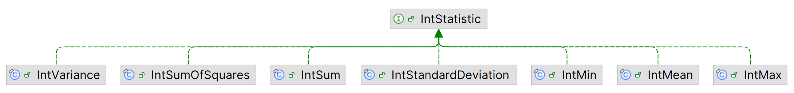

# Apache Commons Statistics

## 简介

Apache Commons Statistics 提供统计功能，其代码起源于 commons-math 项目，为了更好的维护而被提取到单独的项目，此后经历了许多改进。

commons-statistics 被拆分为 4 个子模块：

- `commons-statistics-descriptive` - 提供描述统计学功能 (mean, variance, median, etc).
- `commons-statistics-distribution` - 提供概率分布相关的接口和类
- `commons-statistics-inference` - 提供假设检验功能
- `commons-statistics-ranking` - 提供 rank 转换

另外还在仓库中提供了示例代码。

## 描述统计

`commons-statistics-descriptive` 提供描述统计功能，为 `double`, `int`, `long` 类型的数组或 stream 提供单变量统计功能。计算结果以 `StatisticResult` 类型返回。`StatisticResult` 提供 `double`, `int`, `long` 和 `BigInteger` 类型结果。对整数类型数据可以返回确切的结果。例如，`long` 值的加和用 `double` 可能无法精确表示，用 `long` 可能溢出。

计算**单个统计量**需要创建一个 `StatisticResult` 实例。为了支持添加值来更新统计量，`StatisticResult` w为支持的类型提供了 consumer 接口：`DoubleConsumer`, `IntConsumer`, `LongConsumer`。实现 `StatisticAccumulator` 接口的实例可以与其它实例合并。该设计允许并行计算统计量，可以使用 java stream API 执行。

计算**多个统计量**通过 `Statistic` enum 定义要计算的统计量。创建一个容器类来计算所需的统计信息，并可以使用 java stream API  同时计算多个统计量。通过 `Statistic`  访问统计信息。

**注意**：`double` 计算受浮点数舍入的影响，相同数据不同顺序得到的结果可能不同。`double` 数组使用多通道算法，相对单通道的 `Stream` 准确性更高。如果数据已经存储在数组中，建议采用改方法。

如果数据是整数类型，则建议使用专门的方法。许多实现使用精确的整数进行计算，这比使用 `double` 类型更快、更准确，并且无论数据的输入顺序如何变化，都返回相同结果。为了提高性能，在累计临时变量时没有使用 `BigInteger`，而是使用固定精度的整数计算，有可能溢出 64-bit 长度。

有些统计量无法使用 stream 计算，因为它们需要所有值才能计算，如中位数。这类计算都在数组上执行，实例是 immutable，且线程安全。

### 统计量

- 几何平均值

$$
(\prod_{i=1}^n x_i)^{\frac{1}{n}}
$$

- 峰度

$$
\text{Kurt}=E[(\frac{X-\mu}{\sigma})^4]=\frac{\mu_4}{\sigma^4}
$$

其中，$\mu$ 是 $X$ 的平均值，$\sigma$ 为标准差，$\mu_4$ 表示四阶中心矩。

- 偏度

$$
\gamma_1=E[(\frac{X-\mu}{\sigma})^3]=\frac{\mu_3}{\sigma^3}
$$

其中，$\mu_3$ 表示三阶矩。


commons-statistics 针对不同类型有不同实现，以保证最佳性能和精度。

- 针对整数的统计量如下



- 针对 `double` 类型的 `DoubleStatistic` 统计量更多一点

| 类                  | 功能         |
| ------------------- | ------------ |
| `Kurtosis`          | 峰度         |
| `Skewness`          | 偏度         |
| `Min`               | 最小值       |
| `Max`               | 最大值       |
| `Sum`               | 加和         |
| `SumOfLogs`         | 自然对数之和 |
| `SumOfSquares`      | 平方和       |
| `Product`           | 所有值的乘积 |
| `Mean`              | 平均值       |
| `GeometricMean`     | 几何平均值   |
| `StandardDeviation` | 标准差       |
| `Variance`          | 方差         |


### 计算单个统计量

- 对数组或 stream 计算单个统计量

```java
int[] values = {1, 1, 2, 3, 5, 8, 13, 21};

double v = IntVariance.of(values).getAsDouble();

double m = Stream.of("one", "two", "three", "four")
        .mapToInt(String::length)
        .collect(IntMean::create, IntMean::accept, IntMean::combine)
        .getAsDouble();
```

### 计算多个统计量

使用 enum 类 `Statistic` 指定要计算的统计量。有些统计量共享相同的计算过程，如方差、标准差和均值，此时哪怕没有制定该 `Statistic`，也会提供对应值。通过 `isSupported` 方法可以判断是否提供对应统计量的值：

```java
double[] data = {1, 2, 3, 4, 5, 6, 7, 8};
DoubleStatistics stats = DoubleStatistics.of(
    EnumSet.of(Statistic.MIN, Statistic.MAX, Statistic.VARIANCE),
    data);

stats.getAsDouble(Statistic.MIN);        // 1.0
stats.getAsDouble(Statistic.MAX);        // 8.0
stats.getAsDouble(Statistic.VARIANCE);   // 6.0

// Get other statistics supported by the underlying computations
stats.isSupported(Statistic.STANDARD_DEVIATION));   // true
stats.getAsDouble(Statistic.STANDARD_DEVIATION);    // 2.449...
```

### accept

`DoubleStatistics` 和 `IntStatistics` 等计算多个统计量的容器类，可以使用 `accept` 方法逐步收集变量值：

```java
IntStatistics stats = IntStatistics.of(
    Statistic.MIN, Statistic.MAX, Statistic.MEAN);
Stream.of("one", "two", "three", "four")
    .mapToInt(String::length)
    .forEach(stats::accept);

stats.getAsInt(Statistic.MIN);       // 3
stats.getAsInt(Statistic.MAX);       // 5
stats.getAsDouble(Statistic.MEAN);   // 15.0 / 4
```

### 并行 Stream

使用 parallelStream 同时计算多个统计量，需要用到容器类中的 `Builder` 类，该 `Builder` 使用 `build` 方法每个线程提供容器类，使用 `accept` 填充值，用 `combine` 收集结果：

```java
IntStatistics.Builder builder = IntStatistics.builder(
    Statistic.MIN, Statistic.MAX, Statistic.MEAN);
IntStatistics stats =
    Stream.of("one", "two", "three", "four")
    .parallel()
    .mapToInt(String::length)
    .collect(builder::build, IntConsumer::accept, IntStatistics::combine);

stats.getAsInt(Statistic.MIN);       // 3
stats.getAsInt(Statistic.MAX);       // 5
stats.getAsDouble(Statistic.MEAN);   // 15.0 / 4
```

### 多个数组

## 概率分布

`commons-statistics-distribution` 模块为一些常见的概率分布提供了框架和实现。连续单变量分布又 `ContinuousDistribution` 接口标识。离散分布则由 `DiscreteDistribution` 接口表示。

分布框架为集中常见的离散分布（整数值）和连续概率分布提供计算概率密度和累计概率函数。还支持计算反向累计概率和从分布抽样功能。

- 对分布 `F` 的实例 `f`，`f.cumulativeProbability(x)` 计算 `P(X <= x)` 的概率，即累计概率值
- `f.survivalProbability(x)` 计算 `P(X > x)`，即累计概率的互补值，大约等于 `1-P(X <= x)`

例如：

```java
TDistribution t = TDistribution.of(29);
double lowerTail = t.cumulativeProbability(-2.656);   // P(T(29) <= -2.656)
double upperTail = t.survivalProbability(2.75);       // P(T(29) > 2.75)
```

对离散分布 `F`，概率质量函数为 `f.probability(x)`。对连续分布 `F`，概率密度函数为 `f.density(x)`。另外还提供了 `f.probability(x1,x2)` 函数，计算 `P(x1 < X <=x2)`。

```java
PoissonDistribution pd = PoissonDistribution.of(1.23);
double p1 = pd.probability(5);
double p2 = pd.probability(5, 5);
double p3 = pd.probability(4, 5);
// p2 == 0
// p1 == p3
```

`inverseCumulativeProbability` 和 `inverseSurvivalProbability` 根据概率计算 x 值。示例：

```java
NormalDistribution n = NormalDistribution.of(0, 1);
double x1 = n.inverseCumulativeProbability(1e-300);
double x2 = n.inverseSurvivalProbability(1e-300);
// x1 == -x2 ~ -37.0471
```


## 统计推断

`commons-statistics-inference` 提供假设检验功能。

每个检验（test）类提供计算检验统计量和检验显著性 p-value 的方法。也可以使用 `test` 方法一起计算，返回一个 `SignificanceResult`。`SignificanceResult` 包含一个判断在指定显著性水平是否拒绝原假设的 `reject` 方法。检验类可以扩展 `SignificanceResult` 以返回有关检验的更多信息，如自由度。

或者使用 `statistic` 方法返回统计量的 `double` 值。可以将该统计量与预先计算的临界值比较。

使用 `withDefaults()` 返回默认参数的检验。可以使用实例方法修改任意参数，返回一个新的检验实例。支持多个假设的默认使用双边检验。除非另有说明，否则所有检验实例都是 immutable。

### 推断示例


## 排序转换

`commons-statistics-ranking` 模块提供排序转换功能。

> [!NOTE]
>
> commons-statistics-ranking 目前只提供了 `NaturalRanking` 这一种排序算法。

- `NaturalRanking` 根据浮点数的自然排序提供排名。按输入数字的顺序分配 ranks，从 1 开始：

```java
NaturalRanking ranking = new NaturalRanking();
ranking.apply(new double[] {5, 6, 7, 8});   // 1, 2, 3, 4
ranking.apply(new double[] {8, 5, 7, 6});   // 4, 1, 3, 2
```

- 特殊值 `NaN` 根据配置的 `NaNStrategy` 处理，默认抛出异常

```java
double[] data = new double[] {6, 5, Double.NaN, 7};
new NaturalRanking().apply(data);                      // IllegalArgumentException
new NaturalRanking(NaNStrategy.MINIMAL).apply(data);   // (4, 2, 1, 3)
new NaturalRanking(NaNStrategy.MAXIMAL).apply(data);   // (3, 1, 4, 2)
new NaturalRanking(NaNStrategy.REMOVED).apply(data);   // (3, 1, 2)
new NaturalRanking(NaNStrategy.FIXED).apply(data);     // (3, 1, NaN, 2)
new NaturalRanking(NaNStrategy.FAILED).apply(data);    // IllegalArgumentException
```

- 相同值则根据配置的 `TiesStrategy` 处理，默认使用平均

```java
double[] data = new double[] {7, 5, 7, 6};
new NaturalRanking().apply(data);                      // (3.5, 1, 3.5, 2)
new NaturalRanking(TiesStrategy.SEQUENTIAL).apply(data);   // (3, 1, 4, 2)
new NaturalRanking(TiesStrategy.MINIMUM).apply(data);      // (3, 1, 3, 2)
new NaturalRanking(TiesStrategy.MAXIMUM).apply(data);      // (4, 1, 4, 2)
new NaturalRanking(TiesStrategy.AVERAGE).apply(data);     // (3.5, 1, 3.5, 2)
new NaturalRanking(TiesStrategy.RANDOM).apply(data);      // (3, 1, 4, 2)  or  (4, 1, 3, 2)
```

- 随机来自默认的 generator，可以使用 `LongSupplier` 或随机 64-bit 值提供

```java
double[] data = new double[] {7, 5, 7, 6};
new NaturalRanking(TiesStrategy.RANDOM).apply(data);
new NaturalRanking(new SplittableRandom()::nextInt).apply(data);
// From Commons RNG
UniformRandomProvider rng = RandomSource.KISS.create();
new NaturalRanking(rng::nextInt).apply(data);
// ranks: (3, 1, 4, 2)  or  (4, 1, 3, 2)
```


## 参考

- https://commons.apache.org/proper/commons-statistics/index.html
- https://github.com/apache/commons-statistics

