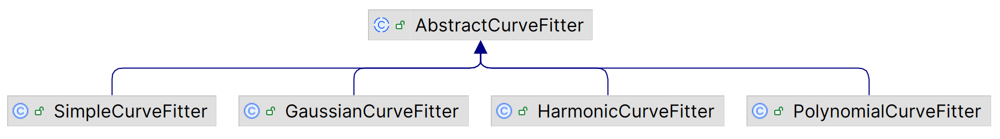

# 曲线拟合

2023-05-23⭐
****
## 简介

`fitting` 包用于单变量函数的曲线拟合。当单变量实函数 $y=f(x)$ 包含未知参数 $p_0, p_1, ..., p_{n-1}$，可以使用曲线拟合查找这些参数。对已有数据点 $(x_0, y_0), (x_1, y_1),...,(x_{k-1}, y_{k-1})$ ，曲线拟合通过调整参数，使拟合点与观测点距离最小化。参数的调整通过最小化目标函数 $\sum(y_i-f(x_i))^2$ 来实现。这实际上是一个最小二乘问题。

commons-math 提供的所有拟合工具（fitter）的工作原理相同：

1. 使用对应类的 `create` 工厂方法创建 fitter 实例

2. 使用观测数据作为参数调用 `fit`，返回包含最适合观测数据的参数数组

对观测数据，可以先逐个添加到 `WeightedObservedPoints` ，然后调用 `toList()` 转换为 `WeightedObservedPoint` list。每个观测数据都可以包含权重值，例如该数据为噪音的可能性，所有数据点的默认权重为 1.0。

有些 fitter 在拟合前需要用户调用 `withStartPoint` 方法提供**参数的初始值**。如果没有提供初始值，它们会调用内部类 `ParameterGuesser` ，根据提供的数据猜测一个合适的初始值。

## 实现

特定函数实现的类图如下：



`AbstractCurveFitter` 是拟合单变量函数 $y=f(p_i;x)$ 的基类，其中 $x$ 为自变量，$p_i$ 为参数。

fitter 通过最小化目标函数来寻找参数值进行你集合：
$$
\sum(y_i-f(x_i))^2
$$
这实际上是一个最小二乘问题。`AbtractCurveFitter` 包含模板方法 `fit()` ，问题设置，例如优化算法的选择，就委托给子类。

```java
import java.util.Collection;

import org.apache.commons.math3.analysis.MultivariateVectorFunction;
import org.apache.commons.math3.analysis.MultivariateMatrixFunction;
import org.apache.commons.math3.analysis.ParametricUnivariateFunction;
import org.apache.commons.math3.fitting.leastsquares.LeastSquaresOptimizer;
import org.apache.commons.math3.fitting.leastsquares.LeastSquaresProblem;
import org.apache.commons.math3.fitting.leastsquares.LevenbergMarquardtOptimizer;

public abstract class AbstractCurveFitter {
    /**
     * 拟合曲线。计算与观测样本最符合的曲线的系数
     */
    public double[] fit(Collection<WeightedObservedPoint> points) {
        // Perform the fit.
        return getOptimizer().optimize(getProblem(points)).getPoint().toArray();
    }

    /**
     * 创建用于拟合曲线的 optimizer。默认实现为 Levenberg-Marquardt
     */
    protected LeastSquaresOptimizer getOptimizer() {
        return new LevenbergMarquardtOptimizer();
    }

    /**
     * 创建于曲线对应的最小二乘问题
     */
    protected abstract LeastSquaresProblem getProblem(Collection<WeightedObservedPoint> points);
}

```

另外，在 `AbstractCurveFitter` 中还有一个辅助类 `TheoreticalValuesFunction`，其功能：

- 存储样本的 x 值
- 计算函数的理论值
- 根据提供的 `ParametricUnivariateFunction` 计算导数

```java
protected static class TheoreticalValuesFunction {
    /** Function to fit. */
    private final ParametricUnivariateFunction f;
    /** Observations. */
    private final double[] points;

    /**
     * @param f function to fit.
     * @param observations Observations.
     */
    public TheoreticalValuesFunction(final ParametricUnivariateFunction f,
                                     final Collection<WeightedObservedPoint> observations) {
        this.f = f;

        final int len = observations.size();
        this.points = new double[len];
        int i = 0;
        for (WeightedObservedPoint obs : observations) {
            this.points[i++] = obs.getX();
        }
    }

    /**
     * @return the model function values.
     */
    public MultivariateVectorFunction getModelFunction() {
        return new MultivariateVectorFunction() {
            /** {@inheritDoc} */
            public double[] value(double[] p) {
                final int len = points.length;
                final double[] values = new double[len];
                for (int i = 0; i < len; i++) {
                    values[i] = f.value(points[i], p);
                }

                return values;
            }
        };
    }

    /**
     * @return the model function Jacobian.
     */
    public MultivariateMatrixFunction getModelFunctionJacobian() {
        return new MultivariateMatrixFunction() {
            /** {@inheritDoc} */
            public double[][] value(double[] p) {
                final int len = points.length;
                final double[][] jacobian = new double[len][];
                for (int i = 0; i < len; i++) {
                    jacobian[i] = f.gradient(points[i], p);
                }
                return jacobian;
            }
        };
    }
}
```

对 `AbstractCurveFitter` 的实现，关键是提供 `LeastSquaresProblem` 的实现。

### GaussianCurveFitter

`GaussianCurveFitter` 提供拟合高斯函数功能。高斯函数定义：
$$
f(x)=\frac{1}{\sigma\sqrt{2\pi}}e^{\frac{-(x-\mu)^2}{2\sigma^2}}
$$
其参数化扩展形式为：
$$
f(x)=aexp(-\frac{(x-b)^2}{2c^2})
$$
关于 $a$ 的偏导为：
$$
exp(-\frac{(x-b)^2}{2c^2})
$$
关于 $b$ 的偏导为：
$$

$$


其参数有三个：

- $a$ 为曲线高度，又称为 Normalization
- $b$ 为曲线位置，即均值，记为 Mean
- $c$ 控制曲线宽度，即标准差，记为Sigma

对应的 `ParametricUnivariateFunction` 的实现作为 `Gaussian` 静态内部类实现：

```java
public static class Parametric implements ParametricUnivariateFunction {
    /**
     * 计算高斯函数值
     *
     * @param x 指定 x 值
     * @param 参数值，顺序：norm, mean and standard deviation
     */
    public double value(double x, double ... param)
        throws NullArgumentException,
               DimensionMismatchException,
               NotStrictlyPositiveException {
        validateParameters(param);

        final double diff = x - param[1];
        final double i2s2 = 1 / (2 * param[2] * param[2]);
        return Gaussian.value(diff, param[0], i2s2);
    }

    /**
     * 计算 x 处的梯度值。关于 a, b, c 的偏导
     */
    public double[] gradient(double x, double ... param)
        throws NullArgumentException,
               DimensionMismatchException,
               NotStrictlyPositiveException {
        validateParameters(param);

        final double norm = param[0];
        final double diff = x - param[1];
        final double sigma = param[2];
        final double i2s2 = 1 / (2 * sigma * sigma);

        final double n = Gaussian.value(diff, 1, i2s2); // 对 a 求导
        final double m = norm * n * 2 * i2s2 * diff; // 对 b 求导
        final double s = m * diff / sigma; // 对 c 求导

        return new double[] { n, m, s };
    }

    /**
     * 参数验证，确保能够计算梯度
     */
    private void validateParameters(double[] param)
        throws NullArgumentException,
               DimensionMismatchException,
               NotStrictlyPositiveException {
        if (param == null) {
            throw new NullArgumentException();
        }
        if (param.length != 3) {
            throw new DimensionMismatchException(param.length, 3);
        }
        if (param[2] <= 0) {
            throw new NotStrictlyPositiveException(param[2]);
        }
    }
}
```

下面看看 `GaussianCurveFitter` 的 `getProblem` 实现：

```java
protected LeastSquaresProblem getProblem(Collection<WeightedObservedPoint> observations) {

    final int len = observations.size();
    final double[] target  = new double[len];
    final double[] weights = new double[len];

    int i = 0;
    for (WeightedObservedPoint obs : observations) {
        target[i]  = obs.getY();
        weights[i] = obs.getWeight();
        ++i;
    }

    final AbstractCurveFitter.TheoreticalValuesFunction model =
            new AbstractCurveFitter.TheoreticalValuesFunction(FUNCTION, observations);

    final double[] startPoint = initialGuess != null ?
        initialGuess :
        // Compute estimation.
        new ParameterGuesser(observations).guess();

    return new LeastSquaresBuilder().
            maxEvaluations(Integer.MAX_VALUE).
            maxIterations(maxIter).
            start(startPoint).
            target(target).
            weight(new DiagonalMatrix(weights)).
            model(model.getModelFunction(), model.getModelFunctionJacobian()).
            build();
}
```

这里采用 `LeastSquaresBuilder` 构建 `LeastSquaresProblem`，其中函数采用前面实现的 `Parametric`：

- 样本 x 值，函数理论值以及偏导均由 `model` 提供，这里使用了 `AbstractCurveFitter` 中提供的辅助类 `TheoreticalValuesFunction`

**示例**：拟合高斯，数据质量较好

```java
protected static final double[][] DATASET1 = new double[][] {
    {4.0254623,  531026.0},
    {4.02804905, 664002.0},
    {4.02934242, 787079.0},
    {4.03128248, 984167.0},
    {4.03386923, 1294546.0},
    {4.03580929, 1560230.0},
    {4.03839603, 1887233.0},
    {4.0396894,  2113240.0},
    {4.04162946, 2375211.0},
    {4.04421621, 2687152.0},
    {4.04550958, 2862644.0},
    {4.04744964, 3078898.0},
    {4.05003639, 3327238.0},
    {4.05132976, 3461228.0},
    {4.05326982, 3580526.0},
    {4.05585657, 3576946.0},
    {4.05779662, 3439750.0},
    {4.06038337, 3220296.0},
    {4.06167674, 3070073.0},
    {4.0636168,  2877648.0},
    {4.06620355, 2595848.0},
    {4.06749692, 2390157.0},
    {4.06943698, 2175960.0},
    {4.07202373, 1895104.0},
    {4.0733171,  1687576.0},
    {4.07525716, 1447024.0},
    {4.0778439,  1130879.0},
    {4.07978396, 904900.0},
    {4.08237071, 717104.0},
    {4.08366408, 620014.0}
};
```

将其转换为 `WeightedObservedPoints` 类型：

```java
final WeightedObservedPoints obs = new WeightedObservedPoints();
for (int i = 0; i < points.length; i++) {
    obs.add(points[i][0], points[i][1]);
}
```

进行拟合：

```java
GaussianCurveFitter fitter = GaussianCurveFitter.create();
double[] parameters = fitter.fit(createDataset(DATASET1).toList());
assertEquals(3496978.1837704973, parameters[0], 1e-4);
assertEquals(4.054933085999146, parameters[1], 1e-4);
assertEquals(0.015039355620304326, parameters[2], 1e-4);
```

如果给出合理的初始值，则可以降低迭代次数。例如：

```java
final int maxIter = 20;
final double[] init = {3.5e6, 4.2, 0.1};

GaussianCurveFitter fitter = GaussianCurveFitter.create();
double[] parameters = fitter
        .withMaxIterations(maxIter)
        .withStartPoint(init)
        .fit(createDataset(DATASET1).toList());

assertEquals(3496978.1837704973, parameters[0], 1e-2);
assertEquals(4.054933085999146, parameters[1], 1e-4);
assertEquals(0.015039355620304326, parameters[2], 1e-4);
```

### PolynomialCurveFitter

`PolynomialCurveFitter` 实现多项式拟合。多项式系数按次数从小到大的顺序排列。定义：
$$
f(x)=a_0x^0+a_1x^1+a_2x^2+\cdots+a_{n-1}x^{n-1}
$$
其 `ParametricUnivariateFunction` 定义在 `PolynomialFunction` 类中：

```java
public static class Parametric implements ParametricUnivariateFunction {
	// 计算梯度
    public double[] gradient(double x, double ... parameters) {
        // 从 a0 到 an-1 依次计算梯度
        final double[] gradient = new double[parameters.length];
        double xn = 1.0;
        for (int i = 0; i < parameters.length; ++i) {
            gradient[i] = xn;
            xn *= x;
        }
        return gradient;
    }

    // 计算函数值
    public double value(final double x, final double ... parameters)
        throws NoDataException {
        return PolynomialFunction.evaluate(parameters, x);
    }
}
```

再看 `getProblem` 实现：

```java
protected LeastSquaresProblem getProblem(Collection<WeightedObservedPoint> observations) {
    final int len = observations.size();
    final double[] target  = new double[len];
    final double[] weights = new double[len];

    int i = 0;
    for (WeightedObservedPoint obs : observations) {
        target[i]  = obs.getY();
        weights[i] = obs.getWeight();
        ++i;
    }

    final AbstractCurveFitter.TheoreticalValuesFunction model =
            new AbstractCurveFitter.TheoreticalValuesFunction(FUNCTION, observations);

    if (initialGuess == null) {
        throw new MathInternalError();
    }

    // Return a new least squares problem set up to fit a polynomial curve to the
    // observed points.
    return new LeastSquaresBuilder().
            maxEvaluations(Integer.MAX_VALUE).
            maxIterations(maxIter).
            start(initialGuess).
            target(target).
            weight(new DiagonalMatrix(weights)).
            model(model.getModelFunction(), model.getModelFunctionJacobian()).
            build();

}
```

对比高斯拟合，可以发现只有一点差别：多项式拟合必须提供初始值，即至少指定多项式的次数。

**示例**：多项式拟合

```java
final RealDistribution rng = new UniformRealDistribution(-100, 100);
rng.reseedRandomGenerator(64925784252L);

final double[] coeff = {12.9, -3.4, 2.1}; // 12.9 - 3.4 x + 2.1 x^2
final PolynomialFunction f = new PolynomialFunction(coeff);

// Collect data from a known polynomial.
final WeightedObservedPoints obs = new WeightedObservedPoints();
for (int i = 0; i < 100; i++) {
    final double x = rng.sample();
    obs.add(x, f.value(x));
}

// Start fit from initial guesses that are far from the optimal values.
final PolynomialCurveFitter fitter
        = PolynomialCurveFitter.create(0).withStartPoint(new double[]{-1e-20, 3e15, -5e25});
final double[] best = fitter.fit(obs.toList());

assertArrayEquals(coeff, best, 1E-12);
```

其中，`UniformRealDistribution` 为均匀实数分布，用来生成样本数据 `x`。

## 通用实现

`SimpleCurveFitter` 类为实现其它曲线拟合提供了基本功能。对自定义函数，需要实现 `ParametricUnivariateFunction` 接口。该类定义如下：

```java
public class SimpleCurveFitter extends AbstractCurveFitter {
    /** 自定义函数*/
    private final ParametricUnivariateFunction function;
    /** 初始参数 */
    private final double[] initialGuess;
    /** 最大迭代次数 */
    private final int maxIter;

    private SimpleCurveFitter(ParametricUnivariateFunction function,
                              double[] initialGuess,
                              int maxIter) {
        this.function = function;
        this.initialGuess = initialGuess;
        this.maxIter = maxIter;
    }

    /** {@inheritDoc} */
    @Override
    protected LeastSquaresProblem getProblem(Collection<WeightedObservedPoint> observations) {
        // Prepare least-squares problem.
        final int len = observations.size();
        final double[] target  = new double[len];
        final double[] weights = new double[len];

        int count = 0;
        for (WeightedObservedPoint obs : observations) {
            target[count]  = obs.getY();
            weights[count] = obs.getWeight();
            ++count;
        }

        final AbstractCurveFitter.TheoreticalValuesFunction model
            = new AbstractCurveFitter.TheoreticalValuesFunction(function,
                                                                observations);

        // Create an optimizer for fitting the curve to the observed points.
        return new LeastSquaresBuilder().
                maxEvaluations(Integer.MAX_VALUE).
                maxIterations(maxIter).
                start(initialGuess).
                target(target).
                weight(new DiagonalMatrix(weights)).
                model(model.getModelFunction(), model.getModelFunctionJacobian()).
                build();
    }
}
```

只需要提供自定义函数实现 `ParametricUnivariateFunction`，`getProblem()` 与前面的高斯拟合、多项式拟合基本完全相同。

示例：采用 `SimpleCurveFitter` 实现与 `PolynomialCurveFitter` 完全相同的效果

```java
final Random randomizer = new Random(53882150042L);
final RealDistribution rng = new UniformRealDistribution(-100, 100);
rng.reseedRandomGenerator(64925784252L);

// 定义多项式函数
final double[] coeff = {12.9, -3.4, 2.1}; // 12.9 - 3.4 x + 2.1 x^2
final PolynomialFunction f = new PolynomialFunction(coeff);

// 生成样本数据
final WeightedObservedPoints obs = new WeightedObservedPoints();
for (int i = 0; i < 100; i++) {
    final double x = rng.sample();
    obs.add(x, f.value(x) + 0.1 * randomizer.nextGaussian()); // 添加高斯噪声
}

final ParametricUnivariateFunction function = new PolynomialFunction.Parametric();
// Start fit from initial guesses that are far from the optimal values.
final SimpleCurveFitter fitter
        = SimpleCurveFitter.create(function,
        new double[]{-1e20, 3e15, -5e25});
final double[] best = fitter.fit(obs.toList());

assertArrayEquals(coeff, best, 2e-2);
```


## 线性拟合

线性拟合比较简单，直接使用 `SimpleRegression` 类，默认使用最小二乘 optimizer。该类拟合如下形式的函数：
$$
y=kx+b
$$
其中，$k$ 为斜率，$b$ 为截距。

拟合后除了可以获得这两个参数，还可以获得 $k$ 和 $b$ 的标准误差，ANOVA, r-square 和 Pearson r 统计量。

以 [Norris 数据集](https://www.itl.nist.gov/div898/strd/lls/data/LINKS/DATA/Norris.dat) 为例，创建数据集：

```java
// order is {y,x}
private double[][] data = {{0.1, 0.2}, {338.8, 337.4}, {118.1, 118.2},
    {888.0, 884.6}, {9.2, 10.1}, {228.1, 226.5}, {668.5, 666.3}, {998.5, 996.3},
    {449.1, 448.6}, {778.9, 777.0}, {559.2, 558.2}, {0.3, 0.4}, {0.1, 0.6}, {778.1, 775.5},
    {668.8, 666.9}, {339.3, 338.0}, {448.9, 447.5}, {10.8, 11.6}, {557.7, 556.0},
    {228.3, 228.1}, {998.0, 995.8}, {888.8, 887.6}, {119.6, 120.2}, {0.3, 0.3},
    {0.6, 0.3}, {557.6, 556.8}, {339.3, 339.1}, {888.0, 887.2}, {998.5, 999.0},
    {778.9, 779.0}, {10.2, 11.1}, {117.6, 118.3}, {228.9, 229.2}, {668.4, 669.1},
    {449.2, 448.9}, {0.2, 0.5}
};
```

拟合：

```java
assertEquals(36, data.length);
SimpleRegression regression = new SimpleRegression();
for (double[] datum : data) {
    regression.addData(datum[1], datum[0]);
}
assertEquals(1.00211681802045, regression.getSlope(), 1E-11, "slope");
assertEquals(0.429796848199937E-03, regression.getSlopeStdErr(), 1E-11, "slope std err");
assertEquals(36, regression.getN(), "number of observations");
assertEquals(-0.262323073774029, regression.getIntercept(), 1E-11, "intercept");
assertEquals(0.232818234301152, regression.getInterceptStdErr(), 1E-11, "std err intercept");
assertEquals(0.999993745883712, regression.getRSquare(), 1E-11, "r-square");
assertEquals(4255954.13232369, regression.getRegressionSumSquares(), 1E-8, "SSR");
assertEquals(0.782864662630069, regression.getMeanSquareError(), 1E-9, "MSE");
assertEquals(26.6173985294224, regression.getSumSquaredErrors(), 1E-8, "SSE");
```

拟合生成了许多表征拟合效果的指标：

- slope std err

斜率的标准误差（SE）计算公式为：
$$
SE=\frac{\sqrt{\frac{\sum{(y_i-\hat{y}_i)^2}}{n-2}}}{\sqrt{\sum{(x_i-\overline{x})}^2}}
$$

## 参考

- https://commons.apache.org/proper/commons-math/userguide/fitting.html