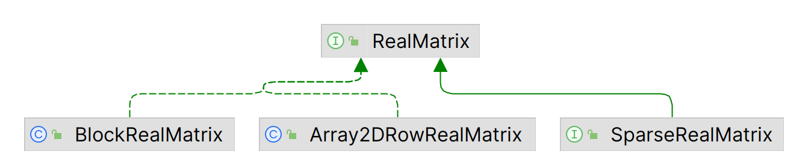

# 线性代数

2025-01-06 ⭐
@author Jiawei Mao
***
## 简介

commons-math 的线性代数实现支持矩阵（稀疏和密集矩阵）和向量操作。提供基本数学运算和分解算法，可用于最小二乘求解线性模型。

## 实数矩阵

`RealMatrix` 接口表示存储实数的矩阵。支持以下基本矩阵运算：

- 矩阵的加法、减法和乘法；
- 标量加法和乘法；
- 转置；
- Norm 和 Trace；
- 向量操作

例如：

```java
// 工厂方法：创建 2 行 3 列矩阵
double[][] matrixData = {{1d, 2d, 3d}, {2d, 5d, 3d}};
RealMatrix m = MatrixUtils.createRealMatrix(matrixData);

// 构造函数：创建 3 行 2 列矩阵
double[][] matrixData2 = {{1d, 2d}, {2d, 5d}, {1d, 7d}};
RealMatrix n = new Array2DRowRealMatrix(matrixData2);

// 两种语法都会 copy 输入的 double[][]

// 矩阵乘法
RealMatrix p = m.multiply(n);
assertEquals(p.getRowDimension(), 2);
assertEquals(p.getColumnDimension(), 2);

// 使用 LU decomposition 计算逆矩阵
RealMatrix pInverse = new LUDecomposition(p).getSolver().getInverse();
```

`RealMatrix` 接口的实现三个：

- `Array2DRowRealMatrix` 和 `BlockRealMatrix` 用于密集矩阵，后者适合大型矩阵（>50）；
- `SparseRealMatrix` 用于稀疏矩阵。



## 实数向量

`RealVector` 接口表示实数向量。支持以下矩阵运算：

- 矩阵的加法、减法和乘法；
- 标量加法和乘法；
- 转置；
- Norm 和 Trace；
- 向量操作。

`RealVectorFormat` 类以自定义文本格式处理向量的输入/输出。

## 求解线性方程组

`DecompositionSolver` 接口的 `solve()` 方法以线性或最小二乘方式求解 $AX=B$ 形式的方程。用 `RealMatrix` 表示系统的系数矩阵。求解该系统分两步：

1. 分解系统矩阵
2. 使用分解的系数矩阵构建求解器（solver）求解

当需要使用相同系数矩阵求解多个系统时，采用这种分步方式，只需要分解一次系数矩阵。

例如，求解如下线性系统：

```
2x + 3y - 2z = 1
-x + 7y + 6z = -2
4x - 3y - 5z = 1
```

首先分解系数矩阵 $A$（这里采用 LU 分解）， 并构建 solver：

```java
RealMatrix coefficients = new Array2DRowRealMatrix(new double[][]{
        {2, 3, -2},
        {-1, 7, 6},
        {4, -3, -5}
}, false);
DecompositionSolver solver = new LUDecomposition(coefficients).getSolver();
```

然后场景一个 `RealVector` 表示常量 $B$，并使用 `solve(RealVector)` 求解线性方程组：

```java
RealVector constants = new ArrayRealVector(new double[]{1, -2, 1}, false);
RealVector solution = solver.solve(constants);
```

`solution` 包含线性方程组的解，`solution.getEntry(0)` 为 x，`solution.getEntry(1)` 为 y，`solution.getEntry(2)` 为 z。

如下表所示，每种类型的分解方法都具有特定语义和限制。对求解 $AX=B$ 的算法，采用最小二乘法要求返回的 $X$ 的值使得残差 $AX-B$ 的值最小。最小二乘可用于求解方程比未知数多的系统（矩阵 $A$ 的行数比列数多）。如果存在精确解（正好有 $X$ 使得 $AX-B=0$），则该精确解也是最小二乘的最优解。这意味着适合最小二乘问题的算法也可以查找精确解，不过求解精确解的算法不一定适合最小二乘问题。

**分解算法**

| 算法名称                                                     | 系数矩阵                    | 问题类型               |
| ------------------------------------------------------------ | --------------------------- | ---------------------- |
| [LU](https://hipparchus.org/apidocs/org/hipparchus/linear/LUDecomposition.html) | square                      | exact solution only    |
| [Cholesky](https://hipparchus.org/apidocs/org/hipparchus/linear/CholeskyDecomposition.html) | symmetric positive definite | exact solution only    |
| [QR](https://hipparchus.org/apidocs/org/hipparchus/linear/QRDecomposition.html) | any                         | least squares solution |
| [eigen decomposition](https://hipparchus.org/apidocs/org/hipparchus/linear/EigenDecomposition.html) | square                      | exact solution only    |
| [SVD](https://hipparchus.org/apidocs/org/hipparchus/linear/SingularValueDecomposition.html) | any                         | least squares solution |

上面也可以直接使用 `double[]` 而不是 `RealVector`，此时返回结果也是 `double[]`。

可以一次调用使用相同系数矩阵求解多个系统。为了，可以创建一个矩阵，其列向量为要求解系统的常数项，调用 `solve(RealMatrix)`，返回的矩阵不同列对应不同系统的解。

## 分解

分解算法除了用于求解系统方程组，也可以用于特征值分解和奇异值分解。

`EigenDecomposition` 接口的 `getEigenvalue()`, `getEigenvalues()`, `getEigenVector()`, `getV()`, `getD()` 和 `getVT()` 方法支持 $AX=lambda X$ 形式的特征值问题，其中 `lambda` 为实数标量。

`SingularValueDecomposition` 接口的 `getSingularValues()`, `getU()`, `getS()` 和 `getV()` 方法支持 `AXi=lambda Yi` 奇异值求解问题，其中 `lambda` 为实数标量，`Xi` 和 `Yi` 向量形成各自向量空间的正交基。

## 参考

- https://hipparchus.org/hipparchus-core/linear.html
- https://commons.apache.org/proper/commons-math/userguide/linear.html
