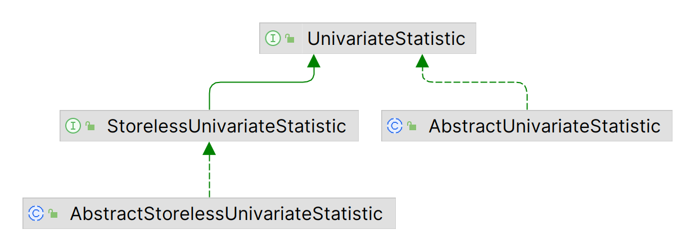
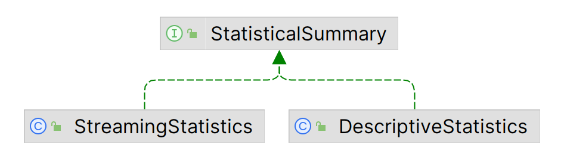

# 统计

- [统计](#统计)
  - [简介](#简介)
  - [描述统计](#描述统计)
    - [计算 summary 统计量](#计算-summary-统计量)
    - [维护最近 100 个数据的滚动平均值](#维护最近-100-个数据的滚动平均值)
    - [计算多个样本的统计量并聚合结果](#计算多个样本的统计量并聚合结果)
  - [Frequency distributions](#frequency-distributions)
    - [统计 integer 频率分布](#统计-integer-频率分布)
    - [统计 string 频率分布](#统计-string-频率分布)
  - [简单回归](#简单回归)
    - [一次添加一个数据拟合模型](#一次添加一个数据拟合模型)
    - [使用二维 double 数组拟合模型](#使用二维-double-数组拟合模型)
    - [禁用常数项](#禁用常数项)
  - [多元线性回归](#多元线性回归)
    - [OLS 回归](#ols-回归)
    - [GLS 回归](#gls-回归)
    - [流式回归](#流式回归)
  - [协方差和相关性](#协方差和相关性)
  - [假设检验](#假设检验)
  - [参考](#参考)

2024-12-10
@author Jiawei Mao
***

## 简介

统计包提供了基本的描述性统计、频率分布、线性回归、方差分析、相关性分析和各种假设检验。

## 描述统计

描述统计相关功能在`stat.descriptive` 包中：

- 算术和几何平均；
- 方差和标准差；
- 和、乘积、对数和、平方和；
- 最小、最大、中位数和百分位数；
- 偏度和峰度；
- 第一、第二、第三和第三动量。

除了百分位数和中位数，计算其它统计量都不需要保存完整输入数据。stat 提供了两种接口和实现，即存储和不存储输入数据。例如，`PSquarePercentile` 和 `RandomPercentile` 分别使用 `PSquare` 和 `RANDOM` 算法来计算百分位数。

`UnivariateStatistic` 为顶层接口，所有统计量都实现该接口。其 `evaluate()` 以 double[] 数组为参数，返回对应的统计值。`StorelessUnivariateStatistic` 扩展 `UnivariateStatistic` 接口，添加了 `increment()`, `getResult()` 和相关方法，以支持无缓存的流式实现。流式实现在调用 `increment()` 添加值时维护计数器、加和和其它状态信息。实现 `StorelessUnivariateStatistic` 接口的统计量不管通过 `increment()` 添加的数据流有多长，都只需要固定存储大小。

`AbstractUnivariateStatistic` 和 `AbstractStorelessUnivariateStatistic` 提供了顶层接口的抽象实现。如下图所示：



每个统计量都作为单独的类实现，扩展上面两个抽象类之一。实例化和使用统计量的方法有：

- 直接实例化和使用；
- 使用聚合类 `DescriptiveStatistics` 和 `StreamingStatistics` 更方便、高效。



`DescriptiveStatistics` 在内存中存储输入数据，并提供滚动窗口计算统计量的功能。

`StreamingStatistics` 不存储完整的输入数据。它使用 `RandomPercentile` 维护数据流的有界数据样本。

|聚合|统计量|是否存储|是否支持滚动|
|---|---|---|---|
|`DescriptiveStatistics`|min, max, mean, geometric mean, n, sum, sum of squares, standard deviation, variance, percentiles, skewness, kurtosis, median|Yes|Yes|
|`StreamingStatistics`|min, max, mean, geometric mean, n, sum, sum of squares, standard deviation, variance, percentiles|No|No|

`StreamingStatistics` 支持使用各种 `aggregate` 方法对结果进行**聚合**。

`MultivariateSummaryStatistics` 类似于 `StreamingStatistics`，但处理 n-tuple 值，而非标量值。它还可以计算输入数据的协方差矩阵。

`DescriptiveStatistics` 和 `StreamingStatistics` 都**不是线程安全**的。

还有一个工具类 `StatUtils`，提供直接从 double[] 数组计算统计量的 static 方法。

下面是一些计算描述统计量的示例。

### 计算 summary 统计量

- 使用 `DescriptiveStatistics` 聚合类（存储输入数据）

```java
// 1. 创建 DescriptiveStatistics
DescriptiveStatistics stats = new DescriptiveStatistics();

// 2. 从数组添加数据
for (int i = 0; i < inputArray.length; i++) {
    stats.addValue(inputArray[i]);
}

// 3. 计算统计量
double mean = stats.getMean();
double std = stats.getStandardDeviation();
double median = stats.getPercentile(50);
```

- 使用 `StreamingStatistics` 聚合类处理数据流

```java
// 1. 创建 StreamingStatistics
StreamingStatistics stats = new StreamingStatistics();

// 2. 从输入流读取数据
// 添加值，更新 sums, counters 等
while (line != null) {
    line = in.readLine();
    stats.addValue(Double.parseDouble(line.trim()));
}
in.close();

// 3. 计算统计量
double mean = stats.getMean();
double std = stats.getStandardDeviation();
```

- 使用 `StatUtils` 工具类

```java
// 直接用 double[] 计算统计量
double mean = StatUtils.mean(values);
double std = FastMath.sqrt(StatUtils.variance(values));
double median = StatUtils.percentile(values, 50);

// 计算前 3 个数据的均值
mean = StatUtils.mean(values, 0, 3);
```

### 维护最近 100 个数据的滚动平均值

使用 `DescriptiveStatistics`，将窗口大小设置为 100：

```java
// 1. 创建 DescriptiveStatistics，设置窗口大小
DescriptiveStatistics stats = new DescriptiveStatistics();
stats.setWindowSize(100);

// 2. 从输入流读取数据、
// 每隔 100 个数据显示最近 100 个数据的均值
long nLines = 0;
while (line != null) {
    line = in.readLine();
    stats.addValue(Double.parseDouble(line.trim()));
    if (nLines == 100) {
        nLines = 0;
        // 3. 输出滚动平均值
        System.out.println(stats.getMean());
    }
}
in.close();
```

### 计算多个样本的统计量并聚合结果

使用多个 `StreamingStatistics`，并将它们合并为最终结果：

```java
// 1. 为每个样本单独创建 StreamingStatistics 
StreamingStatistics setOneStats = new StreamingStatistics();
StreamingStatistics setTwoStats = new StreamingStatistics();

// 2. 添加值
setOneStats.addValue(2);
setOneStats.addValue(3);
setTwoStats.addValue(2);
setTwoStats.addValue(4);
...
// 3. 聚合结果
StreamingStatistics aggregate = new StreamingStatistics();
aggregate.aggregate(setOneStats, setTwoStats);

// Full sample data is reported by the aggregate
double totalSampleSum = aggregate.getSum(); // 11
```

!!! note
    所谓聚合，就是将两部分数据集合并，计算合并后数据集的统计量。

也可以使用 `StatisticalSummary` 聚合结果：

```java
// 为每个样本创建 StreamingStatistic
StreamingStatistics setOneStats = new StreamingStatistics();
StreamingStatistics setTwoStats = new StreamingStatistics();

// 添加数据
setOneStats.addValue(2);
setOneStats.addValue(3);
setTwoStats.addValue(2);
setTwoStats.addValue(4);
...
// 聚合结果
StatisticalSummary aggregatedStats = StatisticalSummary.aggregate(setOneStats, setTwoStats);

// 整个样本数据的统计量
double totalSampleSum = aggregatedStats.getSum(); // 11
```

## Frequency distributions

`Frequency` 提供离散值的计数和百分比。

String, integer, long, char 以及任何实现 `Comparable` 接口的类都可以用 `Frequency` 计数。

在计数时，所有数值默认按自然顺序排序，但是可以通过向构造函数提供 `Comparator` 来覆盖该默认行为。

下面是一些示例。

### 统计 integer 频率分布

`LongFrequency` 提供混合 integer, long, Integer 和 Long 的频率统计：

```java
 LongFrequency f = new LongFrequency();
 f.addValue(1);
 f.addValue(new Integer(1));
 f.addValue(new Long(1));
 f.addValue(2);
 f.addValue(new Integer(-1));

 System.out.prinltn(f.getCount(1));   // displays 3
 System.out.println(f.getCumPct(0));  // displays 0.2
 System.out.println(f.getPct(new Integer(1)));  // displays 0.6
 System.out.println(f.getCumPct(-2));   // displays 0
 System.out.println(f.getCumPct(10));  // displays 1
```

### 统计 string 频率分布

区分大小写，自然排序：

```java
Frequency<String> f = new Frequency<>();
f.addValue("one");
f.addValue("One");
f.addValue("oNe");
f.addValue("Z");
System.out.println(f.getCount("one")); // displays 1
System.out.println(f.getCumPct("Z"));  // displays 0.5
System.out.println(f.getCumPct("Ot")); // displays 0.25
```

不区分大小写：

```java
Frequency<String> f = new Frequency<>(String.CASE_INSENSITIVE_ORDER);
f.addValue("one");
f.addValue("One");
f.addValue("oNe");
f.addValue("Z");
System.out.println(f.getCount("one"));  // displays 3
System.out.println(f.getCumPct("z"));  // displays 1
```


## 简单回归

`SimpleRegression` 提供普通最小二乘回归（ordinary least square regression），只有一个自变量：
$$
y=mx+b
$$
可以获得截距和斜率的标准差，以及方差分析、r 平方和 Pearson's r 统计量。

观测值 $(x,y)$ 可以一次一个地添加到模型，也可以提供二维数组。观测值不存在在内存，因此不限制添加到模型的观测值数量。

**注意事项：**

- 当观测值少于 2 个，或者 x 值没有变化（所有 x 值相同），所有统计数据都返回 `NaN`。拟合二元回归模型至少需要 2 个具有不同 x 的观测值；
- 统计量的 getter 方法总是返回当前数据集的计算值，即可以一边添加数据，一边获得更新后的统计量，不需要创建新实例。没有更新所有统计量的方法，每个 getter 方法都会执行必要的计算以返回请求的统计量；
- 将 `false` 传递给 `SimpleRegression(boolean)` 表示不要截距项，此时 `hasIntercept` 返回 false，拟合模型时也不考虑截距，`getIntercept()` 返回 0；
- `SimpleRegression` 类不是线程安全的。

**实现：**

- 随着观测值被添加到模型，x 值加和、y 值加和、xy 加和以及 x 和 y 与各自平均值的差值平方和使用 “Algorithms for Computing the Sample Variance: Analysis and Recommendations”, Chan, T.F., Golub, G.H., and LeVeque, R.J. 1983, American Statistician, vol. 37, pp. 242-247 中的公式进行更新，Weisberg, S. “Applied Linear Regression”. 2nd Ed. 1985 中引用了该公式。所有统计量都根据这些加和计算而来
- 统计推断（置信区间、参数显著性水平）基于假设：模型中的观测值来自二元正态分布

### 一次添加一个数据拟合模型

1. 实例化回归实例，添加数据点

```java
regression = new SimpleRegression();
regression.addData(1d, 2d);
// 此时只有一个观测值
// 所有回归统计量返回 NaN

regression.addData(3d, 3d);
// 此时有两个观测值
// 可以计算斜率和截距，但是推断统计量依然返回 NaN

regression.addData(3d, 3d);
// 现在可以计算所有统计量
```

2. 基于目前添加的数据计算统计量

```java
// 回归线截距
System.out.println(regression.getIntercept());
// 回归线斜率
System.out.println(regression.getSlope());
// 斜率标准差
System.out.println(regression.getSlopeStdErr());
```

3. 使用回归模型预测新 x 值的 y 值

```java
// 显示 x = 1.5 时的预测 y 值
System.out.println(regression.predict(1.5d)
```

可以继续添加数据，随后的 getXXX 会包含新添加的数据。

### 使用二维 double 数组拟合模型


实例化 `SimpleRegression` 并加载数据集：

```java
double[][] data = { { 1, 3 }, {2, 5 }, {3, 7 }, {4, 14 }, {5, 11 }};
SimpleRegression regression = new SimpleRegression();
regression.addData(data);
```

根据数据拟合回归模型：

```java
// 显示回归线截距
System.out.println(regression.getIntercept());
// 显示回归线斜率
System.out.println(regression.getSlope());
// 显示斜率的标准差
System.out.println(regression.getSlopeStdErr());
```

可以继续添加更多数据，甚至可以添加另一个 `double[][]` 数组，随后的 getXXX 将包含额外添加的数据。

### 禁用常数项

实例化 `SimpleRegression` 并加载数据集：

```java
double[][] data = { { 1, 3 }, {2, 5 }, {3, 7 }, {4, 14 }, {5, 11 }};
// 参数为 false，表示截距为 0
SimpleRegression regression = new SimpleRegression(false);
regression.addData(data);
```

根据数据拟合回归模型：

```java
// 回归线截距，因为约束了常数项，所以返回 0
System.out.println(regression.getIntercept());

// 回归线斜率
System.out.println(regression.getSlope());

// 斜率标准差
System.out.println(regression.getSlopeStdErr());

// 返回 Double.NaN, 截距保持为 0
System.out.println(regression.getInterceptStdErr() );
```

约束常数项要谨慎。

## 多元线性回归

`OLSMultipleLinearRegression`, `GLSMultipleLinearRegression` 和 `MillerUpdatingRegression` 实现最小二乘回归拟合如下线性模型：
$$
Y = X\times b+\mu
$$

其中 Y 是 n 维回归因变量（**regressand**），X 是 `[n,k]` 矩阵，其中 k 个 columns 值称为自变量（**regressor**）。b 是 k 维的回归参数，$\mu$ 是 n 维误差项或残差项（**error terms**, or **residuals**）。

- `OLSMultipleLinearRegression` 提供普通最小二乘（Ordinary Least Square, OLS） 实现；
- `GLSMultipleLinearRegression` 提供广义最小二乘实现；
- `MillerUpdatingRegression` 提供 OLS 的流式实现。

相关算法和公式可参考 Javadoc。

`OLSMultipleLinearRegression` 模型的数据可以是单个 double[] 数组，由数据 row 拼接成的一维数组，每个 Y 后跟着对应的 X 值；也可以使用 `double[][]`，每一个 row 对应一个 `double[]`。

`GLSMultipleLinearRegression` 模型还需要一个代表误差项的协方差矩阵 `double[][]`。参考 `AbstractMultipleLinearRegression#newSampleData(double[],int,int)`, `OLSMultipleLinearRegression#newSampleData(double[], double[][])` 和`GLSMultipleLinearRegression#newSampleData(double[],double[][],double[][])`。

`MillerUpdatingRegression` 模型实现 `UpdatingMultipleLinearRegression` 接口，它提供了类似 `OLSMultipleLinearRegression` 添加数据的方法。与 `StorelessUnivariateStatistics` 相似，`UpdatingMultipleLinearRegression` 不存储观测数据，因此不限制数据量。

**使用注意事项：**

- 在调用 `newSample`, `newX`, `newY` 或 `newCovariance` 方法时会验证数据，当输入数组维度不匹配，或没有足够的数据来估计模型时，抛出 `IllegalArgumentException`；
- 回归模型默认包含截距。所以，上面的矩阵 X 包含一个初始为 1 的 row。提供给 `newX` 或 `newSample` 的 X 数据不应该包含这一列，数据加载方法会自动创建。要取消截距项，可以将 `noIntercept` 属性设置为 `true`；
- 多元线性回归类都不是线程安全。

下面是一些示例。

### OLS 回归

初始化 OLS 回归对象，加载数据集：

```java
OLSMultipleLinearRegression regression = new OLSMultipleLinearRegression();
double[] y = new double[]{11.0, 12.0, 13.0, 14.0, 15.0, 16.0};
double[][] x = new double[6][];
x[0] = new double[]{0, 0, 0, 0, 0};
x[1] = new double[]{2.0, 0, 0, 0, 0};
x[2] = new double[]{0, 3.0, 0, 0, 0};
x[3] = new double[]{0, 0, 4.0, 0, 0};
x[4] = new double[]{0, 0, 0, 5.0, 0};
x[5] = new double[]{0, 0, 0, 0, 6.0};          
regression.newSampleData(y, x);
```

获取回归参数：

```java
double[] beta = regression.estimateRegressionParameters();       
double[] residuals = regression.estimateResiduals();
double[][] parametersVariance = regression.estimateRegressionParametersVariance();
double regressandVariance = regression.estimateRegressandVariance();
double rSquared = regression.calculateRSquared();
double sigma = regression.estimateRegressionStandardError();
```

### GLS 回归

初始化 GLS 回归对象，加载数据集：

```java
GLSMultipleLinearRegression regression = new GLSMultipleLinearRegression();
double[] y = new double[]{11.0, 12.0, 13.0, 14.0, 15.0, 16.0};
double[][] x = new double[6][];
x[0] = new double[]{0, 0, 0, 0, 0};
x[1] = new double[]{2.0, 0, 0, 0, 0};
x[2] = new double[]{0, 3.0, 0, 0, 0};
x[3] = new double[]{0, 0, 4.0, 0, 0};
x[4] = new double[]{0, 0, 0, 5.0, 0};
x[5] = new double[]{0, 0, 0, 0, 6.0};          
double[][] omega = new double[6][];
omega[0] = new double[]{1.1, 0, 0, 0, 0, 0};
omega[1] = new double[]{0, 2.2, 0, 0, 0, 0};
omega[2] = new double[]{0, 0, 3.3, 0, 0, 0};
omega[3] = new double[]{0, 0, 0, 4.4, 0, 0};
omega[4] = new double[]{0, 0, 0, 0, 5.5, 0};
omega[5] = new double[]{0, 0, 0, 0, 0, 6.6};
regression.newSampleData(y, x, omega); 
```

### 流式回归

初始化流式 OLS 回归对象，加载数据集：

```java
// 创建包含 3 个自变量和 1 个截距项的流式回归对象
MillerUpdatingRegression regression = new MillerUpdatingRegression(3, true); 

// 添加一个观测值
double[] x = {1.0, 1.0, 1.0};
double y = {1.0};
instance.addObservation(x, y);

// 一次添加两个观测值
double[][] xMult = {{2.0, 4.0, 5.0}, {1.4, 2.4, 2.1}};
double[] yMult = {2.0, 8.0};
instance.addObservations(xMult, yMult);

// 添加更多观测值，都不保存在内存
```

获取回归参数：

```java
RegressionResults result = regression.regress();
double[] parameters =  result.getParameterEstimates();
```

由于该模型包含截距，因此 `parameters[0]` 为截距的估计值。`parameters[1]`, `[2]` 和`[3]` 为三个自变量的回归系数估计自豪。

估计参数的标准差（顺序同上）：

```java
double[] stdErrs = result.getStdErrorOfEstimates();
```

R-squares, SSE, MSE:

```java
double Rsquare = result.getRSquared();
double MSE = result.getMeanSquareError();
double SSE = result.getErrorSumSquares();
```

参数 1 和 2 的协方差：

```java
double cov = result.getCovarianceOfParameters(1, 2) 
```

## 协方差和相关性

`org.hipparchus.stat.correlation` 提供计算成对数组或矩阵 columns 之间的协方差和相关性：

- `Covariance` 计算协方差；
- `PearsonsCorrelation` 计算 Pearson 相关系数；
- `SpearmansCorrelation` 计算 Spearman 秩相关；
- `KendallsCorrelation` 计算 Kendall tao 秩相关。

实现注意事项：

- 无偏协方差的计算公式为 $cov(X,Y)=\sum(x_i-E(X))(y_i-E(Y))/(n-1)$，是否对协方差进行偏差校正由参数 `biasCorrected` 设置，默认为 `true`，若为 `false`，底数为 $n$；
- `SpearmansCorrelation` 对输入数据应用 rank-transformation，在排序后的数据上计算 Pearson 相关系数。排序算法可配置，默认为 `NaturalRanking`；
- `KendallsCorrelation` 计算两个量之间的关联性。tao 检验是基于 tao 系数的非参假设检验。

**计算 2 个数组的协方差**

- 计算 2 个 double 数组的协方差

```java
new Covariance().covariance(x, y)
```

- 没有校正的协方差

```java
covariance(x, y, false)
```


**协方差矩阵**

计算矩阵 `data` 不同 columns 的协方差矩阵：

```java
new Covariance().computeCovarianceMatrix(data)
```

这里默认计算的无偏协方差，若需要去掉校正，可使用：

```java
computeCovarianceMatrix(data, false)
```

**2 个数组的 Pearson 相关系数**

x 和 y 是两个 double 数组，计算相关系数：

```java
new PearsonsCorrelation().correlation(x, y)
```

**Pearson 相关矩阵**

计算矩阵 data 不同 columns 之间的相关系数矩阵：

```java
new PearsonsCorrelation().computeCorrelationMatrix(data)
```

返回的相关系数矩阵的第 i,j 条是 `data` 的第 i 列和第 j 列之间的 Pearson 相关系数。

**Pearson 相关显著性和标准差**

计算与 Pearson 相关系数的标准差和显著性，首先要创建 `PearsonsCorrelation` 实例：

```java
PearsonsCorrelation correlation = new PearsonsCorrelation(data);
```

`data` 

## 假设检验

> 2024年12月10日⭐

`org.hipparchus.stat.inference` 包提供 t-检验、卡方检验、G-检验、单因素方差分析、Mann-Whitney U、Wilcoxon signed rank 和 Binomial 检验，以及 t, chi-square, G, one-way ANOVA, Mann-Whitney U, Wilcoxon signed rank, Kolmogorov-Smirnov 检的 p-Value 计算。

对应的类分别为：`TTest`, `ChiSquareTest`, `GTest`, `OneWayAnova`, `MannWhitneyUTest`, `WilcoxonSignedRankTest`, `BinomialTest`, `KolmogorovSmirnovTest`。

`InferenceTestUtils` 类提供创建 test 实例或直接计算检验统计量的静态方法。下面的示例都使用 `InferenceTestUtils` 执行检验。

创建检验对象实例的方法有两种，例如

- 静态方法：`InferenceTestUtils.getTTest()`
- 构造函数：`new TTest()`

**实现要点：**

- 支持单样本和双样本 t 检验。双样本 t 检验可以是配对 t 检验，也可以不配对；非配对双样本 t 检验可以假设总体方差相等或不等下进行。当假设方差相等，使用合并方差估计来计算 t 统计量，自由度等于样本大小之和减 2.当假设方差不等，t 检验统计量使用两个样本方差，并采用 Welch-Satterwaite 近似来计算自由度。不管哪种情况，都提供计算 t 统计量、p-value 和执行固定显著性水平的检验。假设等方差的类或方法名以 "homoscedastic" 开头，仅以 "t" 开头的类或方法不假设方差相等。
- t 检验返回的 p-value 的有效性取决于数据是否符合 t 检验的前提假设
- t，卡方和方差分析返回的 p-value 是精确的，基于 `distribution` 包中 t 分布、卡方分布和 F 分布的数值近似
- G-test 实现提供了两个 p-value: gTest(expected, observed)，

### 单样本 t 检验

将 `double[]` 数组的平均值与固定值进行比较：

```java
double[] observed = {1d, 2d, 3d};
double mu = 2.5d;
System.out.println(InferenceTestUtils.t(mu, observed));
```

该代码显示与单样本 t 检验相关的 t 统计量。

也可以将 `StreamingStatistics` 描述的数据集的平均值与固定值比较：

```java
double[] observed ={1d, 2d, 3d};
double mu = 2.5d;
StreamingStatistics sampleStats = new StreamingStatistics();
for (int i = 0; i < observed.length; i++) {
    sampleStats.addValue(observed[i]);
}
System.out.println(TestUtils.t(mu, sampleStats));
```

### 单因素 ANOVA 检验

> 2024年12月10日⭐

```java
double[] classA =
   {93.0, 103.0, 95.0, 101.0, 91.0, 105.0, 96.0, 94.0, 101.0 };
double[] classB =
   {99.0, 92.0, 102.0, 100.0, 102.0, 89.0 };
double[] classC =
   {110.0, 115.0, 111.0, 117.0, 128.0, 117.0 };
List classes = new ArrayList();
classes.add(classA);
classes.add(classB);
classes.add(classC);
```

然后使用 `OneWayAnova` 实例或 `InferenceTestUtils` 方法计算所有均值相等的零假设相关的 F 统计量或 p-value：

```java
double fStatistic = InferenceTestUtils.oneWayAnovaFValue(classes); // F-value
double pValue = InferenceTestUtils.oneWayAnovaPValue(classes); // P-value
```

如果固定显著性水平，则返回一个 bool 值，表示在该显著性水平是否拒绝零假设：

```java
InferenceTestUtils.oneWayAnovaTest(classes, 0.01); // returns a boolean
                                 // true means reject null hypothesis
```

## 参考

- https://hipparchus.org/hipparchus-stat/index.html