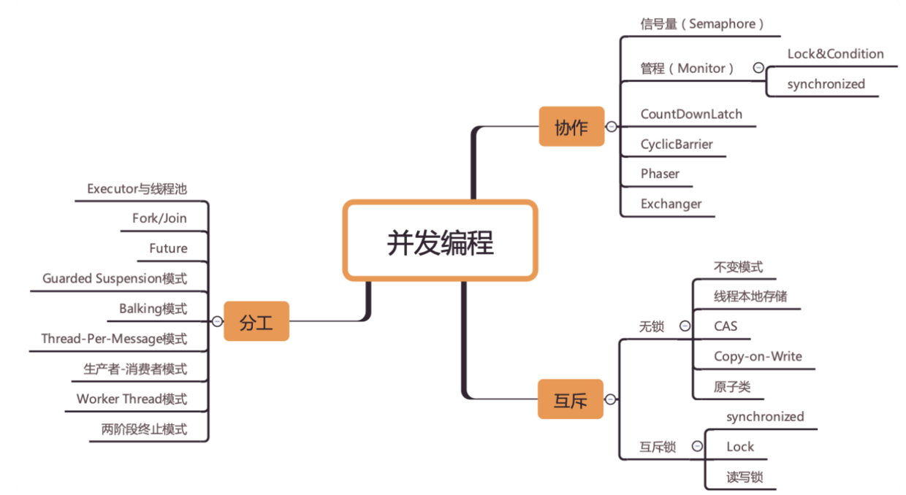

# Content
- [线程安全](01_thread_security.md)
- [取消任务](06_cancel.md)
- [线程池原理](04_executor.md)
- [GUI 程序](07_gui.md)

Java 并发总结：
- `Runnable` 接口用于定义一个可异步执行任务，不返回结果；
- `ExecutorService` 按规则执行任务；
- `Callable` 接口用于定义可异步执行并返回值的任务；
- 可以将一个或多个 `Callable` 实例传递给 `ExecutorService` 并合并结果；
- 如果多个线程除了同一个数据，如果该数据没有同步，则结果是不可预测的；
- 相对 locks，应当优先使用并发算法和线程安全的数据结构；
- 

# Reference
- https://docs.oracle.com/javase/tutorial/essential/concurrency/index.html
- [x] https://howtodoinjava.com/java-concurrency-tutorial/
- http://tutorials.jenkov.com/java-concurrency/index.html
- https://www.codejava.net/java-core/concurrency
- Java 高并发线程详解