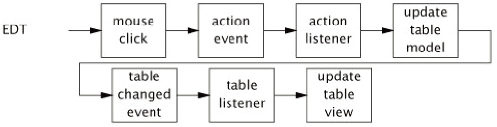

# TOC
- [TOC](#toc)
- [GUI 为何是单线程](#gui-%e4%b8%ba%e4%bd%95%e6%98%af%e5%8d%95%e7%ba%bf%e7%a8%8b)
  - [顺序事件处理（Sequential Event Processing）](#%e9%a1%ba%e5%ba%8f%e4%ba%8b%e4%bb%b6%e5%a4%84%e7%90%86sequential-event-processing)
  - [Swing 中的线程约束](#swing-%e4%b8%ad%e7%9a%84%e7%ba%bf%e7%a8%8b%e7%ba%a6%e6%9d%9f)
- [短命GUI任务](#%e7%9f%ad%e5%91%bdgui%e4%bb%bb%e5%8a%a1)
- [长寿GUI任务](#%e9%95%bf%e5%af%bfgui%e4%bb%bb%e5%8a%a1)
  - [取消任务](#%e5%8f%96%e6%b6%88%e4%bb%bb%e5%8a%a1)
  - [进度显示](#%e8%bf%9b%e5%ba%a6%e6%98%be%e7%a4%ba)

# GUI 为何是单线程
在过去，GUI程序都是单线程的，GUI事件在“主事件循环”中依次处理。现代的GUI框架只是稍有不同：创建了一个专用的事件调度线程（Event dispatch thread, EDT）处理GUI事件。

不仅仅 Java 中采用单线程GUI框架，Qt、NextStep、MacOS Cocoa、X Windows 等等都是单线程框架。并不是没有尝试过多线程GUI框架，最后都因为条件竞争和死锁等持久性问题，最后都改为单线程事件模型：一个专用线程从队列中事件，并将其分配给事件处理线程。（AWT最初是想支持大规模的多线程访问，由于体验不好，才有了单线程的Swing。）

多线程GUI框架极容易受死锁影响，部分是由面向对象的GUI组件和输入事件处理的交互引起的。
用户输入事件由底层 OS 上升到程序：如由OS检测的鼠标点击，在工具包中转换为 "mouse click" 事件，并最终传送到事件监听器，形成一个 "button pressed" 事件。而另一方面，程序触发的事件一路下降从特定的GUI组件类传递到底层OS： 如修改某个组件的背景色，分配给特定的组件类，最后传给底层OS渲染。如果上下两条事件线都访问相同的组件，使对象线程安全会产生不一致的锁顺序，导致死锁。

导致多线程GUI框架死锁的另一个原因是 MVC（model-view-control）模式的流行。将用户交互集成到 MVC 模型极大的简化了GUI程序的实现，但同样也提高了锁顺序不一致的风险。

我相信如果多线程GUI工具包经过精心设计，并且公开了其锁的方法细节，而你足够聪明、小心并且对工具包的整体结构十分了解，你可以成功使用多线程GUI工具包。但是你哪里出了点小错误，可能大部分时候没问题，偶尔会出现死机（死锁）和一些小故障（竞争锁）。这种多线程GUI工具包只适合于那些设计该工具包的人使用。

但是这显然不适合于广泛的商业用途，单线程GUI通过限制线程实现线程安全，所有的GUI对象必须通过事件分配线程访问。

## 顺序事件处理（Sequential Event Processing）
GUI 应用围绕一些细粒度事件展开，如点击鼠标、按键等。事件是一种任务，AWT和Swing 提供的事件处理器和 `Executor` 类似。

因为处理GUI任务的线程只有一个，因此它们按顺序依次处理，一个事件处理完，然后处理下一次，不会有两个事件重叠的情况。知道这一点编程就很容易了，你不需要担心两个事件相互干扰的问题。

这种按顺序处理任务的缺点是，如果一个任务要花很长时间，后面的任务都需要等它完成才能执行。如果后面的这些事件是响应用户输入、或者提供视觉反馈的操作，就会出现画面卡死的现象。当一个耗时任务在事件线程中运行，用户甚至无法取消任务，因为点击 "Cancel" 按钮产生的事件也要等前面的事件执行完才能响应。因此，在事件线程中执行的任务必须迅速执行并返回。对耗时的任务，例如检查文档的拼写、搜索文件系统或从网络上获取资源，你必须重新创建一个线程执行它们，这样GUI组件就可以迅速返回。

## Swing 中的线程约束
所有的 Swing 组件（如 `JButton`, `JTable`）和数据模型对象（如 `TableModel`, `TreeModel`）都限制在事件线程中，所以任何访问这些对象的代码必须在事件线程中运行。GUI 对象不是通过同步，而是通过线程约束来保持一致。其优点是在事件线程中运行的任务在访问GUI组件时不需要担心同步问题；缺点是不能在事件线程之外访问。

> Swing 单线程规则：Swing 组件和模型只能在事件分配线程（Event-dispatching thread, EDT）中创建，修改和访问。

As with all rules, there are a few exceptions. 有少部分的 Swing 方法可以在任意线程访问，它们在 Javadoc 中明确标识为是线程安全的，包括：
- `SwingUtilities.isEventDispatchThread`, 判断当前线程是否是EDT；
- `SwingUtilities.invokeLater`, 将一个任务 `Runnable` 放到 EDT 上执行（任意线程调用）；
- `SwingUtilities.invokeAndWait`, 将 `Runnable` 任务放到EDT上运行，阻塞当前线程直到其完成（只能在non-GUI线程上调用）；
- 在事件队列上添加重画或重新验证的请求（任意线程）；
- 添加会移除监听器的方法（任意线程），不过监听器只在EDT上调用。

`invokeLater` 和 `invokeAndWait` 方法功能很像 `Executor`。实际上，使用单线程 `Executor` 实现 `SwingUtilities` 的线程相关的方法很简单，例如：
```java
import java.lang.reflect.InvocationTargetException;
import java.util.concurrent.*;

public class SwingUtilities
{
    private static final ExecutorService exec = Executors.newSingleThreadExecutor(new SwingThreadFactory());
    private static volatile Thread swingThread;

    private static class SwingThreadFactory implements ThreadFactory
    {
        public Thread newThread(Runnable r)
        {
            swingThread = new Thread(r);
            return swingThread;
        }
    }

    public static boolean isEventDispatchThread()
    {
        return Thread.currentThread() == swingThread;
    }

    public static void invokeLater(Runnable task)
    {
        exec.execute(task);
    }

    public static void invokeAndWait(Runnable task) throws InterruptedException, InvocationTargetException
    {
        Future f = exec.submit(task);
        try {
            f.get();
        } catch (ExecutionException e) {
            throw new InvocationTargetException(e);
        }
    }
}
```
这并非 `SwingUtilities` 的实际实现，因为 Swing 比 `Executor` 框架出现的早，不过如果今天实现 Swing 框架，可能会如此实现。

可以将 Swing 事件线程看作单线程 `Executor`，它从事件队列中取事件依次处理。类似于线程池，有时候工作线程会挂掉，然后被新创建的线程替代，不过这完全不影响使用者。总的来说，单线程策略很适合于GUI的短期响应任务。

# 短命GUI任务
在GUI应用中，事件从事件线程起，传递至监听器，执行某些任务。对短期任务，由于耗时短，可以在事件线程中执行；对长期任务，则需要由额外的线程处理。

对简单情况，将展示对象限制在事件线程很自然。例如：
```java
final Random random = new Random();
final JButton button = new JButton("Change Color");
// ...
button.addActionListener(new ActionListener() {
    public void actionPerformed(ActionEvent e) {
        button.setBackground(new Color(random.nextInt()));
    }
});
```
创建一个按钮，点击按钮随机更改按钮颜色。当用户点击按钮时，Swing 在事件线程中将 `ActionEvent` 传递给所有注册的事件监听器。监听器收到事件后，随机选择一个颜色并修改按钮的背景色。即事件从GUI工具包起，传递给监听器，监听器根据用户时间修改GUI，整个控制流一直在事件线程，如下所示：


这个小例子说明了大多数GUI程序和GUI工具包之间的相互作用特征。只要任务短命，并且只访问GUI对象，你几乎可以完全忽略线程问题，所以事情都在EDT中完成。

稍微复杂一点的则使用 MVC 模型，如下图所示：




Swing 将大部分可视化组件分为两个对象：模型和视图。要显示的数据放在模型中，而控制数据如何显示的规则在视图中。在模型数据改变时，模型可以发出事件，而视图接收这些事件。当视图收到模型数据改变的事件，视图从模型中获取新的数据并更新显示。

# 长寿GUI任务
如果所有的任务都是短命的，则整个程序都可以在事件线程中运行，你完全不需要关于线程问题。然而，实际的GUI程序大部分会执行那种长周期任务，如检查拼写、后台编译、获取远程资源等，没人愿意等待GUI界面卡顿这么久，这些任务必须在其它的线程中运行，以保证GUI保持响应状态。

Swing 使得在事件线程中执行任务很简单，但是没有提供辅助GUI任务在其它线程中执行代码。不过这很简单，我们可以自己创建 `Executor` 处理长周期任务。使用缓冲线程池执行长周期任务就很合适，因为GUI程序极少会创建大量的长周期任务，所以也不用担心线程池过于膨胀。

我们首先创建一个简单的长寿任务，不支持取消、进度显示，也不更新GUI，然后逐步添加这些功能。如下所示，
```java
ExecutorService backgroundExec = Executors.newCachedThreadPool();
// ...
button.addActionListener(new ActionListener() {
    public void actionPerformed(ActionEvent e) {
        backgroundExec.execute(new Runnable() {
            public void run() { doBigComputation(); }
        });
}});
```
将一个 `ActionListener` 和按钮绑定，提交一个长寿任务到 `Executor`。尽管有两个内部类，以这种方式初始化一个任务很容易。

不过运行这种长寿任务没有任何UI反馈让使用者很难习惯。在长寿任务完成后，一般在UI上有可视化的反馈。但是执行任务的后台线程无法访问UI组件，所以在完成任务后，必须添加另外一个任务到事件线程用于更新UI。如下：
```java
button.addActionListener(new ActionListener(){
    public void actionPerformed(ActionEvent e){
        button.setEnabled(false);
        label.setText("busy");
        backgroundExec.execute(new Runnable(){
            public void run(){
                try {
                    doBigComputation();
                } finally {
                    GuiExecutor.instance().execute(new Runnable(){
                        public void run(){
                            button.setEnabled(true);
                            label.setText("idle");
                        }
                    });
                }
            }
        });
    }
});
```
action listener 首先让按钮变暗`setEnabled(false)`并设置按钮标签 `setText("busy")`，表示正有任务在执行，随后提交一个任务到后台的 executor。在任务完成后，添加另一个任务到事件线程，重新激活 `setEnabled(true)`，并设置文本 `setText("idle")`。

在按下按钮时启动任务，该任务包含三个连续子任务：第一个子任务更新UI，告诉已经有任务开始了；并在后台线程执行第二个子任务，在任务完成后，第二个子任务将第三个子任务添加到事件线程以更新UI。这种模式是典型的在GUI程序中运行长寿任务的方式。

## 取消任务
一个长寿任务运行多久，用户就有多久想取消任务。可以直接通过线程中断的方式实现取消，不过通过 `Future` 实现起来更容易，它本身带有取消任务的功能。

将 `mayInterruptIfRunning` 设置为 `true`可以调用 `cancel` 取消 `Future` 任务，`Future` 实现中断执行任务线程的打断机制。如下，轮询线程的中断状态，在打断时提前返回：
```java
Future<?> runningTask = null; // thread-confined
// ...
startButton.addActionListener(new ActionListener() {
    public void actionPerformed(ActionEvent e) {
        if (runningTask != null) {
            runningTask = backgroundExec.submit(new Runnable() {
                public void run() {
                    while (moreWork()) {
                        if (Thread.currentThread().isInterrupted()) {
                            cleanUpPartialWork();
                            break;
                        }
                        doSomeWork();
                    }
                }
            });
        };
}});
cancelButton.addActionListener(new ActionListener() {
    public void actionPerformed(ActionEvent event) {
        if (runningTask != null)
            runningTask.cancel(true);
}});
```
因为 `runningTask` 被限制在事件线程，因为在设置和检查时无需同步，而 `startButton` 的监听器能保证一次只有一个任务运行。

## 进度显示
使用 `Future` 极大的简化了取消长寿任务的实现。`Future` 在任务完成时还能发出通知，在后台 `Callable` 结束后，`done` 被调用。