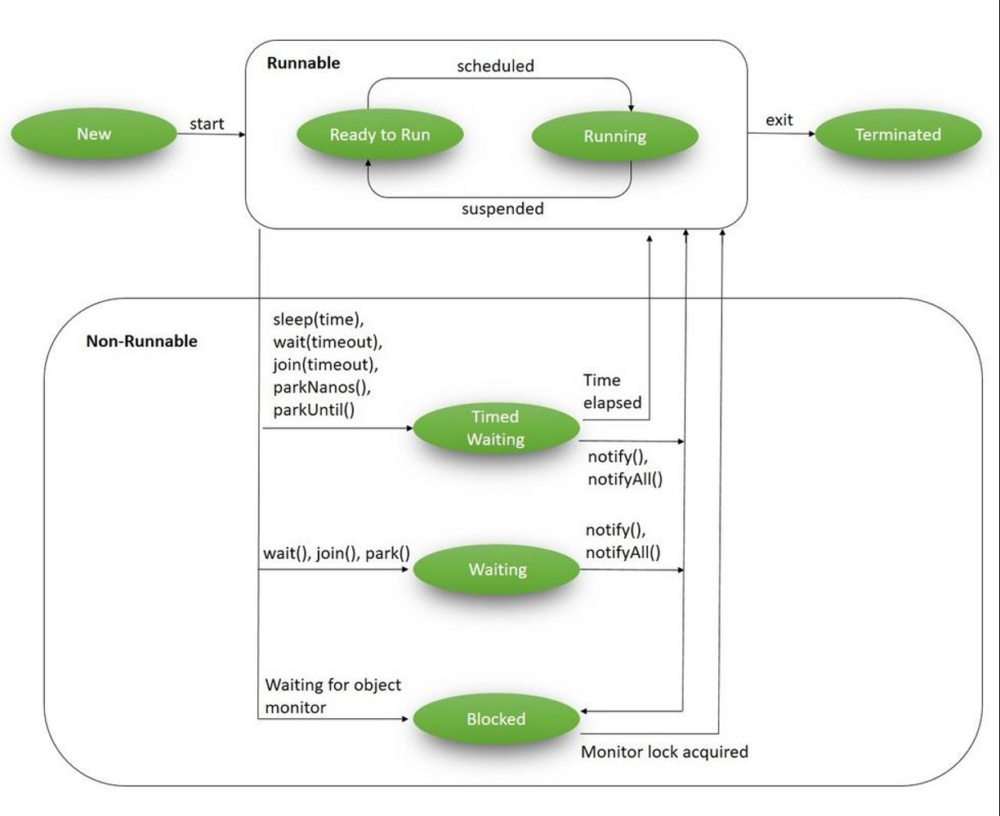

# 线程生命周期



- [线程生命周期](#线程生命周期)
  - [NEW](#new)
  - [RUNNABLE](#runnable)
  - [BLOCKED](#blocked)
  - [WAITING](#waiting)
  - [Time Waiting](#time-waiting)
  - [Terminated](#terminated)

Thread 类中的静态 enum `State` 定义了线程的可能状态

|状态|说明|
|---|---|
|NEW|创建但未调用 `start()` 启动|
|RUNNABLE|正在运行或准备好运行，但在等待资源|
|BLOCKED|等待获取 monitor lock 以进去或重新进入同步的块或方法。
|WAITING|等待其它线程执行特定操作，没有时间限制|
|TIMED_WAITING|在指定时间段内等待其它线程执行特定操作|
|TERMINATED|执行结束|

## NEW

`NEW` 表示线程刚创建，还没有启动，在调用 `start()` 方法前，线程状态保持为 `NEW`。例：

```java
Thread t = new Thread(() -> { });
assertSame(t.getState(), Thread.State.NEW);
```

`NEW` 状态的线程还没开始执行，需要进行一些初始化工作。

## RUNNABLE

创建线程，然后调用 `start()` 方法后，线程进入 `RUNNABLE` 状态。

`RUNNABLE` 可以理解为可执行线程。可执行线程可能正在执行，也可能没有执行，没有执行时，线程在可执行线程池中，等待被线程调度选中，获取CPU时间。

一个**没有运行的 `RUNNABLE` 线程**（ready to run）不会直接进入 `BLOCKED` 或 `TERMINATED` 状态，即使调用 `wait`、`sleep`或其它阻塞IO的操作，也必须先获得 CPU 时间，要么运行，要么意外结束。

正在运行的线程（Running）可以发生如下可能的转变：

- 直接进入 `TERMINATED` 状态，比如使用不推荐的 `stop` 方法；
- 由于 CPU 的调度器轮询使该线程放弃执行，进入 `RUNNABLE` 状态。

以及由于某种原因放弃CPU执行权，进入阻塞状态，暂停运行。直到线程进入可运行(runnable) 状态，才有机会再次获得 CPU 时间，转到运行 (running) 状态。阻塞的情况有：

- 等待阻塞，比如调用 `sleep`, `wait` 等方法，JVM 把线程放入等待池 waitSet 中，进入 `BLOCKED` 状态；
- 进入某个阻塞的 IO 操作，进入 `BLOCKED` 状态；
- 同步阻塞，获取某个锁资源，从而加入到该锁的阻塞队列而进入 `BLOCKED` 状态；
- 线程主动调用 `yield()` 方法，放弃 CPU 时间，进入 `RUNNABLE` 状态。

运行(running)的线程执行 `Thread.sleep(long ms)` 或 `t.join()` 方法，或者发送了I/O请求时，JVM会把该线程置为阻塞状态。当 `sleep()` 状态超时、`join()` 等待线程终止或者超时、或者I/O处理完毕后，线程重新转入可运行(runnable)状态。

例如：

```java
Thread t = new Thread(() -> {});
t.start();
assertSame(t.getState(), Thread.State.RUNNABLE);
```

这里需要注意，上面的测试不一定能通过。有可能调用 `start()` 后线程立刻获得CPU时间开始执行，在调用 `getState()` 时可能已经执行完。

## BLOCKED

当线程等待 monitor lock 并尝试访问某个被其它线程锁定的代码时，进入阻塞（blocked）状态。此时线程不活动，不运行任何代码，消耗最少的资源，直到线程调度器重新激活它。如

- 进入 `synchronized` 语句
- I/O 请求

例如：

```java
 @Test
void testBlock(){
    Thread t1 = new Thread(new DemoThread());
    Thread t2 = new Thread(new DemoThread());

    t1.start();
    t2.start();

    try {
        Thread.sleep(1000);
    } catch (InterruptedException e) {
        e.printStackTrace();
    }
    assertSame(Thread.State.BLOCKED, t2.getState());
    System.exit(0);
}

static class DemoThread implements Runnable{
    @Override
    public void run(){
        heavyTask();
    }

    public static synchronized void heavyTask(){
        while (true) {

        }
    }
}
```

说明：

1. 在上面创建了两个线程 `t1` 和 `t2`。
2. `t1` 启动先进入 `heavyTask()`，由于是同步方法，后面其它线程访问该方法就进入 `BLOCKED` 状态，直到 `t1` 完成该方法。
3. `t1` 在该方法中处于无限循环，所有其它所有线程都无法进行该方法，所以 `t2` 的状态为 `BLOCKED`。

`BLOCKED` 状态线程可切换到其它状态：

- 直接进入 `TERMINATED` 状态，比如意外死亡或调用了 `stop()` 方法；
- 线程阻塞的操作结束（如I/O完成），进入 `RUNNABLE` 状态；
- 线程完成指定休眠时间，进入 `RUNNABLE` 状态；
- 等待池的线程被其它线程 `notify/notifyall` 唤醒，进入 `RUNNABLE` 状态；
- 线程获取到某个锁，进入 `RUNNABLE` 状态；
- 线程在阻塞过程中被打断，比如其它线程调用了 `interrupt` 方法，进入 `RUNNABLE` 状态。

## WAITING

当线程等到其它线程执行特定操作时处于 `WAITING` 状态。调用下面三种方法会进入该状态：

1. `object.wait()`
2. `thread.join()`
3. `LockSupport.part()`

注意 `wait()` 和 `join()` 方法都没有指定时间。

例如：

```java
public class WaitingState implements Runnable{
    public static Thread t1;

    public static void main(String[] args)
    {
        t1 = new Thread(new WaitingState());
        t1.start();
    }

    @Override
    public void run(){
        Thread t2 = new Thread(new WaitingThread());
        t2.start();

        try {
            t2.join();
        } catch (InterruptedException e) {
            Thread.currentThread().interrupt();
            e.printStackTrace();
        }
    }

    class WaitingThread implements Runnable{
        @Override
        public void run()
        {
            try {
                Thread.sleep(1000);
            } catch (InterruptedException e) {
                Thread.currentThread().interrupt();
                e.printStackTrace();
            }
            System.out.println(WaitingState.t1.getState());
        }
    }
}
```

说明：

1. 创建并启动线程 `t1`.
2. `t1` 创建并启动线程 `t2`
3. 在线程 `t1` 中调用了 `t2.join()`，使得 `t1` 等待直到 `t2` 完成
4. 所以此时 `t2` 中 `t1` 处于 `WAITING` 状态

## Time Waiting

当线程整等待其它线程执行特定操作，但只等待一段时间时，处于 `TIMED_WAITING` 状态。

通过下面方法可以进入 `TIMED_WAITING` 状态：

1. `thread.sleep(long millis)`
2. `wait(int timeout)` or `wait(int timeout, int nanos)`
3. `thread.join(long millis)`
4. `LockSupport.parkNanos`
5. `LockSupport.parkUntil`

例如：

```java
@Test
void testTimedWaiting()
{
    Thread t1 = new Thread(new WaitThread());
    t1.start();

    // given enough time to start t1
    try {
        Thread.sleep(1000);
    } catch (InterruptedException e) {
        e.printStackTrace();
    }
    assertSame(Thread.State.TIMED_WAITING, t1.getState());
}

class WaitThread implements Runnable
{

    @Override
    public void run()
    {
        try {
            Thread.sleep(5000);
        } catch (InterruptedException e) {
            e.printStackTrace();
        }
    }
}
```

上例中通过 `Thread.sleep(5000)` 使线程 `t1` 进入 `TIMED_WAITING` 状态。

## Terminated

当线程执行完成或异常结束后，进入 `TERMINATED` 状态。即：

- 线程正常执行结束
- 线程运行出错，意外结束
- JVM 崩溃

例如：

```java
Thread t1 = new Thread(() -> { });
t1.start();
try {
    // given enough time for t1 to complete
    Thread.sleep(1000);
} catch (InterruptedException e) {
    e.printStackTrace();
}
assertSame(Thread.State.TERMINATED, t1.getState());
```

线程 `t1` 很快结束，进入 `TERMINATED` 状态。
