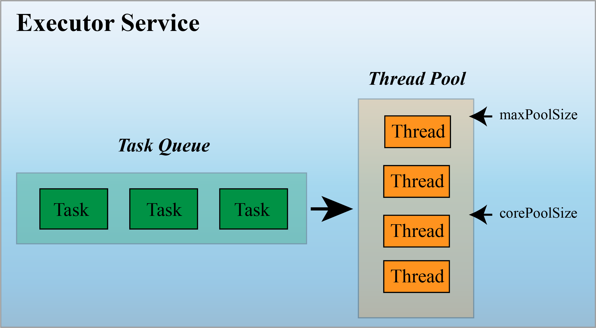
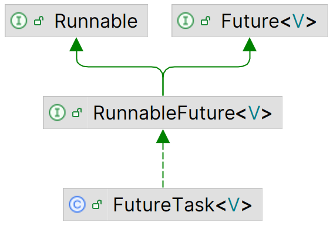

# 线程池

- [线程池](#线程池)
  - [1. 简介](#1-简介)
    - [线程池的基本原理](#线程池的基本原理)
    - [回收核心线程？](#回收核心线程)
    - [Executor](#executor)
    - [生命周期](#生命周期)
    - [线程池状态](#线程池状态)
    - [线程池使用流程](#线程池使用流程)
  - [2. 创建线程池](#2-创建线程池)
    - [示例 1](#示例-1)
    - [Executors](#executors)
      - [newCachedThreadPool](#newcachedthreadpool)
      - [newFixedThreadPool](#newfixedthreadpool)
      - [newSingleThreadPoolExecutor](#newsinglethreadpoolexecutor)
      - [newScheduledThreadPool](#newscheduledthreadpool)
  - [3. ThreadPoolExecutor](#3-threadpoolexecutor)
    - [workQueue](#workqueue)
    - [threadFactory](#threadfactory)
    - [handler](#handler)
    - [执行任务](#执行任务)
    - [线程池状态查询](#线程池状态查询)
    - [关闭线程池](#关闭线程池)
  - [4. 返回结果的任务](#4-返回结果的任务)
    - [示例 2](#示例-2)
    - [示例 3](#示例-3)
  - [5. 处理第一个结果](#5-处理第一个结果)
    - [示例 4](#示例-4)
  - [6. 处理所有结果](#6-处理所有结果)
    - [示例 5](#示例-5)
  - [7. 延迟执行](#7-延迟执行)
    - [示例 6](#示例-6)
  - [8. 周期执行](#8-周期执行)
    - [示例 7](#示例-7)
  - [9. 取消任务](#9-取消任务)
    - [示例 8](#示例-8)
  - [10. 任务完成时触发操作](#10-任务完成时触发操作)
    - [示例 9](#示例-9)
  - [11. 任务启动和处理结果分离](#11-任务启动和处理结果分离)
    - [示例 10](#示例-10)

2024-11-08⭐
@author Jiawei Mao
***

## 1. 简介

在 Java 中线程的创建和销毁开销都很大，除了任务执行所需的开销，系统还需要为线程分配资源及额外的内存。因此反复创建线程开销会很大，降低系统效率。

线程池存放已经创建好的线程，将任务提交给线程池，线程池使用已创建的线程执行任务，使得线程可以重复使用，在降低创建线程开销的同时简化了线程的管理工作。

线程池复用线程具有以下优点：

- 减少内存开销，创建线程占用内存；
- 降低系统开销，创建线程需要时间，会延迟处理的请求；
- 提高稳定性，避免无限创建线程导致的 `OutOfMemoryError`；
- 将当前任务与主线程分离，实现和主线程的异步执行；
- 实现线程创建和管理的分离。

但是，一味的开线程也不一定能带来性能上的，线池休眠也要占用一定的内存空间，所以要合理地选择线程池的大小。使用 executor，只需要实现 `Runnable` 或 `Callable` 对象，然后将它们发送给 executor。executor 负责执行任务，并使用必要的线程运行它们。说明：

- `Executor` 是最基础的线程池接口，只有一个 `execute()` 方法；
- `ExecutorService` 接口扩展 `Executor`，添加了 `submit()`, `shutdown()`等管理方法，还可以使用返回的 `Future` 控制任务执行；
- `AbstractExecutorService` 抽象类实现了 `ExecutorService` 接口中的大部分方法；
- `ThreadPoolExecutor` 为线程池的具体实现类；
- `ScheduledExecutorService` 接口扩展了 `ExecutorService` 接口，添加了周期执行功能；
- `ScheduledThreadPoolExecutor` 是 `ScheduledExecutorService` 的具体实现类；
- 另外还有工厂类 `Executors`，提供创建线程池的工厂方法。


### 线程池的基本原理

线程池管理一堆已经创建好的线程，并负责执行提交的任务。当提交的任务大于线程池中线程的数目，可以创建新的线程执行任务，也可以将该任务放入一个队列，等其它任务执行完有了空闲线程再执行。因此一个线程池至少需要如下功能：

- 任务队列，用于保存待执行的任务；
- 线程数量管理
  - 初始线程数量, init
  - 线程数量不足时，最大允许的扩充数量, max
  - 线程池空闲时，释放线程，最低保留的线程数目，core
- 拒绝任务策略：如果线程池和队列均已满，需要有相应的策略拒绝任务；
- 线程工厂：用来创建线程；
- `QueueSize`：用来存放提交的 `Runnable` 或 `Callable` 任务。

线程池的基本结构如下所示：



工作线程（worker-thread）：从 work-queue 获取任务来执行，然后返回线程池。

通过 `execute()` 提交任务，线程池按如下流程安排新的任务：


1. 刚创建的线程池，里面没有线程，不过可以通过 `prestartCoreThread()` 或 `prestartAllCoreThreads()` 预先创建线程
2. 当调用 `execute()` 添加一个新任务时，线程池会作如下判断：
   - 如果正在运行的线程数小于 `corePoolSize`，则创建线程执行该任务；
   - 如果正在运行的线程数大于或等于 `corePoolSize`，但队列 `workQueue`未满，那么将该任务放入队列，按照FIFO的顺序执行；
   - 如果队列已满，而正在运行的线程数目小于 `maximumPoolSize`，则创建线程执行该任务；
   - 如果队列已满，且正在运行的线程数目大于或等于 `maximumPoolSize`，那么线程池会给 `RejectedExecutionHandler` 作拒绝处理。
3. 当一个线程执行结束，线程池从队列中取下一个任务执行。
4. 当一个线程无所事事超过一段时间（`keepAliveTime`），如果当前运行的线程数目大于 `corePoolSize`，线程池会关掉这个线程。

`submit()` 也是提交任务的方法，和 `execute()` 不同的是，它可以返回任务执行的结果：其内部调用 `execute()` 方法执行任务，通过 `Future()` 获得结果。

小结一下：在线程池中执行任务比为每个任务分配一个线程优势更多，通过重用现有的线程而不是创建新线程，可以在处理多个请求时分摊线程创建和销毁产生的巨大的开销。当请求到达时，通常工作线程已经存在，提高了响应性；通过配置线程池的大小，可以创建足够多的线程使CPU达到忙碌状态，还可以防止线程太多耗尽计算机的资源。

### 回收核心线程？

将 `corePoolSize` 的数量设置为 0，使得线程池的所有线程都是“临时”的，只有 `keepAliveTime` 存活时间，但这会导致一个很严重的后果，`corePoolSize=0` 时，任务需要填满阻塞队列才会创建线程来执行任务，阻塞队列有设置长度还好，如果队列长度无限大呢，你就等着 OOM 吧，所以用这种设置行为并不是我们所需要的。

### Executor

`Executor` 接口的声明非常简单：

```java
public interface Executor {
    void execute(Runnable command);
}
```

`execute(Runnable)` 用来执行提交的任务。通常使用 `Executor` 来代替显式创建线程。例如，

- 显式创建线程

```java
new Thread(new RunnableTask()).start() 
```

- `Executor` 方式：

```java
Executor executor = anExecutor();
executor.execute(new RunnableTask1());
executor.execute(new RunnableTask2());
```

但是，`Executor` 接口没有要求必须异步执行任务。例如，executor 可以执行在调用者线程中立即执行提交的任务：

```java
class DirectExecutor implements Executor {
    public void execute(Runnable r) {
        r.run();
    }
}
```

当然，更典型的情况，是在任务调用者所在线程之外的线程执行任务。例如，下面的 `Executor` 为每个任务创建一个新的线程：

```java
class ThreadPerTaskExecutor implements Executor {
    public void execute(Runnable r) {
        new Thread(r).start();
    }
}
```

许多 `Executor` 的实现对任务调度方式和时间进行了定制。例如，下面的 executor 将提交的任务序列化到另一个 executor：

```java
class SerialExecutor implements Executor {
    final Queue<Runnable> tasks = new ArrayDeque<>();
    final Executor executor;
    Runnable active;      
    SerialExecutor(Executor executor) {      
        this.executor = executor;    
    }      
    
    public synchronized void execute(Runnable r) {      
        tasks.add(() -> {        
            try {          
                r.run();        
            } finally {          
                scheduleNext();        
            }      
        });      
        if (active == null) {        
            scheduleNext();      
        }    
    }      
    
    protected synchronized void scheduleNext() {      
        if ((active = tasks.poll()) != null) {        
            executor.execute(active);      
        }    
    }  
}
```

在 `java.util.concurrent` 包提供的 `Executor` 实现同时实现了 `ExecutorService` 接口。

### 生命周期


创建 `Executor` 很容易，但JVM只有在所有（非守护）线程全部终止后才会退出，因此，如果无法正确关闭 `Executor`，JVM 将无法结束。

由于 `Executor` 以异步的方式执行任务，因此在任何时刻，之前提交任务的状态不是立即可见。有些任务可能已经完成，有些可能正在运行，而其它的任务可能在 work-queue 中等待执行。

为了解决 `Executor` 的生命周期问题， `ExecutorService` 接口扩展 `Executor`，添加了一些用于生命周期管理的方法。如下：

```java
public interface ExecutorService extends Executor {

    void shutdown();
    List<Runnable> shutdownNow();
    boolean isShutdown();

    boolean isTerminated();

    boolean awaitTermination(long timeout, TimeUnit unit)
        throws InterruptedException;

    <T> Future<T> submit(Callable<T> task);
    <T> Future<T> submit(Runnable task, T result);
    Future<?> submit(Runnable task);

    <T> List<Future<T>> invokeAll(Collection<? extends Callable<T>> tasks)
        throws InterruptedException;
    <T> List<Future<T>> invokeAll(Collection<? extends Callable<T>> tasks,
                                  long timeout, TimeUnit unit)
        throws InterruptedException;

    <T> T invokeAny(Collection<? extends Callable<T>> tasks)
        throws InterruptedException, ExecutionException;
    <T> T invokeAny(Collection<? extends Callable<T>> tasks,
                    long timeout, TimeUnit unit)
        throws InterruptedException, ExecutionException, TimeoutException;
}
```

`ExecutorService` 的生命周期有三种状态：running, shutting-down 和 terminated。

- `ExecutorService` 初始化后处于 running 状态
- `shutdown` 执行平缓关闭：不再接受新 task，但是等待已经提交的 tasks 完成
- `shudownNow` 执行粗暴关闭：取消运行中的 task，不再启动 work-queue 中尚未开始执行的 task

`ExecutorService` 关闭后提交的 task 由 `RejectedExecutionHandler` 处理，它会抛弃任务，或者让 `execute` 方法抛出一个 `RejectedExecutionExeception`。

等所有 task 完成后，`ExecutorService` 进入 terminated 状态。可以调用 `awaitTermination` 等待 `ExecutorService` 进入 terminated 状态，或者通过调用 `isTerminated` 轮询 `ExecutorService` 是否已经 terminated。通常调用 `awaitTermination` 后会立即调用 `shutdown`，从而产生同步关闭 `ExecutorService` 的效果。

### 线程池状态

`ThreadPoolExecutor` 中定义了几个 final 字段用于定义线程池的状态：

```java
private static final int RUNNING    = -1 << COUNT_BITS;
private static final int SHUTDOWN   =  0 << COUNT_BITS;
private static final int STOP       =  1 << COUNT_BITS;
private static final int TIDYING    =  2 << COUNT_BITS;
private static final int TERMINATED =  3 << COUNT_BITS;

private final AtomicInteger ctl = new AtomicInteger(ctlOf(RUNNING, 0));
private static final int COUNT_BITS = Integer.SIZE - 3;
private static final int CAPACITY   = (1 << COUNT_BITS) - 1;
```
`AtomicInteger` 类型字段 `ctl` 用于记录当前状态。`Integer` 有32位，其中高3位表示线程池状态，低29位表示线程池中的任务数目。

- `COUNT_BITS` 表示 `ctl` 变量中有效线程数量的位数，这里是 29；
- `CAPACITY` 表示最大有效线程数，这里是 $2^{29}-1=536870911$，五亿多，完全够用；

所以，这里用一个字段表示了状态和线程数目两个信息，主要是方便这两个信息的同时获取。

线程池有五种状态：
|状态|说明|
|---|---|
|`RUNNING`|线程池初始化后的默认状态，表示接收新任务，并且处理任务队列中的任务|
|`SHUTDOWN`|调用 `shutdown()` 后进入该状态，该状态下不接收新任务，但继续处理任务队列中已有的任务，包括那些还未开始执行的任务|
|`STOP`|调用 `shutdownNow()` 后进入该状态，该状态下线程池不接收新任务，并将正在执行的线程状态设置为 interrupted，不再启动队列中尚未执行的任务|
|`TIDYING`|所有任务完成，`workerCount` 为 0 时进入该状态|
|`TERMINATED`|`terminated()`执行完毕后的状态|

说明：
- `shutdown()` 执行平缓的关闭过程，线程池从 `RUNNING` 转换为 `SHUTDOWN` 状态；
- `shutdownNow()` 执行粗暴的关闭过程，
- 当线程池处于 `SHUTDOWN` 或 `STOP` 状态，并且所有工作线程已经销毁，任务缓存队列已经清空或执行结束后，线程池被设置为 `TERMINATED` 状态。
- 在 `ExecutorService` 关闭后提交的任务将由 "Rejected Execution Handler" 处理，它会抛弃任务，或者使得 `execute` 方法抛出一个 `RejectedExecutionException`。
- 等所有任务都完成了，`ExecutorService` 转入终止状态。可以使用 `awaitTermination` 来等待 `ExecuteService` 到达终止状态，或者通过调用 `isTerminated` 查询 `ExecutorService` 是否已终止。通常在调用 `awaitTermination`后立即调用 `shutdown`，从而产生同步关闭 `ExecutorService` 的效果。

### 线程池使用流程

**1. 定义任务类**

```java
class Handler implements Runnable{  }
```

**2. 创建线程池**

```java
ExecutorService executorService = Executors.newCachedThreadPool();  
```

或者

```java
int cpuNums = Runtime.getRuntime().availableProcessors();  //获取当前系统的CPU 数目  
ExecutorService executorService =Executors.newFixedThreadPool(cpuNums * POOL_SIZE); //ExecutorService通常根据系统资源情况灵活定义线程池大小  
```

**3. 提交任务**

线程池通过 `execute()` 提交任务，提交任务后的执行流程：

循环操作：

```java
while(true){  
  executorService.execute(new Handler(socket));   
     // class Handler implements Runnable{  
  或者  
  executorService.execute(createTask(i));  
      //private static Runnable createTask(final int taskID)  
}  
```
`execute(Runnable对象)`方法其实就是对 `Runnable` 对象调用 `start()` 方法（当然还有一些其他后台动作，比如队列，优先级，IDLE timeout，active激活等）

**4. 关闭线程池**

`ThreadPoolExecutor` 提供了两个关闭线程池的方法，分别是 `shutdown()` 和 `shutdownNow()`，其中：
- `shutdown()` 调用后不再接受新的任务，等队列中的所有任务完成后终止；
- `shutdownNow()` 调用后不再接受新任务，并尝试中断正在制定的任务，且清空任务队列。


**5. 延迟任务与周期任务**

`Timer` 类负责管理延迟任务（如在 100ms 后执行任务）和周期任务（如每 10ms 执行一次该任务）。然而，`Timer` 存在一些缺陷，`Timer` 支持基于绝对时间的调度机制，因此任务的执行对系统时钟变化很敏感，而 `ScheduledThreadPoolExecutor` 支持基于相对时间的调度，因此应该考虑使用 `ScheduledThreadPoolExecutor` 来代替它。

`Timer` 在执行所有定时任务时只创建一个线程。如果某个任务执行时间过长，那么将破坏其他 `TimerTask` 的定时准确性。

在 Java 5.0 之后已经很少使用 `Timer` 了，如果要构建自己的调度服务，可以使用 `DelayQueue`，它实现了 `BlockingQueue`，并为 `ScheduledThreadPoolExecutor` 提供调度服务。

**6. 线程池配置**

一般需要根据任务的类型来配置线程池大小。

- 对 CPU 密集型任务，就需要尽量压榨CPU，参考值可以设置为 NCPU+1，通常能实现最优的利用率。即使当计算密集型的线程偶尔因为某种原因暂停，额外的线程也能确保 CPU 的时钟周期不会被浪费。

- 如果是 IO密集型任务，由于线程并不会一直执行，因此线程池的规模应该更大。参考值为 2*NCPU。


## 2. 创建线程池

使用 `Executor` 框架，第一步是创建 `ThreadPoolExecutor` 实例。创建 `ThreadPoolExecutor` 有两种方式：

1. 使用 `ThreadPoolExecutor` 提供的 4 个构造函数
2. 使用工厂类 `Executors`

创建 `Executor` 后，就可以执行 `Runnable` 或 `Callable` 对象。

关闭 `Executor`：

- 使用 `shutdown()` 关闭 `Executor`。`executor` 会等待正在运行或等待执行的任务完成，然后结束。
- 在调用 `shutdown()` 之后、executor 关闭之前提交任务，executor 会拒绝该任务。

下面通过示例介绍如何使用 `Executors` 工厂类创建 `ThreadPoolExecutor` 对象，以及如何提交任务和处理被拒绝任务。

### 示例 1

1. 创建 `Task` 任务类，实现 `Runnable` 接口

```java
import java.util.Date;
import java.util.concurrent.TimeUnit;

public class Task implements Runnable {

    // 任务创建时间
    private final Date initDate;
    // 任务名称
    private final String name;

    public Task(String name) {
        this.name = name;
        this.initDate = new Date();
    }

    @Override
    public void run() {
        System.out.printf("%s: Task %s: Created on: %s\n",
                Thread.currentThread().getName(),
                name, initDate);
        System.out.printf("%s: Task %s: Started on: %s\n",
                Thread.currentThread().getName(),
                name, new Date());
        
        try {
            // sleep 一段随机时间
            long duration = (long) (Math.random() * 10);
            System.out.printf("%s: Task %s: Doing a task during %d seconds\n",
                    Thread.currentThread().getName(),
                    name, duration);
            TimeUnit.SECONDS.sleep(duration);
        } catch (InterruptedException e) {
            e.printStackTrace();
        }

        System.out.printf("%s: Task %s: Finished on: %s\n",
                Thread.currentThread().getName(),
                name, new Date());
    }
}
```

2. 创建 `RejectedTaskController`，实现 `RejectedExecutionHandler` 接口。

```java
import java.util.concurrent.RejectedExecutionHandler;
import java.util.concurrent.ThreadPoolExecutor;

public class RejectedTaskController implements RejectedExecutionHandler {

    @Override
    public void rejectedExecution(Runnable r, ThreadPoolExecutor executor) {
        // 输出被拒绝 task 的名称和 executor 的状态
        System.out.printf("RejectedTaskController: The task %s has been rejected\n",
                r.toString());
        System.out.printf("RejectedTaskController: %s\n",
                executor.toString());
        System.out.printf("RejectedTaskController: Terminating: %s\n",
                executor.isTerminating());
        System.out.printf("RejectedTaksController: Terminated: %s\n",
                executor.isTerminated());
    }
}
```

3. 实现 `Server` 类，该类使用 executor 执行接收到的任务

```java
import java.util.concurrent.Executors;
import java.util.concurrent.ThreadPoolExecutor;

public class Server {

    private final ThreadPoolExecutor executor;

    public Server() {
        executor = (ThreadPoolExecutor) Executors.newFixedThreadPool(
                Runtime.getRuntime().availableProcessors());
        RejectedTaskController controller = new RejectedTaskController();
        executor.setRejectedExecutionHandler(controller);
    }

    public void executeTask(Task task) {
        System.out.printf("Server: A new task has arrived\n");
        executor.execute(task);

        System.out.printf("Server: Pool Size: %d\n",
                executor.getPoolSize());
        System.out.printf("Server: Active Count: %d\n",
                executor.getActiveCount());
        System.out.printf("Server: Task Count: %d\n",
                executor.getTaskCount());
        System.out.printf("Server: Completed Tasks: %d\n",
                executor.getCompletedTaskCount());
    }

    public void endServer() {
        executor.shutdown();
    }
}
```

4. 实现 `Main` 类，在 `main` 方法中创建 100 个 tasks 并发送给 `Executor`

```java
public class Main {
    public static void main(String[] args) {
        Server server = new Server();
        System.out.printf("Main: Starting.\n");
        for (int i = 0; i < 100; i++) {
            Task task = new Task("Task " + i);
            server.executeTask(task);
        }
        // 关闭 Server
        System.out.printf("Main: Shutting down the Executor.\n");
        server.endServer();

        // 发送一个新的 task，该 task 会被拒绝
        System.out.printf("Main: Sending another Task.\n");
        Task task = new Task("Rejected task");
        server.executeTask(task);
        
        System.out.printf("Main: End.\n");
    }
}
```

这个示例的关键是 Server 类。该类创建并使用 `ThreadPoolExecutor` 执行任务。

`ThreadPoolExecutor` 提供了 4 个构造函数，但是使用起来有点复杂，用 `Executors` 的工厂方法就简单多了。

上面用 `Executors.newFixedThreadPool()` 创建一个指定最大线程数的 `Executor`。如果任务数超过线程数，剩余的任务阻塞，直到有可用的空闲线程。该方法的参数为最大线程数，上例用 `Runtime.getRuntime().availableProcessors()` 返回 JVM 可用的处理器数，该数字通常与计算机的内核数一致。

重用线程的优点是减少了创建线程所需时间。缺点是线程池保留了固定的驻留线程，如果向 `Executor `发送太多任务，有可能导致系统过载。

创建 `Executor` 后，可以使用 `execute()` 方法发送 `Runnable` 或 `Callable` 类型的任务来执行。在上例，发送的 `Task` 任务实现了 `Runnable` 接口。

上面还输出了 `Executor` 的一些日志消息。具体来说：

- `getPoolSize()`：线程池中实际的线程数；
- `getActiveCount()`：线程池中正在执行任务的线程数；
- `getTaskCount()`：计划执行的任务总数。由于任务和线程的状态在计算过程中动态变化，所以返回的是近似值；
- `getCompletedTaskCount()`：已完成任务数。

`ThreadPoolExecutor` 以及其它 `Executor` 实现都**必须显式结束**。否则 executor 不会结束，一致等待新任务。Java 应用只有在所有非守护线程执行完毕后才会结束，因此，如果不终止 executor，Java 程序不会结束。

调用 `ThreadPoolExecutor.shutdown()` 关闭 executor。当 executor 完成所有任务，调用 `shutdown()` 后，再次发送任务到 executor，executor 默认会拒绝任务并抛出 `RejectedExecutionException`，或者单独实现了一个拒绝策略（如上所示）。实现拒绝策略，需要实现 `RejectedExecutionHandler` 接口，该接口只有一个方法 `rejectedExecution()`，包含两个参数：

- `Runnable` 对象，即被拒绝的任务；
- `Executor` 对象，即 executor 的引用。

对每个被 executor 拒绝的任务，都会调用该方法。通过 `ThreadPoolExecutor.setRejectedExecutionHandler()` 设置拒绝策略。

部分输出：

```
Server: A new task has arrived
Server: Pool Size: 32
Server: Active Count: 32
Server: Task Count: 100
Server: Completed Tasks: 3
Main: Shutting down the Executor.
Main: Sending another Task.
Server: A new task has arrived
RejectedTaskController: The task mjw.java.concurrency.executor.Task@5679c6c6 has been rejected
RejectedTaskController: java.util.concurrent.ThreadPoolExecutor@27ddd392[Shutting down, pool size = 32, active threads = 32, queued tasks = 65, completed tasks = 3]
RejectedTaskController: Terminating: true
RejectedTaksController: Terminated: false
```

### Executors

`ThreadPoolExecutor` 类的使用比较复杂，所以 JDK 提供了工厂类 `Executors` 来创建线程池。 `Executors` 提供了许多创建线程池的静态方法：

| 方法  | 功能   |
| ---- | ------ |
| `newFixedThreadPool` | 创建一个固定大小线程池，每提交一个任务创建一个线程，当到达线程最大数量时，线程池的规模将不再变化 |
| `newCachedThreadPool` | 创建一个可缓存的线程池，当前线程池的规模超出了处理需求，将回收空的线程；当需求增加时，会增加线程数量；线程池规模无限制                    |
| `newSingleThreadPoolExecutor` | 创建只包含一个线程的线程池，如果这个线程异常结束，会创建另一个线程来替代。能确保任务按照在队列中的顺序串行执行 |
| `newScheduledThreadPool`      | 创建一个固定长度的线程池，以延迟或者定时的方式来执行，类似 `Timer`                                                                        |
| `newSingleThreadScheduledExecutor` | 创建一个 `ScheduledExecutorSenrice`，线程池大小为 1 |

不推荐使用上面的方法创建线程池，因为上面的静态方法只是简单的对 `ThreadPoolExecutor` 的构造函数进行封装，使用的参数策略过于简单。

例如：
```java
public static ExecutorService newCachedThreadPool() {
    return new ThreadPoolExecutor(0, Integer.MAX_VALUE,
                                    60L, TimeUnit.SECONDS,
                                    new SynchronousQueue<Runnable>());
}
```
该方法将最大线程数设置为 `Integer.MAX_VALUE`，如果无线的创建线程，可容易抛出 `OutOfMemoryException`。

通过使用 Executor，可以实现各种调优、管理、监视、记录日志、错误报告和其他功能，如果不使用执行框架，要增加这些功能很难。

一般使用 `LinkedBlockingQueue`，大小设置为有边界，避免内存溢出。即使用 `newFixedThreadPool`。

#### newCachedThreadPool

```java
public static ExecutorService newCachedThreadPool() {
    return new ThreadPoolExecutor(0, Integer.MAX_VALUE,
                                  60L, TimeUnit.SECONDS,
                                  new SynchronousQueue<Runnable>());
}
```

`newCachedThreadPool` 创建的线程池不限制线程数量，即：

- `corePoolSize` 为 0
- `maximumPoolSize` 为 `Integer.MAX_VALUE`
- `keepAliveTime` 为 60 秒

该线程池的行为：

- 当线程池的规模超过了处理需求时，回收空闲线程；

- 当需求增加时，添加新的线程；
- 线程池的规模不存在任何限制。

该线程池适合执行许多短执行周期任务，每个任务都尽可能在空闲的线程上执行；如果所有线程都在忙，则为新的任务创建新的线程；线程空闲的时间超过一段时间就会被终止。

任务提交时，该线程池会使用空闲的线程执行任务，若无空闲线程，则将任务加入 `SynchronousQueue`，而 `SynchronousQueue` 是一种直接提交任务的队列，其大小始终为 0，它迫使线程池增加新的线程执行任务。当任务执行完毕，由于 `corePoolSize` 为 0，因此空闲线程会在 60 秒后被回收。

对 `newCachedThreadPool`，如果同时提交大量任务，而任务的执行又不快，那么系统会开启等量的线程，这样可能会很快耗尽系统资源。

> [!TIP]
>
> 将返回 `ExecutorService` 转换为 `ThreadPoolExecutor`，以便访问更多方法。

#### newFixedThreadPool

```java
public static ExecutorService newFixedThreadPool(int nThreads) {
    return new ThreadPoolExecutor(nThreads, nThreads,
                                  0L, TimeUnit.MILLISECONDS,
                                  new LinkedBlockingQueue<Runnable>());
}
```

`newFixedThreadPool()` 创建一个固定长度的线程池，即：

- `corePoolSize` 和 `maximumPoolSize` 相等
- `keepAliveTime` 为 0
- 使用无界队列 `LinkedBlockingQueue` 存放无法立即执行的任务，当任务提交非常频繁时，该队列可能迅速膨胀，从而耗尽系统资源。

每提交一个任务就创建一个线程，直到达到线程池的最大数量，这时线程池的规模不再变化。

如果没有空闲线程，新添加的任务会放在 work-queue 中，直到有空余线程。

该线程池适合于计算量大的任务，或者限制任务消耗的资源。

#### newSingleThreadPoolExecutor

`newSingleThreadPoolExecutor` 创建一个单线程无界队列的 `Executor`，一次只能执行一个任务。

- `corePoolSize` 和 `maximumPoolSize` 均为 1
- `keepAliveTime` 为 0

它创建单个 work-thread 执行任务，如果这个线程异常结束，会创建另一个线程补回来。

`newSingleThreadPoolExecutor` 能确保任务在 work-queue 中串行执行，如 FIFO，LIFO 或优先级队列。

#### newScheduledThreadPool

`newScheduledThreadPool` 创建一个固定长度的线程池，而且以**延迟或定时**的方式来执行。

## 3. ThreadPoolExecutor


`ThreadPoolExecutor` 类是线程池的具体实现类，该类提供了4个构造函数，其它三个构造函数在下面的构造的基础上提供了部分默认值：

```java
public ThreadPoolExecutor(int corePoolSize,
                          int maximumPoolSize,
                          long keepAliveTime,
                          TimeUnit unit,
                          BlockingQueue<Runnable> workQueue,
                          ThreadFactory threadFactory,
                          RejectedExecutionHandler handler) {
   // ...
}
```

`Executors` 的几个工厂方法，都直接调用了该构造函数。

| 参数 | 说明  |
| -- | --- |
| `corePoolSize` | 核心线程数。在创建线程池后，线程池中默认没有线程，等任务来才创建线程执行任务，当线程池中的线程数达到 `corePoolSize`，如果有新任务进入，则允许线程池增长到 `maximumPoolSize`；如果调用了 `prestartAllCoreThreads()` 或 `prestartCoreThread()`方法，则在任务到来之前就预创建线程 |
| `maximumPoolSize` | 线程池允许的最大线程数，当线程数达到 `maximumPoolSize`，后续任务放在缓存队列中，不再创建新线程 |
| `keepAliveTime`   | 线程没有任务执行时，过多久终止空闲线程。默认情况下只有当线程池中的线程数目大于 `corePoolSize` 时 `keepAliveTime` 才起作用，即当线程池中的线程数大于 `corePoolSize`，线程空闲的时间达到 `keepAliveTime` 就被终止，直到线程池中的线程数不超过 `corePoolSize`。该规则默认仅应用于非核心线程，如果调用 `allowCoreThreadTimeOut(true)`，则该规则也应用于核心线程，即线程池中的线程数不大于 `corePoolSize` 时 `keepAliveTime` 也起作用 |
| `unit`  | `keepAliveTime` 的时间单位 |
| `workQueue`  | 当前线程数超过 `corePoolSize`，新的任务会处于等待状态，并保存在该阻塞队列中  |
| `threadFactory`   | 线程工厂，用于创建线程 |
| `handler`         | 拒绝策略，拒绝任务采取的策略 |

> `largestPoolSize` 字段用于记录线程池中曾出现的最大线程数目。

### workQueue

提交但未被执行的任务放在 `workQueue` 中，该阻塞队列一般选择以下几种类型：

- `ArrayBlockingQueue`
- `DelayQueue`
- `LinkedBlockingQueue`
- `PriorityBlockingQueue`
- `SynchronousQueue`

**ArrayBlockingQueue**
内部实现为数组，有固定大小，初始化后大小不再变化。称为**有界队列**。

若有新的任务需要执行：

- 如果线程池的实际线程数小于 `corePoolSize`，则优先创建新的线程；
- 若大于 `corePoolSize`，则将新任务加入等待队列；
- 若等待队列已满，无法加入：
  - 若当前总线程数不大于 `maximumPoolSize` ，则创建新的线程执行任务；
  - 若大于 `maximumPoolSize`，则执行拒绝策略。

**DelayQueue**
阻塞的是其内部元素，`DelayQueue` 中的元素必须实现 `java.util.concurrent.Delayed` 接口，该接口只有一个方法 `long getDelay(TimeUnit unit)`，返回值是队列元素被释放前的保留时间，返回 0 或者负值表示该元素已经到期需要被释放，此时 `DelayedQueue` 通过其 `take()` 方法释放此对象，`DelayQueue` 可应用于定时关闭连接、缓存对象，超时处理等各种场景；

**LinkedBlockingQueue**
阻塞队列的大小是可选的，如果初始化时指定一个大小，它就是有边界的，如果不指定，它就是**无边界**的。无边界其实是采用了默认大小 `Integer.MAX_VALUE`。其内部实现是一个链表。

与有界队列 `ArrayBlockingQueue` 相比，除非系统资源耗尽，否则无界队列不存在任务入队失败的情况。当有新的任务到来：

- 系统的线程数小于 `corePoolSize` 时，线程池会生成新的线程执行任务；
- 当线程数达到 `corePoolSize`，就不会继续增加线程，后续任务直接进入队列；
- 若任务创建速度远大于处理速度，无界队列会保持快速增长，直到耗尽系统内存。

**PriorityBlockingQueue**
`PriorityBlockingQueue` 是带有执行优先级的队列，是一个无边界队列。它的排序规则和 `java.util.PriorityQueue` 一样。需要注意，`PriorityBlockingQueue` 中允许插入 `null` 对象。所有插入 `PriorityBlockingQueue` 的对象必须实现 `java.lang.Comparable` 接口，队列优先级的排序规则按照对这个接口的实现来定义。

**SynchronousQueue**
`SynchronousQueue` 是一个特殊的阻塞队列，它没有容量，每个插入操作必须等待另一个线程的删除操作，每一个删除操作需要等待另一个线程的插入操作。所以，它直接将新任务提交给线程执行，如果没有空闲线程，则尝试创建新的线程；如果线程数量达到最大值，则执行拒绝策略。

如果使用 `SynchronousQueue`，通常要设置很大的 `maximumPoolSize`，否则容易执行拒绝策略。

### threadFactory

`ThreadFactory` 是一个简单的接口：

```java
public interface ThreadFactory {
    Thread newThread(Runnable r);
}
```

用于创建线程的工厂类，`Executors`里默认的 `threadFactory` 里线程的默认命名规则为 "pool-num-thread-num".

### handler

当运行的线程数目达到 `maximumPoolSize`，并且 `workQueue` 有界且已满，这时提交新的任务通过 handler 策略处理。

handle 有以下几种取值：
| handle 策略                              | 说明                                                     |
| ---------------------------------------- | -------------------------------------------------------- |
| `ThreadPoolExecutor.AbortPolicy`         | 默认值，丢弃任务并抛出`RejectedExecutionException`异常   |
| `ThreadPoolExecutor.DiscardPolicy`       | 丢弃任务，但是不抛出异常                                 |
| `ThreadPoolExecutor.DiscardOldestPolicy` | 丢弃队列最前面的任务，然后重新尝试执行任务（重复此过程） |
| `ThreadPoolExecutor.CallerRunsPolicy`    | 由调用线程处理该任务                                     |

还可以自定义拒绝策略，只需要实现 `RejectedExecutionHandler` 接口。

### 执行任务

| 方法                                                         | 说明                                                         |
| ------------------------------------------------------------ | ------------------------------------------------------------ |
| `void execute(Runnable command)`                             | 提交 `Runnable` 任务                                         |
| `invokeAny(Collection<? extends Callable<T>> tasks)`         | 执行 tasks，返回第一个成功完成（即未抛出异常）task 的结果。取消未完成的 tasks。参考 [处理第一个结果](#5-执行多个任务处理第一个结果) |
| `invokeAny(Collection<? extends Callable<T>> tasks, long timeout, TimeUnit unit)` | 执行 tasks，返回第一个在指定时间内成功完成（即未抛出异常）task 的结果。取消未完成的 tasks。 |
| `List<Future<T>> invokeAll(Collection<? extends Callable<T>> tasks)` | 执行 tasks，当所有 tasks 完成返回 `Future` list。返回的 `Future` 的 `idDone` 都返回 true。参考 [处理所有结果](#6-处理所有结果) |
| `List<Future<T>> invokeAll(Collection<? extends Callable<T>> tasks, long timeout, TimeUnit unit)` | 执行 tasks，当所有 tasks 完成或超时返回 `Future` list。返回 `Future` 的 `isDone` 都返回 true。返回后，未完成的 task 被取消。 |
| `Future<T> submit(Callable<T> task)`                         | 提交任务，与 `execute()` 不同的是可以返回执行结果            |
| `Future<?> submit(Runnable task)`                            | 提交任务                                                     |
|                                                              |                                                              |


### 线程池状态查询

| 方法                      | 功能                                                         |
| ------------------------- | ------------------------------------------------------------ |
| `getCorePoolSize()`       | 线程池大小                                                   |
| `getActiveCount()`        | 正在执行任务的线程数                                         |
| `getCompletedTaskCount()` | 已完成任务数。由于任务和线程状态在计算过程中动态变化，索引返回的是近似值。 |
| `getLargestPoolSize()`    | 线程池中曾经同时存在的最大线程数                             |
| `getTaskCount()`          | 返回提交的 task 总数近似值                                   |

### 关闭线程池

| 方法                                            | 说明                                                         |
| ----------------------------------------------- | ------------------------------------------------------------ |
| `shutdown()`                                    | 请求关闭线程池，executor 等待正在运行或等待执行的任务完成后，结束线程池 |
| `shutdownNow()`                                 | 尝试停止所有正在执行的 tasks，暂停等待执行的 tasks，返回等待执行的 tasks 列表。该方法返回收，这些 tasks 从任务队列清楚。<br />此方法不会等待正在执行的 tasks 完成，可以使用 `awaitTermination` 完成该任务。<br />该方法使用 `Thread.interrupt` 中断正在执行的 tasks，对不能响应 interrupt 的 task，可能无法终止 |
| `isTerminated()`                                | 调用 `shutdown()` 或 `shutdownNow()`，并且所有 tasks 完成，返回 true |
| `isShutdown()`                                  | 如果调用了 `shutdown()`，返回 `true`                         |
| `awaitTermination(long timeout, TimeUnit unit)` | 阻塞调用的线程，直到 executor 完成任务或者时间达到指定的 timeout |

## 4. 返回结果的任务

`Executor` 框架的优势之一是可以返回并发任务的结果。Java API 通过下面两个接口实现该功能：

- `Callable`： 该接口只有一个 `call()` 方法，在其中实现任务逻辑。`Callable` 为参数化接口，参数类型为 `call()` 方法的返回类型；
- `Future`：该接口在 `Callable` 的基础上提供了获取结果和管理状态的方法。
  - 控制任务的状态：可以取消任务和检查任务是否已经完成。使用 `isDone()` 检查任务是否完成。
  - 通过 `get()` 方法获取返回的结果，如果 `get()` 方法在等待结果时线程中断，抛出 `InterruptedException`。如果 `call()` 抛出异常，`get()` 随之抛出 `ExecutionException`。

`Executor` 执行的任务的生命周期有 4 个阶段：创建、提交、开始和完成。由于任务可能要执行很长时间，因此通常希望能够取消这个任务。在 `Executor` 中：

- 已提交但尚未执行的任务可以取消，
- 已经开始执行的任务，只有当它们能够响应中断时，才能取消。

提交 `Callable` 任务：

```java
ExecutorService executor = Executors.newFixedThreadPool();
Callable<V> task = ...;
Future<V> result = executor.submit(task);
```

提交任务返回 `Future` 实例，因为任务执行完才有结果，顾名思义，未来才出现。`Future` 表示一个任务的生命周期，并提供相应的方法来判断任务是否已经完成或取消，以及获取任务的结果、取消任务等。

`Future` 的 `get()` 方法的行为取决于任务状态：

- 如果任务已完成，`get()` 方法返回结果;
- 如果出错，抛出 `ExecutionException`;
- 如果任务没有完成，`get` 将阻塞直到任务完成；
- 如果任务被取消，`get` 抛出 `CancellationException`；
- 如果超时，则抛出 `TimeoutException`。

`cancel` 方法尝试取消任务的执行，如果任务没在运行，调用无任何效果。如果设置 `mayInterruptIfRunning` 为 `true`，则打断线程执行。

创建 `Future` 的方法有很多：

- `ExecutorService` 中所有 `submit()` 方法都返回一个 `Future`，即将 `Runnable` 或 `Callable` 提交给 `Executor`，得到一个 `Future`，可用于获得任务的执行结果，或取消任务；
- 可以用 Runnable 或 Callable 对象实例化 `FutureTask`

从 Java 6 开始，ExecutorService 可以改写 `AbstractExecutorService` 中的 `newTaskFor` 方法实现，从而根据已提交的 `Runnable` 或 `Callable` 来创建 `Future` 实例。默认实现直接创建` FutureTask`：

```java
protected <T> RunnableFuture<T> newTaskFor(Callable<T> callable) {
    return new FutureTask<T>(callable);
}
```

### 示例 2

1. 首先创建一个实现 `Callable` 接口的 `FactorialCalculator` 类，参数化类型为 `Integer`，用于计算指定数的阶乘

```java
public class FactorialCalculator implements Callable<Integer> {

    // 计算该数的阶乘
    private final Integer number;

    public FactorialCalculator(Integer number) {
        this.number = number;
    }

    @Override
    public Integer call() throws Exception { // 执行任务，返回阶乘
        int result = 1;
        if (number == 0 || number == 1) {
            return 1;
        } else {
            for (int i = 2; i <= number; i++) {
                result *= i;
                TimeUnit.MILLISECONDS.sleep(20); // 模拟耗时任务
            }
        }
        System.out.printf("%s: %d\n", Thread.currentThread().getName(), result);
        return result;
    }
}
```

2. 测试该类

```java
import java.util.ArrayList;
import java.util.List;
import java.util.Random;
import java.util.concurrent.*;

public class CallableEx {

    public static void main(String[] args) {
        ThreadPoolExecutor executor = (ThreadPoolExecutor) 
                Executors.newFixedThreadPool(2);
        List<Future<Integer>> resultList = new ArrayList<>();

        Random random = new Random();

        for (int i = 0; i < 10; i++) {
            int number = random.nextInt(10);
            // 创建新的任务
            FactorialCalculator calculator = new FactorialCalculator(number);
            // submit 提交任务，返回 Future，Future 可用于管理任务
            Future<Integer> result = executor.submit(calculator);
            resultList.add(result);
        }

        do {
            // 查看完成的任务数
            System.out.printf("Main: Number of Completed Tasks: %d\n", 
                              	executor.getCompletedTaskCount());

            // 查看 10 个 Future 对象管理的任务是否完成
            for (int i = 0; i < resultList.size(); i++) {
                Future<Integer> future = resultList.get(i);
                System.out.printf("Main: Task %d: %s\n", i, future.isDone());
            }

            try {
                TimeUnit.MILLISECONDS.sleep(50);
            } catch (InterruptedException e) {
                e.printStackTrace();
            }
        } while (executor.getCompletedTaskCount() < resultList.size());

        // 到这里，所有任务已完成
        System.out.printf("Main: Results\n");
        for (int i = 0; i < resultList.size(); i++) {
            Future<Integer> result = resultList.get(i);
            try {
                Integer number = result.get(); // get() 阻塞直到 call() 执行完
                System.out.printf("Main: Task %d: %d\n", i, number);
            } catch (InterruptedException | ExecutionException e) {
                throw new RuntimeException(e);
            }
        }

        // 关闭
        executor.shutdown();
    }
}
```

通过 `submit()` 方法将 `Callable` 对象传递给 executor 执行，返回 `Future` 对象；通过 `Future` 对象我们可以：

- 查看任务的状态，取消任务，也可以通过 `isDone()` 方法检查任务是否完成；
- 获得执行的结果：通过 `get()` 方法获得结果
  - 该方法会等待 `Callable` 的 `call()` 方法执行结束。
  - 在 `get()` 方法等待结果时如果线程被中断，抛出 `InterruptedException` 异常，如果 `call()` 方法抛出异常，则 `get()` 方法抛出 `ExecutionException` 异常。
  - `Future` 接口还提供了重载方法 `get(long timeout, TimeUnit unit)`。该方法如果在指定时间内没有执行完，抛出 `TimeoutException`。


### 示例 3

**使用 Future 实现页面渲染器**

为了使页面渲染器实现更高的并发性，首先将渲染过程分解为两个任务：

1. 渲染所有文本
2. 下载所有图像

因为其中一个是 CPU 密集型，一个是 IO 密集型，因此这种方法即使在单 CPU 上也能提升性能。

`Callable` 和 `Future` 有助于表示这些协同任务之间的交互。下面创建一个 `Callable` 来下载所有图像，并将其提交到 `ExecutorService`，返回一个描述任务执行情况的 `Future`。当主任务需要图像时，它会等待 `Future.get` 的调用结果。如果幸运的话，当开始请求时所有图像已经下载完成，即使没有，至少图像的下载任务已经提前开始了。

```java
import java.util.ArrayList;
import java.util.List;
import java.util.concurrent.*;

public abstract class FutureRenderer {
    
    private final ExecutorService executor = Executors.newCachedThreadPool();

    void renderPage(CharSequence source) {
        final List<ImageInfo> imageInfos = scanForImageInfo(source);
        // 用于下载所有图像
        Callable<List<ImageData>> task =
                new Callable<List<ImageData>>() {
                    public List<ImageData> call() {
                        List<ImageData> result = new ArrayList<ImageData>();
                        for (ImageInfo imageInfo : imageInfos)
                            result.add(imageInfo.downloadImage());
                        return result;
                    }
                };

        Future<List<ImageData>> future = executor.submit(task);
        // 渲染文本
        renderText(source);

        try {
            // 等待图像
            List<ImageData> imageData = future.get();
            for (ImageData data : imageData)
                renderImage(data);
        } catch (InterruptedException e) {
            // 重新设置线程的中断状态
            Thread.currentThread().interrupt();
            // 不需要结果，因此取消任务
            future.cancel(true);
        } catch (ExecutionException e) {
            throw launderThrowable(e.getCause());
        }
    }

    public static RuntimeException launderThrowable(Throwable t) {
        if (t instanceof RuntimeException)
            return (RuntimeException) t;
        else if (t instanceof Error)
            throw (Error) t;
        else
            throw new IllegalStateException("Not unchecked", t);
    }

    interface ImageData {
    }

    interface ImageInfo {

        ImageData downloadImage();
    }

    abstract void renderText(CharSequence s);

    abstract List<ImageInfo> scanForImageInfo(CharSequence s);

    abstract void renderImage(ImageData i);
}
```

`FutureRenderer` 使得渲染文本和下载图像数据并发执行。当所有图像下载完，会显示在页面上，这将提升用户体验。

## 5. 处理第一个结果

并发编程中的一个常见应用：多个并发任务解决同一个问题，但只对第一个返回的结果感兴趣。例如，采用多种排序算法对数组排序，获得最快排序算法的结果。

下面通过 `ThreadPoolExecutor` 实现该场景：尝试使用两种机制来验证用户，如果其中一种机制能够验证，就采用该机制验证用户。

### 示例 4

1. `UserValidator`: 实现用户验证功能 

```java
import java.util.Random;
import java.util.concurrent.TimeUnit;

public class UserValidator {
	// 用户验证系统名称
    private final String name;

    public UserValidator(String name) {
        this.name = name;
    }
	// 实现验证功能
    public boolean validate(String name, String password) {
        Random random = new Random();
        try {
            // 随机 sleep 一下，模拟验证过程
            long duration = (long) (Math.random() * 10);
            System.out.printf("Validator %s: Validating a user during %d seconds\n",
                    this.name, duration);
            TimeUnit.SECONDS.sleep(duration);
        } catch (InterruptedException e) {
            return false;
        }
        // 返回一个随机 boolean 值
        return random.nextBoolean();
    }

    public String getName() {
        return name;
    }
}
```

2. `ValidatorTask`: 实现 `Callable` 接口的并发任务类，使用 `UserValidation` 进行验证。

```java
import java.util.concurrent.Callable;

public class ValidatorTask implements Callable<String> {

    private final UserValidator validator;
    private final String user;
    private final String password;

    public ValidatorTask(UserValidator validator, String user,
            String password) {
        this.validator = validator;
        this.user = user;
        this.password = password;
    }

    @Override
    public String call() throws Exception {
        // 如果验证失败，抛出异常
        if (!validator.validate(user, password)) {
            System.out.printf("%s: The user has not been found\n",
                    validator.getName());
            throw new Exception("Error validating user");
        }
        // 验证成功，返回 validator 的名称
        System.out.printf("%s: The user has been found\n",
                validator.getName());
        return validator.getName();
    }
}
```

3. `ValidatorMain` 

```java
public class ValidatorMain {
    public static void main(String[] args) {
        String username = "test";
        String password = "test";

        UserValidator ldapValidator = new UserValidator("LDAP");
        UserValidator dbValidator = new UserValidator("DataBase");

        ValidatorTask ldapTask = new ValidatorTask(ldapValidator,
                username, password);
        ValidatorTask dbTask = new ValidatorTask(dbValidator,
                username, password);
        List<ValidatorTask> taskList = new ArrayList<>();
        taskList.add(ldapTask);
        taskList.add(dbTask);
        ExecutorService executor = Executors.newCachedThreadPool();
        String result;
        try {
            result = executor.invokeAny(taskList);
            System.out.printf("Main: Result: %s\n", result);
        } catch (InterruptedException e) {
            throw new RuntimeException(e);
        } catch (ExecutionException e) {
            throw new RuntimeException(e);
        }
        executor.shutdown();
        System.out.printf("Main: End of the Execution\n");
    }
}
```

该示例的核心方法是 `ExecutorService.invokeAny()`。

`invokeAny()` 接收任务列表，启动这些任务，**只要有任何一个任务完成（正常完成，没有抛出异常），线程池会终止其它未完成的任务**。此方法返回的数据类型与 `call()` 返回的数据类型相同。

上面创建了两个 `ValidatorTask`，有 4 种可能：

- 两个任务都返回 `true`：此时 `invokeAny()` 返回率先完成任务的名称，并终止第二个任务；
- 第一个任务返回 `true`，第二个抛出 `Exception`：此时 `invokeAny()` 返回第一个任务的名称；
- 第一个任务抛出 `Exception`，第二个返回 `true`：此时 `invokeAny()` 返回第二个任务的名称；
- 两个任务都抛出 `Exception`：此时 `invokeAny()` 抛出 `ExecutionException`

多次运行上例，可能获得这 4 种结果。

## 6. 处理所有结果

`Executor` 框架支持并发执行任务，无需担心线程的创建和执行。其提供的 `Future` 类可用于控制任务状态，获取任务执行结果。

如果需要等待一个任务结束，可以使用以下两种方法：

- 当任务完成时，`Future.isDone()` 返回 `true`；
- `ThreadPoolExecutor.awaitTermination()`：在调用 `shutDown()` 后，将当前线程进入 sleep 状态，直到所有任务执行完成。

这两个方法各有优缺点。第一个方法只能查看一个任务是否完成；第二个，必须先关闭 executor，否则 `awaitTermination()` 直接返回。

`ThreadPoolExecutor` 提供的 `invokeAll` 方法，向线程池添加 tasks，并等待所有任务完成。

### 示例 5

1. 创建 `Result` 类，用于存储任务执行结果

```java
public class Result {

    private String name;
    private int value;

    public String getName() {
        return name;
    }

    public void setName(String name) {
        this.name = name;
    }

    public int getValue() {
        return value;
    }

    public void setValue(int value) {
        this.value = value;
    }
}
```

2. 创建 `Task` 类，表示需要并发执行的任务

 ```java
 import java.util.concurrent.Callable;
 import java.util.concurrent.TimeUnit;
 
 public class Task implements Callable<Result> {
 
     private final String name;
 
     public Task(String name) {
         this.name = name;
     }
 
     @Override
     public Result call() throws Exception { // 返回 Result
         System.out.printf("%s: Staring\n", this.name);
         // 随机 sleep 一段时间
         try {
             long duration = (long) (Math.random() * 10);
             System.out.printf("%s: Waiting %d seconds for results.\n",
                     this.name, duration);
             TimeUnit.SECONDS.sleep(duration);
         } catch (InterruptedException e) {
             e.printStackTrace();
         }
         // 计算 5 个随机数的加和，作为 Result
         int value = 0;
         for (int i = 0; i < 5; i++) {
             value += (int) (Math.random() * 100);
         }
         Result result = new Result();
         result.setName(this.name);
         result.setValue(value);
         System.out.println(this.name + ": Ends");
 
         return result;
     }
 }
 ```

3. 创建 `Main` 类

```java
import java.util.ArrayList;
import java.util.List;
import java.util.concurrent.ExecutionException;
import java.util.concurrent.ExecutorService;
import java.util.concurrent.Executors;
import java.util.concurrent.Future;

public class Main {
    public static void main(String[] args) {
        ExecutorService executor = Executors.newCachedThreadPool();

        // 创建 10 个 Task
        List<Task> taskList = new ArrayList<>();
        for (int i = 0; i < 10; i++) {
            Task task = new Task("Task-" + i);
            taskList.add(task);
        }

        List<Future<Result>> resultList = null;
        try {
            // 所有任务完成，才返回
            resultList = executor.invokeAll(taskList);
        } catch (InterruptedException e) {
            e.printStackTrace();
        }
        executor.shutdown();

        System.out.println("Main: Printing the results");
        for (Future<Result> future : resultList) {
            try {
                Result result = future.get();
                System.out.println(result.getName() + ": " + result.getValue());
            } catch (InterruptedException | ExecutionException e) {
                e.printStackTrace();
            }
        }
    }
}
```

```java
Task-0: Staring
Task-4: Staring
Task-3: Staring
Task-2: Staring
Task-1: Staring
Task-5: Staring
Task-6: Staring
Task-7: Staring
Task-8: Staring
Task-0: Waiting 2 seconds for results.
Task-7: Waiting 8 seconds for results.
Task-6: Waiting 6 seconds for results.
Task-1: Waiting 6 seconds for results.
Task-3: Waiting 6 seconds for results.
Task-5: Waiting 9 seconds for results.
Task-4: Waiting 4 seconds for results.
Task-8: Waiting 7 seconds for results.
Task-2: Waiting 1 seconds for results.
Task-9: Staring
Task-9: Waiting 7 seconds for results.
Task-2: Ends
Task-0: Ends
Task-4: Ends
Task-6: Ends
Task-3: Ends
Task-1: Ends
Task-8: Ends
Task-9: Ends
Task-7: Ends
Task-5: Ends
Main: Printing the results
Task-0: 273
Task-1: 306
Task-2: 152
Task-3: 198
Task-4: 242
Task-5: 287
Task-6: 243
Task-7: 279
Task-8: 309
Task-9: 180
```

该示例的关键是 `ExecutorService.invokeAll` 方法，该方法接收 `Callable` list，返回相同长度的 `Future` list，且顺序一致，即第一个 `Future` 对象对应第一个 `Callable` 对象。

比较重要的是，`invokeAll()` 方法会**阻塞直到所有任务完成**，因此通过 `invokeAll()` 方法返回的 `Future` 对象，其 `isDone()` 肯定为 `true`。

## 7. 延迟执行

`ScheduledExecutorService` 接口及其实现 `ScheduledThreadPoolExecutor` 提供延迟和周期执行任务的功能。下面介绍如何创建 `ScheduledExecutorService` 并使用它延迟执行任务。`schedule` 方法有 3 类：

- `schedule`：在指定时间，运行任务一次，即延迟执行任务；
- `scheduleAtFixedRate`：固定频率运行任务，即任务开始的时间间隔不变；如果周期太短，任务还没执行到，下一个周期就开始了，此时会等待上一个任务结束，然后立即开始下一个任务；
- `scheduleWithFixedDelay`：上一次结束和下一次开始中间的 delay 保持不变。

通常使用 `Executors.newScheduledThreadPool()` 创建 `ScheduledThreadPoolExecutor`，具有指定 `corePoolSize`, 不限制 `maximumPoolSize` 以及 `keepAliveTime` 为 0。

### 示例 6

1. 创建实现 `Callable` 接口的任务类

```java
import java.util.Date;
import java.util.concurrent.Callable;

public class Task3 implements Callable<String> { // 返回 String 类型

    private final String name;

    public Task3(String name) {
        this.name = name;
    }

    @Override
    public String call() throws Exception {
        // 输出当前时间
        System.out.printf("%s: Starting at : %s\n", name, new Date());
        return "Hello, world";
    }
}
```

2. 创建 main 类

```java
import java.util.Date;
import java.util.concurrent.Executors;
import java.util.concurrent.ScheduledExecutorService;
import java.util.concurrent.TimeUnit;

public class Main3 {
    public static void main(String[] args) {
        // 线程池大小为 1
        ScheduledExecutorService executor = Executors.newScheduledThreadPool(1);
        // 创建 5 个任务
        System.out.printf("Main: Starting at: %s\n", new Date());
        for (int i = 0; i < 5; i++) {
            Task task = new Task("Task " + i);
            // 用 schedule 提交任务，后面参数为延迟时间
            executor.schedule(task, i + 1, TimeUnit.SECONDS);
        }
        // 请求关闭 executor
        executor.shutdown();
        // 等待所有任务结束
        try {
            executor.awaitTermination(1, TimeUnit.DAYS);
        } catch (InterruptedException e) {
            e.printStackTrace();
        }
        // 结束
        System.out.printf("Main: Ends at: %s\n", new Date());
    }
}
```

这个示例的关键是 `ScheduledExecutorService` 接口及其实现 `ScheduledThreadPoolExecutor`，上面直接使用 `Executors.newScheduledThreadPool(1)` 创建 `ScheduledThreadPoolExecutor` 实例，参数为线程池的核心线程数。

使用 `schedule()` 方法提交需要延迟执行的任务，该方法有 3 个参数：

- 需要执行的任务；
- 延迟时间数值；
- 延迟时间单位。

示例输出：

```
Main: Starting at: Wed Mar 13 19:38:03 CST 2024
Task 0: Starting at : Wed Mar 13 19:38:04 CST 2024
Task 1: Starting at : Wed Mar 13 19:38:05 CST 2024
Task 2: Starting at : Wed Mar 13 19:38:06 CST 2024
Task 3: Starting at : Wed Mar 13 19:38:07 CST 2024
Task 4: Starting at : Wed Mar 13 19:38:08 CST 2024
Main: Ends at: Wed Mar 13 19:38:08 CST 2024
```

可以看到，每个任务开始执行的时间相差 1 秒。

其它要点：

- `ScheduledThreadPoolExecutor.schedule()` 同时支持 `Runnable` 和 `Callable` 类型任务；
- 虽然 `ScheduledThreadPoolExecutor` 是 `ThreadPoolExecutor` 的子类，因此包含 `ThreadPoolExecutor` 的所有功能，但建议只对 scheduled 任务使用 `ScheduledThreadPoolExecutor`;
- 在调用 `shutdown()` 方法可以配置 `ScheduledThreadPoolExecutor`，假设关闭 executor 时依然有挂起的任务：
  - 默认行为：虽然已经请求关闭 executor，依然执行这些挂起的任务；
  - 调用 `setExecuteExistingDelayedTasksAfterShutdownPolicy()` 可以修改默认行为，传入 `false` 表示调用 `shotdown()` 后，不再执行那些挂起的任务。

> [!TIP]
>
> 如果想在指定时间执行任务，可以计算该时间与当前时间的差值，并将该差值作为任务的延迟。

虽然 `ScheduledThreadPoolExecutor` 是 `ThreadPoolExecutor` 的子类，但建议仅对 scheduled 任务使用 `ScheduledThreadPoolExecutor`。

此外，调用 `shutdown()` 时，pending tasks 默认会被执行，虽然以请求关闭 executor。可以使用 `setExecuteExistingDelayedTasksAfterShutdownPolicy` 修改此行为。所以，调用 `setExecuteExistingDelayedTasksAfterShutdownPolicy(false)` 或使用 `shutdownNow()` 才会终止 pending-tasks。

## 8. 周期执行

`ThreadPoolExecutor` 对传入的任务，会尽快执行；任务结束，立即将其从 executor 删除；如果想执行相同任务，需要重新将其发送到 executor。

`ScheduledThreadPoolExecutor` 提供周期性执行任务的功能。

### 示例 7

1. 要周期性执行的任务类，这里不需要返回值，所以实现 `Runnable` 接口

```java
public class Task4 implements Runnable {

    private final String name;

    public Task4(String name) {
        this.name = name;
    }

    @Override
    public void run() {
        // 输出当前日期
        System.out.printf("%s: Executed at: %s\n", name, new Date());
    }
}
```

2. main 类

```java
public class Main4 {
    public static void main(String[] args) {
        // 包含 1 个线程的线程池
        ScheduledExecutorService executor = Executors
                .newScheduledThreadPool(1);
        System.out.printf("Main: Starting at: %s\n", new Date());

        Task4 task = new Task4("Task");
        // 4 个参数：
        // - 要周期性执行的任务
        // - 延迟执行的时间
        // - 周期长度
        // - 时间单位
        ScheduledFuture<?> result = executor.scheduleAtFixedRate(task, 1,
                2, TimeUnit.SECONDS);
        for (int i = 0; i < 10; i++) {
            System.out.printf("Main: Delay: %d\n",
                              	result.getDelay(TimeUnit.MILLISECONDS));
            try {
                TimeUnit.MILLISECONDS.sleep(500);
            } catch (InterruptedException e) {
                e.printStackTrace();
            }
        }
        executor.shutdown();
        // sleep 5 秒，保证周期任务结束
        try {
            TimeUnit.SECONDS.sleep(5);
        } catch (InterruptedException e) {
            e.printStackTrace();
        }
        System.out.printf("Main: Finished at: %s\n", new Date());
    }
}
```

需要注意的是，`scheduleAtFixedRate` 的周期，是**任务开始的时间间隔**，如果一个任务执行时间为 5 秒，周期为 3 秒，那么同一时间可能有 2 个任务在执行。

`scheduleAtFixedRate()` 返回 `ScheduledFuture` 对象，该接口扩展 `Future` 接口：

- 上例执行的 `Runnable` 任务，没有返回值，所以其类型化参数为 `?`；
- `ScheduledFuture.getDelay()` 返回 scheduled 任务到下一次执行需要的时间。 

示例输出：

```
Main: Starting at: Wed Mar 13 20:54:33 CST 2024
Main: Delay: 999
Main: Delay: 496
Main: Delay: -8
Task: Executed at: Wed Mar 13 20:54:34 CST 2024
Main: Delay: 1489
Main: Delay: 975
Main: Delay: 473
Task: Executed at: Wed Mar 13 20:54:36 CST 2024
Main: Delay: 1971
Main: Delay: 1458
Main: Delay: 945
Main: Delay: 431
Task: Executed at: Wed Mar 13 20:54:38 CST 2024
Main: Finished at: Wed Mar 13 20:54:43 CST 2024
```

可以看到，任务每 2 秒执行一次，每 500 毫秒输出一次 delay 时间。

调用 `shutdown()` 后，正在执行的周期任务被中断还是继续执行。调用 `setContinueExistingPeriodicTasksAfterShutdownPolicy(false)`  或 `shutdownNow()` 表示立刻中断，否则继续执行。

其它要点：

- `ScheduledThreadPoolExecutor.scheduleWithFixedRate()`  指定的时间间隔，为任务结束到下一次任务开始的间隔；`scheduledAtFixedRate` 指定的时间间隔，是两次任务开始的时间间隔。

## 9. 取消任务

如何取消发送到 executor 的任务：通过 `Future.cancel()` 方法取消任务。

### 示例 8

1. 任务类

```java
public class Task5 implements Callable<String> {
    @Override
    public String call() throws Exception {
        // 加个无限循环，这个任务需要被取消
        while (true) {
            System.out.printf("Task: Test\n");
            Thread.sleep(100);
        }
    }
}
```

2. main 类

```java
public class Main5 {
    public static void main(String[] args) {
        ThreadPoolExecutor executor = (ThreadPoolExecutor) Executors
                .newCachedThreadPool();
        Task5 task = new Task5();
        System.out.printf("Main: Executing the Task\n");
        Future<String> result = executor.submit(task);
        // 让 main 线程 sleep 2 秒
        try {
            TimeUnit.SECONDS.sleep(2);
        } catch (InterruptedException e) {
            e.printStackTrace();
        }
        // 取消任务
        System.out.printf("Main: Canceling the Task\n");
        result.cancel(true);
        // 查看是否真的取消了
        System.out.printf("Main: Canceled: %s\n", result.isCancelled());
        System.out.printf("Main: Done: %s\n", result.isDone());
        // 关闭 executor
        executor.shutdown();
        System.out.printf("Main: The executor has finished\n");
    }
}
```

```
Main: Executing the Task
Task: Test
...
Task: Test
Main: Canceling the Task
Main: Canceled: true
Main: Done: true
Main: The executor has finished
```

根据 `cancel()` 的参数和 task 的状态不同，`cancel()` 的行为不同：

- 如果任务已完成，或之前已取消，或者因为其它原因无法取消，`cancel()` 返回 `false`，表示取消操作失败；
- 如果任务在 executor 中挂起，则该任务被取消，不会被执行。
- 如果任务正在执行，则取决于 `cancel()` 的参数
  - `true`，表示强制取消
  - `false`，表示既然已经在运行，那就等你运行完吧

对已经 `cancel` 的 `Future` 对象，调用 `get()` 抛出 `CancellationException`。

## 10. 任务完成时触发操作

`FutureTask` 是一个可取消的异步计算任务。它实现了 `Runnable` 和 `Future` 接口，提供 `Future` 接口的基本实现。可以使用 `Callable` 或 `Runnable` 对象创建 `FutureTask`。



`FutureTask` 提供取消执行、获取执行结果的方法。其 `done()` 方法用于在**任务结束后执行操作**，可用于执行后处理操作，如释放资源。在 `FutureTask` 的状态转变为 `isDone`，会自动执行 `done()` 方法。

`done()` 方法默认实现为空。

### 示例 9

1. 实现 `Callable` 的任务类

```java
import java.util.concurrent.Callable;
import java.util.concurrent.TimeUnit;

public class ExecutableTask implements Callable<String> {

    private final String name;

    public ExecutableTask(String name) {
        this.name = name;
    }

    public String getName() {
        return name;
    }

    @Override
    public String call() throws Exception {
        try {
            long duration = (long) (Math.random() * 10);
            System.out.printf("%s: Waiting %d seconds for results.\n",
                    this.name, duration);
            // sleep
            TimeUnit.SECONDS.sleep(duration);
        } catch (InterruptedException e) {
        }
        return "Hello, world. I'm " + name;
    }
}
```

2. 使用 `Callable` 对象创建 `FutureTask`

```java
import java.util.concurrent.FutureTask;

public class ResultTask extends FutureTask<String> {

    private final String name;

    public ResultTask(ExecutableTask callable) {
        super(callable);
        this.name = callable.getName();
    }

    @Override
    protected void done() { // 该方法在任务执行完成后自动执行
        if (isCancelled()) {
            System.out.printf("%s: Has been canceled\n", name);
        } else {
            System.out.printf("%s: Has finished\n", name);
        }
    }
}
```

在任务完成时，`done()` 方法被 `FutureTask` 自动调用。

3. main 类

```java
import java.util.concurrent.ExecutionException;
import java.util.concurrent.ExecutorService;
import java.util.concurrent.Executors;
import java.util.concurrent.TimeUnit;

public class Main6 {
    public static void main(String[] args) {
        ExecutorService executor = Executors.newCachedThreadPool();

        ResultTask[] resultTasks = new ResultTask[5];
        for (int i = 0; i < 5; i++) {
            ExecutableTask task = new ExecutableTask("Task " + i);
            resultTasks[i] = new ResultTask(task);
            executor.submit(resultTasks[i]);
        }
        try {
            TimeUnit.SECONDS.sleep(5);
        } catch (InterruptedException e1) {
            e1.printStackTrace();
        }
        // 取消任务
        for (ResultTask resultTask : resultTasks) {
            resultTask.cancel(true);
        }

        for (ResultTask resultTask : resultTasks) {
            try {
                // 看看没有被取消任务的结果
                if (!resultTask.isCancelled()) {
                    System.out.printf("%s\n", resultTask.get());
                }
            } catch (InterruptedException | ExecutionException e) {
                e.printStackTrace();
            }
        }
        executor.shutdown();
    }
}
```

```
Task 1: Waiting 5 seconds for results.
Task 2: Waiting 8 seconds for results.
Task 0: Waiting 4 seconds for results.
Task 3: Waiting 8 seconds for results.
Task 4: Waiting 5 seconds for results.
Task 0: Has finished // 完成
Task 1: Has been canceled // 被无效
Task 2: Has been canceled
Task 3: Has been canceled
Task 4: Has been canceled
Hello, world. I'm Task 0
```

方法返回后、任务状态更改为 `isDone`，`FutureTask` 类会在内部调用 `done()` 方法。在 `done()` 内部无法更改 task 的结果或状态，但可以关闭任务使用的资源、写入日志消息或发送通知。

## 11. 任务启动和处理结果分离

如果向 `Executor` 提交了一组计算任务，并且希望在计算完成后获得结果，那么可以保留与每个任务关联的 `Future`，然后反复使用 `get` 方法，同时将 timeout 设置为 0。这种方法虽然可行，但却有些繁琐，还有一种更好的方法：`CompletionService`。

`CompletionService` 将 `Executor` 和 `BlockingQueue` 的功能融合在一起。可以将 `Callable` 提交给它执行，然后使用类似于队列操作的 take 和 poll 等方法来获取已完成的结果，而这些结果在完成时被封装在 `Future`。`ExecutorCompletionService` 实现了 `CompletionService`，并将计算部分委托给一个 `Executor`。

`ExecutorCompletionService` 实现非常简单，在构造函数中创建一个 `BlockingQueue` 来保存计算完成的结果。计算完成时，调用 `FutureTask` 的 `done` 方法。当提交任务时，首先将任务包装为一个` QueueingFuture`，这是 `FutureTask` 的一个子类，然后再改写子类的 `done` 方法，并将结果放入 `BlockingQueue` 中。
`CompletionService`  根据线程池中任务的执行结果按执行完成的先后顺序排序，先完成的可优先取到。

`CompletionService`  的定义如下：

```java
public interface CompletionService<V> {
    // 提交任务
    Future<V> submit(Callable<V> task);
    Future<V> submit(Runnable task, V result);

    // 阻塞方法，从队列中获取并移除一个已经完成的任务的结果，如果没有已完成任务，就阻塞
    Future<V> take() throws InterruptedException;
	// 非阻塞：从队列中获取并移除一个已经完成的任务的结果，如果没有已完成任务，返回 null，不阻塞
    Future<V> poll();
    Future<V> poll(long timeout, TimeUnit unit) throws InterruptedException;
}
```

### 示例 10

```java
import java.util.ArrayList;
import java.util.Arrays;
import java.util.List;
import java.util.concurrent.*;

public class CompletionServiceExample {

    public static void main(String[] args) throws ExecutionException,
            InterruptedException {
        ExecutorService executorService = Executors.newFixedThreadPool(2);
        List<Callable<Integer>> callables = Arrays.asList(
                () -> {
                    mySleep(20);
                    System.out.println("=============20 end==============");
                    return 20;
                },
                () -> {
                    mySleep(10);
                    System.out.println("=============10 end==============");
                    return 10;
                }
        );

        List<Future<Integer>> futures = new ArrayList<>();
        //提交任务,并将future添加到list集合中
        futures.add(executorService.submit(callables.get(0)));
        futures.add(executorService.submit(callables.get(1)));
        // 遍历Future,因为不知道哪个任务先完成,所以这边模拟第一个拿到的就是执行时间最长的任务,
        // 那么执行时间较短的任务就必须等待执行时间长的任务执行完
        for (Future future : futures) {
            System.out.println("结果: " + future.get());
        }
        System.out.println("============main end=============");
    }

    private static void mySleep(int seconds) {
        try {
            TimeUnit.SECONDS.sleep(seconds);
        } catch (InterruptedException e) {
            e.printStackTrace();
        }
    }
}
```

```
=============10 end==============
=============20 end==============
结果: 20
结果: 10
============main end=============
```

可以发现，虽然执行 10 秒的任务先执行完，但调用 `future.get()` 拿结果时，休眠 20 秒的没完成，就会阻塞，从而影响了性能。

下面用 `CompletionService` 解决该问题：

```java
import java.util.Arrays;
import java.util.List;
import java.util.concurrent.*;

public class CompletionService2 {

    public static void main(String[] args) throws InterruptedException, ExecutionException {
        ExecutorService executorService = Executors.newFixedThreadPool(2);

        List<Callable<Integer>> callables = Arrays.asList(
                () -> {
                    mySleep(20);
                    System.out.println("=============20 end==============");
                    return 20;
                },
                () -> {
                    mySleep(10);
                    System.out.println("=============10 end==============");
                    return 10;
                }
        );

        // 构建 ExecutorCompletionService，与线程池关联
        CompletionService completionService = new ExecutorCompletionService(executorService);
        // 提交 Callable 任务
        completionService.submit(callables.get(0));
        completionService.submit(callables.get(1));

        // 获取 future 结果,不会阻塞
        Future<Integer> pollFuture = completionService.poll();
        // 这里因为没有执行完成的 Callable，所以返回null
        System.out.println(pollFuture);
        // 获取future结果,最多等待3秒,不会阻塞
        Future<Integer> pollTimeOutFuture = completionService.poll(3, TimeUnit.SECONDS);
        // 这里因为没有执行完成的Callable，所以返回null
        System.out.println(pollTimeOutFuture);
        // 通过take获取Future结果,此方法会阻塞
        for (int i = 0; i < callables.size(); i++) {
            System.out.println(completionService.take().get());
        }

        System.out.println("============main end=============");
    }

    private static void mySleep(int seconds) {
        try {
            TimeUnit.SECONDS.sleep(seconds);
        } catch (InterruptedException e) {
            e.printStackTrace();
        }
    }
}
```

```
null
null
=============10 end==============
10
=============20 end==============
20
============main end=============
```

## 参考

- https://www.baeldung.com/thread-pool-java-and-guava
- 《Java 9 Concurrency Cookbook》, 2ed, Javier Fernandez Gonzalez, Packt Publishing
