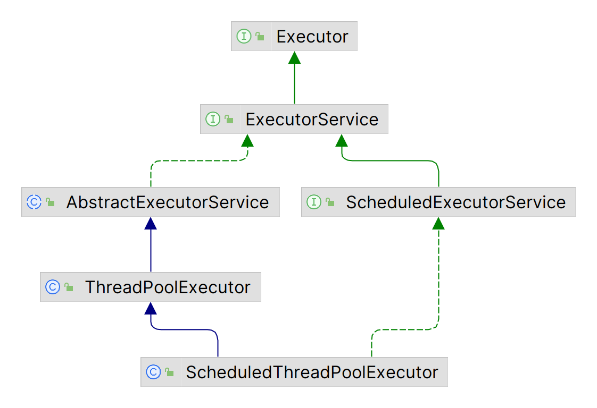

# 线程池 API

2024-03-15
@author Jiawei Mao
***

## 简介

线程池的核心 API 都在 `java.util.concurrent` 包中，类图如下所示：



说明：

- `Executor` 是最基础的执行线程接口；
- `ExecutorService` 接口扩展 `Executor`，添加了 `submit()`, `shutdown()`等管理方法；
- `AbstractExecutorService` 抽象类实现了 `ExecutorService` 接口中的大部分方法；
- `ThreadPoolExecutor` 为线程池的具体实现类；
- `ScheduledExecutorService` 接口扩展了 `ExecutorService` 接口，添加了周期执行功能；
- `ScheduledThreadPoolExecutor` 是 `ScheduledExecutorService` 的具体实现类；
- 另外还有工厂类 `Executors`，提供创建线程池的工厂方法。

## 方法说明


`schedule` 方法有 3 类：

- schedule：在指定时间，运行任务一次；
- scheduleAtFixedRate：固定频率运行任务，即任务开始的时间间隔不变；如果周期太短，任务还没执行到，下一个周期就开始了，此时会等待上一个任务结束，然后立即开始下一个任务；
- scheduleWithFixedDelay：上一次结束和下一次开始中间的 delay 保持不变

## Executor

`Executor` 接口的声明非常简单：

```java
public interface Executor {
    void execute(Runnable command);
}
```

`execute(Runnable)` 用来执行提交的任务。通常使用 `Executor` 来代替显式创建线程。例如，

- 显式创建线程

```java
new Thread(new RunnableTask()).start() 
```

- `Executor` 方式：

```java
Executor executor = anExecutor();
executor.execute(new RunnableTask1());
executor.execute(new RunnableTask2());
```

但是，`Executor` 接口没有要求必须异步执行任务。例如，executor 可以执行在调用者线程中立即执行提交的任务：

```java
class DirectExecutor implements Executor {
    public void execute(Runnable r) {
        r.run();
    }
}
```

当然，更典型的情况，是在任务调用者所在线程之外的线程执行任务。例如，下面的 `Executor` 为每个任务创建一个新的线程：

```java
class ThreadPerTaskExecutor implements Executor {
    public void execute(Runnable r) {
        new Thread(r).start();
    }
}
```

许多 `Executor` 的实现对任务调度方式和时间进行了定制。例如，下面的 executor 将提交的任务序列化到另一个 executor：

```java
class SerialExecutor implements Executor {
    final Queue<Runnable> tasks = new ArrayDeque<>();
    final Executor executor;
    Runnable active;      
    SerialExecutor(Executor executor) {      
        this.executor = executor;    
    }      
    
    public synchronized void execute(Runnable r) {      
        tasks.add(() -> {        
            try {          
                r.run();        
            } finally {          
                scheduleNext();        
            }      
        });      
        if (active == null) {        
            scheduleNext();      
        }    
    }      
    
    protected synchronized void scheduleNext() {      
        if ((active = tasks.poll()) != null) {        
            executor.execute(active);      
        }    
    }  
}
```

在 `java.util.concurrent` 包提供的 `Executor` 实现同时实现了 `ExecutorService` 接口。
## Executors

`ThreadPoolExecutor` 类的使用比较复杂，所以 JDK 提供了工厂类 `Executors` 来创建线程池。 `Executors` 提供了许多创建线程池的静态方法：

| 方法  | 功能   |
| ---- | ------ |
| `newFixedThreadPool` | 创建一个固定大小线程池，每提交一个任务创建一个线程，当到达线程最大数量时，线程池的规模将不再变化 |
| `newCachedThreadPool` | 创建一个可缓存的线程池，当前线程池的规模超出了处理需求，将回收空的线程；当需求增加时，会增加线程数量；线程池规模无限制                    |
| `newSingleThreadPoolExecutor` | 创建只包含一个线程的线程池，如果这个线程异常结束，会创建另一个线程来替代。能确保任务按照在队列中的顺序串行执行 |
| `newScheduledThreadPool`      | 创建一个固定长度的线程池，以延迟或者定时的方式来执行，类似 `Timer`                                                                        |
| `newSingleThreadScheduledExecutor` | 创建一个 `ScheduledExecutorSenrice`，线程池大小为 1 |

不推荐使用上面的方法创建线程池，因为上面的静态方法只是简单的对 `ThreadPoolExecutor` 的构造函数进行封装，使用的参数策略过于简单。

例如：
```java
public static ExecutorService newCachedThreadPool() {
    return new ThreadPoolExecutor(0, Integer.MAX_VALUE,
                                    60L, TimeUnit.SECONDS,
                                    new SynchronousQueue<Runnable>());
}
```
该方法将最大线程数设置为 `Integer.MAX_VALUE`，如果无线的创建线程，可容易抛出 `OutOfMemoryException`。

通过使用 Executor，可以实现各种调优、管理、监视、记录日志、错误报告和其他功能，如果不使用执行框架，要增加这些功能很难。

### newCachedThreadPool

`newCachedThreadPool` 创建的线程池不限制线程数量：

- 当线程池的规模超过了处理需求时，回收空闲线程；
- 当需求增加时，添加新的线程；
- 线程池的规模不存在任何限制。

该线程池适合于包含许多短执行周期任务的情况，每个任务都尽可能在空闲的线程上执行；如果所有线程都在忙，则为新的任务创建新的线程；线程空闲的时间超过一段时间就会被终止。

### newFixedThreadPool

`newFixedThreadPool()` 创建一个固定长度的线程池，每提交一个任务就创建一个线程，直到达到线程池的最大数量，这时线程池的规模不再变化。

如果没有空闲线程，新添加的任务会放在 work-queue 中，直到有空余线程。

该线程池适合于计算量大的任务，或者限制任务消耗的资源。

### newSingleThreadPoolExecutor

`newSingleThreadPoolExecutor` 是一个单线程的 `Executor`。它创建单个 work-thread 执行任务，如果这个线程异常结束，会创建另一个线程补回来。

`newSingleThreadPoolExecutor` 能确保任务在 work-queue 中串行执行，如 FIFO，LIFO 或优先级队列。

### newScheduledThreadPool

`newScheduledThreadPool` 创建一个固定长度的线程池，而且以**延迟或定时**的方式来执行。

