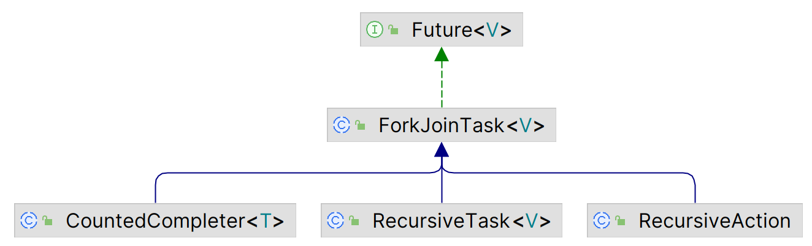

# Fork/Join 简介

2024-03-19
@author Jiawei Mao
## 概述

通常来说，对简单的 Java 并发应用，实现 Runnable 对象，并创建 Thread 执行任务，自己创建、执行和管理线程状态。

Java 5 引入了 `Executor` 和 `ExecutorService` 接口以及对应的实现类 `ThreadPoolExecutor`。`Executor` 将任务的创建和执行分离，只需要实现 `Runnable` 接口创建任务，由 `Executor` 创建、管理和终止线程。

Java 7 提供了另一个 `ExecutorService` 实现，就是 fork/join 框架。fork/join 框架旨在解决可以使用分治法解决的问题。在一个问题中，检查待解决问题的大小，如果它大于设定值，将将其拆分为更小的任务。如下图所示：


没有确切的规则来指导一个任务是否需要继续拆分，具体问题具体分析。可以根据要处理的元素数和执行时间要确定**参考大小**。可以测试不同的大小来选择最适合你问题的参考大小。可以将 ForkJoinPool 看作一个特殊的 Executor。

fork/join 框架基于以下两个操作：

- **fork 操作**：拆分任务，并使用框架执行；
- **join 操作**：合并子任务执行的结果。

fork/join 框架和 `Executor` 的主要区别在于**工作窃取算法**。当一个 task 的 join 操作等待它创建的 subtasks 完成时，执行 task 的线程（worker-thread）会查找其它尚未执行的 task 并执行。这样能够充分利用线程，提供性能。

为了实现该目标，fork/join 框架对任务类型有要求：

- task 只能使用 fork() 和 join() 操作作为同步机制。若使用其它同步机制，worker-thread 在同步时无法执行其它操作。例如，如果在 fork/join 中让一个 task 进入 sleep 状态，执行该 task 的 worker-thread 在 sleep 期间也不会执行其它任务；
- task 不应该执行 I/O 操作；
- task 不能抛出异常。

fork/join 框架的两个主要类：

- `ForkJoinPool`：该类实现 `ExecutorService` 接口和工作窃取算法。它管理 worker-thread，并提供任务状态和执行相关信息；
- `ForkJoinTask`：在 `ForkJoinPool` 中执行的 task 的基类。它提供了执行 `fork()` 和 `join()` 操作，以及控制 task 状态的方法。一般通过扩展 `ForkJoinTask` 的子类实现 fork/join task：
  - `RecursiveAction`：用于无返回值的任务
  - `RecursiveTask`：用于返回一个值的任务
  - `CountedCompleter`：当所有 subtask 完整，触发一个完成动作

该框架提供的大多数特性都包含在 Java 7 中，不过 Java 8 引入了一些额外特性，如包含一个默认的 `ForkJoinPool` 对象，可以通过静态方法 `ForkJoinPool.commonPool()` 获得。这个默认的 fork/join executor 默认线程数为计算机可用处理器数。通过修改系统属性 `java.util.concurrent.ForkJoinPool.common.parallelism` 可以修改默认线程数。parallel-stream 使用该默认 `ForkJoinPool` 。



## 创建 fork/join pool

下面实现一个任务来更新产品列表的价格。初始任务更新列表中的所有元素，使用 10 作为参考大小（ref-size），因此如果一个任务包含的元素超过 10，就将其拆分为两部分，创建两个 tasks。

1. `Product` 保存产品的名称和价格

```java
public class Product {

    private String name;
    private double price;

    public String getName() {
        return name;
    }

    public void setName(String name) {
        this.name = name;
    }

    public double getPrice() {
        return price;
    }

    public void setPrice(double price) {
        this.price = price;
    }
}
```

2. `ProductListGenerator`，生成一组随机 `Product`

```java
public class ProductListGenerator {
    public List<Product> generate(int size) {
        List<Product> ret = new ArrayList<>();
        for (int i = 0; i < size; i++) {
            Product product = new Product();
            product.setName("Product " + i);
            product.setPrice(10);
            ret.add(product);
        }
        return ret;
    }
}
```

3. 任务类，扩展 `RecursiveAction`，即无返回值任务

```java
import java.util.List;
import java.util.concurrent.RecursiveAction;

public class Task extends RecursiveAction {

    private List<Product> products;
    // 指定要处理的元素范围
    private int first;
    private int last;
    // 更新价格比例
    private double increment;

    public Task(List<Product> products, int first, int last,
            double increment) {
        this.products = products;
        this.first = first;
        this.last = last;
        this.increment = increment;
    }

    @Override
    protected void compute() {
        // 下面是 fork-join 任务的典型结构
        // 如果 first 和 last 差别小于 10，更新价格
        if (last - first < 10) {
            updatePrices();
        } else { // 否则，创建子任务
            int middle = (last + first) / 2;
            System.out.printf("Task: Pending tasks:%s\n",
                    getQueuedTaskCount());
            Task t1 = new Task(products, first, middle + 1, increment);
            Task t2 = new Task(products, middle + 1, last, increment);
            // invokeAll 运行这两个子任务
            invokeAll(t1, t2);
        }
    }

    private void updatePrices() {
        for (int i = first; i < last; i++) {
            Product product = products.get(i);
            product.setPrice(product.getPrice() * (1 + increment));
        }
    }
}
```

4. main 类

```java
import java.util.List;
import java.util.concurrent.ForkJoinPool;
import java.util.concurrent.TimeUnit;

public class Main {
    public static void main(String[] args) {
        // 创建 10000 个 products
        ProductListGenerator generator = new ProductListGenerator();
        List<Product> products = generator.generate(10000);
        // 创建 task，更新所有 products 的价格
        Task task = new Task(products, 0, products.size(), 0.20);
        // 创建 ForkJoinPool，默认构造函数，线程数等于处理器数
        ForkJoinPool pool = new ForkJoinPool();
        // 执行任务
        pool.execute(task);
        // 每 5 毫秒查看一个线程池状态
        do {
            System.out.printf("Main: Thread Count:%d\n",
                    pool.getActiveThreadCount());
            System.out.printf("Main: Thread Steal:%d\n",
                    pool.getStealCount());
            System.out.printf("Main: Parallelism:%d\n",
                    pool.getParallelism());
            try {
                TimeUnit.MILLISECONDS.sleep(5);
            } catch (InterruptedException e) {
                e.printStackTrace();
            }
        } while (!task.isDone());
        // 关闭线程池
        pool.shutdown();
        // 使用 isCompletedNormally() 查看任务是否正常完成
        if (task.isCompletedNormally()) {
            System.out.printf("Main: The process has completed normally.\n");
        }
        // 执行完，所有 product 价格应该都是 12
        for (int i = 0; i < products.size(); i++) {
            Product product = products.get(i);
            if (product.getPrice() != 12) {
                System.out.printf("Product %s: %f\n",
                        product.getName(), product.getPrice());
            }
        }
        System.out.println("Main: End of the program.\n");
    }
}
```

```
Main: Thread Count:1
Main: Thread Steal:0
Main: Parallelism:32
...
Main: Thread Count:32
Main: Thread Steal:0
Main: Parallelism:32
...
Main: Thread Count:32
Main: Thread Steal:3
Main: Parallelism:32
...
Main: Thread Count:32
Main: Thread Steal:24
Main: Parallelism:32
...
Main: The process has completed normally.
Main: End of the program.
```

创建子任务：

```java
int middle = (last + first) / 2;
Task t1 = new Task(products, first, middle + 1, increment);
Task t2 = new Task(products, middle + 1, last, increment);
invokeAll(t1, t2);
```

这里调用 `invokeAll` 运行两个 subtasks，task 在继续执行前等待两个 subtasks 完成。在等待过程中，执行该 task 的 worker-thread 获取另一个等待执行的 task 并执行。通过这种方式，fork/join 框架提供了比 `Runnable` 和 `Callable` 更有效的任务管理。

- 在 `Executor` 框架，所有 tasks 都需要发送到 executor 执行，而 `ForkJoinTask` 的 `invokeAll()` 方法之间可以执行子任务。
- 调用 `ForkJoinPool.execute()` 将任务发送到 fork-join 线程池。这是一个异步调用，主线程继续执行。
- 通过 `ForkJoinPool` 的相关方法可以检查正在运行的任务的状态和进展。
- 最后，调用 `ForkJoinPool.shutdown()` 结束线程池。

`ForkJoinPool` 中其它执行任务的方法：

- `execute (Runnable task)`：另一个版本的 `execute()`。将 `Runnable` 发送到 `ForkJoinPool` 执行，`ForkJoinPool` 无法使用任务窃取算法。工作窃取算法必须和 `ForkJoinTask` 搭配使用。
- `invoke(ForkJoinTask<T> task)`：`execute()` 是异步执行，而 `invoke()` 是同步调用，在任务完成后才会返回。
- 也可以使用 `ExecutorService` 中声明的 `invokeAll()` 和 `invokeAny()` 方法。这些方法参数类型为 `Callable`，不支持任务窃取。这类任务用 `ThreadPoolExecutor` 合适。

`ForkJoinTask` 同样提供了多个版本的 `invokeAll()`

- `invokeAll(ForkJoinTask<?>... tasks)`：可变参数，可以传入任意数目的 `ForkJoinTask` 运行。
- `invokeAll(Collection<T> tasks)`：同上，其中泛型参数 `T` 必须是 `ForkJoinTask` 及其子类。

虽然 `ForkJoinPool` 主要用于执行 `ForkJoinTask` 类型任务，但它 也可以直接执行 `Runnable` 和 `Callable` 对象。甚至可以使用 `ForkJoinTask` 的静态方法 `adapt()` 将 `Callable` 或 `Runnable` 对转换为 `ForkJoinTask`，简而言之。`ForkJoinPool` 也可以当作常规线程池使用。

## 参考

- https://www.baeldung.com/java-fork-join
