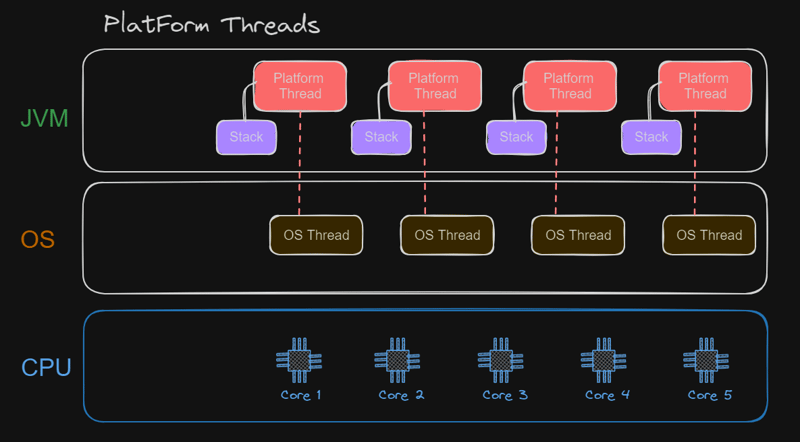

# Java 21 并发

## 简介

Java SE 的并发 API 为高性能多线程工具提供了强大、可扩展的框架，如线程池和阻塞队列。Java 并发 API 包含：

| API                        | 说明                                                         |
| -------------------------- | ------------------------------------------------------------ |
| 虚拟线程（virtual thread） | 虚拟线程是轻量级线程，可以减少编写、维护和调试高吞吐量并发应用的工作量 |
| Structured concurrency     | 结构化并发将在不同线程运行的相关 tasks 作为一个工作 unit，从而简化错误处理和取消，提高可靠性、增强可观察性 |
|                            |                                                              |
|                            |                                                              |
|                            |                                                              |
|                            |                                                              |
|                            |                                                              |
|                            |                                                              |
|                            |                                                              |

## 虚拟线程

虚拟线程是轻量级线程，可以减少编写、维护和调试高吞吐量并发应用的工作量。

线程是可以调度的最小处理单元，对应 `java.lang.Thread` 类。线程有两种：

- 平台线程
- 虚拟线程

### 平台线程

**平台线程**是对系统线程（OS）的简单包装。平台线程在其底层 OS 线程运行 Java 代码，并在整个生命周期持有 OS 线程。因此，平台线程的数量不会超过 OS 线程数。

平台线程很昂贵，它与 OS 线程一一对应，且通常包含一个较大的堆栈空间和其它由 OS 维护的资源。



### 什么是虚拟线程？

和平台线程一样，虚拟线程也是 `java.lang.Thread` 实例。但是，虚拟线程不绑定到特定 OS 线程。虚拟线程仍然在 OS 线程运行代码，但是，当虚拟线程调用 I/O 阻塞操作，Java runtime 会挂起该虚拟线程，此时与挂起的虚拟线程关联的 OS 线程可以执行其它虚拟线程的操作。

虚拟线程的实现方法与虚拟内存类似。为了模拟大量内存，OS 将一个较大的虚拟地址空间映射到有限的 RAM。类似地，为了模拟大量线程，Java runtime 将大量虚拟线程映射到少量 OS 线程。

与平台线程不同，虚拟线程通常有一个浅调用堆栈，只执行一个 HTTP 客户端调用或一个 JDBC 查询。尽管虚拟线程支持线程局部变量和可继承的线程局部变量，但应该慎用，因为单个 JVM 可能支持数百万个虚拟线程。

**虚拟线程**适合运行**大部分时间被阻塞的任务**，如等待 I/O 操作完成。不适合长时间运行的 CPU 密集型任务。

虚拟线程就像堆上分配的任何 Java 对象，可以被 JVM 垃圾回收。虚拟线程的创建非常便宜，可以快速大量创建。

### 为什么使用虚拟线程？

虚拟线程适合高吞吐量的并发应用，特别是包含大量大部分时间在等待的并发任务。服务器就是这类应用，因为它们处理大量 client 请求，这些请求通常执行阻塞 I/O 操作，如获取资源。

虚拟线程**不是更快的线程**，即它们运行代码的速度并不比平台线程快。它们是为了提高吞吐量，而不是速度（延迟）。

### 创建和运行虚拟线程

`Thread` 和 `Thread.Builder` 提供创建平台线程和虚拟线程的 APIs。`java.util.concurrent.Executors` 也提供创建一种 `ExecutorService`，可以为每个 task 启动一个虚拟线程。

#### Thread 创建虚拟线程

`Thread.ofVirtual()` 创建用于创建虚拟线程的 `Thread.Builder` 。

**示例**：创建并启动一个虚拟线程，该线程打印一条消息。调用 `join` 方法以等待虚拟线程终止（从而能够在 main 线程终止之前看到打印的消息）

```java
Thread thread = Thread.ofVirtual()
        .start(() -> System.out.println("Hello"));
thread.join();
```

```
Hello
```

`Thread.Builder` 接口提供创建设置属性创建线程：

- `Thread.Builder.ofPlatform` 子接口创建平台线程
- `Thread.Builder.ofVirttual` 子接口创建虚拟线程

**示例**：使用 `Thread.Builder` 接口创建名为 `MyThread` 的虚拟线程

```java
Thread.Builder.OfVirtual builder = Thread.ofVirtual().name("MyThread");
Runnable task = () -> System.out.println("Running thread");
Thread t = builder.start(task);
System.out.println("Thread t name: " + t.getName());
t.join();
```

```
Thread t name: MyThread
Running thread
```

**示例**：使用 `Thread.Builder` 创建并启动 2 个虚拟线程

```java
Thread.Builder.OfVirtual builder = Thread.ofVirtual().name("worker-", 0);
Runnable task = () -> System.out.println("Thread ID: " + Thread.currentThread().threadId());

// name "worker-0"
Thread t1 = builder.start(task);
t1.join();
System.out.println(t1.getName() + " terminated");

// name "worker-1"
Thread t2 = builder.start(task);
t2.join();
System.out.println(t2.getName() + " terminated");
```

```
Thread ID: 35
worker-0 terminated
Thread ID: 38
worker-1 terminated
```

#### Executors.newVirtualThreadPerTaskExecutor

Executors 将线程的管理、创建于其它部分分离。

**示例**：使用 `Executors.newVirtualThreadPerTaskExecutor()` 创建 `ExecutorService`。

当调用 `ExecutorService.submit(Runnable)`，会创建虚拟线程并执行任务，返回 `Future`。`Future.get()` 会等待任务完成，因此，该示例在虚拟线程的 task 完成时打印一条消息。

```java
try (ExecutorService myExecutor = Executors.newVirtualThreadPerTaskExecutor()) {
    Future<?> future = myExecutor.submit(() -> System.out.println("Running thread"));
    future.get();
    System.out.println("Task completed");
    // ...
} catch (ExecutionException e) {
    throw new RuntimeException(e);
}
```

```
Running thread
Task completed
```


## 参考

- https://docs.oracle.com/en/java/javase/21/core/concurrency.html