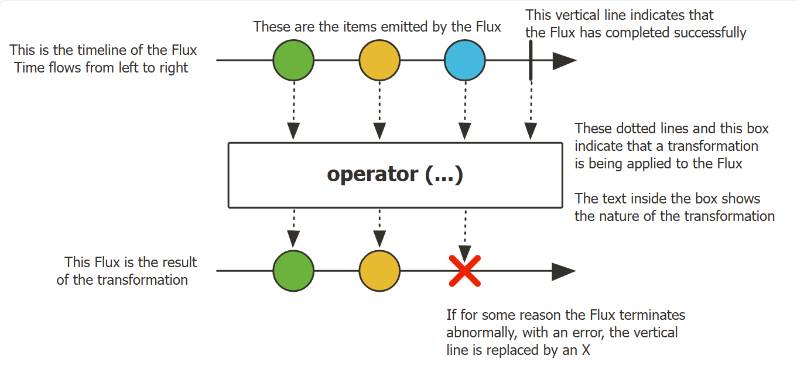

# Reactor

2025-03-12 add: Reactive 编程简介
@author Jiawei Mao

***
## 1. 简介

Reactor 是 JVM 非阻塞 reactive 编程基础，具有高效的需求管理。它直接与 Java 8 函数式 API 集成，尤其是 `CompletableFuture`, `Stream` 和 `Duration`。它提供了可组合的异步序列 API：`Flux` (用于  N 个元素)和 `Mono` (用于 0 或 1 个元素)，比广泛实现 [Reactive Streams](https://www.reactive-streams.org/) 规范。

Reactor 还通过 reactor-netty 项目支持进程间的非阻塞通讯。reactor-netty 适合微服务架构，为 HTTP、TCP 和 UDP 提供 backpressure-ready 网络引擎。

**基本要求**：Reactor 需要 Java 8+。

> [!TIP]
>
> **反压（backpressure）**
>
> 数据流从上游生产者到下游消费者传输过程中，上游生产速度大于下游消费速度，导致下游的 buffer 溢出，这种现象称为出现了 backpressure。

### BOM 和版本

Reactor 3 使用 BOM（Bill of Materials）模型（since reactor-core 3.0.4）。

artifacts 采用版本方案为 `AJOR.MINOR.PATCH-QUALIFIER`，而 BOM 采用 `YYYY.MINOR.PATCH-QUALIFIER`，其中：

- `MAJOR` 为主版本，不同主版本之间有重大变化，可能需要进行迁移；
- `YYYY` 指发行周期的第一个 GA 发行的年份
- `.MINOR` 是从 0 开始的数字，每次增加表示一个新的发行周期：
  - 对项目而言，表示很多变化，有少量的迁移工作
  - 对 BOM 而言，如果有两个 BOM 在同一年首次发布，它用于辨别不同的发布周期
- `.PATCH` 是从 0 开始的数字，用于表示服务周期
- `-QUALIFIER` 是文本识别符，在 GA 版本中忽略

因此，按照该约定第一个发行周期是 `2020.0.x`，名称 `Europium`。采用如下识别符：

- `-M1`..`-M9`：里程碑，一个服务周期不超过 9
- `-RC1`..`-RC9`：发布候选版本，每个服务周期不超过 9
- `-SNAPSHOT`：快照

> [!NOTE]
>
> 快照（snapshot）在上面顺序最高，因为它们通常是每个 `PATCH` 最先预发行版本。

### 安装 Reactor

使用 reactor 的最简单方式是使用 BOM，并将相关依赖项添加到项目中。

- Maven

首先在 pom.xml 中导入 BOM

```xml
<dependencyManagement>
    <dependencies>
        <dependency>
            <groupId>io.projectreactor</groupId>
            <artifactId>reactor-bom</artifactId>
            <version>2024.0.3</version>
            <type>pom</type>
            <scope>import</scope>
        </dependency>
    </dependencies>
</dependencyManagement>
```

然后根据需要添加依赖项，只是不需要指定 `<version>`：

```xml
<dependencies>
    <dependency>
        <groupId>io.projectreactor</groupId>
        <artifactId>reactor-core</artifactId>

    </dependency>
    <dependency>
        <groupId>io.projectreactor</groupId>
        <artifactId>reactor-test</artifactId>
        <scope>test</scope>
    </dependency>
</dependencies>
```

## 2. Reactive 编程简介

Reactor 实现 reactive 编程范式，可以概括为：

> [!NOTE]
>
> reactive 编程是与数据流和变化传播相关的异步编程范式。使用它可以轻松地表达静态或动态数据流。
>
> https://en.wikipedia.org/wiki/Reactive_programming

微软首先在 .NET 中创建了 reactive 扩展库（Rx）。然后 RxJava 在 JVM 中实现 reactive 编程。随着时间推移，Reactive Streams 定义了 JVM 上 reactive 库的一组接口和交互规范。其接口已经集成到 Java 9 的 `Flow` 类。

reactive 编程范式在面向对象语言中通常以 Observer 设计模式实现。可以将 reactive 流模式与迭代器设计模式进行比较，一个主要区别是：迭代器基于 pull，reactive 流基于 push。

迭代器是基于命令的编程模式，由开发人员选择何时访问序列的下一个元素。在 reactive-stream 中，对应 `Publisher`-`Subscriber`。`Publisher` 通知 `Subscriber` 有新元素，这是 reactive 的关键。同样，应用于 push 值的操作也是声明式的，而不是命令式：程序员描述计算的逻辑，而不是描述确切的控制流。

`Publisher` 通过调用 `onNext` 向 `Subscriber` 推送新的值，也可以调用 `onErro` 发送错误，或调用 `onComplete` 表示已完成。错误和完成都终止序列。可以总结为：

```
onNext x 0..N [onError | onComplete]
```

这种方法非常灵活。该模式支持没有值、1 个值或 n 个值。

但是，为什么需要这种异步 reactive 库？

### 阻塞是一种浪费

从广义上讲，改善程序性能的方法有两种：

- 并行（parallelize）：使用更多线程和硬件资源
- 效率（efficiency）：在当前资源的使用上寻求更大的效率

Java 开发人员通常使用阻塞代码编程。这种实践很好，直到有性能瓶颈。然后就需要引入其它线程，运行类似的阻塞代码。这种方式很容易引入数据争用等并发问题。

更重要的是，阻塞会浪费资源。一旦程序涉及延时操作，特别是 I/O、数据库请求或网络调用，就会浪费资源，因为线程会闲置下来等待数据。

因此，并行不是万能药，有必要获得硬件的全部能力。

### 异步

编写异步代码，而非阻塞代码，可以让程序切换到另一个使用相同基础资源的任务，然后在异步处理完成后返回当前任务。

但是，在 JVM 上如何编写异步代码？Java 提供了两种异步编程模式：

- **Callbacks**: 异步方法没有返回值，而是在结果可用时采用额外的 `callback` 参数。如 Swing 的 `EventListener`
- `Future`：异步方法直接返回 `Future<T>`。异步过程计算 `T` 值，`Future` 对象包含对其访问。该值无法立即可用，可以进行轮询直到可用为止。例如，`ExecutorService` 使用 `Future` 对象运行 `Callable<T>` 任务。

两种方法各有局限性。

Callbacks 很难聚合，很容易导致难以阅读和维护的代码，称为 "callback hell"。

例如：在 UI 显示用户的 top-5 favorites，如果没有则显示建议。这涉及 3 个服务：一个给出 favorite IDs, 一个获取 favorite 详细信息，一个提供建议的详细信息。如下：

```java
userService.getFavorites(userId, new Callback<List<String>>() { // ①
  public void onSuccess(List<String> list) { // ②
    if (list.isEmpty()) { // ③
      suggestionService.getSuggestions(new Callback<List<Favorite>>() {
        public void onSuccess(List<Favorite> list) { // ④
          UiUtils.submitOnUiThread(() -> { // ⑤
            list.stream()
                .limit(5)
                .forEach(uiList::show); // ⑥
            });
        }

        public void onError(Throwable error) { // ⑦
          UiUtils.errorPopup(error);
        }
      });
    } else {
      list.stream() // ⑧
          .limit(5)
          .forEach(favId -> favoriteService.getDetails(favId, // ⑨
            new Callback<Favorite>() {
              public void onSuccess(Favorite details) {
                UiUtils.submitOnUiThread(() -> uiList.show(details));
              }

              public void onError(Throwable error) {
                UiUtils.errorPopup(error);
              }
            }
          ));
    }
  }

  public void onError(Throwable error) {
    UiUtils.errorPopup(error);
  }
});
```

1. 使用基于 callback 对的服务：`Callback` 接口，当异步过程成功时调用 `onSuccess`，失败时调用 `onError`
2. 第一个服务使用 favorite ID list 调用其 callback
3. 如果 list 为空，转到 `suggestionService`
4. `suggestionService` 将 `List<Favorite>` 发给第一个 callback
5. 由于是处理 UI，所以要确保在 UI 线程上运行
6. 使用 Java 8 `Stream` 将 suggestions 限制到 5，并在 UI 上显示
7. 弹窗显示错误信息
8. 回到 favorite ID，如果服务返回完整 list，需要转到 `favoriteService` 获取详细的 `Favorite` 对象。只需要 5 个。
9. 再次 callback。这次获得了 5 个 `Favorite` 对象，并在 UI 线程显示。

这么多代码，并且具有重复性的内容。下面是等价的 reactor 实现：

```java
userService.getFavorites(userId) // ①
           .flatMap(favoriteService::getDetails) // ②
           .switchIfEmpty(suggestionService.getSuggestions()) // ③
           .take(5) // ④
           .publishOn(UiUtils.uiThreadScheduler()) // ⑤
           .subscribe(uiList::show, UiUtils::errorPopup); // ⑥
```

1. 从 favorite ID flow 开始
2. 异步将它们转换为 `Favorite` 对象 (`flatMap`)，得到 `Favorite` flow
3. 如果 `Favorite` flow 是空的，则通过 `suggestionService` 切换
4. 获取最多 5 个结果
5. 再 UI 线程依次处理数据
6. 描述数据的最终处理方式，成功则在 UI 列表显示，错误则弹窗显示

如果要确保检索 favorite ID 的时间少于 800 ms，或者（如果需要更长时间）从缓存中获取？在基于 callback 的代码中，这是一个复杂的任务。在 Reactor 中通过 `timeout` 操作符很容易实现：

```java
userService.getFavorites(userId)
           .timeout(Duration.ofMillis(800)) // ①
           .onErrorResume(cacheService.cachedFavoritesFor(userId)) // ②
           .flatMap(favoriteService::getDetails) // ③
           .switchIfEmpty(suggestionService.getSuggestions())
           .take(5)
           .publishOn(UiUtils.uiThreadScheduler())
           .subscribe(uiList::show, UiUtils::errorPopup);
```

1. 如果检索时间超过 800 ms，发出错误
2. 对错误，转到 `cacheService`
3. 余下和上例类似

`Future` 对象比 callback 好点，但是即使有 java 8 引入的 `CompletableFuture`，在组合方面依然表现不佳。将多个 `Future` 对象组合起来是可行的，但是并不容易。另外，`Future` 还有其他问题：

- 调用 `get()` 方法，很容易碰到另一种阻塞情况
- 不支持 lazy 计算
- 不支持多个值和高级错误处理

再举个例子：获得一个 ID list，希望获取名称和统计数据，并配对组合在一起，所有这些异步。下面使用 `CompletableFuture` 实现：

```java
CompletableFuture<List<String>> ids = ifhIds(); // ①

CompletableFuture<List<String>> result = ids.thenComposeAsync(l -> { // ②
	Stream<CompletableFuture<String>> zip =
			l.stream().map(i -> { // ③
				CompletableFuture<String> nameTask = ifhName(i); // ④
				CompletableFuture<Integer> statTask = ifhStat(i); // ⑤

				return nameTask.thenCombineAsync(statTask, (name, stat) -> "Name " + name + " has stats " + stat); // ⑥
			});
	List<CompletableFuture<String>> combinationList = zip.collect(Collectors.toList());// ⑦
	CompletableFuture<String>[] combinationArray = combinationList.toArray(new CompletableFuture[combinationList.size()]);

	CompletableFuture<Void> allDone = CompletableFuture.allOf(combinationArray); // ⑧
	return allDone.thenApply(v -> combinationList.stream()
			.map(CompletableFuture::join) // ⑨
			.collect(Collectors.toList()));
});

List<String> results = result.join(); // ⑩
assertThat(results).contains(
		"Name NameJoe has stats 103",
		"Name NameBart has stats 104",
		"Name NameHenry has stats 105",
		"Name NameNicole has stats 106",
		"Name NameABSLAJNFOAJNFOANFANSF has stats 121");
```

1. 从输出 id-list 的 `Future` 开始
2. 得到 list 后，进行更深入的异步处理
3. 对 list 的每个元素
4. 异步获取关联名称
5. 异步获取统计量
6. 合并两个结果
7. 此时已有代表所有组合任务的 `Future` list，为了执行这些任务，将 list 转换为数组
8. 将数组传递给 `CompletableFuture.allOf`，当所有任务完成，它输出一个完成的 `Future`
9. 比较棘手的是 `allOf` 返回 `CompletableFuture<Void>`，所以这里重新迭代 future-list，使用 `join()`收集结果（这里不会阻塞，因为 `allOf` 确保所有 future 完成）
10. 当所有异步 pipeline 被触发，等待它被处理比国内返回，就可以断言结果。

由于 Reactor 包含许多开箱即用的组合操作符，所以可以简化该过程：

```java
Flux<String> ids = ifhrIds(); // ①

Flux<String> combinations =
		ids.flatMap(id -> { // ②
			Mono<String> nameTask = ifhrName(id); // ③
			Mono<Integer> statTask = ifhrStat(id); // ④

			return nameTask.zipWith(statTask, // ⑤
					(name, stat) -> "Name " + name + " has stats " + stat);
		});

Mono<List<String>> result = combinations.collectList(); // ⑥

List<String> results = result.block();// ⑦
assertThat(results).containsExactly( // ⑧
		"Name NameJoe has stats 103",
		"Name NameBart has stats 104",
		"Name NameHenry has stats 105",
		"Name NameNicole has stats 106",
		"Name NameABSLAJNFOAJNFOANFANSF has stats 121"
);
```

1. 这次，从异步提供的 id 序列 `Flux<String>` 开始
2. 对序列的每个元素异步处理两次（`flatMap` 内部）
3. 获取关联名称
4. 获取关联统计量
5. 异步组合这两个值
6. 当值可用时，将其聚合到 list 中
7. 在生产中，可以继续异步使用 `Flux`，进一步组合或订阅。最有可能的是返回 `Mono` 结果。由于这里处于测试阶段，因此改为阻塞，等待处理完成，直接返回聚合的结果。
8. 断言结果

使用 callback 和 `Future` 的风险是类似的，使用 `Publisher-Subscriber` 的 reactive 编程就是为了解决该问题。

### 从命令式编程到响应式编程

reactive 库（如 Reactor）旨在解决 JVM 中经典异步方法的缺点，同时还关注其它方面：

- 可组合性和可读性
- 数据作为流处理，由丰富的运算符进行操作
- 在订阅前什么都不会发生
- 反压或消费者向生产者发出信号表示生产过快的能力
- 高级但高价值的抽象，与并发无关

#### 可组合性和可读性

可组合性（composability）指能够排列多个异步任务，使前面的任务作为后续任务的输入。或者，可以使用 fork-join 的方式运行多个任务。此外，可以在高级系统中将异步任务作为离散组件重用。

排列任务的能力与代码的可读性和可维护性紧密相关。随着异步进程层数和复杂性的增加，编写和阅读代码变得越来越困难。callback 模型很简单，它的主要缺点是，对复杂的任务，需要从 callback 中调用 callback，而 callback 本身又嵌套在另一个 callback 中，依此类推，这种混乱称为 callback-hell。这样的代码很难回溯和推理。

Reactor 提供了丰富的组合选项，代码反映了抽象过程的排列，并且所有内容通常保持在同一级别（嵌套最小化）。

#### 类比装配线

可以将 reactive 处理数据的过程类比为装配线。原材料从原始 `Publisher` 触发，最终成为成品推动给消费者 `Subscriber`。

原材料可以经过各种转化和其它中间步骤，也可能是为一个大型装配线组装中间零件。如果某一点出现故障或堵塞，受影响的工作者可以向上游发出信号以限制原材料的流动。

#### 操作符

在 Reactor 中，操作符就是装配线中的工作站。每个操作符都会向 `Publisher` 添加行为，并将上一步的 `Publisher` 包装到新的实例。整个 chain 就这样串联起来，数据从第一个 `Publisher` 出发，沿着chain 移动，并被每个 link 进行转换。最终，`Subscriber` 完成整个过程。需要注意，在 `Subscriber` 订阅之前不会执行任何操作。

虽然 Reactive Streams 规范没有指定操作符，但 Reactor 等 reactive 库最大的价值之一就是提供了丰富的操作符。这些操作符覆盖很多方面，从简单的转换到过滤到复杂的排列和错误处理等。

#### subscribe 前不执行

在 Reactor 中，在编写 `Publisher` chain 时，默认一开始不会注入数据。通过订阅操作，将 `Publisher` 和 `Subscriber` 绑定，从而触发整个 chain 的数据流。这是 `Subscriber` 内部发出的 `request` 信号实现，该信号向上传播，直到最初的 `Publisher`。

#### Backpressure

向上传播信号也用于实现反压。

Reactive Streams 规范定义的机制与此机制非常接近：订阅者可以在无界模式下工作，让 source 以最快的速度推送所有数据；或者使用 request 机制向 source 发出信号，表示它只能处理最多 n 个元素。

中间操作符也可以在传输过程中更改请求。例如一个缓冲区操作符将元素分为 10 个一组，如果订阅者请求一个缓冲区，则 source 可以生成 10 个元素。有些操作符还实现了预取策略，从而避免 `request(1)` 往返，如果在请求之前生成元素的成本不高，`request(1)` 是有益的。

这将 push 模型转变为 push-pull 混合模型，下游可以从上游拉取 n 个 元素。但如果这些元素还未准备好，上游会在每次生产时 push  元素。

#### Hot vs Cold

Rx 系列 reactive 库将 reactive 序列分为两类：hot 和 cold。主要区别在于 reactive 流如何响应订阅者：

- **Cold**: cold 序列为每个 `Subscriber` 重新开始，包含数据源。例如，如果 source 包装一个 HTTP 调用，则每个订阅都回发出新的 HTTP 请求。
- **Hot**: hot 序列不会为每个 `Subscriber` 从头开始。后期订阅者会订阅后会收到之前发出的信号。注意，有些 hot reactive stream 可以全部或部分缓存/重新发射。从一般角度看，hot 序列甚至可以在没有订阅者时发出信号。

## 3. Reactor 核心功能

Reactor 项目的主要 artifact 为 reactor-core，这是一个实现 Reactive Streams 规范基于 Java 8 实现的 reactive 库。

Reactor 引入了可组合的 reactive 类型，这些类型实现 `Publisher`，同时提供了丰富的操作符，`Flux` 和 `Mono`：

- `Flux` 对象表示 0 到 N 个元素的 reactive 序列
- `Mono` 对象表示 0 或 1 个元素

这种区别带入一些语义信息，指示异步处理的大致基数。例如，一个 HTTP 请求仅生成一个响应，因此执行 `count` 操作没有意义。因此，将此类 HTTP 调用的结果表示为 `Mono<HttpResponse>` 比表示为 `Flux<HttpResponse>` 更有意义，`Mono` 仅提供与 0 或1 项元素相关的操作符。

更改处理最大基数的操作符会切换到相应类型。例如，如果 `Flux` 中存在 `count` 运算符，它会返回 `Mono<Long>`。

### Flux 

下图展示 `Flux` 如何元素：



`Flux<T>` 是标准的 `Publisher<T>`，表示一个异步序列，可以发出 0 到 N 个元素，然后完成（成功或失败）。与 Reactive Streams 规范一样，这三种类型的信号会转换为对下游订阅者的 `onNext`, `onComplete` 和 `onError` 方法的调用。

由于可能的信号范围很大，所以 `Flux` 是一种通用的 reactive 类型。所有事件（包括终止事件）都是可选的：

- 没有 `onNext` 但有 `onComplete` 事件代表一个空序列，删除 `onComplete` 则得到一个无限空序列（除了测试取消操作，没有其它 用处）
- `Flux.interval(Duration)` 生成一个无限的 `Flux<Long>`，从时钟发出规则的 ticks

### Mono


## 参考

- https://projectreactor.io/docs/core/release/reference/gettingStarted.html