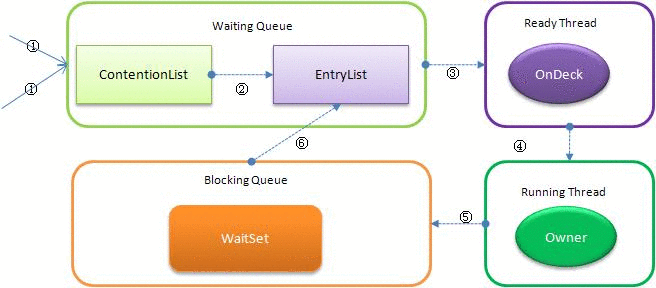

锁用于保护代码不被多个线程同时访问。锁有多种类型：内部锁、互斥锁、分离锁、闭锁、顺序锁、读写锁、独占锁、分拆锁、重入锁。

**临界区(critical section)**, 在任何时候只能在一个线程中执行的一段代码。

同步可以分为两种：

1) 控制同步，一个任务依赖于另一个任务，一个任务没完成，另一个任务不能开始。
2) 数据访问同步，多个线程可以访问一个共享变量，再任意时候，只有一个任务可以访问该变量。

但是，同步引入了线程争用(thread contention) 问题，即当两个或多个线程同时访问一个资源时，导致多个线程运行缓慢，甚至暂停执行。

锁和条件

- 锁用来保护代码片段，任何时刻只能有一个线程执行被保护的代码。
- 锁可以管理试图进入被保护代码段的线程。
- 锁可以用于一个或多个相关的条件对象。
- 每个条件对象管理那些已经进入被保护的代码段但不能运行的线程。

使用建议

- 最好既不使用 Lock/Condition也不使用 synchronized 关键字。许多时候，可以使用 java.util.concurrent 包中的一种机制。
- 如果synchronized 关键字适合你的程序，请尽量使用。

Java 锁机制

- `synchronized` 在修改代码块的时候需要一个引用对象作为锁的对象；
- 在修饰方法的时候，默认是当前对象作为锁的对象；
- 在修饰类的时候，默认是当前类的 Class 对象作为锁的对象。

## 方法锁

> 通过在方法声明中引入 `synchronized` 关键字来声明 `synchronized` 方法。

## synchronized 实现方案

`synchronized` 是最简单的锁定方案。`synchronized` 定义了一个完整的方法或代码块为临界区，通过方法或代码块的互斥性来完成实际上的一个原子操作，即被 `synchronized` 关键字声明的对象，只允许一个执行线程访问。（方法或代码块在被一个线程调用时，其他线程处于等待状态）在 Sun 的 HotSpot JVM 实现中，`synchronized` 锁还被称为**对象监视器**。

注意 `synchronized` 锁住的是堆里的对象，而非栈里的对象引用。

对象锁（方法锁）和类锁有所不同。

对象锁，针对一个对象，它在该对象的某个内存位置声明 一个标志位用于标识该对象是否拥有锁，所以它只会锁住当前的对象。一般一个对象锁是对一个非静态成员变量进行 `synchronized` 修饰，或者对一个非静态方法进行 `synchronized` 修饰，对于对象锁，不同对象访问同一个被 `synchronized` 修饰的方法的时候不会阻塞。

类锁是锁住整个类，当有多个线程

所有的Java对象都有一个与 `synchronzied` 关联的对象监视器（monitor），允许线程在该对象监视器上进行加锁和解锁操作。

- **静态方法**，Java类对应的Class类的对象所关联的监视器对象，锁住 Class 实例，因为 Class 的相关数据存储在永久带，因此静态方法锁相当于类的全局锁。
- 当 synchronized 的静态方法被一个线程访问，其它线程可以访问该对象的非静态方法。如果静态和非静态方法改变了相同的数据，会出现数据不一致的错误。
- **实例方法**，当前对象实例所关联的监视器对象，锁住对象实例。
- **代码块**，代码块声明中的对象所关联的监视器对象。

synchronized 比较简单，语义比较明确，尽管 `Lock` 推出后性能有比较大的提升，但是`synchronized` 使用还是很广泛，其应用层的含义是把任意一个非 NULL 的对象当做锁。

> 注：当锁被释放，对共享变量的修改会写入主存；当获得锁，CPU缓存中的内容被置为无效。编译器在处理 synchronized 方法或代码块，不会把其中包含的代码移动到 `synchronized` 方法或代码块之外，从而避免了由于代码重排而造成的问题。

`synchronized` 关键字会降低应用程序的性能，因此应该只在并发需要修改共享数据的方法中使用它。所以使用 `synchronized` 关键字，应该使临界区尽可能小。

当使用 synchronized 关键字保护代码块时，需要将对象引用作为参数传入。通常使用 this 引用执行方法所属的对象，也可以使用其他的对象，一般来说，这些对象就是为了该目的而创建。

获得锁的流程
当多个线程一起访问某个对象监视器时，对象监视器会将这些请求存储在不同的容器中。(获得锁的流程)

1) Contention List: 竞争队列，所有请求锁的线程首先被放在这个竞争的队列中；
2) Entry List: Content List 中那些有资格成为候选资源的线程被移动到 Entry List 中；
3) Wait Set: 那些调用 wait 方法被阻塞的线程被放置在这里；
4) OnDeck: 任意时刻，最多只有一个线程正在竞争锁资源，该线程被称为 OnDeck;
5) Owner: 当前已经获得锁资源的线程被称为 Owner;
6) !Owner: 当前释放锁的线程

关系图如下：



`ContentionList` 并不是真正意义上的一个队列，仅仅是一个虚拟队列，它只有Node以及对应的Next指针，并没有Queue的数据结构。每次新加入的 `Node` 会在队头进行，通过CAS改变第一个节点为新增节点，同时新增阶段的next指向后续节点，而取数据都在队列尾部进行。

每次从队列的尾部取出一个数据用于锁竞争候选者（OnDeck），但是并发情况下，ContentionList会被大量的并发线程进行CAS访问，为了降低对尾部元素的竞争，JVM会将一部分线程移动到EntryList中作为候选竞争线程。Owner线程会在unlock时，将ContentionList中的部分线程迁移到EntryList中，并指定EntryList中的某个线程为OnDeck线程（一般是最先进去的那个线程）。Owner线程并不直接把锁传递给OnDeck线程，而是把锁竞争的权利交个OnDeck，OnDeck需要重新竞争锁。这样虽然牺牲了一些公平性，但是能极大的提升系统的吞吐量，在JVM中，也把这种选择行为称之为“竞争切换”。

OnDeck线程获取到锁资源后会变为Owner线程，而没有得到锁资源的仍然停留在EntryList中。如果Owner线程被wait方法阻塞，则转移到WaitSet队列中，直到某个时刻通过notify或者notifyAll唤醒，会重新进去EntryList中。

处于ContentionList、EntryList、WaitSet中的线程都处于阻塞状态，该阻塞是由操作系统来完成的。该线程被阻塞后则进入内核调度状态，会导致系统在用户和内核之间进行来回切换，严重影响锁的性能。为了缓解上述性能问题，JVM引入了自旋锁。原理非常简单，如果Owner线程能在很短时间内释放锁资源，那么那些等待竞争锁的线程可以稍微等一等（自旋）而不是立即阻塞，当Owner线程释放锁后可立即获取锁，进而避免用户线程和内核的切换。但是Owner可能执行的时间会超过设定的阈值，争用线程在一定时间内还是获取不到锁，这是争用线程会停止自旋进入阻塞状态。基本思路就是先自旋等待一段时间看能否成功获取，如果不成功再执行阻塞，尽可能的减少阻塞的可能性，这对于占用锁时间比较短的代码块来说性能能大幅度的提升！

但是有个头大的问题，何为自旋？其实就是执行几个空方法，稍微等一等，也许是一段时间的循环，也许是几行空的汇编指令，其目的是为了占着CPU的资源不释放，等到获取到锁立即进行处理。但是如何去选择自旋的执行时间呢？如果自旋执行时间太长，会有大量的线程处于自旋状态占用CPU资源，进而会影响整体系统的性能。因此自旋的周期选的额外重要！

Synchronized在线程进入ContentionList时，等待的线程就通过自旋先获取锁，如果获取不到就进入ContentionList，这明显对于已经进入队列的线程是不公平的，还有一个不公平的事情就是自旋获取锁的线程还可能直接抢占OnDeck线程的锁资源。

在JVM6以后还引入了一种偏向锁，主要用于解决无竞争下面锁的性能问题。我们首先来看没有这个会有什么样子的问题。

现在基本上所有的锁都是可重入的，即已经获取锁的线程可以多次锁定/解锁监视对象，但是按照之前JVM的设计，每次加锁解锁都采用CAS操作，而CAS会引发本地延迟（下面会讲原因），因此偏向锁希望线程一旦获取到监视对象后，之后让监视对象偏向这个锁，进而避免多次CAS操作，说白了就是设置了一个变量，发现是这个线程过来的就避免再走加锁解锁流程。

# wait/notify

## `wait` 与 `notify/notifyAll` 方法必须在同步代码块中使用

`wait` 与 `notify/notifyAll` 是 `Object` 类的方法，在执行这些方法时，需要先获得锁。

## volatile

volatile 关键字使一个变量在多个线程间可见。

A,B 线程都用到一个变量，java 默认是 A 线程中保留一份 copy，这样如果 B 线程修改了该变量，则A线程未必直到。

使用 volatile 关键字，会让所有线程都会读到变量的修改值。

即 `volatile` 关键字修改的变量值改变时，会通知使用该变量的线程，使用新的值。

volatile 关键字是一个弱同步机制，将变量的更新通知给其它线程。

volatile 的效率比 `synchronized` 高很多。

例如：

```java
public class T2
{
    /*volatile*/ boolean running = true;

    void m()
    {
        System.out.println("m start");
        while (running) {

        }
        System.out.println("m end");
    }

    public static void main(String[] args)
    {
        T2 t = new T2();
        new Thread(t::m, "t1").start();

        try {
            TimeUnit.SECONDS.sleep(1);
        } catch (InterruptedException e) {
            e.printStackTrace();
        }
        t.running = false;
    }
}
```

`m()` 方法中是一个死循环，要结束其循环，必须将 `running` 设置为 false。

不过 `volatile` 不能保证多个线程共同修改 `running` 变量时所带来的不一致问题，即 `volatile` 不能替代 `synchronized`。`volatile` 只保证可见性，而 `synchronized` 即保证了可见性，又保证了原子性。

例如：

```java
public class T3
{
    volatile int count = 0;

    void m()
    {
        for (int i = 0; i < 10_000; i++)
            count++;
    }

    public static void main(String[] args)
    {
        T3 t = new T3();
        List<Thread> threadList = new ArrayList<>();
        for (int i = 0; i < 10; i++) {
            threadList.add(new Thread(t::m, "thread-" + i));
        }
        threadList.forEach(Thread::start);

        threadList.forEach(thread -> {
            try {
                thread.join();
            } catch (InterruptedException e) {
                e.printStackTrace();
            }
        });

        System.out.println(t.count);
    }
}
```

理想情况 `count` 值为100,000，即10个线程各增加10,000，然而输出的count远小于 100,000，因为 `volatile` 不能保证多个线程共同修改 `running` 变量所带来的不一致问题。

如果将上面的 `count` 该为 `AtomicInteger`，或者用 `synchronized` 方法，就可以解决该问题。