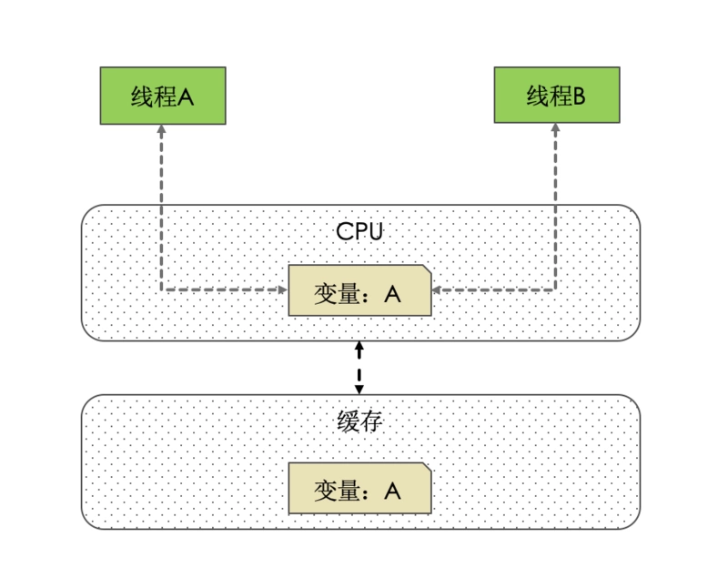
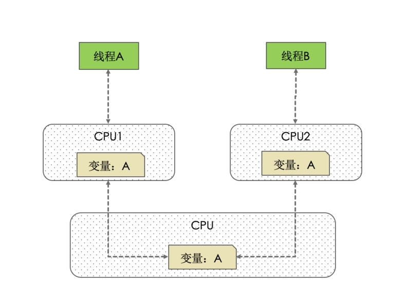
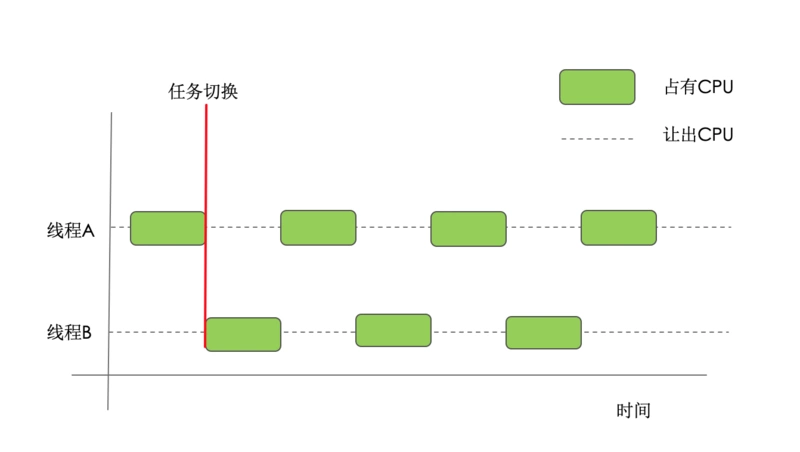
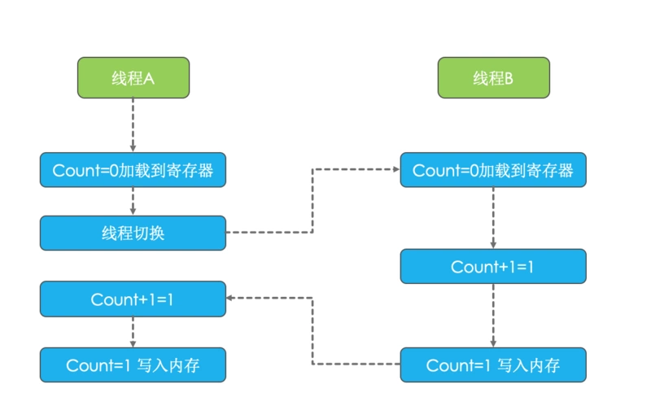
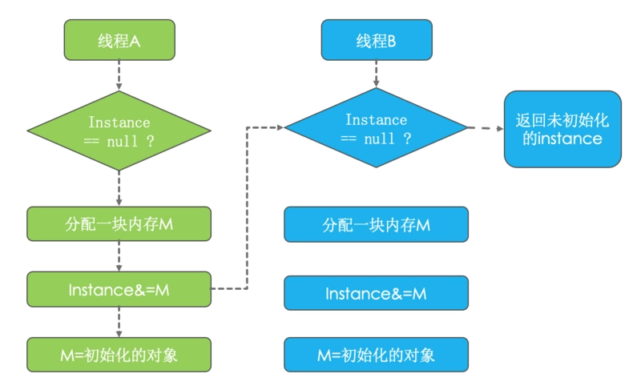

# 内存模型

- [内存模型](#内存模型)
  - [内存结构](#内存结构)
    - [多级缓存](#多级缓存)
    - [多线程](#多线程)
  - [缓存一致性问题](#缓存一致性问题)
  - [线程切换导致的原子性问题](#线程切换导致的原子性问题)
  - [处理器优化和指令重排](#处理器优化和指令重排)
  - [解决方法](#解决方法)
    - [volatile](#volatile)
    - [Happens-Before 原则](#happens-before-原则)
  - [参考](#参考)

2020-09-12, 14:52
@jiawei
***

## 内存结构

现代计算机不同硬件的运行速度差异很大：

```txt
CPU > 缓存 > I/O
```

计算机在执行程序的时候，程序指令在CPU中执行，而执行的时候，又免不了要和数据打交道，而数据存放在主存当中，即计算机的物理内存（硬盘）。

随着CPU技术的发展，CPU的执行速度越来越快。而内存的技术并没有太大变化，所以从内存中读写数据的过程和CPU的执行速度比差距很大,这就导致CPU每次操作内存都要等待很多时间。

### 多级缓存

为了解决该问题，人们在CPU和内存之间增加了高速缓存。缓存即复制一份数据拷贝。他的特点是速度快，内存小，并且昂贵。

此时程序的执行过程就变成：**程序运行时，将运算所需的数据从主存复制一份到 CPU 的高速缓存中，CPU 计算时直接从它的高速缓存读写数据，当运算结束后，再将高速缓存中的数据刷新到主存**。

随着CPU能力的不断提升，一层缓存渐渐的无法满足要求，于是衍生出**多级缓存**。按照数据读取顺序和与CPU结合的紧密程度，CPU缓存可以分为一级缓存（L1），二级缓存（L3），部分高端CPU还具有三级缓存（L3），每一级缓存中所储存的全部数据都是下一级缓存的一部分。

这三种缓存的技术难度和制造成本是相对递减的，所以其容量也是相对递增的。

在有了多级缓存后，程序的执行就变成了：**当CPU要读取一个数据时，首先从一级缓存中查找，如果没有找到再从二级缓存中查找，如果还是没有就从三级缓存或内存中查找**。

单核 CPU 只含有一套L1，L2，L3缓存；多核CPU的每个核心都含有一套L1（甚至和L2）缓存，而共享L3（或者和L2）缓存。

### 多线程

随着计算机能力不断提升，操作系统增加了进程和线程，以充分利用 CPU，在等待 I/O 操作时可以切换执行程序。那么问题就来了，我们来分别分析下单线程、多线程在单核CPU、多核CPU中的影响。

- 单线程。CPU 核心的缓存只被一个线程访问。缓存独占，不会出现访问冲突等问题。
- 单核CPU，多线程。进程中的多个线程会同时访问进程中的共享数据，CPU将某块内存加载到缓存后，不同线程在访问相同的物理地址的时候，都会映射到相同的缓存位置，这样即使发生线程的切换，缓存仍然不会失效。但由于任何时刻只能有一个线程在执行，因此不会出现缓存访问冲突。
- 多核CPU，多线程。每个核都至少有一个 L1 缓存。多个线程访问进程中的某个共享内存，且这多个线程分别在不同的核心上执行，则每个核心都会在各自的caehe中保留一份共享内存的缓冲。由于多核是可以并行的，可能会出现多个线程同时写各自的缓存的情况，而各自的cache之间的数据就有可能不同。

在CPU和主存之间增加缓存，在多线程场景下就可能存在**缓存一致性问题**，也就是说，在多核CPU中，每个核自己的缓存中对同一个数据缓存的内容可能不一致。

## 缓存一致性问题

单核 CPU 和缓存之间的关系：



单核情况，也就是最简单的情况，线程 A 操作写入变量 A，这个变量 A 的值对线程 B 可见。因为连个个线程在同一个 CPU 上操作，所用的也是同一个 CPU 的缓存。

> 一个线程对共享变量的修改，另一个线程能立刻看到，称为可见性。

对多核 CPU：



此时每个 CPU 都有自己的高速缓存，所以变量 A 在不同 CPU 中可能不同步，导致值不一致。

如果线程 A 刚好只操作 CPU1 的缓存，而线程 B 正好只操作了 CPU2 的缓存，此时，线程 A 操作变量 A 的时候，对线程 B 不可见。这就是经典的内存不一致错误。

## 线程切换导致的原子性问题

线程切换最早是为了提高 CPU 利用率而出现的。比如，50 毫秒操作系统会重新选择一个进程来执行（任务切换），50毫秒就是一个时间片：



早期的操作系统是进程间的切换，进程间的内存是不共享的，切换需要切换内存映射地址，因此成本很大。

而一个进程创建的所有线程，内存空间都是共享的，不存在切换内存映射地址问题，所以现在的操作系统都是基于更轻量级的线程实现切换。

任务切换大多数在“时间片”结束的时候进行。

现在我们使用的基本都是高级语言，高级语言的一条语句对应多条 CPU 指令，比如 `count += 1` 对应至少 3 条 CPU 指令：

1. 从内存加载 count 值到CPU的寄存器
2. 在寄存器执行 +1
3. 将结果写回内存（缓存机制导致可能写入的是CPU缓存，而不是内存）

操作系统在做任务切换时，可能会在任意一条 CPU 指令执行完切换，这样就会出问题，如下所示：



线程 A 刚执行完初始化 `count=0` 时，切换到了线程 B，线程 B 执行 `count+1=1`并写入缓存，CPU 切换回线程 A，线程 A 执行 `count+1=1` 并再次写入缓存，最后缓存中的结果为 1.

> 一个或多个操作在 CPU 执行过程中不被中断的特性称为**原子性**。

显然 `count += 1` 这个操作不是原子操作。

CPU 能够保证的原子性，是 CPU 指令级别的，在编程语言层面，需要额外的语言特性保证操作的原子性。

## 处理器优化和指令重排

上面提到在在CPU和主存之间增加缓存，在多线程场景下会存在缓存一致性问题。除了这种情况，还有一种硬件问题也比较重要。为了使处理器内部的运算单元能够尽可能的被充分利用，处理器可能会对输入代码进行乱序执行处理。这就是处理器优化。

除了现在很多流行的处理器会对代码进行优化乱序处理，很多编程语言的编译器也会有类似的优化，比如Java虚拟机的即时编译器（JIT）也会做指令重排。

可想而知，如果任由处理器优化和编译器对指令重排的话，就可能导致各种各样的问题。

程序按照代码的先后顺序执行，但是编译器为了优化性能，有时候会改变程序中语句的先后顺序，例如 `a=6; b=7;`，编译器优化后可能变成 `b=7; a=6;`，对该情况，语句的顺序不影响程序的最终结果，但是有时候编译器的优化可能导致意想不到的 bug。

例如，双重检查创建单例对象的例子：

```java
public class Singleton{

    private static Singleton instance;

    public static Singleton getInstance()
    {
        if (instance == null) {
            synchronized (Singleton.class) {
                if (instance == null) {
                    instance = new Singleton();
                }
            }
        }
        return instance;
    }
}
```

看似完美的代码，其实也有问题，在 `new` 上：

`new` 的基本步骤：

1. 分配一块内存 M
2. 在内存 M 在初始化对象
3. 把内存 M 的地址赋值的变量

实际上编译后的顺序可能是：

1. 分配一块内存 M
2. 把内存 M 的地赋值的变量
3. 在内存 M 上初始化对象



如图所示，当线程 A 执行第二步的时候，被线程切换了，此时 `instance` 未初始化实例的对象，而线程 B 这时候执行到 `instance==null`，发现 instance 已经有值了，导致返回了一个空的对象异常。

## 解决方法

上面提到的缓存一致性问题、处理器器优化的指令重排问题是硬件的不断升级导致的。那么，有没有什么机制可以很好的解决上面的这些问题呢？

最简单直接的做法就是废除处理器和处理器的优化技术、废除CPU缓存，让CPU直接和主存交互。但是，这么做虽然可以保证多线程下的并发问题。但是，这就有点因噎废食了。

所以，为了保证并发编程中可以满足原子性、可见性及有序性。有一个重要的概念，那就是**内存模型**。

为了保证共享内存的正确性（可见性、有序性、原子性），内存模型定义了**共享内存系统中多线程程序读写操作行为的规范**。通过这些规则来规范对内存的读写操作，从而保证指令执行的正确性。它与处理器、缓存、并发、编译器均相关，解决了CPU多级缓存、处理器优化、指令重排等导致的内存访问问题，保证了并发场景下的一致性、原子性和有序性。

内存模型解决并发问题主要采用两种方式：限制处理器优化和使用内存屏障。

Java 内存模型规范了 JVM 如何按需禁用缓存和编译优化的方法。

### volatile

`volatile` 关键是不是 Java 特有的，C 语言也有，其原始含义表示禁用 CPU 缓存。

例如，我们声明一个 `volatile` 变量 `volatile int x = 0;`，相当于告诉编译器，对这个变量的读写，不使用 CPU 缓存，必须从内存中读取或写入。

### Happens-Before 原则

Happens-Before 定义：前面操作的结果对后续操作是可见的。

Happens-Before 约束编译器行为，即允许编译器优化，但是要求优化后依然遵守 Happens-Before 原则。

Java 内存模型定义的 Happens-Before 原则：

- 程序的顺序性原则

指在一个线程中，程序按照 Happens-Before 执行。在单线程中比较好理解，程序前面对某变量的操作对后续操作是可见的。

- volatile 变量规则

对 volatile 变量的写操作，Happens-Before 后续对这个变量的读操作。

- 传递性

即 A Happens-Before B，且 B Happens-Before C，则 A Happens-Before C。

如下所示：

```java
class VolatileDemo{

    int x = 0;
    

}
```

## 参考

- [成长之路-博客](https://segmentfault.com/a/1190000018563584)
