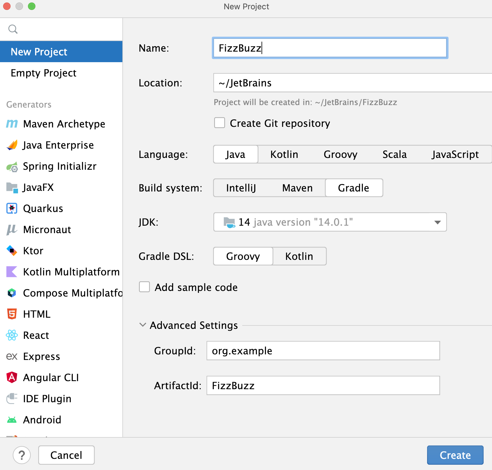

# IDEA Gradle 插件

## 查看 IDEA 兼容的 Gradle 版本

打开 IDEA 安装目录下的 `plugins\gradle\lib`，可以看到兼容的 gradle 版本。

## Gradle 教程

创建 Gradle 项目，运行并测试，使用 Gradle 执行 JAR 文件。

### 1. 创建项目

1. 点击 New Project

2. 设置项目名称 FizzBuzz 和位置
3. 选择语言 Java 和编译工具 Gradle
4. 