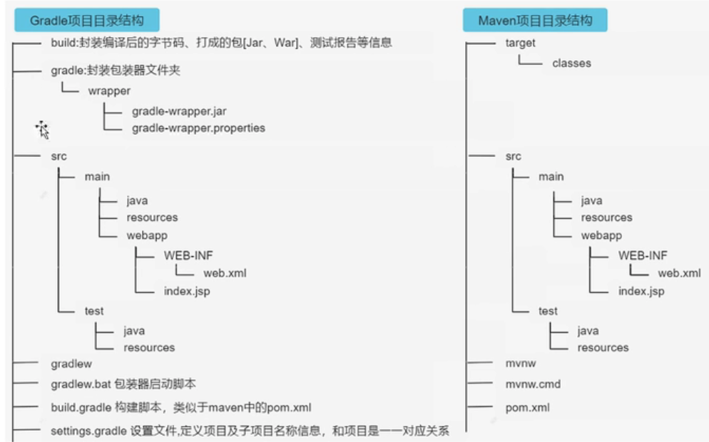

# Gradle 快速入门

## Gradle 项目目录结构

Gradle 项目默认目录结构和 Maven 项目的目录结构一致：

必需目录：build, src, build.gradle, settings.gradle

- gradlew 执行的指定 wrapper 版本中的 gradle 指令，不是本地安装的 Gradle
- 一个项目只有一个 settings.gradle 文件，哪怕有多个子项目
- build.gradle 与包对应，每个包一个 build.gradle 文件

