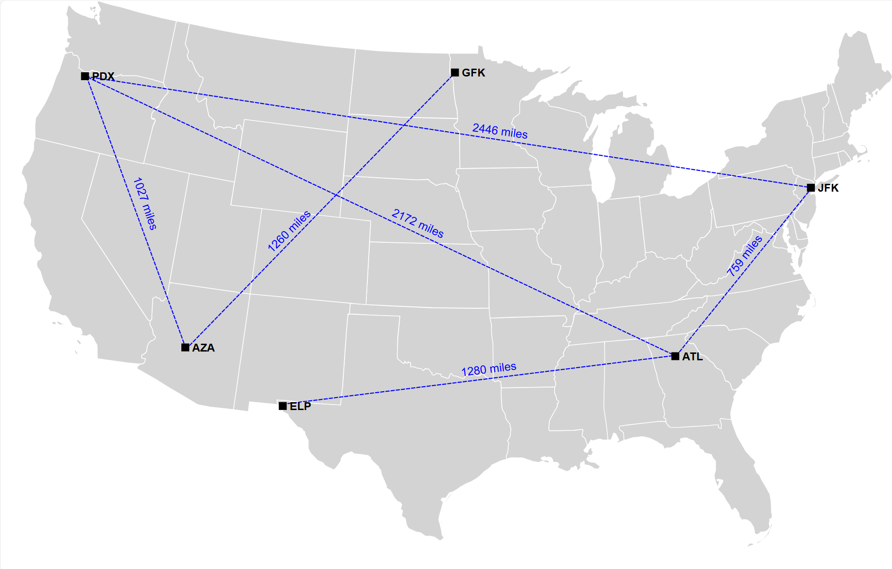

# Graph

## 简介

Guava 的 `common.graph` 提供了图数据结构。

## 定义

graph 包含：

- node，也称为 vertices
- edges，也称为 links

directed edge, 具有 source 和 target。

`common.graph` 不支持同时包含 directed 和 undirected edges。

示例：

```java
graph.addEdge(nodeU, nodeV, edgeUV);
```

- `nodeU` 和 `nodeV` 互为 adjacent (相邻)
- `edgeUV` 与 `nodeU` 和 `nodeV` 关联

如果 graph 有向：

- `nodeU` 为 `nodeV` 的 **predecessor** 
- `nodeV` 为 `nodeU` 的 **successor** 
- `edgeUV` 为 `nodeU` 的出边（outgoing）
- `edgeUV` 为 `nodeV` 的入边（incoming）
- `nodeU` 为 edgeUV 的 source
- nodeV 为 edgeUV 的 target

如果 graph 无向：

- nodeU 为 nodeV 的 predecessor and a successor
- nodeV 为 nodeU 的 predecessor and a successor
- edgeUV 同时为 nodeU 的入边和出边
- edgeUV 同时为 nodeV 的入边和出边

**self-loop** 指 edge 的两个端点连接到同一个 node。如果 self-loop 有向，那么它是 node 的入边和出边，node 是 edge 的 source 和 target。

如果两个 edge 以相同的顺序连接相同的 nodes，则它们平行（parallel）；如果它们以相反的顺序连接相同的 nodes，则它们反平行（antiparallel）。显然，无向 edge 不可能反平行。

示例：

```java
directedGraph.addEdge(nodeU, nodeV, edgeUV_a);
directedGraph.addEdge(nodeU, nodeV, edgeUV_b);
directedGraph.addEdge(nodeV, nodeU, edgeVU);

undirectedGraph.addEdge(nodeU, nodeV, edgeUV_a);
undirectedGraph.addEdge(nodeU, nodeV, edgeUV_b);
undirectedGraph.addEdge(nodeV, nodeU, edgeVU);
```

在 `directedGraph`，`edgeUV_a` 和 `edgeUV_b` 平行，且它们都与 `edgeVU` 反平行。

在 `undirectedGraph`，`edgeUV_a`, `edgeUV_b` 和 `edgeVU` 互相平行。

## 功能

`common.graph` 主要提供 graph 的接口和类。不支持 I/OP 和可视化等功能。

`common.graph` 支持如下 graph 类型：

- directed graph
- undirected graph
- nodes 和 edges 关联值（weights, labels）
- self-loop
- parallel edges (包含 parallel edge 的 graph 又称为 multigraph)
- 支持 nodes/edges 的 insertion-ordered, sorted, unordered

## Graph 类型

`common.graph` 提供了三个顶层接口表示  graph:

- `Graph`
- `ValueGraph`
- `Network`

### ValueGraph

`ValueGraph` 包含 `Graph` 所有与 node 相关的方法，并增加了查询指定 edge 值的方法。

`ValueGraph` 的 edge 都有一个用于指定的值。

`ValueGraph` 提供了一个 `asGraph()` 方法，它返回 `ValueGraph` 的 `Graph` 视图，从而可以调用在 Graph 上操作的方法。

示例：`ValueGraph<Airport, Distance>`，edge 的值表示两个 `Airport` 之间的距离。



## 创建 Graph

`common.graph` 提供的实现类不是 public，而是采用 `Builder` 类创建。获得 `Builder` 的方式有两种：

- 


## Mutable 和 Immutable graph

### Mutable 类型

每个 graph 都有一个对应的 `Mutable*` 子类型：

- `MutableGraph`
- `MutableValueGraph`
- `MutableNetwork`

这些子类型定义了修改方法：

- 添加和删除 nodes
  - `addNode(node)` 和 `removeNode(node)`
- 添加和删除 edges
  - `MutableGraph`
    - `putEdge(nodeU, nodeV)`
    - `removeEdge(nodeU, nodeV)`
  - `MutableValueGraph`
    - `putEdgeValue(nodeU, nodeV, value)`
    - `removeEdge(nodeU, nodeV)`
  - `MutableNetwork`
    - `addEdge(nodeU, nodeV, edge)`
    - `removeEdge(edge)`

Guava 特意将可变方法拆分为子类型，是为了鼓励防御性编程。如果你的代码只检查或遍历 graph，而不是修改它，则应该将其输入指定为 Graph, ValueGraph 或 Network，而不是 mutable 的子类型。

由于 `Graph` 等都是接口，虽然它们不包含 mutable 方法，但是将该接口提供为 caller 并不能保证 caller 不会修改它，对实际类型为 `Mutable` 的子类型，caller 可以将其 cast 为子类型。如果不希望 caller 修改 Graph，应该使用 `Immutable` 实现。

### Immutable 类型

每个 graph 类型都有对应的 `Immutable` 实现。这些类类似于 Guava 的 `ImmutableSet`, `ImmutableList`, `ImmutableMap` 等，构造后就不能修改，并且内部使用高效的 immutable 数据结构。

创建 ImmutableGraph 实例的方法有两种：

- 使用 GraphBuilder

```java
ImmutableGraph<Country> immutableGraph1 =
    GraphBuilder.undirected()
        .<Country>immutable()
        .putEdge(FRANCE, GERMANY)
        .putEdge(FRANCE, BELGIUM)
        .putEdge(GERMANY, BELGIUM)
        .addNode(ICELAND)
        .build();
```

- 使用 `ImmutableGraph.copyOf()`

```java
ImmutableGraph<Integer> immutableGraph2 = ImmutableGraph.copyOf(otherGraph);
```

immutable graph 能保证稳定的 incident-edge 顺序：

- 如果使用 `GraphBuilder`，其 incident-edge 顺序与插入顺序一致；
- `copyOf`，与复制过程 edge 的访问顺序一致。

#### 特点

`Immutable` 类型能确保：

- shallow-immutable: 不能添加、删除或替换元素（这些类没有实现 `Mutable` 接口）；
- deterministic iteration: 迭代顺序与输入 graph 保持一致；
- thread safety: 多线程访问安全；
- integrity: 不能在此包外部继承。

将这些 `Immutable*` 视为接口，而不是实现。

## 遍历

`Traverser` 类提供对简单 graph 类结构的 BFS 和 DFS 遍历方法，包括但不限于 `common.graph` 的 graph 类型。

例如，在文件系统中查找问及那。将所有文件放入 in-memory graph 不切实际，`Traverser` 提供了函数接口来实现：

```java
Iterable<Path> iterable =
    Traverser.<Path>forTree(
            // 实现 SuccessorsFunction 的 lambda 函数
		    // 返回指定 node 的下一个 node
            path -> path.isDirectory() ? path.listFiles() : ImmutableList.of())
        .breadthFirst(Path.ROOT); // BFS

stream(iterable).filter(path -> containsText(path, query)).findFirst();
```

其中 DFS 提供了两个方法：

- depthFirstPreOrder：最先访问的放在前面

- depthFirstPostOrder: 最先访问的放在最后

  


## 示例

1. 是否包含 node

```java
graph.nodes().contains(node);
```

2. u 和 v 之间是否有 edge

对无向图，下面参数 u 和 v 的顺序无所谓。


