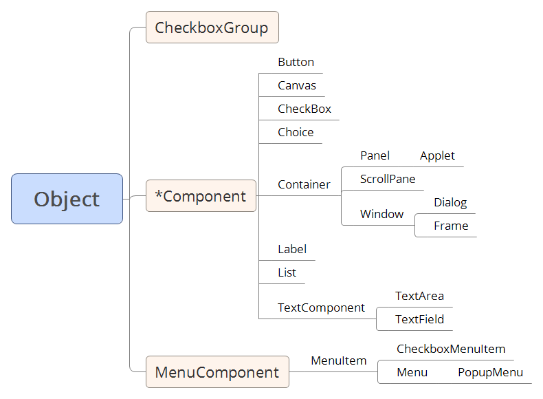
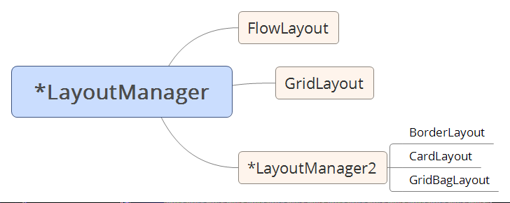

# TOC
- [TOC](#toc)
- [简介](#%e7%ae%80%e4%bb%8b)
- [AWT](#awt)
- [Swing](#swing)
- [SWT](#swt)

# 简介
AWT/Swing 和 SWT/JFace 分属两种不同的体系，采取了不同的技术路线。
- AWT作为Java语言的第一个GUI类库包，是最早的一个基础库。
- Swing 以 AWT为基础进行了改造，其组件更加强大、美观，但速度比AWT慢。
- SWT是IBM开发的基于 JNI 本地调用的GUI库，与 Windows 风格类似。
- Jface 是对 SWT 的 MVC 模式的实现。

MVC (Model, View, Controller的缩写)，MVC 模式是为了实现Web系统的职能分工。Model层实现系统中的业务逻辑，通常可以用JavaBean或EJB来实现。View 层用于与用户的交互，通常用JSP来实现。Controller层是Model与View之间沟通的桥梁，它可以分派用户的请求并选择恰当的视图用于显示，同时它也可以解释用户的输入并将它们映射为模型层可执行的操作。

轻量级原件的缺点是执行速度慢，优点是可以在所有平台上采用统一的行为。

Swing在AWT的基础上很好地解决了跨平台感官不一的问题，并且提供了比 AWT 更为丰富的组件(AWT连树形控件、表格控件都没有)和更强大的功能，但却过于复杂，并且速度较慢。

SWT具有比AWT更为丰富的空间，比Swing更为快捷的速度。它使用本地的方法创建应用界面，实现的界面拥有与操作系统相同的感官效果。与 AWT 和 Swing 纯Java特色的界面相比，此处的界面真正实现了跟随系统而变化的特点。

SWT缺点主要有两点：不是Java语言标准，某些平台不支持。

SWT Designer的Eclipse插件，使用该插件可以像采用Visual Studio .NET 开发Window图形用户界面一样简单，可以采用可视化拖拽的方式进行。现在是 WindowsBuilder，同时支持 Swing, SWT。

JFace基于 SWT 提供了一个MVC的抽象层，隐藏了底层的开发接口细节。要在当前项目中引用JFace的类，必须在当前项目的classpath中添加JFace的类包。JFace基于SWT实现了更高级的GUI组件。

# AWT
Abstract Windows Toolkit (AWT)优点：
- AWT在 Java 技术的每个版本都是标准配置；
- AWT非常稳定；
- 它通常可以对GUI组件自动进行销毁。你几乎不需要对组件进行销毁处理。(高级组件例外，如对话框和Frame)。
- AWT组件是线程安全的，即不需要关心在应用程序中哪一个线程对GUI进行了更新。这个特性可以减少很多GUI更新的问题，不过使用AWT GUI运行的速度更慢了。
- AWT让我们能以 top-down 或 bottom-up 或以任意组合顺序来构建GUI。即可以先创建容器再创建子组件、也可以先创建子创建。

AWT提供有效的GUI组件、布局管理器和事件。

**AWT 类图**

**AWT 布局管理器**

通常对AWT来说(也适用于Swing和SWT)，每个事件类型都有一个相关的 `xxListener` 接口，用来将事件传递给处理程序。应用程序会为自己感兴趣处理的事件源进行注册。

由于AWT依赖于主机GUI的对等体(peer)控件，因此无法做到 write once, run everywhere。

# Swing
Swing 是解决 AWT 缺点的一个尝试，为了克服在不同主机上行为会不同的缺点，Swing 将对主机控件的依赖性降至最低。Swing 只为诸如窗口和框架之类的顶层组件使用对等体。大部分组件(`JComponent` 及其子类)都使用纯 Java 代码模拟。

Swing 称基于对等体的组件为重量级(heavy weight)；对模拟的组件称为轻量级(light weight)。Swing 支持在一个 GUI 中混合使用重量级组件和轻量级组件，但是如果组件产生了重叠，就必须注意绘制这些控件的顺序。

Swing 重要特点：
- 模型与视图和空间分离： 对于这个模型中的所有控件(如按钮、列表、树等)来说，模型和控件是分离的。
- 可编程外观：每个组件的外观都是由一个单独的、可动态替换的实现来进行控制。
- 呈现器和编辑器：大部分显示模型内容的组件，如列表、表和树，都可以处理几乎所有类型的模型元素。
- 可访问性：即创建残疾人可访问的GUI
- Swing 也支持GUI组件自动销毁
- Swing 组件不是线程安全的。

# SWT
和 AWT 概念相比，SWT是一个低级的GUI工具包。`JFace` 是一组用来简化使用 SWT 构建 GUI 的增强组件和工具服务。SWT 的构建者从 AWT 和 Swing 实现中学习了很多经验，他们试图构建一个集二者优点于一体而没有二者的缺点的系统。从很多方面来说，他们已经成功了。

SWT 也是基于对等体实现的，在这一点上它与 AWT 非常类似。它克服了 AWT 所面临的 LCD 的问题，方法如下：定义了一组控件，它们可以用来构建大部分办公应用程序或开发者工具，然后可以按照逐个主机的原则，为特定主机所没有提供的控件创建模拟控件（这与 Swing 类似）。对于大部分现代主机来说，几乎所有的控件都是基于本地对等体的。这意味着基于 SWT 的 GUI 既具有主机外观，又具有主机的性能。这样就避免了使用 AWT 和 Swing 而引起的大部分问题。特定的主机具有一些低级功能控件，因此 SWT 提供了扩充（通常是模拟的）版本（通常使用 “C” 作为名字中的第一个字母），从而可以产生更一致的行为。

在对等体工作方式上，SWT 与 AWT 不同。在 SWT 中，对等体只是主机控件上的一些封装程序而已。在 AWT 中，对等体可以提供服务来最小化主机之间的差异（就是在这里，AWT 碰到了很多行为不一致的问题）。这意味着 SWT 应用程序实际上就是一个主机应用程序，它必然会全部继承主机的优点和缺点。这还意味着 SWT 不能完全实现 WORE 的目标；它更像是一种 WOTE 解决方案。这就是说，SWT 尽管不如 Swing 那么优秀，但是它在创建可移植解决方案方面是很杰出的。
