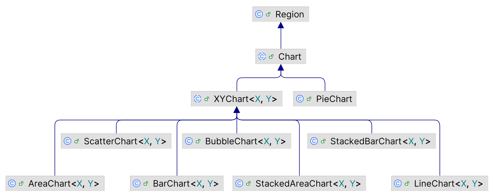
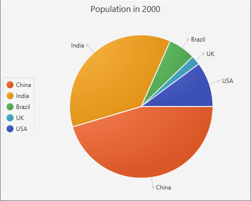
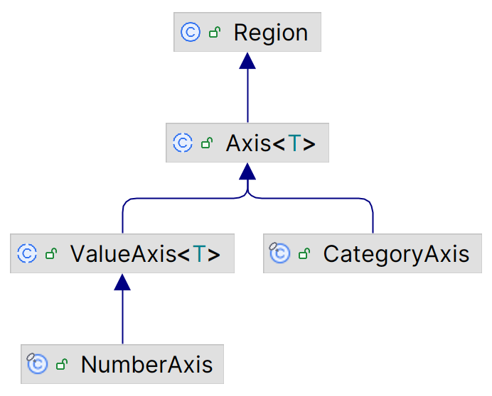
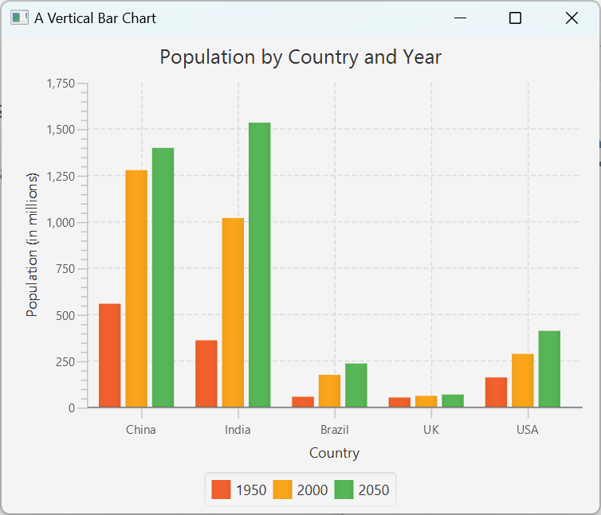
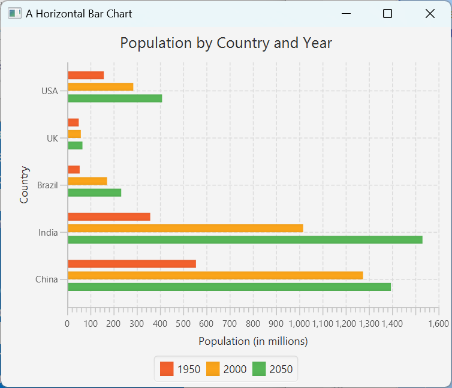
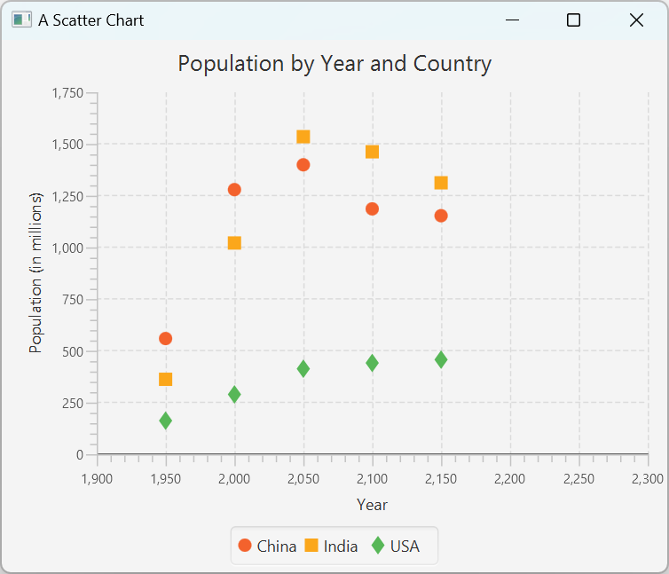
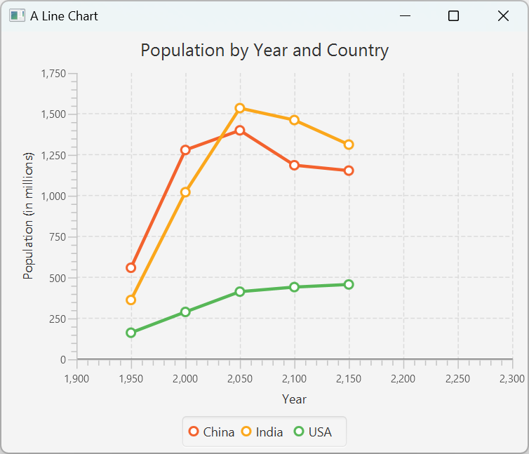
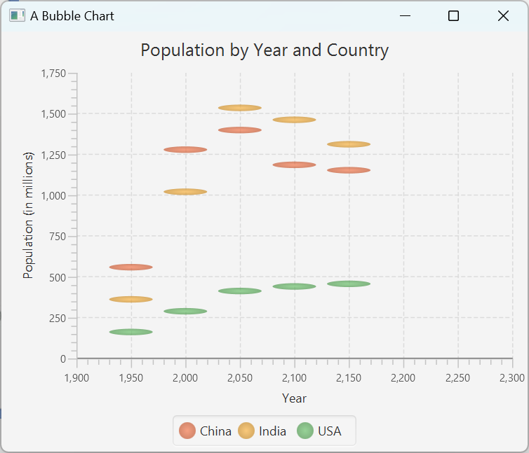
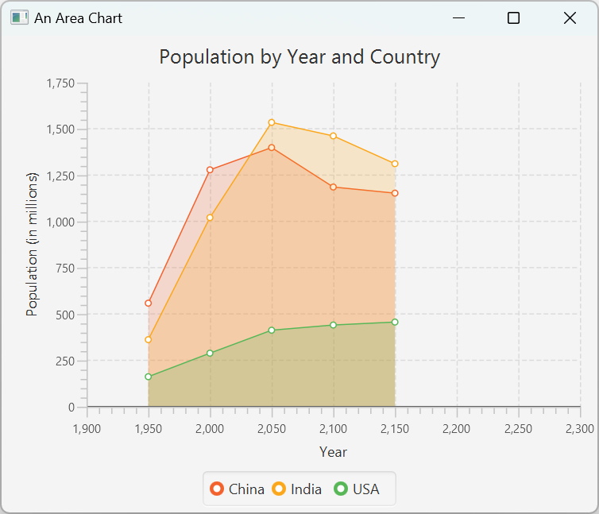
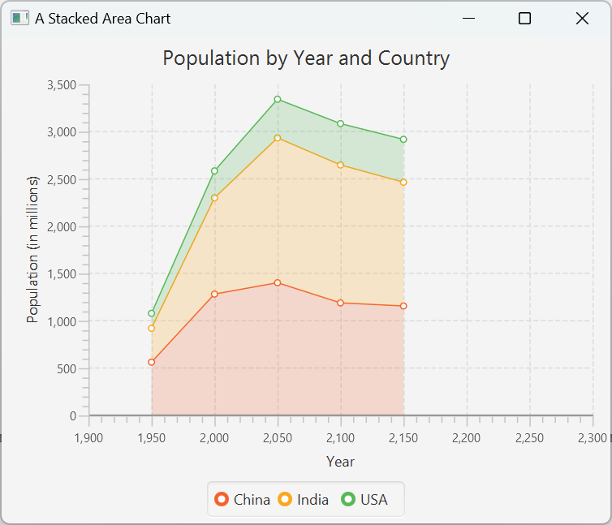

# JavaFX Chart 入门

2023-06-01
@author Jiawei Mao
***
## 概述

JavaFX Chart API 定义在 `javafx.scene.chart` 包中，JavaFX 支持的图表类型如下所示：



抽象类 `Chart` 是所有 chart 的基类。Chart 可以添加到 scene graph，且支持 CSS 个性化。`Chart` 包含所有图表共有的属性和方法。

JavaFX 将图表分为两类：

- 不包含坐标轴，如 `PieChart`
- 包含 x-轴和 y-轴，如 `XYChart`

每个 Chart 至少包含三部分：

- title
- legend
- content

不同类型的 chart 定义数据方式不同，下面是所有 `Chart` 的共同属性。

|属性|说明|
|---|---|
|title|标题|
|titleSide|标题位置，默认上方，可用值 `Side` enum: TOP, RIGHT, BOTTOM, LEFT|
|legend|图例|
|legendSide|指定 legend 位置|
|`legendVisible`|legend 可见性|
|animated|动画效果，default=True|

chart 对不同类型的数据通常使用不同符号表示。legend 列出不同类型数据的符号和描述。`legend` 是 `Node` 类型，指定 chart 的图例，默认在 chart 下方。`legendSide` 属性指定 legend 位置。

`legendVisible` 属性指定 legend 是否可见，默认可见。

`animated` 属性指定 chart 内容变化是否以动画形式显示，默认 `true`。

### 数据

在定义 chart 的数据模型时，必须区分包含 Axis 和不包含 Axis 的 chart。

`XYChart` 是所有包含两个坐标轴 chart 的超类，使用 `XYChart.Data` 指定这类 chart 的数据模型：

- `xValue` 属性对应 x 轴
- `yValue` 属性对应 y 轴
- 还可以设置一个 `extraValue` 属性，可用于任何目的，比如用于 bubble-chart 的半径


与 axis chart 不同，pie-chart 不需要定义 x 值和 y 值。pie-chart 有专门的 `PieChart.Data` 定义数据。

## CSS

`Chart` 类定义所有 chart 的共有属性，其 CSS 类名为 `chart`。

例如，定义所有 chart 的 `legendSide`, `legendVisible` 和 `titleSide` 属性： 

```css
.chart {
    -fx-legend-side: top;
    -fx-legend-visible: true;
    -fx-title-side: bottom;
}
```

chart 有两个子类：

- chart-title
- chart-content

`chart-title` 为 `Label` 类型，`chart-content` 为 `Pane` 类型。

示例：设置所有 charts 的背景为 yellow, title 字体为 Arial 16px bold

```css
.chart-content{
    -fx-background-color:  yellow;
}
.chart-title{
    -fx-font-family: "Arial";
    -fx-font-size: 16px;
    -fx-font-weight: bold;
}
```


### Legend

legend 的默认类名为 `chart-legend`。

示例：设置 legend 背景为 light-gray

```css
.chart-legend{
    -fx-background-color: lightgray;
}
```

每个 legend 有两个子结构：

- `chart-legend-item`, `Label` 类型，指定 legend 文本
- `chart-legend-item-symbol`, `Node` 类型，指定 legend 的图标，默认为圆

示例：设置 legend 的字体，并将图标设置为箭头

```css
.chart-legend-item{
    -fx-font-size: 16px;
}
.chart-legend-item-symbol{
    -fx-shape: "M0 -3.5 v7 l 4 -3.5z"
}
```

## PieChart

饼图是一个分成不同扇区的圆，每个扇区的面积（或）代表数据量的大小。

通过 `PieChart` 类创建饼图。该类包含两个构造函数：

- `PieChart()`
- `PieChart(ObservableList<PieChart.Data> data)`

创建过程很简单，为 `PieChart` 指定数据，然后添加到面板中即可。

```java
PieChart()
PieChart(ObservableList<PieChart.Data> data)
```

两个构造函数，差别在于是否指定数据。

饼图的扇区用 `PieChart.Data` 类表示。每个扇区包含名字和数值，对应 `PieChart.Data` 的 `name` 和 `pieValue` 属性。例如，创建一个扇区，名称为 "China"，数值为 1275：

```java
PieChart.Data chinaSlice = new PieChart.Data("China", 1275);
```

饼图的数据类型为 `ObservableList<PieChart.Data>`。例如，创建包含三个数据的饼图：

```java
ObservableList<PieChart.Data> chartData = FXCollections.observableArrayList();

chartData.add(new PieChart.Data("China", 1275));
chartData.add(new PieChart.Data("India", 1017));
chartData.add(new PieChart.Data("Brazil", 172));
```

然后使用构造函数创建饼图：

```java
PieChart charts = new PieChart(chartData);
```

**示例**：使用饼图显示 2000 年五个国家的人口数

```java
import javafx.application.Application;
import javafx.collections.FXCollections;
import javafx.collections.ObservableList;
import javafx.geometry.Side;
import javafx.scene.Scene;
import javafx.scene.chart.PieChart;
import javafx.scene.layout.StackPane;
import javafx.stage.Stage;

public class PieChartTest extends Application {
    public static void main(String[] args) {
        Application.launch(args);
    }

    @Override
    public void start(Stage stage) {
        PieChart chart = new PieChart();
        chart.setTitle("Population in 2000");

        // legend 放左侧
        chart.setLegendSide(Side.LEFT);

        // Set the data for the chart
        ObservableList<PieChart.Data> chartData = FXCollections.observableArrayList();
        chartData.add(new PieChart.Data("China", 1275));
        chartData.add(new PieChart.Data("India", 1017));
        chartData.add(new PieChart.Data("Brazil", 172));
        chartData.add(new PieChart.Data("UK", 59));
        chartData.add(new PieChart.Data("USA", 285));

        chart.setData(chartData);

        StackPane root = new StackPane(chart);
        Scene scene = new Scene(root);

        stage.setScene(scene);
        stage.setTitle("A Pie Chart");
        stage.show();
    }
}
```


### PieChart 属性

|PieChart 属性|说明|
|---|---|
|data|指定数据，类型为 `ObservableList<PieChart.Data>`|
|`startAngle`|第一个 pie slice 起始角度，默认 0，对应三点钟方向；`startAngle` 为正数表示逆时针方向计算，例如 90° 表示从 12 点钟位置开始|
|clockwise|从 startAngle，顺时针或逆时针排列 slices，true 表示顺时针，默认为 true|
|`labelsVisible`|slice labels 是否可见，label 在 slice 附近显示，通过 `PieChart.Data` 指定|
|labelLineLength|label 和对应 slice 连线的长度，默认 20.0 px|

PieChart 默认包含标签和 legend。
`PieChart.Data` 包括数据名称和数值，其标签为数据名称。


### 自定义 Slice

每个 pie-slice 由 `Node` 表示，通过 `PieChart.Data` 的 `getNode()` 获得其引用。不过该 `Node` 在对应的 slice 添加到 pie chart 后才创建，所以提前调用返回 null。

示例：为每个 slice 设置 tooltip，tool-tip 显示鼠标下数据的信息：

- slice name
- pie value
- percent pie value

`addSliceTooltip()` 方法中包含访问 slice-nodes 以及添加 tool-tips 的逻辑。

```java
import javafx.application.Application;
import javafx.collections.FXCollections;
import javafx.collections.ObservableList;
import javafx.geometry.Side;
import javafx.scene.Node;
import javafx.scene.Scene;
import javafx.scene.chart.PieChart;
import javafx.scene.control.Tooltip;
import javafx.scene.layout.StackPane;
import javafx.stage.Stage;

public class PieChartEx4_slice extends Application {

    @Override
    public void start(Stage stage) {
        PieChart chart = new PieChart();
        chart.setTitle("Population in 2000");

        chart.setLegendSide(Side.LEFT);

        ObservableList<PieChart.Data> data = FXCollections.observableArrayList();
        data.add(new PieChart.Data("China", 1275));
        data.add(new PieChart.Data("India", 1017));
        data.add(new PieChart.Data("Brazil", 172));
        data.add(new PieChart.Data("UK", 59));
        data.add(new PieChart.Data("USA", 285));
        chart.setData(data);

        // Add a Tooltip to all pie slices
        this.addSliceTooltip(chart);
        StackPane root = new StackPane(chart);
        Scene scene = new Scene(root);
        stage.setScene(scene);
        stage.setTitle("Customizing Pie Slices");
        stage.show();
    }

    private void addSliceTooltip(PieChart chart) {
        double totalPieValue = 0.0;
        for (PieChart.Data d : chart.getData()) {
            totalPieValue += d.getPieValue();
        }
        // Add a tooltip to all pie slices
        for (PieChart.Data d : chart.getData()) {
            Node sliceNode = d.getNode();
            double pieValue = d.getPieValue();
            double percentPieValue = (pieValue / totalPieValue) * 100;
            // Create and install a Tooltip for the slice
            String msg = d.getName() + "=" + pieValue + " (" + String.format("%.2f", percentPieValue) + "%)";
            Tooltip tt = new Tooltip(msg);
            tt.setStyle("-fx-background-color: yellow;" + "-fx-text-fill: black;");
            Tooltip.install(sliceNode, tt);
        }
    }

    public static void main(String[] args) {
        launch(args);
    }
}
```


### PieChart CSS

除了 `data` 属性，`PieChart` 的其它属性都可以由 CSS 定义。如：

```css
.chart{
	-fx.clockwise: false;
	-fx-pie-label-visible: true;
	-fx-label-line-length: 10;
	-fx-start-angle: 90;
}
```

pie-slice 有 4 个样式类：

- `chart-pie`, 
- `data<i>`, 
- `default-color<j>`
- `negative`

`<i>` 为 slice-index，如第一个 slice 对应 `data0`，第二个为 `date1`，依此类推。

`<j>` 为 series-index，在 pie chart，可以将每个 slice 看作一个 series。默认 CSS （Modena.css）定义了 8 种颜色，如果 pie slice 超过 8 个，则循环使用颜色。

当某个 slice 的数据为负数，则具有 `negative` 样式类。

需要应用于所有 pie slices 的样式，在 `chart-pie` 中定义。例如，下面将所有 pie slices 的边框设为白色，添加 2px 的背景内边距（inset）。这样两个 slice 之间的距离更宽：

```css
.chart-pie {
	-fx-border-color: white;
	-fx-background-insets: 2;
}
```

可以使用如下方式为每个 pie-slices 设置颜色：

```css
.chart-pie.default-color0 {-fx-pie-color: red;}
.chart-pie.default-color1 {-fx-pie-color: green;}
.chart-pie.default-color2 {-fx-pie-color: blue;}
.chart-pie.default-color3 {-fx-pie-color: yellow;}
.chart-pie.default-color4 {-fx-pie-color: tan;}
```

这里只定义了 5 个，后面的采用默认颜色。

#### 更多颜色

如果 pie-chart 的 slice 超过 8 个，且不希望颜色重复，可以在 CSS 中定义余下的颜色，例如：

```css
/* additional_series_colors.css */
.chart-pie.default-color8 {
	-fx-pie-color: gold;
}
.chart-pie.default-color9 {
	-fx-pie-color: khaki;
}
```

**该方法也可用于其它的图表类型**。

pie-slices 和 legend-symbols 被分配的类名样式为 default-color0, default-color1, ... default-color7。

下面演示如何设置颜色：

```java
import javafx.application.Application;
import javafx.collections.FXCollections;
import javafx.collections.ObservableList;
import javafx.geometry.Side;
import javafx.scene.Node;
import javafx.scene.Scene;
import javafx.scene.chart.PieChart;
import javafx.scene.layout.StackPane;
import javafx.stage.Stage;

public class PieChartExtraColor extends Application {
    public static void main(String[] args) {
        Application.launch(args);
    }

    @Override
    public void start(Stage stage) {
        PieChart chart = new PieChart();
        chart.setTitle("Population in 2000");

        chart.setLegendSide(Side.LEFT);

        ObservableList<PieChart.Data> data = FXCollections.observableArrayList();
        data.add(new PieChart.Data("China", 1275));
        data.add(new PieChart.Data("India", 1017));
        data.add(new PieChart.Data("Brazil", 172));
        data.add(new PieChart.Data("UK", 59));
        data.add(new PieChart.Data("USA", 285));
        data.add(new PieChart.Data("Bangladesh", 138));
        data.add(new PieChart.Data("Egypt", 68));
        data.add(new PieChart.Data("France", 59));
        data.add(new PieChart.Data("Germany", 82));
        data.add(new PieChart.Data("Indonesia", 212));

        chart.setData(data);

        StackPane root = new StackPane(chart);
        Scene scene = new Scene(root);

        scene.getStylesheets().add(PieChartExtraColor.class.getResource("additional_series_colors.css").toExternalForm());
        stage.setScene(scene);
        stage.setTitle("A Pie Chart with over 8 Slices");
        stage.show();

        // Override the default series color style class-name for slices over 8.
        // Works only when you set it after the scene is visible
        this.setSeriesColorStyles(chart);
    }

    // 以下是关键内容
    private void setSeriesColorStyles(PieChart chart) {
        ObservableList<PieChart.Data> chartData = chart.getData();
        int size = chartData.size();
        for (int i = 8; i < size; i++) {
            String removedStyle = "default-color" + (i % 8);
            String addedStyle = "default-color" + (i % size);

            // Reset the pie slice colors
            Node node = chartData.get(i).getNode();
            node.getStyleClass().remove(removedStyle);
            node.getStyleClass().add(addedStyle);

            // Reset the legend colors
            String styleClass = ".pie-legend-symbol.data" + i +
                    ".default-color" + (i % 8);
            Node legendNode = chart.lookup(styleClass);
            if (legendNode != null) {
                legendNode.getStyleClass().remove(removedStyle);
                legendNode.getStyleClass().add(addedStyle);
            }
        }
    }
}
```


#### pie-slice 背景图片

可以使用 CSS 设置 pie-slice 的背景图片：

```css
.chart-pie.data0 {
	-fx-background-image: url("china_flag.jpg");
}
```

下面的pie_slice.css 文件定义了一些 pie-slice 的 background-image，legend-symbol-size 以及连接 pie-slice 和 label 的线段的长度。

```css
// pie_slice.css
/* Set a background image for pie slices */
.chart-pie.data0 {-fx-background-image: url("china_flag.jpg");}
.chart-pie.data1 {-fx-background-image: url("india_flag.jpg");}
.chart-pie.data2 {-fx-background-image: url("brazil_flag.jpg");}
.chart-pie.data3 {-fx-background-image: url("uk_flag.jpg");}
.chart-pie.data4 {-fx-background-image: url("usa_flag.jpg");}

/* Set the preferred size for legend symbols */
.chart-legend-item-symbol {
    -fx-pref-width: 100;
    -fx-pref-height: 30;
}
.chart {
	-fx-label-line-length: 10;
}
```

**示例**：使用 pie_slice.css 个性化 PieChart

```java
import javafx.application.Application;
import javafx.collections.FXCollections;
import javafx.collections.ObservableList;
import javafx.geometry.Side;
import javafx.scene.Scene;
import javafx.scene.chart.PieChart;
import javafx.scene.layout.StackPane;
import javafx.stage.Stage;

public class PieChartCustomSlice extends Application {
    public static void main(String[] args) {
        Application.launch(args);
    }

    @Override
    public void start(Stage stage) {
        PieChart chart = new PieChart();
        chart.setTitle("Population in 2000");

        chart.setLegendSide(Side.LEFT);

        ObservableList<PieChart.Data> data = FXCollections.observableArrayList();
        data.add(new PieChart.Data("China", 1275));
        data.add(new PieChart.Data("India", 1017));
        data.add(new PieChart.Data("Brazil", 172));
        data.add(new PieChart.Data("UK", 59));
        data.add(new PieChart.Data("USA", 285));
        chart.setData(data);

        StackPane root = new StackPane(chart);
        Scene scene = new Scene(root);

        scene.getStylesheets().addAll(PieChartCustomSlice.class
                .getResource("pie_slice.css").toExternalForm());

        stage.setScene(scene);
        stage.setTitle("Custom Pie Slices");
        stage.show();
    }
}
```


#### symbol

`pie-legend-symbol`

legend 里的每一项都有样式类 `pie-legend-symbol` 加上对应的`data`，例如 `pie-legend-symbol.data0.default-color1` 表示第一个数据的第二种颜色。

### 事件处理
虽然 pie chart slice 不是 `Node` 对象，但是每个 `PieChart.Data` 对象都可以关联一个 `Node` ，可用于事件处理。

**示例**：为 pie-chart 的每个 slice 添加 `MOUSE_PRESSED` 事件处理

```java
final Label caption = new Label("");
caption.setTextFill(Color.DARKORANGE);
caption.setStyle("-fx-font: 24 arial;");

for (final PieChart.Data data : chart.getData()) {
    data.getNode().addEventHandler(MouseEvent.MOUSE_PRESSED,
        new EventHandler<MouseEvent>() {
            @Override public void handle(MouseEvent e) {
                caption.setTranslateX(e.getSceneX());
                caption.setTranslateY(e.getSceneY());
                caption.setText(String.valueOf(data.getPieValue()) + "%");
             }
        });
}
```

> [!TIP]
>
> 没有反复创建 `Label` 的开销。


## XYChart

`XYChart<X.Y>` 定义包含两个坐标轴的 chart。泛型参数 `X` 和 `Y` 分别定义 x-axis 和 y-axis 的数据类型。

### 添加数据

`XYChart` 中的数据包含 $(x,y)$ 坐标。`XYChart` 的数据保存在 `ObservableList` 类型的命名 series 中，每个 series 包含多个数据。如何渲染数据点取决于图表类型。例如，散点图将数据点渲染为 symbol，而条形图将其渲染为一个 bar。

#### XYChart.Data

数据点由 `XYChart.Data<X,Y>` 定义，包含如下属性：

- `XValue`, x 轴坐标
- `YValue`, y 轴坐标
- `extraValue`, `Object` 类型，用于存储数据的额外信息，其用途取决于 chart-type，如果 chart 不使用，则可以用于其它目的，例如存储数据的 tool-tip 值
- `node`，数据呈现方式

假设 X 和 Y 都是数字类型，创建数据：

```java
XYChart.Data<Number, Number> data1 = new XYChart.Data<>(1950, 555);
XYChart.Data<Number, Number> data2 = new XYChart.Data<>(2000, 1275);
XYChart.Data<Number, Number> data3 = new XYChart.Data<>(2050, 1395);
```

#### XYChart.Series

`XYChart.Series<X,Y>` 表示 series。该类具体如下属性：

- `name`, series 名称
- `data`, `ObservableList of XYChart.Data<X,Y>` 实例，包含数据
- `chart`, 所属 chart 的引用
- `node`, 用于显示该 series 的 `Node`，根据 chart 类型会自动创建一个默认 node

下面创建一个 series，设置 `name` 并添加数据：

```java
XYChart.Series<Number, Number> seriesChina = new XYChart.Series<>();
seriesChina.setName("China");
seriesChina.getData().addAll(data1, data2, data3);
```

`XYChart.data` 属性为 chart 所含数据的引用，类型为包含 `XYChart.Series` 的 `ObservableList`。

**示例**：创建 `XYChart`并添加数据

```java
XYChart<Number, Number> chart = ...
chart.getData().addAll(seriesChina, seriesIndia, seriesUSA);
```

如何显示数据取决于 chart-type。

#### 示例数据

- `getCountrySeries()`，x 轴为 year，y 轴为人口数量
-  `getYearSeries()`，x 轴为 country，y 轴为人口数量

```java
import javafx.collections.FXCollections;
import javafx.collections.ObservableList;
import javafx.scene.chart.XYChart;

@SuppressWarnings("unchecked")
public class XYChartDataUtil {

    public static ObservableList<XYChart.Series<Number, Number>> getCountrySeries() {
        XYChart.Series<Number, Number> seriesChina = new XYChart.Series<>();
        seriesChina.setName("China");
        seriesChina.getData().addAll(
                new XYChart.Data<>(1950, 555),
                new XYChart.Data<>(2000, 1275),
                new XYChart.Data<>(2050, 1395),
                new XYChart.Data<>(2100, 1182),
                new XYChart.Data<>(2150, 1149));

        XYChart.Series<Number, Number> seriesIndia = new XYChart.Series<>();
        seriesIndia.setName("India");
        seriesIndia.getData().addAll(
                new XYChart.Data<>(1950, 358),
                new XYChart.Data<>(2000, 1017),
                new XYChart.Data<>(2050, 1531),
                new XYChart.Data<>(2100, 1458),
                new XYChart.Data<>(2150, 1308));

        XYChart.Series<Number, Number> seriesUSA = new XYChart.Series<>();
        seriesUSA.setName("USA");
        seriesUSA.getData().addAll(
                new XYChart.Data<>(1950, 158),
                new XYChart.Data<>(2000, 285),
                new XYChart.Data<>(2050, 409),
                new XYChart.Data<>(2100, 437),
                new XYChart.Data<>(2150, 453));

        ObservableList<XYChart.Series<Number, Number>> data = FXCollections.observableArrayList();
        data.addAll(seriesChina, seriesIndia, seriesUSA);
        return data;
    }

    public static ObservableList<XYChart.Series<String, Number>> getYearSeries() {
        XYChart.Series<String, Number> series1950 = new XYChart.Series<>();
        series1950.setName("1950");
        series1950.getData().addAll(
                new XYChart.Data<>("China", 555),
                new XYChart.Data<>("India", 358),
                new XYChart.Data<>("Brazil", 54),
                new XYChart.Data<>("UK", 50),
                new XYChart.Data<>("USA", 158));

        XYChart.Series<String, Number> series2000 = new XYChart.Series<>();
        series2000.setName("2000");
        series2000.getData().addAll(
                new XYChart.Data<>("China", 1275),
                new XYChart.Data<>("India", 1017),
                new XYChart.Data<>("Brazil", 172),
                new XYChart.Data<>("UK", 59),
                new XYChart.Data<>("USA", 285));

        XYChart.Series<String, Number> series2050 = new XYChart.Series<>();
        series2050.setName("2050");
        series2050.getData().addAll(
                new XYChart.Data<>("China", 1395),
                new XYChart.Data<>("India", 1531),
                new XYChart.Data<>("Brazil", 233),
                new XYChart.Data<>("UK", 66),
                new XYChart.Data<>("USA", 409));

        ObservableList<XYChart.Series<String, Number>> data = FXCollections.observableArrayList();
        data.addAll(series1950, series2000, series2050);
        return data;
    }
}
```

## 坐标轴

`XYChart` 的坐标轴由抽象类 `Axis<T>` 定义。类图如下：



泛型参数 `T` 表示数据类型，如 `String`, `Number` 等。

axis 显示 tick 和 tick-labels，`Axis` 包含相关设置方法。

`Axis` 的 `label` 属性定义轴标签。

`CategoryAxis` 和 `NumberAxis` 分别用于绘制 `String` 和 `Number`。它们包含特定于数值的属性，例如，`NumberAxis` 继承 `ValueAxis<T>` 的 `lowerBound` 和 `upperBound` 属性，用于指定数据的最小值和最大值。默认情况下，`ValueAxis` 范围一般根据数据自动确定，可以将 `Axis<T>` 的 `autoRanging` 属性设置为 false 来关闭该行为。

示例：分别创建 `CategoryAxis` 和 `NumberAixs`，并设置标签

```java
CategoryAxis xAxis = new CategoryAxis();
xAxis.setLabel("Country");

NumberAxis yAxis = new NumberAxis();
yAxis.setLabel("Population (in millions)");
```

### 坐标轴范围

`NumberAxis` 会自动计算其范围和 tick-labels，其逻辑在 `NumberAxis.autoRange` 方法中：

```java
// minValue, 显示的最小值
// maxValue, 显示的最大值
// length, 坐标轴显示区域长度
// labelSize, 标签的大致平均尺寸
protected Object autoRange(double minValue, double maxValue, 
                           double length, double labelSize) {
    final Side side = getEffectiveSide();
    // 1. 检查是否强制包含 0，并据此调整范围
    if (isForceZeroInRange()) {
        if (maxValue < 0) {
            maxValue = 0;
        } else if (minValue > 0) {
            minValue = 0;
        }
    }
    // 计算可以容纳的 tick-marks 数
    int numOfTickMarks = (int)Math.floor(length/labelSize);
    // 最少 2 个 tick marks
    numOfTickMarks = Math.max(numOfTickMarks, 2);
    // 最少 1 个 minor-ticks
    int minorTickCount = Math.max(getMinorTickCount(), 1);

    double range = maxValue-minValue;

    if (range != 0 && range/(numOfTickMarks*minorTickCount) <= Math.ulp(minValue)) {
        range = 0;
    }
    // pad min and max by 2%, checking if the range is zero
    final double paddedRange = (range == 0)
            ? minValue == 0 ? 2 : Math.abs(minValue)*0.02
            : Math.abs(range)*1.02;
    final double padding = (paddedRange - range) / 2;
    // if min and max are not zero then add padding to them
    double paddedMin = minValue - padding;
    double paddedMax = maxValue + padding;
    // check padding has not pushed min or max over zero line
    if ((paddedMin < 0 && minValue >= 0) || (paddedMin > 0 && minValue <= 0)) {
        // padding pushed min above or below zero so clamp to 0
        paddedMin = 0;
    }
    if ((paddedMax < 0 && maxValue >= 0) || (paddedMax > 0 && maxValue <= 0)) {
        // padding pushed min above or below zero so clamp to 0
        paddedMax = 0;
    }
    // calculate tick unit for the number of ticks can have in the given data range
    double tickUnit = paddedRange/numOfTickMarks;
    // search for the best tick unit that fits
    double tickUnitRounded = 0;
    double minRounded = 0;
    double maxRounded = 0;
    int count = 0;
    double reqLength = Double.MAX_VALUE;
    String formatter = "0.00000000";
    // loop till we find a set of ticks that fit length and result in a total of less than 20 tick marks
    while (reqLength > length || count > 20) {
        int exp = (int)Math.floor(Math.log10(tickUnit));
        final double mant = tickUnit / Math.pow(10, exp);
        double ratio = mant;
        if (mant > 5d) {
            exp++;
            ratio = 1;
        } else if (mant > 1d) {
            ratio = mant > 2.5 ? 5 : 2.5;
        }
        if (exp > 1) {
            formatter = "#,##0";
        } else if (exp == 1) {
            formatter = "0";
        } else {
            final boolean ratioHasFrac = Math.rint(ratio) != ratio;
            final StringBuilder formatterB = new StringBuilder("0");
            int n = ratioHasFrac ? Math.abs(exp) + 1 : Math.abs(exp);
            if (n > 0) formatterB.append(".");
            for (int i = 0; i < n; ++i) {
                formatterB.append("0");
            }
            formatter = formatterB.toString();

        }
        tickUnitRounded = ratio * Math.pow(10, exp);
        // move min and max to nearest tick mark
        minRounded = Math.floor(paddedMin / tickUnitRounded) * tickUnitRounded;
        maxRounded = Math.ceil(paddedMax / tickUnitRounded) * tickUnitRounded;
        // calculate the required length to display the chosen tick marks for real, this will handle if there are
        // huge numbers involved etc or special formatting of the tick mark label text
        double maxReqTickGap = 0;
        double last = 0;
        count = (int)Math.ceil((maxRounded - minRounded)/tickUnitRounded);
        double major = minRounded;
        for (int i = 0; major <= maxRounded && i < count; major += tickUnitRounded, i++)  {
            Dimension2D markSize = measureTickMarkSize(major, getTickLabelRotation(), formatter);
            double size = side.isVertical() ? markSize.getHeight() : markSize.getWidth();
            if (i == 0) { // first
                last = size/2;
            } else {
                maxReqTickGap = Math.max(maxReqTickGap, last + 6 + (size/2) );
            }
        }
        reqLength = (count-1) * maxReqTickGap;
        tickUnit = tickUnitRounded;

        // fix for RT-35600 where a massive tick unit was being selected
        // unnecessarily. There is probably a better solution, but this works
        // well enough for now.
        if (numOfTickMarks == 2 && reqLength > length) {
            break;
        }
        if (reqLength > length || count > 20) tickUnit *= 2; // This is just for the while loop, if there are still too many ticks
    }
    // calculate new scale
    final double newScale = calculateNewScale(length, minRounded, maxRounded);
    // return new range
    return new Object[]{minRounded, maxRounded, tickUnitRounded, newScale, formatter};
}
```

对 `ValueAxis`，要手动设置其坐标轴范围，首先需要关闭 `autoRanging`：

```java
xAxis.setAutoRanging(false);
```

然后设置的范围才能生效：

```java
yAxis.setLowerBound(-25);
yAxis.setUpperBound(25);
yAxis.setTickUnit(5);
```

## BarChart

条形图（BarChart）将数据呈现为水平或垂直的矩形条，矩形的长度与数据大小成正比。

条形图由 `BarChart` 类表示。在条形图中，其中一个坐标轴必须是 `CategoryAxis`，另一个为 `ValueAxis` 或 `NumberAxis`。条形图是水平还是垂直，取决于 `CategoryAxis` 是 x 轴还是 y 轴。

`BarChart` 通过两个属性控制相同类别不同 bar 之间的距离，以及不同类别之间的距离：

- `barGap`
- `categoryGap`

`barGap` 默认为 4 px，`categoryGap` 默认为 10 px。

BarChart 提供了三个构造函数，用于指定坐标轴、数据以及 `categoryGap`：

```java
BarChart(Axis<X> xAxis, Axis<Y> yAxis)
BarChart(Axis<X> xAxis, Axis<Y> yAxis, 
         ObservableList<XYChart.Series<X,Y>> data)
BarChart(Axis<X> xAxis, Axis<Y> yAxis, 
         ObservableList<XYChart.Series<X,Y>> data, 
         double categoryGap)
```

**示例**：创建 `BarChart`：

```java
CategoryAxis xAxis = new CategoryAxis();
xAxis.setLabel("Country");

NumberAxis yAxis = new NumberAxis();
yAxis.setLabel("Population (in millions)");

BarChart<String, Number> chart = new BarChart<>(xAxis, yAxis);
```

这里将 `CategoryAxis` 作为 x 轴，所以得到垂直条形图。然后使用 `setData()` 填充数据：

```java
chart.setData(XYChartDataUtil.getYearSeries());
```

**完整示例**：

```java
import javafx.application.Application;
import javafx.collections.ObservableList;
import javafx.scene.Scene;
import javafx.scene.chart.BarChart;
import javafx.scene.chart.CategoryAxis;
import javafx.scene.chart.NumberAxis;
import javafx.scene.chart.XYChart;
import javafx.scene.layout.StackPane;
import javafx.stage.Stage;

public class VerticalBarChart extends Application {
    @Override
    public void start(Stage primaryStage) throws Exception {
        CategoryAxis xAxis = new CategoryAxis();
        xAxis.setLabel("Country");

        NumberAxis yAxis = new NumberAxis();
        yAxis.setLabel("Population (in millions)");

        BarChart<String, Number> chart = new BarChart<>(xAxis, yAxis);
        chart.setTitle("Population by Country and Year");

        ObservableList<XYChart.Series<String, Number>> chartData =
                XYChartDataUtil.getYearSeries();
        chart.setData(chartData);

        StackPane root = new StackPane(chart);
        Scene scene = new Scene(root);
        primaryStage.setScene(scene);
        primaryStage.setTitle("A Vertical Bar Chart");
        primaryStage.show();
    }

    public static void main(String[] args) {
        launch(args);
    }
}
```



**示例：水平条形图**

```java
import javafx.application.Application;
import javafx.collections.FXCollections;
import javafx.collections.ObservableList;
import javafx.scene.Scene;
import javafx.scene.chart.BarChart;
import javafx.scene.chart.CategoryAxis;
import javafx.scene.chart.NumberAxis;
import javafx.scene.chart.XYChart;
import javafx.scene.layout.StackPane;
import javafx.stage.Stage;

public class HorizontalBarChart extends Application {
    @Override
    public void start(Stage primaryStage) throws Exception {
        NumberAxis xAxis = new NumberAxis();
        xAxis.setLabel("Population (in millions)");

        CategoryAxis yAxis = new CategoryAxis();
        yAxis.setLabel("Country");

        BarChart<Number, String> chart = new BarChart<>(xAxis, yAxis);
        chart.setTitle("Population by Country and Year");

        ObservableList<XYChart.Series<Number, String>> chartData =
                this.getChartData(XYChartDataUtil.getYearSeries());
        chart.setData(chartData);

        StackPane root = new StackPane(chart);
        Scene scene = new Scene(root);
        primaryStage.setScene(scene);
        primaryStage.setTitle("A Horizontal Bar Chart");
        primaryStage.show();
    }

    private ObservableList<XYChart.Series<Number, String>> getChartData(
            ObservableList<XYChart.Series<String, Number>> oldData) {

        ObservableList<XYChart.Series<Number, String>> newData =
                FXCollections.observableArrayList();

        for (XYChart.Series<String, Number> oldSeries : oldData) {
            XYChart.Series<Number, String> newSeries = new XYChart.Series<>();
            newSeries.setName(oldSeries.getName());

            for (XYChart.Data<String, Number> oldItem : oldSeries.getData()) {
                XYChart.Data<Number, String> newItem =
                        new XYChart.Data<>(oldItem.getYValue(), oldItem.getXValue());
                newSeries.getData().add(newItem);
            }
            newData.add(newSeries);
        }
        return newData;
    }

    public static void main(String[] args) {
        launch(args);
    }
}
```



> [!TIP]
>
> 条形图中每个 bar 都用一个 `Node` 表示。通过在 node 上添加 event-handlers 可以与数据交互。`PieChart` 中有介绍如何添加 tool-tips，对 `BarChart` 设置方法相同。

### CSS 设置 BarChart 样式

`BarChart` 的样式类名为：`chart` 和 `bar-chart`。

**示例**：将所有条形图的 `barGap` 设置为 0px，`categoryGap` 设置为 20px。

```java
.bar-chart {
        -fx-bar-gap: 0;
        -fx-category-gap: 20;
}
```

可以定义每个 series 以及 series 中每个 data-item 的外观。每个 data-item 由 node 表示。node 有 5 个默认样式类名：

- `chart-bar`
- `series<i>`
- `data<j>`
- `default-color<k>`
- `negative`

在 `series<i>` 中，`i` 是 series-index。例如，第一个 series 的样式类名为 `series0`，第二个为 `series1`，依此类推。

在 `data<j>` 中，`j` 是数据在 series 中的索引。例如，每个 series 中第一个数据的样式类名为 `data0`，第二个为 `data1`，依此类推。

在 `default-color<k>` 中，`k` 是 series-color-index。例如，第一个 series 中每个 data 获得一个样式类名 `default-color0`，第二个 series 的默认颜色样式类名为 `default-color1`。默认 CSS 仅定义 8 种颜色，`k` 的值等于 `(i%8)`。依此，如果条形图中 series 个数超过 8，颜色会出现重复。如何设置更多颜色，可以参考 PieChart 部分，只需将 `pie-legend-symbol` 替换为 `bar-legend-symbol`，基本逻辑相同。

数据数据为负值，则额外添加 `negative` 样式类。

条形图中每个 legend 被赋予以下样式类名：

- `chart-bar`
- `series<i>`：i 是 series-index
- `bar-legend-symbol`
- `default-color<j>`, `j` 是 series 的 color-index

**示例**：将 series-index 为 0, 8, 16... 的所有数据的颜色定义为蓝色

```css
.chart-bar.default-color0 {
        -fx-bar-fill: blue;
}
```

## StackedBarChart

`StackedBarChart` 是 `BarChart` 的变体，在 `StackedBarChart` 中，同一类别的 bars 堆叠在一起。除了 bars 的位置，其原理与 `BarChart` 完全相同。

`StackedBarChart` 也分水平或垂直。如果 x 轴是 `CategoryAxis`，就是垂直，否则为水平。与 `BarChart` 类似，`StackedBarChart` 必须一个轴是 `CategoryAxis`，另一个轴为 `ValueAxis` 或 `NumberAxis`。

`StackedBarChart` 的 `categoryGap` 属性定义相邻类别之间 bar 之间的间距，默认为 10px。与 `BarChart` `不同的是，StackedBarChart` 没有 `barGap` 属性。

`StackedBarChart` 和 `BarChart` 创建 `CategoryAxis` `的方式不同。BarChart` 可以直接从数据中读取 `category` 值，而 `StackedBarChart` 必须显式指定类别。

```java
CategoryAxis xAxis = new CategoryAxis();
xAxis.setLabel("Country");
// 必须显式指定类别
xAxis.getCategories().addAll("China," "India," "Brazil," "UK," "USA");

NumberAxis yAxis = new NumberAxis();
yAxis.setLabel("Population (in millions)");

StackedBarChart<String, Number> chart = new StackedBarChart<>(xAxis, yAxis);
```

**示例**：创建一个垂直堆叠条形图，要创建水平堆叠条形图，只需要将 `CategoryAxis` 作为 y 轴

```java
import javafx.application.Application;
import javafx.collections.ObservableList;
import javafx.scene.Scene;
import javafx.scene.chart.CategoryAxis;
import javafx.scene.chart.NumberAxis;
import javafx.scene.chart.StackedBarChart;
import javafx.scene.chart.XYChart;
import javafx.scene.layout.StackPane;
import javafx.stage.Stage;

public class VerticalStackedBarChart extends Application {
    @Override
    public void start(Stage primaryStage) throws Exception {
        CategoryAxis xAxis = new CategoryAxis();
        xAxis.setLabel("Country");
        xAxis.getCategories().addAll("China", "India", "Brazil", "UK", "USA");

        NumberAxis yAxis = new NumberAxis();
        yAxis.setLabel("Population (in millions)");

        StackedBarChart<String, Number> chart = new StackedBarChart<>(xAxis, yAxis);
        chart.setTitle("Population by Country and Year");

        ObservableList<XYChart.Series<String, Number>> chartData =
                XYChartDataUtil.getYearSeries();
        chart.setData(chartData);

        StackPane root = new StackPane(chart);
        Scene scene = new Scene(root);
        primaryStage.setScene(scene);
        primaryStage.setTitle("A Vertical Stacked Bar Chart");
        primaryStage.show();
    }

    public static void main(String[] args) {
        launch(args);
    }
}
```


### StackedBarChart CSS 样式

`StackedBarChart` 的样式类名为：`chart` 和` stacked-bar-chart`。

下面将 `StackedBarChart` 的 `categoryGap` 属性设置为 20px：

```css
.stacked-bar-chart {
	-fx-category-gap: 20;
}
```

`StackedBarChart` 中 legend 和 bar 的样式类名与 `BarChart` 完全相同。

## ScatterChart

散点图将数据呈现为符号（symbol），同一 series 的数据使用相同符号。符号的位置由数据的 x 坐标和 y 坐标确定。

散点图由 `ScatterChart` 类实现。x 轴和 y 轴可以使用**任意类型**的 `Axis`。该类没有定义额外属性。构造函数：

```java
ScatterChart(Axis<X> xAxis, Axis<Y> yAxis)
ScatterChart(Axis<X> xAxis, Axis<Y> yAxis, 
             ObservableList<XYChart.Series<X,Y>> data)
```

`Axis` 的 `autoRanging` 默认为 `true`。如果在散点图中使用数值类型，建议将 `autoRanging` 设置为 `false`，设置适当的数值范围，使得数据分布均匀，避免数据密集地分布在一小块区域。

**示例**：创建散点图

两个坐标轴都是数字类型，对 x 轴进行个性化设置，`autoRanging` 设置为 `false`，并设置上下限。tick-unit 设置为 50。如果不设置这些属性，`ScatterChart` 会自动确定这些属性，不过可能样式不好看：

```java
NumberAxis xAxis = new NumberAxis();
xAxis.setLabel("Year");
xAxis.setAutoRanging(false);
xAxis.setLowerBound(1900);
xAxis.setUpperBound(2300);
xAxis.setTickUnit(50);
```

完整示例：

```java
import javafx.application.Application;
import javafx.collections.ObservableList;
import javafx.scene.Scene;
import javafx.scene.chart.NumberAxis;
import javafx.scene.chart.ScatterChart;
import javafx.scene.chart.XYChart;
import javafx.scene.layout.StackPane;
import javafx.stage.Stage;

public class ScatterChartTest extends Application {

    public static void main(String[] args) {
        Application.launch(args);
    }

    @Override
    public void start(Stage stage) throws Exception {

        NumberAxis xAxis = new NumberAxis();
        xAxis.setLabel("Year");
        xAxis.setAutoRanging(false);
        xAxis.setLowerBound(1900);
        xAxis.setUpperBound(2300);
        xAxis.setTickUnit(50);

        NumberAxis yAxis = new NumberAxis();
        yAxis.setLabel("Population (in millions)");

        ScatterChart<Number, Number> chart = new ScatterChart<>(xAxis, yAxis);
        chart.setTitle("Population by Year and Country");

        ObservableList<XYChart.Series<Number, Number>> chartData =
                XYChartDataUtil.getCountrySeries();
        chart.setData(chartData);

        StackPane root = new StackPane(chart);
        Scene scene = new Scene(root);
        stage.setScene(scene);
        stage.setTitle("A Scatter Chart");
        stage.show();
    }
}
```



> [!TIP]
>
> 使用 data-item 的 `node` 属性可以指定 `ScatterChart` 的符号

### ScatterChart CSS 样式

`ScatterChart` 没有额外样式类名。

可以定义每个 series 以及每个 series 中每个 data-item 的外观。`ScatterChart` 中每个 data-item 由一个 node 表示。node 有 5 个默认样式类名：

- `chart-symbol`
- `series<i>`
- `data<j>`
- `default-color<k>`
- `negative`

具体含义可以参考 [BarChart](#css-设置-barchart-样式)。

`ScatterChart` 中每个 legend 被赋予以下样式类名：

- `chart-symbol`
- `series<i>`
- `data<j>`
- `default-color<k>`

**示例**：将第一个 series 的数据显示为蓝色填充的三角形。

```css
.chart-symbol.default-color0 {
    -fx-background-color: blue;
    -fx-shape: "M5, 0L10, 5L0, 5z";
}
```

## LineChart

折线图使用线段连接一系列数据来显示。数据点本身可以用符号表示。可以将折线图看作散点图，只是 symbols 之间用线段连接。折线图通常用于查看数据随时间或类别的变化趋势。

> [!TIP]
>
> 色谱图可以用 LineChart 绘制。

折线图由 `javafx.scene.chart.LineChart` 类实现。该类包含一个 `createSymbols` 属性，默认为 `true`，表示是否为数据创建 `symbol`。设置为 `false` 则只显示连接数据的直线。

```java
chart.setCreateSymbols(false);
```

`LineChart` 类提供了两个构造函数：

```java
LineChart(Axis<X> xAxis, Axis<Y> yAxis)
LineChart(Axis<X> xAxis, Axis<Y> yAxis, 
          ObservableList<XYChart.Series<X,Y>> data)
```

**示例**：创建折线图

折线图和散点图非常类似，这里用圆圈表示数据的 symbols

```java
import javafx.application.Application;
import javafx.collections.ObservableList;
import javafx.scene.Scene;
import javafx.scene.chart.LineChart;
import javafx.scene.chart.NumberAxis;
import javafx.scene.chart.XYChart;
import javafx.scene.layout.StackPane;
import javafx.stage.Stage;

public class LineChartTest extends Application {
    @Override
    public void start(Stage primaryStage) throws Exception {
        NumberAxis xAxis = new NumberAxis();
        xAxis.setLabel("Year");
        xAxis.setAutoRanging(false);
        xAxis.setLowerBound(1900);
        xAxis.setUpperBound(2300);
        xAxis.setTickUnit(50);

        NumberAxis yAxis = new NumberAxis();
        yAxis.setLabel("Population (in millions)");

        LineChart<Number, Number> chart = new LineChart<>(xAxis, yAxis);
        chart.setTitle("Population by Year and Country");

        // Set the data for the chart
        ObservableList<XYChart.Series<Number, Number>> chartData =
                XYChartDataUtil.getCountrySeries();
        chart.setData(chartData);

        StackPane root = new StackPane(chart);
        Scene scene = new Scene(root);
        primaryStage.setScene(scene);
        primaryStage.setTitle("A Line Chart");
        primaryStage.show();
    }

    public static void main(String[] args) {
        launch(args);
    }
}
```



### LineChart CSS 样式

除了 `chart`，`LineChart` 没有其它样式类名。

**示例**：指定 `LineChart` 不创建 symbols

```css
.chart {
    -fx-create-symbols: false;
}
```

`LineChart` 会创建一个 `Path` 来连接某个 series 的所有数据点的线条。每个 series 的线条被分配以下样式类名：

- `chart-series-line`
- `series<i>`
- `default-color<j>`

这里 `i` 是 series-index，`j` 是 color-index。

如果 `createSymbols` 属性为 true，则为每个数据点创建 symbol。每个 symbol node 被分配以下样式类名：

- `chart-line-symbol`
- `series<i>`
- `data<j>`
- `default-color<k>`

其中 `i` 为 series-inddex，`j` 为 series 中 data-item-index，`k` 为 color-index。

每个 series 分配一个 legend-item，具有如下样式类名：

- `chart-line-symbol`
- `series<i>`
- `default-color<j>`

**示例**：将 color-index-0 的线条和符号设置为蓝色

```css
.chart-series-line.default-color0 {
        -fx-stroke: blue;
}
.chart-line-symbol.default-color0 {
        -fx-background-color: blue, white;
}
```

## BubbleChart

气泡图和散点图非常相似，不过气泡图一个数据点有三个值，第三个值用气泡的半径表示。

`BubbleChart` 类表示气泡图，该类没有添加新属性。气泡图使用 `XYChart.Data` 的 `extraValue` 属性来定义气泡的半径。气泡为椭圆形，其半径根据坐标轴的比例进行缩放。如果 x 轴和 y 轴缩放比例相等，气泡就是圆形。

> [!TIP]
>
> 气泡半径默认根据坐标轴的缩放因子进行缩放。如果坐标轴的缩放因子非常小，可能看不到气泡。此时应该将 `extraValue` 值设置为较高的值。或者使用较大的缩放因子。

`BubbleChart` 定义了两个构造函数：

```java
BubbleChart(Axis<X> xAxis, Axis<Y> yAxis)
BubbleChart(Axis<X> xAxis, Axis<Y> yAxis, 
            ObservableList<XYChart.Series<X,Y>> data)
```

**示例**：创建气泡图

这里将所有数据点的 `extraValue` 设置为 20px。如果需要使用气泡半径表示另一个维度的数据，则可以相应地设置 `extraValue`：

```java
import javafx.application.Application;
import javafx.collections.ObservableList;
import javafx.scene.Scene;
import javafx.scene.chart.BubbleChart;
import javafx.scene.chart.NumberAxis;
import javafx.scene.chart.XYChart;
import javafx.scene.layout.StackPane;
import javafx.stage.Stage;

public class BubbleChartTest extends Application {
    @Override
    public void start(Stage stage) throws Exception {
        NumberAxis xAxis = new NumberAxis();
        xAxis.setLabel("Year");
        xAxis.setAutoRanging(false);
        xAxis.setLowerBound(1900);
        xAxis.setUpperBound(2300);
        xAxis.setTickUnit(50);

        NumberAxis yAxis = new NumberAxis();
        yAxis.setLabel("Population (in millions)");

        BubbleChart<Number, Number> chart = new BubbleChart<>(xAxis, yAxis);
        chart.setTitle("Population by Year and Country");

        // Get the data for the chart
        ObservableList<XYChart.Series<Number, Number>> chartData =
                XYChartDataUtil.getCountrySeries();

        // Set the bubble radius
        setBubbleRadius(chartData);

        // Set the data for the chart
        chart.setData(chartData);

        StackPane root = new StackPane(chart);
        Scene scene = new Scene(root);
        stage.setScene(scene);
        stage.setTitle("A Bubble Chart");
        stage.show();
    }

    private void setBubbleRadius(ObservableList<XYChart.Series<Number, Number>> chartData) {
        for (XYChart.Series<Number, Number> series : chartData) {
            for (XYChart.Data<Number, Number> data : series.getData()) {
                data.setExtraValue(20); // Bubble radius
            }
        }
    }

    public static void main(String[] args) {
        launch(args);
    }
}
```



### BubbleChart CSS 样式

BubbleChart 除了 chart，没有其它样式类名。

可以自定义每个 series 的气泡以及每个 data-item 的样式。BubbleChart 中每个 data-item 由 Node 表示。该 node 包含 4 个默认样式类名：

- `chart-bubble`
- `series<i>`
- `data<j>`
- `default-color<k>`

其中，`i` 是 series-index，`j` 是 series 中 data-item-index，`k` 是 series 的 color-index。

每个 series 分配了一个 legend-item，具有如下样式类名：

- `chart-bubble`
- `series<i>`
- `bubble-legend-symbol`
- `default-color<k>`

**示例**：将 series color-index0 的 fill-color 设置为 blue。因此，第一个 series 的气泡和 legend symbol 的颜色为蓝色。

```css
.chart-bubble.default-color0 {
    -fx-bubble-fill: blue;
}
```

## AreaChart

面积图是折线图的一种变体。它绘制连接一系列数据点的线条，并填充线条和 x 轴之间的区域。不同 series 的区域使用不同的颜色绘制。

面积图由 `AreaChart` 类实现。和 `LineChart` 类似，`AreaChart` 包含一个 `createSymbols` 属性，用于设置是否为数据点绘制 symbol，默认为 true。该类包含两个构造函数：

```java
AreaChart(Axis<X> xAxis, Axis<Y> yAxis)
AreaChart(Axis<X> xAxis, Axis<Y> yAxis, 
          ObservableList<XYChart.Series<X,Y>> data)
```

**示例**：创建面积图

需要注意的是，后添加的 series 会覆盖前一个 series

```java
import javafx.application.Application;
import javafx.collections.ObservableList;
import javafx.scene.Scene;
import javafx.scene.chart.AreaChart;
import javafx.scene.chart.NumberAxis;
import javafx.scene.chart.XYChart;
import javafx.scene.layout.StackPane;
import javafx.stage.Stage;

public class AreaChartTest extends Application {
    @Override
    public void start(Stage stage) throws Exception {
        NumberAxis xAxis = new NumberAxis();
        xAxis.setLabel("Year");
        xAxis.setAutoRanging(false);
        xAxis.setLowerBound(1900);
        xAxis.setUpperBound(2300);
        xAxis.setTickUnit(50);

        NumberAxis yAxis = new NumberAxis();
        yAxis.setLabel("Population (in millions)");

        AreaChart<Number, Number> chart = new AreaChart<>(xAxis, yAxis);
        chart.setTitle("Population by Year and Country");

        ObservableList<XYChart.Series<Number, Number>> chartData =
                XYChartDataUtil.getCountrySeries();
        chart.setData(chartData);

        StackPane root = new StackPane(chart);
        Scene scene = new Scene(root);
        stage.setScene(scene);
        stage.setTitle("An Area Chart");
        stage.show();
    }

    public static void main(String[] args) {
        launch(args);
    }
}
```



### AreaChart CSS 样式

`AreaChart` 除了 chart，没有其它样式类名。

**示例**：不创建 symbols

```css
.chart {
    -fx-create-symbols: false;
}
```

AreaChart 中每个 series 都由一个包含两个 Path 的 Group 表示，一个 Path 表示连接所有数据点的线段，另一个 Path 表示 series 覆盖的面积。表示连接线段的 Path 包含如下样式类名：

- `chart-series-area-line`
- `series<i>`
- `default-color<j>`

表示 series 覆盖面积的 Path 包含如下样式类名：

- `chart-series-area-fill`
- `series<i>`
- `default-color<j>`

如果 createSymbols 属性为 true，每个 symbol 分配如下样式类名：

- `chart-area-symbol`
- `series<i>`
- `data<j>`
- `default-color<k>`

每个 series 分类一个 legend-item，包含以下样式类名：

- `chart-area-symbol`
- `series<i>`
- `area-legend-symbol`
- `default-color<j>`

**示例**：将 color-index-0 的颜色设置为蓝色，不透明度为 20%

```css
.chart-series-area-fill.default-color0 {
    -fx-fill: rgba(0, 0, 255, 0.20);
}
```

**示例**：将 color-index-0 的符号，线段和 legend-symbol 设置为蓝色

```css
/* Data point symbols color */
.chart-area-symbol.default-color0. {
        -fx-background-color: blue, white;
}
/* Series line segment color */
.chart-series-area-line.default-color0 {
        -fx-stroke: blue;
}
/* Series legend symbol color */
.area-legend-symbol.default-color0 {
        -fx-background-color: blue, white;
}
```

## StackedAreaChart

`StackedAreaChart` 是 `AreaChart` 的一种变体。它为每个 series 绘制一个区域，与 `AreaChart` `不同的是，StackedAreaChart` 会将这些 series 堆叠起来。

`StackedAreaChart` 提供两个构造函数：

```java
StackedAreaChart(Axis<X> xAxis, Axis<Y> yAxis)
StackedAreaChart(Axis<X> xAxis, Axis<Y> yAxis, 
                 ObservableList<XYChart.Series<X,Y>> data)
```

**示例**：创建堆叠面积图

```java
import javafx.application.Application;
import javafx.collections.ObservableList;
import javafx.scene.Scene;
import javafx.scene.chart.NumberAxis;
import javafx.scene.chart.StackedAreaChart;
import javafx.scene.chart.XYChart;
import javafx.scene.layout.StackPane;
import javafx.stage.Stage;

public class StackedAreaChartTest extends Application {
    @Override
    public void start(Stage stage) throws Exception {
        NumberAxis xAxis = new NumberAxis();
        xAxis.setLabel("Year");
        xAxis.setAutoRanging(false);
        xAxis.setLowerBound(1900);
        xAxis.setUpperBound(2300);
        xAxis.setTickUnit(50);

        NumberAxis yAxis = new NumberAxis();
        yAxis.setLabel("Population (in millions)");

        StackedAreaChart<Number, Number> chart = new StackedAreaChart<>(xAxis, yAxis);
        chart.setTitle("Population by Year and Country");

        ObservableList<XYChart.Series<Number, Number>> chartData =
                XYChartDataUtil.getCountrySeries();
        chart.setData(chartData);

        StackPane root = new StackPane(chart);
        Scene scene = new Scene(root);
        stage.setScene(scene);
        stage.setTitle("A Stacked Area Chart");
        stage.show();
    }

    public static void main(String[] args) {
        launch(args);
    }
}
```



### StackedAreaChart CSS 样式

`StackedAreaChart` 的样式设置与 `AreaChart` 完全相同。

## 自定义 XYChart 外观

下面介绍更多自定义 XYChart 的方法。XYChart 包含几个 boolean 属性，用于设置 plot 外观：

- `alternativeColumnFillVisible`
- `alternativeRowFillVisible`
- `horizontalGridLinesVisible`
- `verticalGridLinesVisible`
- `horizontalZeroLineVisible`
- `verticalZeroLineVisible`

chart-area 划分为网格，网格线位于 x 轴或 y 轴的 major-ticks。

### 网格交替填充

alternativeColumnFillVisible 和 alternativeRowFillVisible 属性设置是否交替填充网格的行和列。alternativeColumnFillVisible 默认为 false，alternativeRowFillVisible 默认为 true.

在 JavaFX 8 中设置 alternativeColumnFillVisible 和 alternativeRowFillVisible 没有任何效果，因为 JavaFX 8 默认使用 Modena CSS。此时有两种解决方案。

- 使用 Caspian CSS

```java
Application.setUserAgentStylesheet(Application.STYLESHEET_CASPIAN);
```

- 使用如下 CSS

```css
.chart-alternative-column-fill {
        -fx-fill: #eeeeee;
        -fx-stroke: transparent;
        -fx-stroke-width: 0;
}
.chart-alternative-row-fill {
        -fx-fill: #eeeeee;
        -fx-stroke: transparent;
        -fx-stroke-width: 0;
}
```

这些样式来自 Caspain CSS。

### 显示零线

图表的坐标轴可能不包含零线。是否包含零线取决于坐标轴显示的范围。

`horizontalZeroLineVisible` 和 `verticalZeroLineVisible` 控制零线是否可见，默认可见。只有当坐标轴同时包含正负数时，零线才可见。如果 y 轴有正值和负值，则会出现一条额外的横轴，标识 y 轴的零值。同样的规则也适用于 x 轴。

### 网格线

`horizontalGridLinesVisible` 和 `verticalGridLinesVisible` 设置水平和垂直网格线是否可检，默认为 true。

### 数值 tick label 格式化

`ValueAxis` 包含一个 `tickLabelFormatter` 属性，为 `StringConverter` 类型，专门用于 tick label 格式化。默认实现为 `NumberAxis.DefaultFormatter`。

对前面的 XYChart 示例，可以将 y 轴设置为 "Population (in millions)"。可以将 tick label 添加 "M" 后缀：

```java
NumberAxis yAxis = new NumberAxis();
yAxis.setLabel("Population");
yAxis.setTickLabelFormatter(new StringConverter<Number>() {
        @Override
        public String toString(Number value) {
               // 添加 M 后缀
               return Math.round(value.doubleValue()) + "M";
        }
        @Override
        public Number fromString(String value) {
               // 移出 M 后缀，从而解析 label
               value = value.replaceAll("M", "");
               return Double.parseDouble(value);
        }
});
```

`NumberAxis.DefaultFormatter` 提供了添加前缀或后缀的功能：

```java
NumberAxis yAxis = new NumberAxis();
yAxis.setLabel("Population");
yAxis.setTickLabelFormatter(new NumberAxis.DefaultFormatter(yAxis, null, "M"));
```

**示例**：自定义折线图，格式化 y 轴刻度标签

```java
import javafx.application.Application;
import javafx.scene.Scene;
import javafx.scene.chart.LineChart;
import javafx.scene.chart.NumberAxis;
import javafx.scene.layout.StackPane;
import javafx.stage.Stage;

public class CustomizingCharts extends Application {
    @Override
    public void start(Stage primaryStage) throws Exception {
        Application.setUserAgentStylesheet(Application.STYLESHEET_CASPIAN);

        NumberAxis xAxis = new NumberAxis();
        xAxis.setLabel("Year");
        xAxis.setAutoRanging(false);
        xAxis.setLowerBound(1900);
        xAxis.setUpperBound(2300);
        xAxis.setTickUnit(50);

        NumberAxis yAxis = new NumberAxis();
        yAxis.setLabel("Population");

        yAxis.setTickLabelFormatter(new NumberAxis.DefaultFormatter(yAxis, null, "M"));

        LineChart<Number, Number> chart = new LineChart<>(xAxis, yAxis);
        chart.setTitle("Population by Year and Country");

        chart.setData(XYChartDataUtil.getCountrySeries());

        // Show alternate column fills
        chart.setAlternativeColumnFillVisible(true);
        chart.setAlternativeRowFillVisible(false);

        // Hide grid lines
        chart.setHorizontalGridLinesVisible(false);
        chart.setVerticalGridLinesVisible(false);

        StackPane root = new StackPane(chart);
        Scene scene = new Scene(root);
        primaryStage.setScene(scene);
        primaryStage.setTitle("Customizing Tick Labels and Chart Plot");
        primaryStage.show();
    }

    public static void main(String[] args) {
        launch(args);
    }
}
```


## 事件处理

### Chart Element 事件

JavaFX 提供的所有 chart 都扩展了 Node 类，并继承了该类的所有方法好厄无属性，以便处理鼠标和键盘事件。如果需要处理的 chart-element 不是 `Node` 类型，则可以使用其 `node` 属性，通过 `setNode` 和 `getNode` 方法将特定 `Node` 与 chart-element 关联。接下来就可以像处理任何其它 `Node` 的事件一样处理 chart-element 事件。

示例：

```java
for (final XYChart.Data data : chart.getData()) {
    data.getNode().addEventHandler(
       //Event handling 
    );
}
```

### 动画

使用 `Chart` 的 `animated` 属性和 `setAnimated` 方法来设置动画功能。

可以使用 `Axis` 的 `animated` 属性和 `setAnimated` 方法为坐标轴添加动画效果。

## 自定义 Chart

通过扩展 `Chart` 或 `XYChart` 类可以自定义实现新的 chart 类型。


## 参考

- https://docs.oracle.com/javafx/2/charts/jfxpub-charts.htm
- https://github.com/extjfx/extjfx
