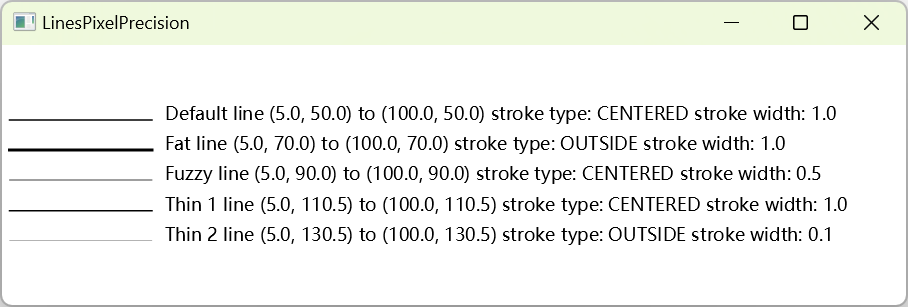

# Snapping

2023-08-10, 12:28
add: fill 和 stroke 对 snapToPixel 的表现差异
2023-07-11, 13:57
@author Jiawei Mao

****
## 1. 简介

下图是一个 (5px, 5px) 的屏幕：


图中的圆圈表示像素点：

- 坐标 (0, 0) 映射到左上角像素点的左上角
- 坐标 (0.5, 0.5) 映射到左上角像素的中心

整数坐标落在像素点中间，对应上图中的实线。

JavaFX 的坐标系统支持 float，从而可以指定像素的任意部分。如 (2.0, 3.0) 指向像素点角。

`Region` 使用 float 作为坐标，在 pixel 边界可能没有完全对齐，使边界看起来模糊。

`Region` 的 `snapToPixel` 属性解决该问题。`snapToPixel` 默认为 true，即 `Region` 会调整 children 的 position, spacing, size 为**整数**，从而与 pixel 边界匹配：

- 因此填充（fill）具有直线边缘的形状，其边缘往往是清晰的，因此参数为整数，使得这些形状的边界得以覆盖完整的像素点。
- 另一方面，对相同的 stroking 形状，其边界往往是模糊的。因为 stroke 的默认宽度为 1.0，正好对应一个像素点，默认行为是，stroke 一半在边界内，一半在边界外。大部分形状的边界位置一般为整数坐标值，从而边界内外各占 50%，从而导致 fill 是清晰的，而 stroke 为模糊的

解决该问题的方法有两种：
- 使用更宽的 stroke，在没有缩放的情况下，2.0 px 足以
- 使用 `StrokeType.INSIDE` 或 `StrokeType.OUTSIDE`，而不是默认的 `CENTERED` 类型


使用整数来绘制 `Line` 或 `Shape`，strokeWidth 为 1px 会看起来很模糊。例如，绘制一条从 (1,1) 到 (8,1) 的 1px 宽的水平线，如下图所示：

- 该线占据上下两个像素，显得粗且模糊
- 像素的颜色根据坐标和 strokeWidth 值调整


## 2. 示例

下面绘制几条基本相同的线：

```java
import javafx.application.Application;
import javafx.scene.Scene;
import javafx.scene.layout.Pane;
import javafx.scene.paint.Color;
import javafx.scene.shape.Line;
import javafx.scene.shape.StrokeType;
import javafx.scene.text.Text;
import javafx.stage.Stage;

public class LinesPixelPrecision extends Application {

    public static void main(String[] args) {
        Application.launch(args);
    }

    @Override
    public void start(Stage stage) {
        stage.setTitle("LinesPixelPrecision ");
        Pane root = new Pane();
        Scene scene = new Scene(root, 800, 250, Color.WHITE);

        double y = 50.0;
        // draw a line using default values
        Line defaultLine = createLine(5.0, y, 100, y, 1, null);
        Text defaultLineText = createText(defaultLine, "Default");

        y = 70;
        Line fatLine = createLine(5.0, y, 100, y, 1, StrokeType.OUTSIDE);
        Text fatLineText = createText(fatLine, "Fat");

        y = 90;
        Line fuzzyLine = createLine(5.0, y, 100, y, .5, null);
        Text fuzzyLineText = createText(fuzzyLine, "Fuzzy");

        y = 110.5;
        Line thin1Line = createLine(5.0, y, 100, y, 1, null);
        Text thin1LineText = createText(thin1Line, "Thin 1");

        y = 130.5;
        Pane subPane = new Pane();
        Line thin2Line = createLine(5.0, y, 100, y, 0.10, StrokeType.OUTSIDE);
        subPane.getChildren().add(thin2Line);
        Text thin2LineText = createText(thin2Line, "Thin 2");

        root.getChildren().addAll(defaultLine, defaultLineText);
        root.getChildren().addAll(fatLine, fatLineText);
        root.getChildren().addAll(fuzzyLine, fuzzyLineText);
        root.getChildren().addAll(thin1Line, thin1LineText);
        root.getChildren().addAll(subPane, thin2LineText);

        stage.setScene(scene);
        stage.show();
    }

    private Line createLine(double startX, double startY,
                            double endX, double endY,
                            double strokeWidth, StrokeType strokeType) {
        Line line = new Line(startX, startY, endX, endY);
        line.setStrokeWidth(strokeWidth);
        if (strokeType != null) {
            line.setStrokeType(strokeType);
        }
        line.setStroke(Color.BLACK);

        return line;
    }

    private Text createText(Line line, String name) {
        // label line (%s, %s) to (%s, %s) stroke type: %s
        String displayString = String.format(" %s line (%s, %s) to (%s, %s) stroke type: %s stroke width: %s",
                name,
                line.getStartX(),
                line.getStartY(),
                line.getEndX(),
                line.getEndY(),
                line.getStrokeType().toString(),
                line.getStrokeWidth());

        Text text = new Text(displayString);
        text.setX(line.getEndX() + 5);
        text.setY(line.getEndY());
        text.setFill(Color.BLACK);
        return text;
    }
}
```



这些线段的特征：

|lineType|strokeWidth|strokeType|
|---|---|---|
|Default|1|CENTERED|
|Fat|1|OUTSIDE|
|Fuzzy|0.5|CENTERED|
|Thin 1|1|CENTERED|
|Thin 2|0.1|OUTSIDE|

说明：使用整数坐标值，strokeWidth 为 1px，此时线段看起来有点模糊

- 坐标值上加上 0.5 即可变清晰，Default vs. Thin 1 为该情况
- 将 strokeType 设置为 `OUTSIDE` 或 `INSIDE` 也可以变清晰，Default vs. Fat line 为该情况