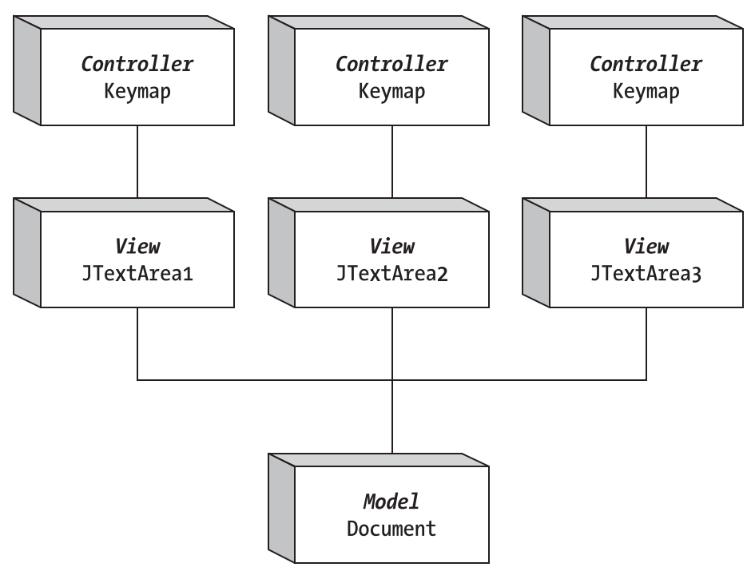

# MVC 模式

2024-04-10
@author Jiawei Mao
***

## MVC 流程

MVC（Model-View-Controller）是一种特殊的 Observer 设计模式：

- model 保存组件的状态
- view 充当 Observer 来显示模型的状态
- controller，定义用户界面如何相应用户输入

### MVC 通讯

下面显示 `JTextArea` 的 MVC 模型：

- `JTextArea` 作为 MVC 的 view 部分；
- 显示的 `Document` 为 model 部分，`Document` 存储 `JTextArea` 的状态信息，即文本内容；
- `JTextArea` 中的 `InputMap` 则是 controller
  - `InputMap` 将 keyboard 输入映射到 `ActionMap` 指令
  - `ActionMap` 将指令映射到 `TextAction` 对象，该对象可以修改 `Document；`
  - 当修改方法，`Document` 创建 `DocumentEvent` 发送回 `JTextArea`。


### Swing 组件的 UI 代理

在 MVC 模型中，view 和 controller 有复杂的交互，Swing 将这两部分组合成一个代理对象，以简化总体设计。这导致每个 Swing 组件都有一个 UI 代理，负责渲染组件当前状态并处理用户输入。

有时，用户事件会修改 view，但不影响 model。例如，cursor 位置是 view 的一个属性，model 并不关心 cursor 位置，只关心文本内容。因此，影响 cursor 位置的用户输入不会传递给 model。在其他时候，影响 Document 内容的用户输入会传递给 model。由于这种紧密的耦合，每个 Swing 组件都有一个 UI 代理。

下图是 `JTextArea` 的组成，包括 model 和 UI-delegate。


> `JTextArea` 的 MVC 结构。

`JTextArea` 的 UI-delegate 从 `TextUI` 接口开始，`BasicTextUI` 提供基本实现。`BasicTextAreaUI` 则提供 JTextArea 的专门实现。BasicTextAreaUI 创建 PlainView 或 WrappedPlainView。在模型方面，则要简单许多。AbstractDocument 实现 Document 接口，并进一步由 PlainDocument 扩展。

文本组件后面会进行更相信的讨论。

## 共享数据模型

因为数据模型只存储状态信息，所以可以在多个组件共享模型。然后，每个组件的视图都可以修改模型。如下所示：



这里 3 个 `JTextArea` 用来修改一个 `Document`。如果用户修改一个 `JTextArea` 的内容，模型随之改变，其它 `JTextArea` 自动更新到新的状态。所有 `Document` 视图都不需要手动通知其它视图。

实现数据模型共享的方式有两种：

- 创建独立于组件的数据模型，然后让每个组件都使用该模型；
- 先创建一个组件，从该组件获取模型，然后与其他组件共享。

**示例：** 使用第二种方法共享数据模型。

```java
import javax.swing.*;
import javax.swing.text.Document;
import java.awt.*;

public class ShareModel {

    public static void main(String[] args) {
        Runnable runner = new Runnable() {
            @Override
            public void run() {
                JFrame frame = new JFrame("Sharing Sample");
                frame.setDefaultCloseOperation(JFrame.EXIT_ON_CLOSE);

                Container content = frame.getContentPane();
                JTextArea textarea1 = new JTextArea();
                Document document = textarea1.getDocument();
                JTextArea textarea2 = new JTextArea(document);
                JTextArea textarea3 = new JTextArea(document);

                content.setLayout(new BoxLayout(content, BoxLayout.Y_AXIS));
                content.add(new JScrollPane(textarea1));
                content.add(new JScrollPane(textarea2));
                content.add(new JScrollPane(textarea3));
                frame.setSize(300, 400);
                frame.setVisible(true);
            }
        };
        EventQueue.invokeLater(runner);
    }
}
```

下图是编辑后的外观。


这三个 `JTextArea` 都可以查看和修改 `Document`。

## 预定义数据模型

在使用 Swing 组件时，理解其背后的数据模型非常重要。了解组件的数据模型有助于你将组件的视图与逻辑分开。

下表列出了所有 Swing 组件的数据模型。如果某个组件没有列出，那么该组件的数据模型应该是从其父类继承而来。有时用多个组件来描述组件，数据存储在一个模型，数据选择在另一个模型。对 JComboBox，MutableComboBoxModel 接口扩展 ComboBoxModel。没有单独的类实现 ComboBoxModel 而没有实现 MutableComboBoxModel 。

|组件|数据模型接口|实现|
|---|---|---|
|AbstractButton|ButtonModel|DefaultButtonModel|
|JColorChooser|ColorSelectionModel|DefaultColorSelectionModel|
|JComboBox|ComboBoxModel|N/A|
||MutableComboBoxModel|DefaultComboBoxModel|
|JFileChooser|ListModel|BasicDirectoryModel|
|JList|ListModel|AbstractListModel|
|||DefaultListModel|
||ListSelectionModel|DefaultListSelectionModel|
|JMenuBar|SingleSelectionModel|DefaultSingleSelectionModel|
|JPopupMenu|SingleSelectionModel|DefaultSingleSelectionModel|
|JProgressBar|BoundedRangeModel|DefaultBoundedRangeModel|
|JScrollBar|BoundedRangeModel|DefaultBoundedRangeModel|
|JSlider|BoundedRangeModel|DefaultBoundedRangeModel|
|JSpinner|SpinnerModel|AbstractSpinnerModel|
|||SpinnerDateModel|
|||SpinnerListModel|
|||SpinnerNumberModel|
|JTabbedPane|SingleSelectionModel|DefaultSingleSelectionModel|
|JTable|TableModel|AbstractTableModel|
|||DefaultTableModel|
||TableColumnModel|DefaultTableColumnModel|
||ListSelectionModel|DefaultListSelectionModel|
|JTextComponent|Document|AbstractDocument|
|||PlainDocument|
|||StyledDocument|
|||DefaultStyleDocument|
|||HTMLDocument|
|JToggleButton|ButtonModel|JToggleButton|
|||ToggleButtonModel|
|JTree|TreeModel|DefaultTreeModel|
||TreeSelectionModel|DefaultTreeSelectionModel|
|                ||JTree.EmptySelectionModel|

当直接访问 Swing 组件的模型，如果更改模型，所有注册的视图都会自动收到通知。这种状态自动传播是 MVC 流行的原因之一。
