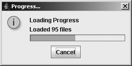

# ProgressMonitor

- [ProgressMonitor](#progressmonitor)
  - [简介](#简介)
  - [创建 ProgressMonitor](#创建-progressmonitor)
  - [使用 ProgressMonitor](#使用-progressmonitor)
  - [ProgressMonitor 属性](#progressmonitor-属性)
  - [自定义 ProgressMonitor Laf](#自定义-progressmonitor-laf)

2024-01-05, 11:22⭐
***

## 简介

`ProgressMonitor` 用于报告耗时任务的状态。它是一个特殊的非组件 Swing 类。

如果任务比较耗时，`ProgressMonitor` 会弹出一个窗口，如下图所示：



`ProgressMonitor` 弹窗后：

- 用户可以观看任务进度，任务完成 `ProgressMonitor` 自动消失
- 也可以点击 "Cancel" 按钮，取消任务

对取消操作，任务需要定期检查 `ProgressMonitor`，以查看用户是否点击了取消按钮。

`ProgressMonitor` 显示的弹窗是一个 `JOptionPane`，其 `maxCharactersPerLineCount` 属性为 60，会自动换行。`JDialog` 为非模态，标题为 "Progress..."。

消息区包含三个对象：

- 顶部是一条固定消息，在 `JOptionPane` 的整个生命周期中保持不变。该消息可以是字符串文本，或类似 `JOptionPane.message` 属性的对象数组
- 中间为注释或可以随着任务进展变化的消息
- 底部是一个进度条（`JProgressBar`）

另外，按钮区域显示一个 "Cancel" 按钮。

## 创建 ProgressMonitor

```java
public ProgressMonitor(Component parentComponent,
                           Object message,
                           String note,
                           int min,
                           int max) 
```

参数：

- `parentComponent` 是显示 `JOptionPane` 的父组件，，其作用类似于 `JOptionPane.createDialog()` 中的 `parentComponent` 参数
- `message` 为静态消息，可以为 `null`
- `note` 为动态消息，也可以为 `null`
- `min` 和 `max` 为进度条的范围

`ProgressMonitor` 不会一开始就显示弹窗，而是每隔 500 毫秒检查一次，判断任务是否会在两秒内完成。如果两秒内无法完成，再弹窗显示进度。检查时间可以通过 `ProgressMonitor` 的 `millisToDecideToPopup` 和 `millisToPopup` 属性设置。

**示例：** 创建包含 200 个步骤的 `ProgressMonitor`

```java
ProgressMonitor monitor = new ProgressMonitor(parent, 
    "Loading Progress", "Getting Started...", 0, 200);
```

## 使用 ProgressMonitor

在执行任务中，调用 `ProgressMonitor.setProgress(int newValue)` 更新进度。

假设用 `progress` 字段保存进度，在任务中更新 `progress` 值，并设置 `ProgressMonitor` 进度：

```java
progress += 5;
monitor.setProgress(progress);
```

多次调用 `setProgress` 进度条可能没有变化。进度的变化在 `ProgressMonitor` 进度条长度上至少前进一个像素才有效果。例如，如果 `ProgressMonitor` 的 `min` 和 `max` 分别为 0 和 20亿，那么每次增加 5，增加 1000 次也不会对进度条产生明显影响。

`progress` 可以已加载文件数，或从文件中读取的字节数。如果 `min` 和 `max` 参数的差值为 100，则可以将当前进度视为完成百分比。

除了更新进度，还可以更新 `note`：

```java
monitor.setNote("Loaded " + progress + " files");
```

`ProgressMonitor` 取消任务逻辑由任务完成。如果取消任务，ProgressMonitor 自动关闭对话框，但是任务必须在源码中合适位置检查任务是否被取消：

```java
if (monitor.isCanceled()) {
    // Task canceled - cleanup
    ...
} else {
    // Continue doing task
    ...
}
```

大多数需要 `ProgressMonitor` 的任务都需要单独的线程来实现。

**示例：** 创建 `ProgressMonitor`，支持手动或自动更新 `progress` 属性。

- 点击 "Start" 按钮创建 `ProgressMonitor`
- 点击 "Manual Increase" 进度前进 5
- 点击 "Automatic Increase" 每 250 毫秒增加 3
- 在自动增加进度时，点击弹窗的 "Cancel" 按钮，演示取消操作

```java
public class SampleProgress {

    static ProgressMonitor monitor;
    static int progress;
    static Timer timer;

    static class ProgressMonitorHandler implements ActionListener {

        // Called by Timer
        public void actionPerformed(ActionEvent actionEvent) {
            if (monitor == null)
                return;
            if (monitor.isCanceled()) {
                System.out.println("Monitor canceled");
                timer.stop();
            } else {
                progress += 3;
                monitor.setProgress(progress);
                monitor.setNote("Loaded " + progress + " files");
            }
        }
    }

    public static void main(String[] args) {

        Runnable runner = () -> {
            JFrame frame = new JFrame("ProgressMonitor Sample");
            frame.setDefaultCloseOperation(JFrame.EXIT_ON_CLOSE);
            frame.setLayout(new GridLayout(0, 1));

            // Define Start Button
            JButton startButton = new JButton("Start");
            ActionListener startActionListener = actionEvent -> {
                Component parent = (Component) actionEvent.getSource();
                monitor = new ProgressMonitor(parent, "Loading Progress", "Getting Started...", 0, 200);
                progress = 0;
            };
            startButton.addActionListener(startActionListener);
            frame.add(startButton);

            // Define Manual Increase Button
            // Pressing this button increases progress by 5
            JButton increaseButton = new JButton("Manual Increase");
            ActionListener increaseActionListener = actionEvent -> {
                if (monitor == null)
                    return;
                if (monitor.isCanceled()) {
                    System.out.println("Monitor canceled");
                } else {
                    progress += 5;
                    monitor.setProgress(progress);
                    monitor.setNote("Loaded " + progress + " files");
                }
            };
            increaseButton.addActionListener(increaseActionListener);
            frame.add(increaseButton);

            // Define Automatic Increase Button
            // Start Timer to increase progress by 3 every 250 ms
            JButton autoIncreaseButton = new JButton("Automatic Increase");
            ActionListener autoIncreaseActionListener = actionEvent -> {
                if (monitor != null) {
                    if (timer == null) {
                        timer = new Timer(250, new ProgressMonitorHandler());
                    }
                    timer.start();
                }
            };
            autoIncreaseButton.addActionListener(autoIncreaseActionListener);
            frame.add(autoIncreaseButton);

            frame.setSize(300, 200);
            frame.setVisible(true);
        };
        EventQueue.invokeLater(runner);
    }
}
```

## ProgressMonitor 属性

ProgressMonitor 的 8 个属性：

|属性|类型|权限|
|---|---|---|
|accessibleContext|AccessibleContext|Read-only|
|canceled|boolean|Read-only|
|maximum|int|Read-write|
|millisToDecideToPopup|int|Read-write|
|millisToPopup|int|Read-write|
|minimum|int|Read-write|
|note|String|Read-write|
|progress|int|Write-only|

- `millisToDecideToPopup` 属性是 `ProgressMonitor` 是弹窗显示前等待的毫秒数。如果在这期间 `progress` 属性没有改变，`ProgressMonitor` 会继续等 `millisToDecideToPopup` 毫秒，循环该过程，直到 `progress` 更新
- 当 `ProgressMonitor` 发现 `progress` 属性已更新，它会判断任务在 `millisToPopup` 毫秒内任务是否能完成，如果 `ProgressMonitor` 觉得任务能在 millisToPopup 毫秒内完成，则不会显示弹窗；否则，弹窗会在 millisToPopup 毫秒后显示

!!! caution
    尽管技术上可行，但不推荐在出现弹窗后修改 minimum 和 maximum 属性。这会导致进度条更新不稳定

## 自定义 ProgressMonitor Laf

更改 ProgressMonitor 的 Laf 需要更改其包含的 JProgressBar, JLabel 和 ProgressMonitor。

ProgressMonitor 包含一个 UIResource 相关属性，即 `ProgressMonitor.progressText`。
