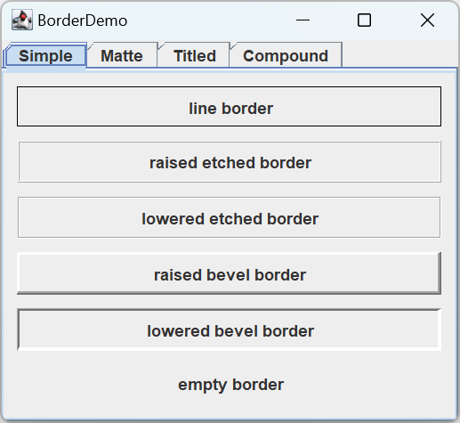
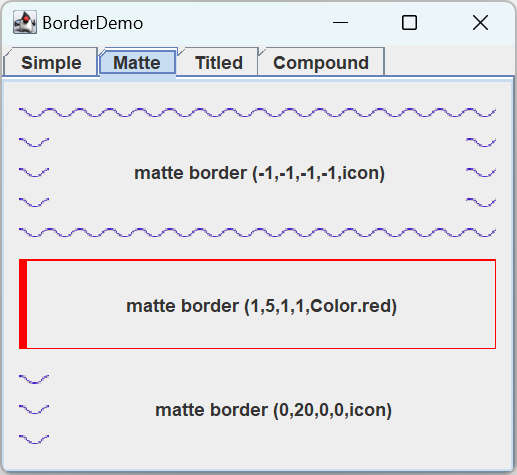
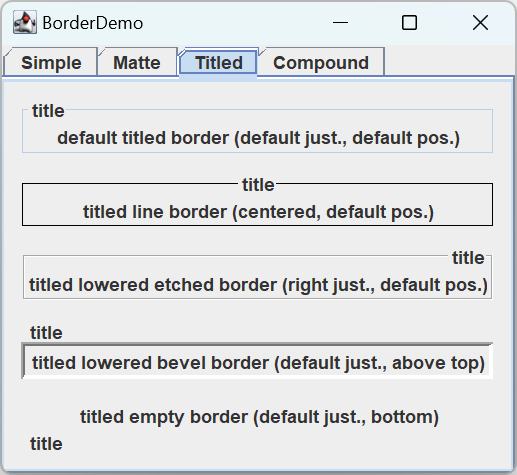

# 如何使用边框

- [如何使用边框](#如何使用边框)
  - [简介](#简介)
  - [边框类型](#边框类型)
    - [简单边框](#简单边框)
    - [matte 边框](#matte-边框)
    - [Title 边框](#title-边框)
    - [复合边框](#复合边框)
  - [自定义边框](#自定义边框)
  - [Border API](#border-api)
  - [完整示例](#完整示例)
  - [参考](#参考)

2023-12-22, 17:46 ⭐
****

## 简介

每个 `JComponent` 组件可以有一个或多个边框。边框不是组件，但非常有用，可用于绘制 Swing 组件的边缘。边框不仅可用于绘制线条和 fancy 的边缘，还可以在组件四周提供标题和空白区域。

从技术上来说，可以为任何继承 `JComponent` 的对象设置边框，但是大多数 Swing 组件的 LaF 实现对自定义边框的支持不好。因此，如果你需要为除 `JPanel`, `JLabel` 外的 Swing 组件设置边框，建议将组件放在 `JPanel` 中，然后设置 `JPanel` 的边框，总体效果一致。

可以使用 `JComponent.setBorder` 设置边框。可以使用 `BorderFactory` 创建大部分 Swing 支持的边框。如果需要在多个地方使用相同边框，可以啊惊奇保存到 `Border` 类型的变量（Border 不是组件，所以可以多次使用）。

**示例：** 为容器创建边框

```java
JPanel pane = new JPanel();
pane.setBorder(BorderFactory.createLineBorder(Color.black));
```

如下图所示，里面包含一个标签组件。容器边缘的黑线就是 `Border` 绘制：


```java
public class BorderDemo {
    public static void main(String[] args) {
        JFrame jf = new JFrame("添加内容面板测试程序");
        jf.setSize(300, 200);
        jf.setDefaultCloseOperation(WindowConstants.EXIT_ON_CLOSE);
        jf.setVisible(true);

        JPanel contentPane = new JPanel();
        jf.setContentPane(contentPane);
        JButton b1 = new JButton("确定");
        JButton b2 = new JButton("取消");
        contentPane.add(b1);
        contentPane.add(b2);

        b1.setBorder(BorderFactory.createLineBorder(Color.red));//用来设置按钮组件的边框
    }
}
```


在实际开发中，一般会使用边框美化组件。

## 边框类型

### 简单边框

下图展示了 Swing 提供的边框（`BorderDemo` 源码在后面）：

```java
Border blackline = BorderFactory.createLineBorder(Color.black);
Border raisedetched = BorderFactory.createEtchedBorder(EtchedBorder.RAISED);
Border loweredetched = BorderFactory.createEtchedBorder(EtchedBorder.LOWERED);
Border raisedbevel = BorderFactory.createRaisedBevelBorder();
Border loweredbevel = BorderFactory.createLoweredBevelBorder();
Border empty = BorderFactory.createEmptyBorder();
```



### matte 边框

下图展示 matte 边框:

- matte 边框可以在组件四周指定不同的宽度（pixel）
- 甚至可以用不同的颜色或 icon 绘制边框
- 使用 icon 重复填充边框，应计算好组件和 icon 的大小，避免 icon 长度不够或者被截断

```java
ImageIcon icon = createImageIcon("images/wavy.gif", "wavy-line border icon"); //20x22
Border border = BorderFactory.createMatteBorder(-1, -1, -1, -1, icon);
if (icon != null) {
    addCompForBorder(border, "matte border (-1,-1,-1,-1,icon)", matteBorders);
} else {
    addCompForBorder(border, "matte border (-1,-1,-1,-1,<null-icon>)", matteBorders);
}
border = BorderFactory.createMatteBorder(1, 5, 1, 1, Color.red);
addCompForBorder(border, "matte border (1,5,1,1,Color.red)", matteBorders);

border = BorderFactory.createMatteBorder(0, 20, 0, 0, icon);
if (icon != null) {
    addCompForBorder(border, "matte border (0,20,0,0,icon)", matteBorders);
} else {
    addCompForBorder(border, "matte border (0,20,0,0,<null-icon>)", matteBorders);
}
```

这里创建了三个边框：

- 第一个以 wavy.gif 填充边框(-1 表示根据 icon 的大小动态计算，top 和 bottom 等于 icon 高度，left 和right 等于 icon 的宽度)；
- 第二个以不同的 pixel 填充 left；
- 第三个只左边 以wavy.gif 填充

效果如下：



### Title 边框

可以让任何 `Border` 带上标题，如果创建时不指定 `Border`，则使用 Laf 默认的 `Border`。例如，Java Laf 默认使用 grey line 作为 `Border`，而 Windows Laf 默认使用 etched `Border`。

Title Border 的标题默认放在左上角:

- `setTitleJustification()` 用于设定对齐方式
- `setTitlePosition()` 用于设定位置，如 `ABOVE_TOP`, `BOTTOM`

```java
TitledBorder titled;
titled = BorderFactory.createTitledBorder("title"); 
titled.setTitleJustification(TitledBorder.CENTER);
titled.setTitlePosition(TitledBorder.DEFAULT_POSITION);
titled = BorderFactory.createTitledBorder(blackline, "title"); 
titled = BorderFactory.createTitledBorder(loweredetched, "title");
titled = BorderFactory.createTitledBorder(loweredbevel, "title"); 
titled = BorderFactory.createTitledBorder(empty, "title"); 

```



### 复合边框

可以将各种边框组合起来使用：

```java
JPanel compoundBorders = new JPanel();
compoundBorders.setBorder(paneEdge);
compoundBorders.setLayout(new BoxLayout(compoundBorders, BoxLayout.Y_AXIS));
Border redline = BorderFactory.createLineBorder(Color.red);
Border compound;
compound = BorderFactory.createCompoundBorder(raisedbevel, loweredbevel);
addCompForBorder(compound, "compound border (two bevels)", compoundBorders);
compound = BorderFactory.createCompoundBorder(redline, compound);
addCompForBorder(compound, "compound border (add a red outline)", compoundBorders);
titled = BorderFactory.createTitledBorder(
        compound, "title", TitledBorder.CENTER, TitledBorder.BELOW_BOTTOM);
addCompForBorder(titled, "titled compound border (centered, below bottom)", compoundBorders);
```


## 自定义边框

如果 `BorderFactory` 没有提供你想要的 `Border`，则要么直接使用边框包中的 API，要么自定义边框。`swing.border` 提供了 Border 接口，以及下面已经展示的边框：

| Border | 描述 |
| ------ | ---- |
|`LineBorder`|任意厚度单色的 line border|
|`EtchedBorder`|etched-in 或 etched-out|
|`BevelBorder`|斜面边框|
|`EmptyBorder`|空白透明边框，占用空间但不绘制|
|`MatteBorder`|Matte-like 边框 of either a solid color or a tiled icon|
|`TitledBorder`|任意带标题的边框|

另外还有一个 `SoftBevelBorder`，和 `BevelBorder` 类似，不过边界更柔和。

如果没有你需要的边框，则需要自定义边框。通过扩展 `AbstractBorder` 类实现。自定义需要实现以下两个方法：

- `paintBorder`, `JComponent` 会调用其中的代码绘制其边框
- `getBorderInsets`, 绘制边框所需区域大小

如果自定义边框包含 insets (一般包含)，则还需要覆盖 `AbstractBorder.getBorderInsets(Component c)` 和 `AbstractBorder.getBorderInsets(Component c, Insets insets)`，以保证 insets 尺寸正确。

有关自定义实现的具体示例，可参考 `javax.swing.border` 包。

## Border API

`Border` API 可以分为两部分：

- 使用 `BorderFactory` 创建 `Border`
- 查看或设置组件的 `Border`

`BorderFactory` 创建 `Border` API:

|方法|说明|
|---|---|
|`Border createLineBorder(Color)` <br> `Border createLineBorder(Color, int)`|创建线段边框。参数：线段颜色和宽度|
|`Border createEtchedBorder()` <br> `Border createEtchedBorder(Color, Color)` <br> `Border createEtchedBorder(int)` <br> `Border createEtchedBorder(int, Color, Color)`|创建 etched 边框。`Color` 参数指定高亮和阴影颜色。int 为 `EtchedBorder.RAISED` 或 `EtchedBorder.LOWERED`，默认为 `LOWERED`|
|`Border createLoweredBevelBorder()`|创建凹陷效果的边框|
|`Border createRaisedBevelBorder()`|创建凸起效果的边框|
|`Border createBevelBorder(int, Color, Color)` <br> `Border createBevelBorder(int, Color, Color, Color, Color)`|创建凸起或凹陷的斜边边框。int 参数为 `BevelBorder.RAISED` 或 `LOWERED`。<br>- 三参数构造： highlight color, shadow color.<br>- 五参数构造：outer highlight, inner highlight, outer shadow, inner shadow colors|
|`Border createEmptyBorder()` <br> `Border createEmptyBorder(int, int, int, int)`|创建不可见的边框。<br> 无参数构造：边框不占用位置，当构造边框不可见的 titled border 时可用。<br> 四参数构造：指定边框在 top, left, bottom, right 占用的 pixels 数，当在组件边添加空白区域时很有用|
|`MatteBorder createMatteBorder(int, int, int, int, Color)`<br>`MatteBorder createMatteBorder(int, int, int, int, Icon)`|创建 matte 边框。int 参数指定边框在 top, left, bottom, right 占用的像素。color 指定填充的颜色，Icon 指定填充边框的 icon|
|`TitledBorder createTitledBorder(String)` <br>`TitledBorder createTitledBorder(Border)`<br>`TitledBorder createTitledBorder(Border, String)`<br>`TitledBorder createTitledBorder(Border, String, int, int)`<br>`TitledBorder createTitledBorder(Border, String, int, int, Font)`<br>`TitledBorder createTitledBorder(Border, String, int, int, Font, Color)`|创建带标题的边框。参数：<br>- String, 边框的标题<br>- font, 标题的字体<br>- color, 标题的颜色<br>- Border, 和标题同时显示的边框，如果未指定，则使用 laf 的默认边框<br>- 标题默认放在伴随边框的顶部左对齐，可选的 int 参数指定标题的位置和对齐方式<br>- 位置参数：`TitledBorder.ABOVE_TOP`, `TOP`(默认), `BELOW_TOP`, `ABOVE_BOTTOM`, `BOTTOM`, `BELOW_BOTTOM`<br>- 对齐方式：`LEADING`(默认), `CENTER`, `TRAILING`|
|`CompoundBorder createCompoundBorder(Border, Border)`|合并两个边框为一个。第一个参数指定 outer border, 第二个为 inner border|

**查询或设置 Component 的边框**

|方法|说明|
|---|---|
|`void setBorder(Border)`<br>`Border getBorder()`|查询或设置 JComponent 的边框|
|`void setBorderPainted(boolean)` <br> `boolean isBorderPainted()` <br>(int `AbstractButton`, `JMenuBar`, `JPopupMenu`, `JProgressBar`, `JToolBar`)|设置或查询是否显示组件的边框|

## 完整示例

```java
import javax.swing.*;
import javax.swing.border.Border;
import javax.swing.border.EtchedBorder;
import javax.swing.border.TitledBorder;
import java.awt.*;

public class BorderDemo extends JPanel {

    public BorderDemo() {
        super(new GridLayout(1, 0));

        //Keep references to the next few borders,
        //for use in titles and compound borders.
        Border blackline, raisedetched, loweredetched,
                raisedbevel, loweredbevel, empty;

        //A border that puts 10 extra pixels at the sides and
        //bottom of each pane.
        Border paneEdge = BorderFactory.createEmptyBorder(0, 10, 10, 10);

        blackline = BorderFactory.createLineBorder(Color.black);
        raisedetched = BorderFactory.createEtchedBorder(EtchedBorder.RAISED);
        loweredetched = BorderFactory.createEtchedBorder(EtchedBorder.LOWERED);
        raisedbevel = BorderFactory.createRaisedBevelBorder();
        loweredbevel = BorderFactory.createLoweredBevelBorder();
        empty = BorderFactory.createEmptyBorder();

        //First pane: simple borders
        JPanel simpleBorders = new JPanel();
        simpleBorders.setBorder(paneEdge);
        simpleBorders.setLayout(new BoxLayout(simpleBorders, BoxLayout.Y_AXIS));

        addCompForBorder(blackline, "line border", simpleBorders);
        addCompForBorder(raisedetched, "raised etched border", simpleBorders);
        addCompForBorder(loweredetched, "lowered etched border", simpleBorders);
        addCompForBorder(raisedbevel, "raised bevel border", simpleBorders);
        addCompForBorder(loweredbevel, "lowered bevel border", simpleBorders);
        addCompForBorder(empty, "empty border", simpleBorders);

        //Second pane: matte borders
        JPanel matteBorders = new JPanel();
        matteBorders.setBorder(paneEdge);
        matteBorders.setLayout(new BoxLayout(matteBorders, BoxLayout.Y_AXIS));

        ImageIcon icon = createImageIcon("images/wavy.gif",
                "wavy-line border icon"); //20x22
        Border border = BorderFactory.createMatteBorder(-1, -1, -1, -1, icon);
        if (icon != null) {
            addCompForBorder(border,
                    "matte border (-1,-1,-1,-1,icon)",
                    matteBorders);
        } else {
            addCompForBorder(border,
                    "matte border (-1,-1,-1,-1,<null-icon>)",
                    matteBorders);
        }
        border = BorderFactory.createMatteBorder(1, 5, 1, 1, Color.red);
        addCompForBorder(border,
                "matte border (1,5,1,1,Color.red)",
                matteBorders);

        border = BorderFactory.createMatteBorder(0, 20, 0, 0, icon);
        if (icon != null) {
            addCompForBorder(border,
                    "matte border (0,20,0,0,icon)",
                    matteBorders);
        } else {
            addCompForBorder(border,
                    "matte border (0,20,0,0,<null-icon>)",
                    matteBorders);
        }

        //Third pane: titled borders
        JPanel titledBorders = new JPanel();
        titledBorders.setBorder(paneEdge);
        titledBorders.setLayout(new BoxLayout(titledBorders,
                BoxLayout.Y_AXIS));
        TitledBorder titled;

        titled = BorderFactory.createTitledBorder("title");
        addCompForBorder(titled,
                "default titled border"
                        + " (default just., default pos.)",
                titledBorders);

        titled = BorderFactory.createTitledBorder(
                blackline, "title");
        addCompForTitledBorder(titled,
                "titled line border"
                        + " (centered, default pos.)",
                TitledBorder.CENTER,
                TitledBorder.DEFAULT_POSITION,
                titledBorders);

        titled = BorderFactory.createTitledBorder(loweredetched, "title");
        addCompForTitledBorder(titled,
                "titled lowered etched border"
                        + " (right just., default pos.)",
                TitledBorder.RIGHT,
                TitledBorder.DEFAULT_POSITION,
                titledBorders);

        titled = BorderFactory.createTitledBorder(
                loweredbevel, "title");
        addCompForTitledBorder(titled,
                "titled lowered bevel border"
                        + " (default just., above top)",
                TitledBorder.DEFAULT_JUSTIFICATION,
                TitledBorder.ABOVE_TOP,
                titledBorders);

        titled = BorderFactory.createTitledBorder(
                empty, "title");
        addCompForTitledBorder(titled, "titled empty border"
                        + " (default just., bottom)",
                TitledBorder.DEFAULT_JUSTIFICATION,
                TitledBorder.BOTTOM,
                titledBorders);

        //Fourth pane: compound borders
        JPanel compoundBorders = new JPanel();
        compoundBorders.setBorder(paneEdge);
        compoundBorders.setLayout(new BoxLayout(compoundBorders,
                BoxLayout.Y_AXIS));
        Border redline = BorderFactory.createLineBorder(Color.red);

        Border compound;
        compound = BorderFactory.createCompoundBorder(
                raisedbevel, loweredbevel);
        addCompForBorder(compound, "compound border (two bevels)",
                compoundBorders);

        compound = BorderFactory.createCompoundBorder(
                redline, compound);
        addCompForBorder(compound, "compound border (add a red outline)",
                compoundBorders);

        titled = BorderFactory.createTitledBorder(
                compound, "title",
                TitledBorder.CENTER,
                TitledBorder.BELOW_BOTTOM);
        addCompForBorder(titled,
                "titled compound border"
                        + " (centered, below bottom)",
                compoundBorders);

        JTabbedPane tabbedPane = new JTabbedPane();
        tabbedPane.addTab("Simple", null, simpleBorders, null);
        tabbedPane.addTab("Matte", null, matteBorders, null);
        tabbedPane.addTab("Titled", null, titledBorders, null);
        tabbedPane.addTab("Compound", null, compoundBorders, null);
        tabbedPane.setSelectedIndex(0);
        String toolTip = new String("<html>Blue Wavy Line border art crew:<br>&nbsp;&nbsp;&nbsp;Bill Pauley<br>&nbsp;&nbsp;&nbsp;Cris St. Aubyn<br>&nbsp;&nbsp;&nbsp;Ben Wronsky<br>&nbsp;&nbsp;&nbsp;Nathan Walrath<br>&nbsp;&nbsp;&nbsp;Tommy Adams, special consultant</html>");
        tabbedPane.setToolTipTextAt(1, toolTip);

        add(tabbedPane);
    }

    void addCompForTitledBorder(TitledBorder border,
            String description,
            int justification,
            int position,
            Container container) {
        border.setTitleJustification(justification);
        border.setTitlePosition(position);
        addCompForBorder(border, description,
                container);
    }

    void addCompForBorder(Border border,
            String description,
            Container container) {
        JPanel comp = new JPanel(new GridLayout(1, 1), false);
        JLabel label = new JLabel(description, JLabel.CENTER);
        comp.add(label);
        comp.setBorder(border);

        container.add(Box.createRigidArea(new Dimension(0, 10)));
        container.add(comp);
    }


    /**
     * Returns an ImageIcon, or null if the path was invalid.
     */
    protected static ImageIcon createImageIcon(String path, String description) {
        java.net.URL imgURL = BorderDemo.class.getResource(path);
        if (imgURL != null) {
            return new ImageIcon(imgURL, description);
        } else {
            System.err.println("Couldn't find file: " + path);
            return null;
        }
    }

    /**
     * Create the GUI and show it.  For thread safety,
     * this method should be invoked from the
     * event-dispatching thread.
     */
    private static void createAndShowGUI() {
        //Create and set up the window.
        JFrame frame = new JFrame("BorderDemo");
        frame.setDefaultCloseOperation(JFrame.EXIT_ON_CLOSE);

        //Create and set up the content pane.
        BorderDemo newContentPane = new BorderDemo();
        newContentPane.setOpaque(true); //content panes must be opaque
        frame.setContentPane(newContentPane);

        //Display the window.
        frame.pack();
        frame.setVisible(true);
    }

    public static void main(String[] args) {
        javax.swing.SwingUtilities.invokeLater(new Runnable() {
            public void run() {
                createAndShowGUI();
            }
        });
    }
}
```

## 参考

- https://docs.oracle.com/javase%2Ftutorial%2F/uiswing/components/border.html