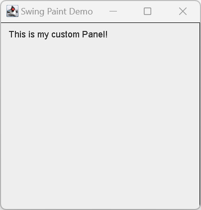

#  自定义绘制

2023-12-25⭐
@author Jiawei Mao
****

## 简介

大部分程序不需要自己写绘制代码，Swing 标准组件可以满足大部分需求。如果确实需要控制 `Graphics` 的绘制方法，可以阅读以下内容。

下面通过一个按照鼠标事件绘制形状的简单 GUI 程序来解释如何实现自定义绘制。

Swing 的自定义绘制与 AWT 类似，但不建议完全使用 AWT 编写程序。

## 示例

### 1. 创建主窗口

所有 GUI 都需要一个主窗口，在 Swing 中为 `javax.swing.JFrame`。因此，第一步是创建 `JFrame`。需要注意，GUI 创建代码应该放在 Event Dispatch Thread (EDT) 中，以防死锁，如下：

```java
import javax.swing.SwingUtilities;
import javax.swing.JFrame;

public class SwingPaintDemo1 {

    public static void main(String[] args) {
        SwingUtilities.invokeLater(() -> createAndShowGUI());
    }

    private static void createAndShowGUI() {
        System.out.println("Created GUI on EDT? " +
                SwingUtilities.isEventDispatchThread());
        JFrame f = new JFrame("Swing Paint Demo"); // 创建窗口，并设置标题
        f.setDefaultCloseOperation(JFrame.EXIT_ON_CLOSE);
        f.setSize(250, 250);
        f.setVisible(true);
    }
}
```

代码说明：

- `SwingUtilities` 帮助类在 EDT 线程上创建 GUI；
- 默认单击 close 按钮，`JFrame` 不会退出程序，需要通过 `setDefaultCloseOperation` 实现该行为；
- 显式将窗口尺寸设置为 250x250，不过向 `JFrame` 添加组件后，就不需要了。

### 2. 添加绘制代码

下面，添加自定义绘制代码。

操作：扩展 `javax.swing.JPanel`，提供自定义绘制代码。

```java
public class SwingPaintDemo1 {

    public static void main(String[] args) {
        SwingUtilities.invokeLater(new Runnable() {
            @Override
            public void run() {
                createAndShowGUI();
            }
        });
    }

    private static void createAndShowGUI() {
        System.out.println("Created GUI on EDT? " +
                SwingUtilities.isEventDispatchThread());
        JFrame f = new JFrame("Swing Paint Demo");
        f.setDefaultCloseOperation(WindowConstants.EXIT_ON_CLOSE);
        f.add(new MyPanel());
        f.pack();
        f.setVisible(true);
    }
}

class MyPanel extends JPanel {

    public MyPanel() {
        setBorder(BorderFactory.createLineBorder(Color.BLACK));
    }
	
    public Dimension getPreferredSize() {
        return new Dimension(250, 250);
    }

    public void paintComponent(Graphics g) {
        super.paintComponent(g);

        // draw text
        g.drawString("This is my custom Panel!", 10, 20);
    }
}
```



说明：定义了一个 `JPanel` 的子类，`MyPanel`，里面包含绘制的主要代码。

- `MyPanel` 在构造函数中添加了黑色边框，这种细微的差别很难看到，可以先注释掉构造函数的代码，运行后和原来的 GUI 对比；
- `MyPanel` 覆盖 `getPreferredSize()` 以设置 panel 的 prefSize。这样在 `SwingPaintDemo` 中就不需要再设置尺寸，添加控件后调用 `pack` 即可；
- 所有的自定义绘制代码都在 `paintComponent` 方法中。
  - 该方法在 `javax.swing.JComponent` 方法中，在子类中覆盖该方法以自定义绘制行为。
  - `java.awt.Graphics` 参数包含许多绘制 2D 图形的方法，不过大多数情况，实际参数为 `java.awt.Graphics2D` (`Graphics` 的子类)对象，该类提供了更多 2D 图形渲染功能。

大多数标准 Swing 组件都有自身的 Laf (由单独的 UI Delegate 实现)。调用 `super.paintComponent(g)` 会将 graphics-context 传给 UI-delegate，由 UI-delegate 绘制 panel 的背景。

当将其他的窗口覆盖 Java GUI，然后移开。在两种情况下，绘制系统发现组件被 damaged，paintCompnent方法被调用。

### 3. 事件处理

最后，添加事件处理代码：添加鼠标事件，在点击或拖动鼠标时重绘组件。为了保证程序的有效性，我们会记录鼠标的坐标，只 repaint 改变的区域。这是推荐的高效实现方法。

```java
public class SwingPaintDemo1 {

    public static void main(String[] args) {
        SwingUtilities.invokeLater(new Runnable() {
            @Override
            public void run() {
                createAndShowGUI();
            }
        });
    }

    private static void createAndShowGUI() {
        System.out.println("Created GUI on EDT? " +
                SwingUtilities.isEventDispatchThread());
        JFrame f = new JFrame("Swing Paint Demo");
        f.setDefaultCloseOperation(WindowConstants.EXIT_ON_CLOSE);
        f.add(new MyPanel());
        f.pack();
        f.setVisible(true);
    }
}

class MyPanel extends JPanel {

    private int squareX = 50;
    private int squareY = 50;
    private int squareW = 20;
    private int squareH = 20;

    public MyPanel() {
        setBorder(BorderFactory.createLineBorder(Color.BLACK));
        addMouseListener(new MouseAdapter() {
            @Override
            public void mousePressed(MouseEvent e) {
                moveSquare(e.getX(), e.getY());
            }
        });

        addMouseMotionListener(new MouseMotionAdapter() {
            @Override
            public void mouseDragged(MouseEvent e) {
                moveSquare(e.getX(), e.getY());
            }
        });
    }

    private void moveSquare(int x, int y) {
        int OFFSET = 1;
        if ((squareX != x) || (squareY != y)) {
            repaint(squareX, squareY, squareW + OFFSET, squareH + OFFSET);
            squareX = x;
            squareY = y;
            repaint(squareX, squareY, squareW + OFFSET, squareW + OFFSET);
        }
    }

    public Dimension getPreferredSize() {
        return new Dimension(250, 200);
    }

    public void paintComponent(Graphics g) {
        super.paintComponent(g);
        g.drawString("This is my custom Panel!", 10, 20);
        g.setColor(Color.RED);
        g.fillRect(squareX, squareY, squareW, squareH);
        g.setColor(Color.BLACK);
        g.drawRect(squareX, squareY, squareW, squareH);
    }
}
```

在 `MyPanel` 中添加了 `mousePressed` 和 `mouseDragged` 事件处理，当鼠标事件发生，由 `moveSquare` 处理事件，以更新矩形方块的位置。所有这些代码都在 EDT 中执行。

其中最重要的是 `repaint()` 方法的调用。该方法由 `java.awt.Component` 定义，是程序重绘组件的方法。该方法包含无参版本（重绘整个组件）和多参数版本（重绘指定区域）。指定的区域称为 *clip*。调用 `repaint` 的多参数版本虽然更费事，但可以避免重绘不需要更新的区域。

因为是手动设置 *clip*，`moveSquare` 调用了两次 `repaint`：

- 第一次将之前方块所在的地方填充背景色
- 第二次绘制方块当前所在区域

值得注意的时，尽管在同一事件处理中连续两次调用了 `repaint`，但是 Swing 会在一次 `paint` 操作中获取所有信息并重绘这两部分。

操作联系：

1. 注释掉第一次 `repaint()` 调用，再执行程序，可以发现，点击或拖动鼠标，原来的方块还在。
2. 当有多个方块在屏幕上，最小化然后恢复窗口会导致程序完全重绘组件，其它的方块全部消失，只有当前的还在
3. 注释掉两个 `repaint` 方法，然后在 `paintComponent` 末尾添加 `repaint` 调用，程序又恢复正常了，但是没有原来高效，因为每次都会完全绘制整个组件。

### 4. 改进设计

为了方便演示，上面的绘制代码都放在 `MyPanel` 类中。但是，如果你的应用需要跟踪多个方块实例，可以将绘制的代码放到一个单独的类中，这样每个方块都可以当做一个单独的对象。该技术在2D 游戏中使用十分广泛，被称为 "sprite animation"。

```java
public class SwingPaintDemo1 {

    public static void main(String[] args) {
        SwingUtilities.invokeLater(new Runnable() {
            @Override
            public void run() {
                createAndShowGUI();
            }
        });
    }

    private static void createAndShowGUI() {
        System.out.println("Created GUI on EDT? " +
                SwingUtilities.isEventDispatchThread());
        JFrame f = new JFrame("Swing Paint Demo");
        f.setDefaultCloseOperation(WindowConstants.EXIT_ON_CLOSE);
        f.add(new MyPanel());
        f.setSize(250, 250);
        f.setVisible(true);
    }
}

class MyPanel extends JPanel {

    RedSquare redSquare = new RedSquare();

    public MyPanel() {
        setBorder(BorderFactory.createLineBorder(Color.BLACK));
        addMouseListener(new MouseAdapter() {
            @Override
            public void mousePressed(MouseEvent e) {
                moveSquare(e.getX(), e.getY());
            }
        });

        addMouseMotionListener(new MouseMotionAdapter() {
            @Override
            public void mouseDragged(MouseEvent e) {
                moveSquare(e.getX(), e.getY());
            }
        });
    }

    private void moveSquare(int x, int y) {
        // 当前 square 状态
        final int CURR_X = redSquare.getX();
        final int CURR_Y = redSquare.getY();
        final int CURR_W = redSquare.getWidth();
        final int CURR_H = redSquare.getHeight();
        final int OFFSET = 1;

        if ((CURR_X != x) || (CURR_Y != y)) {
            // 将原始位置填充背景
            repaint(CURR_X, CURR_Y, CURR_W + OFFSET, CURR_H + OFFSET);

            // 更新坐标
            redSquare.setX(x);
            redSquare.setY(y);

            // 重绘新位置的 square
            repaint(redSquare.getX(), redSquare.getY(),
                    redSquare.getWidth() + OFFSET,
                    redSquare.getHeight() + OFFSET);
        }
    }

    public Dimension getPreferredSize() {
        return new Dimension(250, 200);
    }

    public void paintComponent(Graphics g) {
        super.paintComponent(g);
        g.drawString("This is my custom Panel!", 10, 20);
        redSquare.paintSquare(g);
    }
}

class RedSquare {

    private int xPos = 50;
    private int yPos = 50;
    private int width = 20;
    private int height = 20;

    public void setX(int xPos) {
        this.xPos = xPos;
    }

    public int getX() {
        return xPos;
    }

    public void setY(int yPos) {
        this.yPos = yPos;
    }

    public int getY() {
        return yPos;
    }

    public int getWidth() {
        return width;
    }

    public int getHeight() {
        return height;
    }

    public void paintSquare(Graphics g) {
        g.setColor(Color.RED);
        g.fillRect(xPos, yPos, width, height);
        g.setColor(Color.BLACK);
        g.drawRect(xPos, yPos, width, height);
    }
}
```

这里从头创建了 `RedSquare` 类，也可以让 `RedSquare` 扩展 `java.awt.Rectangle`。不管如何实现 `RedSquare`，关键是里面添加了一个以 `Graphics` 为参数的方法，并且在 panel 的 `paintComponent` 中调用该方法。这种分离模式让代码更简洁。

## 绘制机制

绘制代码都放在 `paintComponent` 方法中。在需要绘制时，该方法会被调用，但是绘制实际从 `paint` 方法开始（定义在 `java.awt.Component` 中）。没当需要渲染时，该方法被绘制系统调用。方法签名如下：

```java
public void paint(Graphics g)
```

`javax.swing.JComponent` 扩展 `java.awt.Component`，并将 `paint` 方法拆分为三个方法，并按如下顺序调用：

```java
protected void paintComponent(Graphics g)
protected void paintBorder(Graphics g)
protected void paintChildren(Graphics g)
```

虽然 API 没有不让你重写 `paintBorder` 和 `paintChildren`，但一般不需要。因此，`paintComponent` 是唯一需要重写的方法。

如前所述，大多数 Swing 标准组件的 Laf 由单独的 `ComponentUI` 实现。这意味着大多数或几乎所有的 Swing 标准组件的绘制流程如下：

1. `paint()` 调用 `paintComponent()`
2. 如果 `ui` 属性不为 `null`，`paintComponent()` 调用 `ui.update()`
3. 如果组件的 `opaque` 属性为 `true`，`ui.update()` 填充组件背景，然后调用 `ui.paint()`
4. `ui.paint()` 渲染组件的内容

所以前面的 `SwingPaintDemo` 代码中要调用 `super.paintComponent(g)`，以设置背景。

```java
public void paintComponent(Graphics g) {
    // 首先让 UI 代理绘制，如果该组件非透明，它会首先填充背景

    super.paintComponent(g);       
    g.drawString("This is my custom Panel!",10,20);
    redSquare.paintSquare(g);
}  
```

如果你已经理解上述所有演示代码，那么你已有足够的实践知识编写自定义绘制代码。

为了进一步优化渲染，`JComponent` 提供了 3 个额外的渲染属性：`opaque`, `optimizedDrawingEnabled` 和 `doubleBuffered`：

- `opaque`：定义组件是否透明。当组件透明，`JComponent` 的容器必须渲染组件背景。为提高性能，可以让 `JComponent` 保持不透明，让 `JComponent` 自己绘制背景；
- `optimizedDrawingEnabled`：直接子组件是否可以重叠。如果不能重叠，`repaint` 时间会大大减少。默认除了 JDesktopPane, JLayeredPane 和 JViewport，其它 Swing 组件都启用了渲染优化；
- `doubleBuffered`：是否开启双缓冲。

## 总结

- 在 Swing 中，绘制从 `paint()` 方法开始，该方法依次调用 `paintComponent`, `paintBorder` 和 `paintChildren`。在组件首次绘制、调整大小或被其它窗口遮盖后再次显示时，系统会自动调用这些方法。
- 代码通过调用组件的 `repaint()` 方法完成重绘；不要直接调用 `paintComponent`。调用 `repaint()` 后绘制系统会在正确时间调用 `paintComponent()`。
- `repaint()` 多参数重载能缩小组件的 *clip* 区域，使绘制更高效。`repaint()` 的无参方法重绘整个组件。
- 由于缩小了 *clip* 区域，所以在 `moveSquare` 中两次调用 `repaint()`。第一次用背景色填充正方形原来的位置，第二次在新位置绘制正方形。
- 可以在同一个事件处理中多次调用 `repaint`，Swing 会对 `repaint()` 调用进行合并，实际只执行一次。
- 对有 UI-Delegate 的组件，在重写 `paintComponent` 时应首先调用 `super.paintComponent(g)`。否则你的组件需要负责绘制背景。
- 将绘制部分的代码抽离出来，在单独的对象中定义带有 `Graphic` 的参数的方法绘制自身，可使代码更为简洁。

## 常见绘制问题

Q：绘制代码放哪儿

对继承 `JComponent` 的组件，绘制代码都放在 `paintComponent` 中。

Q：画的东西不显示

在需要更新外观时，是否调用 `repaint`。

Q：组件的前景显示了，但不显示背景。导致可以看到组件后面一个或多个组件。

- 确保组件是不透明的。例如，在多数 Laf 中 `JPanel` 不透明，但不是全部。要是 `JLabel` 和 GTK+ `JPanel` 不透明，必须调用 `setOpaque(true)`
- 如果自定义组件扩展 `JPanel` 或特定 `JComponent` 子类，那么在绘制自定义内容前，需要调用 `super.paintComponent` 绘制背景
- 在自定义组件的 `paintComponent` 的顶部中调用如下方法绘制背景

```java
g.setColor(getBackground());
g.fillRect(0, 0, getWidth(), getHeight());
g.setColor(getForeground());
```

Q：使用 `setBackground` 设置组件背景颜色，但似乎无效

自定义组件没有绘制背景的可能性最大：自定义组件是透明的，或者自定义代码没有绘制背景。例如，如果设置 `JLabel` 的背景色，同时必须设置 `setOpaque(true)`，以保证背景被渲染。

Q：如何绘制粗线？

Java 2D API 支持线宽、线条样式等。

Q：某个组件的边框看着很奇怪。

- 组件经常更新它的边界来反应状态，因此，除了自定义 `JComponent` 子类和 `JPanel` 外，应该避免调用 `setBorder`
- 该组件是否由 GTK+ 或 Windows Xp 等 Lafs 使用 UI 代理绘制的边框，而不是 `Border` 对象？如果是，不要在这些组件上调用 `setBorder` 方法
- 自定义组件中是否考虑了 insets

Q：自定义绘制代码性能差。

- 使用 `Graphics` 的 `getClip` 或 `getClipBounds` 确定绘制区域，区域越小速度越快.
- 如果组件只有部分区域需要更新，使用 `repaint` 带参数的版本

## 参考

- https://docs.oracle.com/javase/tutorial/uiswing/painting/index.html