# AWT 进阶

- [AWT 进阶](#awt-进阶)
  - [渲染流程](#渲染流程)
  - [Shapes](#shapes)
    - [使用 Shape](#使用-shape)
  - [Areas](#areas)
  - [Strokes](#strokes)
  - [Paint](#paint)
  - [Coordinate Transformations](#coordinate-transformations)
  - [Clipping](#clipping)

***

## 渲染流程

按如下流程使用 Graphics 绘制：

1. 获取 `Graphics2D` 对象，从 Java SE 1.2 开始，`paint` 和 `paintComponent` 等方法的参数为 `Graphics2D`，可以直接强制转换

```java
public void paintComponent(Graphics g){
    var g2 = (Graphics2D) g;
    . . .
}
```

2. 使用 `setRenderingHints` 设置渲染提示，性能和质量的权衡

```java
RenderingHints hints = . . .;
g2.setRenderingHints(hints);
```

3. 使用 `setStroke` 方法设置 `stroke`。`stroke` 绘制图形边框，可以设置线条宽度，虚线等

```java
Stroke stroke = . . .;
g2.setStroke(stroke);
```

4. 使用 `setPaint` 方法设置 `paint`。`paint` 是填充色。

```java
Paint paint = . . .;
g2.setPaint(paint);
```

5. 用 `clip` 方法设置剪辑区域

```java
Shape clip = . . .;
g2.clip(clip);
```

6. 使用 `transform` 方法设置用户空间到设备空间的转换。比如在自定义坐标系统中定义形状，然后转换到像素坐标

```java
AffineTransform transform = . . .;
g2.transform(transform);
```

7. 使用 `setComposite` 设置合成规则

```java
Composite composite = . . .;
g2.setComposite(composite);
```

8. 创建形状

```java
Shape shape = . . .;
```

9. 绘制或填充形状

```java
g2.draw(shape);
g2.fill(shape);
```

在大多情况下，不需要所有这些步骤。而且 Graphics2D 的属性都有默认值，只有需要自定义时才需要修饰设置。

下面介绍形状、Strokes、paints、transformations, composition 等内容。

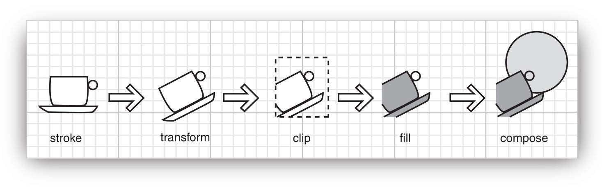

上图渲染形状采用了如下步骤：

1. stroke 形状边框
2. transform 形状
3. clip 形状。如果 shape 和 clip 区域没有交集，停止渲染
4. 绘制 clip 后余下的部分
5. 填充形状

**java.awt.Graphics2D**

```java
// 使用当前 paint 绘制形状边框
void draw(Shape s)
// 使用当前 paint 填充形状
void fill(Shape s)
```

## Shapes

`Graphics` 绘制形状的方法如下所示：

```java
drawLine
drawRectangle
drawRoundRect
draw3DRect
drawPolygon
drawPolyline
drawOval
drawArc
```

这些方法都有相应的 `fill` 方法，从 JDK 1.0 开始就在 Graphics 类中。Java 2D API 为这些形状提供了专门的类：

- 3D 矩形的概念被删除，因此 `draw3DRect` 没有对应的类。
- Java 2D API 提供了两个额外的类，`CubicCurve2D` 和 `QuadCurve2D`。
- `drawPolygon` 的功能由 `GeneralPath` 实现

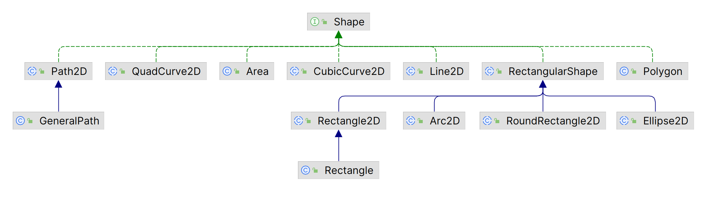

要绘制形状，首先创建实现 `Shape` 接口的类对象，然后调用 `Graphics2D` 的 `draw` 方法。

可以看到，`Rectangle2D`, `RoundRectangle2D`, `Ellipse2D` 和 `Arc2D` 都继承自 `RectangularShape`。椭圆和圆弧不是矩形，不过它们由矩形边界，如下图所示：


每个名称以 "2D" 结尾的类都有两个子类，用于指定坐标保存为 `float` 还是 `double`。如 `Rectangle2D.Float` 和 `Rectangle2D.Double`。

但是，所有 graphics 内部都使用 `float` 坐标，因为 `float` 足以用作几何计算精度。但是 Java 中处理 `float` 比较麻烦，所以采用了内部用 `float`，参数和返回值用 `double` 的形式。只有在创建 2D 对象时才需要区分 float 和 double，例如：

```java
var floatRect = new Rectangle2D.Float(5F, 10F, 7.5F, 15F);
var doubleRect = new Rectangle2D.Double(5, 10, 7.5, 15);
```

最后 ，还有一个 `Point2D` 类，用于描述坐标点。它不是 `Shape` 子类，而是辅助定义 `Shape`。

### 使用 Shape

- 对 `RoundRectangle2D`，需指定左上角、宽度、高度以及圆角尺寸。例如：

```java
var r = new RoundRectangle2D.Double(150, 200, 100, 50, 20, 20);
```

生成一个圆角矩形，每个角的圆半径为 20。如下图所示：


- 对圆弧，需要指定边框，起始角度、圆弧扫过的角度以及封闭方式 `Arc2D.OPEN`, `Arc2D.PIE`, `Arc2D.CHORD`

```java
var a = new Arc2D(x, y, width, height, startAngle, arcAngle, closureType);
```


圆弧类型：

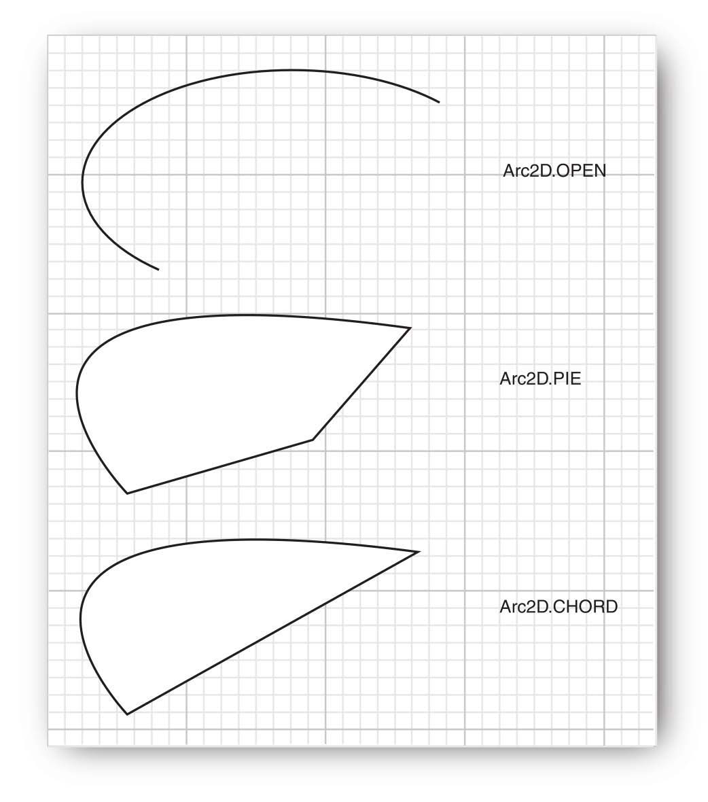

!!! caution
    如果圆弧是椭圆的，圆弧角度的计算并不简单。角度是相对矩形边框指定的，45°总是落在椭圆中心到矩形右上角。因此，如果矩形长宽相差很大，弧线的开始和结尾会向 长边倾斜。

    假设圆心为原点，点 (x,y) 在圆弧上，那么倾斜的角度为：
    
    ```java
    skewedAngle = Math.toDegrees(Math.atan2(-y * height, x * width));
    ```
    
    该值在 -180 到 180 之间。以这种方式计算倾斜的角度。如果起始角度或差值为负值，则在起始角度上加上 360。

- quadratic 和 cubic 曲线

Java 2D 支持二次曲线和三次曲线。二次曲线和三次曲线由两个端点和一个/两个控制点指定。移动控制点会改变曲线形状。


>  二次曲线

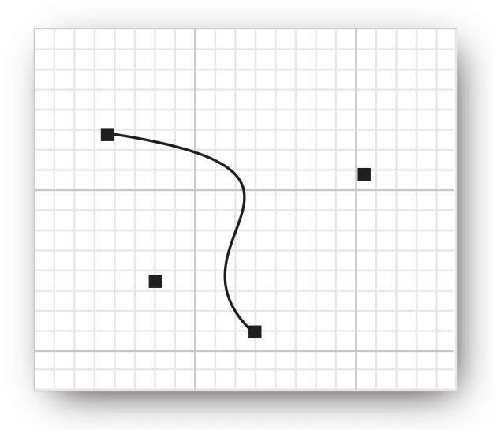

> 三次曲线

通过指定端点和控制点的坐标创建曲线：

```java
var q = new QuadCurve2D.Double(startX, startY, controlX, controlY, endX, endY);
var c = new CubicCurve2D.Double(startX, startY, control1X, control1Y,
    control2X, control2Y, endX, endY);
```

二次曲线不是很灵活，在实践中不常用。但是三次曲线（如由 CubicCurve2D 绘制的 Bézier 曲线）非常常见。通过组合多个三次曲线，使连接点处的斜率匹配，可以创建复杂、光滑的曲线。

- GeneralPath

使用 `moveTo` 方法指定路径的起点：

```java
var path = new GeneralPath();
path.moveTo(10, 20);
```

然后通过 `lineTo`、`quadTo` 或 `curveTo` 方法扩展路径。

对 `lineTo`，需要指定终点，对两种曲线，则要指定控制点和终点。例如：

```java
path.lineTo(20, 30);
path.curveTo(control1X, control1Y, control2X, control2Y, endX, endY);
```

调用 `closePath` 关闭路径，即从终点画一条直线到起点。

画多边形很简单：调用 `moveTo` 到第一个角，然后重复调用 `lineTo` 到其它角，最后调用 `closePath` 关闭多边形。

也可以不关闭 `GeneralPath`，在任何时候都可以调用 `moveTo` 移动到另一个点开始新的线段。

最后，可以使用 `append` 方法将任意 `Shape` 对象添加到 `GeneralPath`。append 第二个参数为 true 表示新 Shape 要连接到路径的最后一个点上，否则为 false。例如：

```java
Rectangle2D r = . . .;
path.append(r, false);
```

将矩形边框附加到路径上，到不与现有路径连接。但是：

```java
path.append(r, true);
```

在路径的终点到矩形的起点添加一条直线。

**示例：** 绘制图形

从 JComboBox 选择形状生成器，包括：

- 直线
- 矩形，圆角矩形，椭圆
- 弧线
- 多边形（GeneralPath）
- 二次和三次曲线

可以使用鼠标调整控制点，当移动控制点，shape 会不断重绘。

这个程序有点复杂，因为要处理多个形状，并支持拖动控制点。

超类 ShapeMaker 封装了生成 Shape 的共性。每个 Shape 都有固定数量的控制点，用户可以移动这些控制点。`getPointCount` 返回控制点数。抽象方法：

```java
Shape makeShape(Point2D[] points)
```

根据指定控制点计算实际 Shape。

为了允许拖动控制点，ShapePanel 处理鼠标和鼠标移动事件。如果在矩形上按下鼠标，则随后的鼠标拖动会移动该矩形。

大多数 ShapeMaker 都很就简单，它们的 makeShape 方法返回所需形状。ArcMaker 稍微复杂一些，需要计算起点和终点角度。此外，为了证明计算正确，返回包含的 GeneralPath 包含 arc，边界矩形，以及圆弧中心到角度控制点的直线。

```java
import javax.swing.*;
import java.awt.*;
import java.awt.event.MouseAdapter;
import java.awt.event.MouseEvent;
import java.awt.event.MouseMotionAdapter;
import java.awt.geom.*;
import java.util.Random;

/**
 * This program demonstrates the various 2D shapes.
 */
public class ShapeTest
{
    public static void main(String[] args) {
        EventQueue.invokeLater(() ->
        {
            var frame = new ShapeTestFrame();
            frame.setTitle("ShapeTest");
            frame.setDefaultCloseOperation(JFrame.EXIT_ON_CLOSE);
            frame.setVisible(true);
        });
    }
}

/**
 * This frame contains a combo box to select a shape and a component to draw it.
 */
class ShapeTestFrame extends JFrame
{
    public ShapeTestFrame() {
        var comp = new ShapeComponent();
        add(comp, BorderLayout.CENTER);
        var comboBox = new JComboBox<ShapeMaker>();
        comboBox.addItem(new LineMaker());
        comboBox.addItem(new RectangleMaker());
        comboBox.addItem(new RoundRectangleMaker());
        comboBox.addItem(new EllipseMaker());
        comboBox.addItem(new ArcMaker());
        comboBox.addItem(new PolygonMaker());
        comboBox.addItem(new QuadCurveMaker());
        comboBox.addItem(new CubicCurveMaker());
        comboBox.addActionListener(event ->
        {
            ShapeMaker shapeMaker = comboBox.getItemAt(comboBox.getSelectedIndex());
            comp.setShapeMaker(shapeMaker);
        });
        add(comboBox, BorderLayout.NORTH);
        comp.setShapeMaker((ShapeMaker) comboBox.getItemAt(0));
        pack();
    }
}

/**
 * This component draws a shape and allows the user to move the points that define it.
 */
class ShapeComponent extends JComponent
{
    private static final Dimension PREFERRED_SIZE = new Dimension(300, 200);
    private Point2D[] points;
    private static Random generator = new Random();
    private static int SIZE = 10;
    private int current;
    private ShapeMaker shapeMaker;

    public ShapeComponent() {
        addMouseListener(new MouseAdapter()
        {
            public void mousePressed(MouseEvent event) {
                Point p = event.getPoint();
                for (int i = 0; i < points.length; i++) {
                    double x = points[i].getX() - SIZE / 2;
                    double y = points[i].getY() - SIZE / 2;
                    Rectangle2D r = new Rectangle2D.Double(x, y, SIZE, SIZE);
                    if (r.contains(p)) {
                        current = i;
                        return;
                    }
                }
            }

            public void mouseReleased(MouseEvent event) {
                current = -1;
            }
        });
        addMouseMotionListener(new MouseMotionAdapter()
        {
            public void mouseDragged(MouseEvent event) {
                if (current == -1) return;
                points[current] = event.getPoint();
                repaint();
            }
        });
        current = -1;
    }

    /**
     * Set a shape maker and initialize it with a random point set.
     *
     * @param aShapeMaker a shape maker that defines a shape from a point set
     */
    public void setShapeMaker(ShapeMaker aShapeMaker) {
        shapeMaker = aShapeMaker;
        int n = shapeMaker.getPointCount();
        points = new Point2D[n];
        for (int i = 0; i < n; i++) {
            double x = generator.nextDouble() * getWidth();
            double y = generator.nextDouble() * getHeight();
            points[i] = new Point2D.Double(x, y);
        }
        repaint();
    }

    public void paintComponent(Graphics g) {
        if (points == null) return;
        var g2 = (Graphics2D) g;
        for (int i = 0; i < points.length; i++) {
            double x = points[i].getX() - SIZE / 2;
            double y = points[i].getY() - SIZE / 2;
            g2.fill(new Rectangle2D.Double(x, y, SIZE, SIZE));
        }

        g2.draw(shapeMaker.makeShape(points));
    }

    public Dimension getPreferredSize() {return PREFERRED_SIZE;}
}

/**
 * A shape maker can make a shape from a point set. Concrete subclasses must return a shape in the makeShape method.
 */
abstract class ShapeMaker
{
    private int pointCount;

    /**
     * Constructs a shape maker.
     *
     * @param pointCount the number of points needed to define this shape
     */
    public ShapeMaker(int pointCount) {
        this.pointCount = pointCount;
    }

    /**
     * Gets the number of points needed to define this shape.
     *
     * @return the point count
     */
    public int getPointCount() {
        return pointCount;
    }

    /**
     * Makes a shape out of the given point set.
     *
     * @param p the points that define the shape
     * @return the shape defined by the points
     */
    public abstract Shape makeShape(Point2D[] p);

    public String toString() {
        return getClass().getName();
    }
}

/**
 * Makes a line that joins two given points.
 */
class LineMaker extends ShapeMaker
{
    public LineMaker() {
        super(2);
    }

    public Shape makeShape(Point2D[] p) {
        return new Line2D.Double(p[0], p[1]);
    }
}

/**
 * Makes a rectangle that joins two given corner points.
 */
class RectangleMaker extends ShapeMaker
{
    public RectangleMaker() {
        super(2);
    }

    public Shape makeShape(Point2D[] p) {
        var s = new Rectangle2D.Double();
        s.setFrameFromDiagonal(p[0], p[1]);
        return s;
    }
}

/**
 * Makes a round rectangle that joins two given corner points.
 */
class RoundRectangleMaker extends ShapeMaker
{
    public RoundRectangleMaker() {
        super(2);
    }

    public Shape makeShape(Point2D[] p) {
        var s = new RoundRectangle2D.Double(0, 0, 0, 0, 20, 20);
        s.setFrameFromDiagonal(p[0], p[1]);
        return s;
    }
}

/**
 * Makes an ellipse contained in a bounding box with two given corner points.
 */
class EllipseMaker extends ShapeMaker
{
    public EllipseMaker() {
        super(2);
    }

    public Shape makeShape(Point2D[] p) {
        var s = new Ellipse2D.Double();
        s.setFrameFromDiagonal(p[0], p[1]);
        return s;
    }
}

/**
 * Makes an arc contained in a bounding box with two given corner points, and with starting and ending angles given by
 * lines emanating from the center of the bounding box and ending in two given points. To show the correctness of the
 * angle computation, the returned shape contains the arc, the bounding box, and the lines.
 */
class ArcMaker extends ShapeMaker
{
    public ArcMaker() {
        super(4);
    }

    public Shape makeShape(Point2D[] p) {
        double centerX = (p[0].getX() + p[1].getX()) / 2;
        double centerY = (p[0].getY() + p[1].getY()) / 2;
        double width = Math.abs(p[1].getX() - p[0].getX());
        double height = Math.abs(p[1].getY() - p[0].getY());

        double skewedStartAngle = Math.toDegrees(Math.atan2(-(p[2].getY() - centerY) * width,
                (p[2].getX() - centerX) * height));
        double skewedEndAngle = Math.toDegrees(Math.atan2(-(p[3].getY() - centerY) * width,
                (p[3].getX() - centerX) * height));
        double skewedAngleDifference = skewedEndAngle - skewedStartAngle;
        if (skewedStartAngle < 0) skewedStartAngle += 360;
        if (skewedAngleDifference < 0) skewedAngleDifference += 360;

        var s = new Arc2D.Double(0, 0, 0, 0,
                skewedStartAngle, skewedAngleDifference, Arc2D.OPEN);
        s.setFrameFromDiagonal(p[0], p[1]);

        var g = new GeneralPath();
        g.append(s, false);
        var r = new Rectangle2D.Double();
        r.setFrameFromDiagonal(p[0], p[1]);
        g.append(r, false);
        var center = new Point2D.Double(centerX, centerY);
        g.append(new Line2D.Double(center, p[2]), false);
        g.append(new Line2D.Double(center, p[3]), false);
        return g;
    }
}

/**
 * Makes a polygon defined by six corner points.
 */
class PolygonMaker extends ShapeMaker
{
    public PolygonMaker() {
        super(6);
    }

    public Shape makeShape(Point2D[] p) {
        var s = new GeneralPath();
        s.moveTo((float) p[0].getX(), (float) p[0].getY());
        for (int i = 1; i < p.length; i++)
            s.lineTo((float) p[i].getX(), (float) p[i].getY());
        s.closePath();
        return s;
    }
}

/**
 * Makes a quad curve defined by two end points and a control point.
 */
class QuadCurveMaker extends ShapeMaker
{
    public QuadCurveMaker() {
        super(3);
    }

    public Shape makeShape(Point2D[] p) {
        return new QuadCurve2D.Double(p[0].getX(), p[0].getY(), p[1].getX(), p[1].getY(),
                p[2].getX(), p[2].getY());
    }
}

/**
 * Makes a cubic curve defined by two end points and two control points.
 */
class CubicCurveMaker extends ShapeMaker
{
    public CubicCurveMaker() {
        super(4);
    }

    public Shape makeShape(Point2D[] p) {
        return new CubicCurve2D.Double(p[0].getX(), p[0].getY(), p[1].getX(), p[1].getY(),
                p[2].getX(), p[2].getY(), p[3].getX(), p[3].getY());
    }
}
```

**java.awt.geom.RoundRectangle2D.Double**

```java
RoundRectangle2D.Double(double x, double y, 
    double width, double height, 
    double arcWidth, double arcHeight)
```

创建指定矩形边界和圆弧尺寸的圆角矩形。

**java.awt.geom.Arc2D.Double**

```java
Arc2D.Double(double x, double y, 
    double w, double h, 
    double startAngle, double arcAngle,
    int type)
```

创建指定矩形边界、起始点、圆弧角和圆弧类型的弧线。

## Areas

上一节介绍了如何使用直线和曲线构造复杂的形状。通过足够直线和曲线，基本上可以画出任何形状。例如，字体中字符形状就是由直线和二次曲线或三次曲线组成。

有时候，通过矩形、多边形或椭圆等组合起来描述形状更容易。Java 2D 支持 4 种将两个形状合并为一个的方法：

- `add`: 两个形状的并集
- `subtract`: 形状 1 和 2 的差集
- `intersect`: 形状 1 和 2 的交集
- `exclusiveOr`：形状 1 和 2 并集和交集的差集

如下图所示：

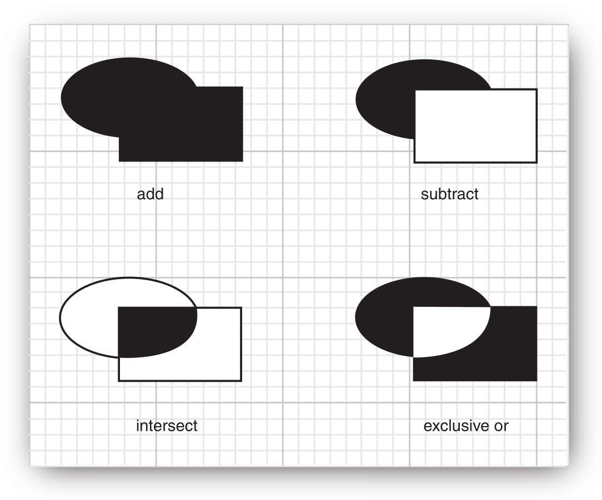

要构造复杂区域，从一个初始 Area 开始：

```java
var a = new Area();
```

然后将其与其它 Shape 进行合并：

```java
a.add(new Rectangle2D.Double(. . .));
a.subtract(path);
. . .
```

`Area` 实现了 `Shape` 接口。因此可以用 `draw` 方法绘制边框，用 `fill` 填充。

**java.awt.geom.Area**

```java
void add(Area other)
void subtract(Area other)
void intersect(Area other)
void exclusiveOr(Area other)
```

## Strokes

`Graphics2D` 的 `draw` 方法使用当前 `stroke` 绘制形状边框。stroke 默认是宽度为 1 的实线。调用 `setStroke` 方法可以设置不同的 stroke。Java2D 定义了 `BasicStroke` 表示 stroke。

可以创建任意宽度的 stroke。例如，创建宽度为 10 像素的线条：

```java
g2.setStroke(new BasicStroke(10.0F));
g2.draw(new Line2D.Double(. . .));
```

当 stroke 宽度大于 1，stroke 的末端就可以有不同样式：

- butt cap: 末端直接结束
- round cap: 末端加一个半圆
- square cap: 末端加半个方形

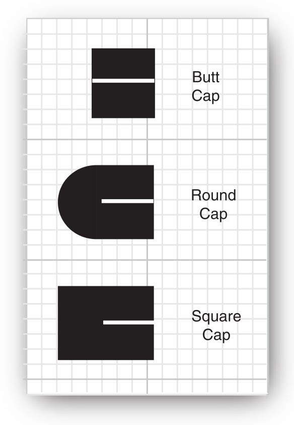

当两个粗线段相遇，它们的连接方式也有三种：

- bevel join
- round join
- miter join

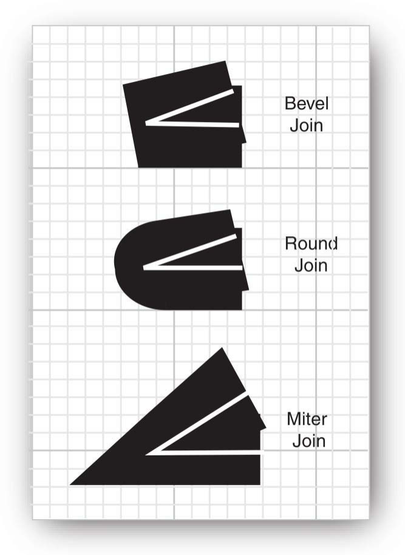

当两条线以很小的角度连接，使用 bevel 会延长很长。为了放置该情况，添加了 miter-limit 参数控制其长度。miter-limit 值为内外距离与 strokeWidth 的比例，默认为 10.

在 `BasicStroke` 构造函数中可以指定以上参数：

```java
g2.setStroke(new BasicStroke(10.0F, BasicStroke.CAP_ROUND, BasicStroke.JOIN_ROUND));
g2.setStroke(new BasicStroke(10.0F, BasicStroke.CAP_BUTT, BasicStroke.JOIN_MITER,
    15.0F /* miter limit */));
```

最后，可以通过设置 dashPattern 来创建虚线。dashPattern 是包含线段、空白长度的 float[] 数组。

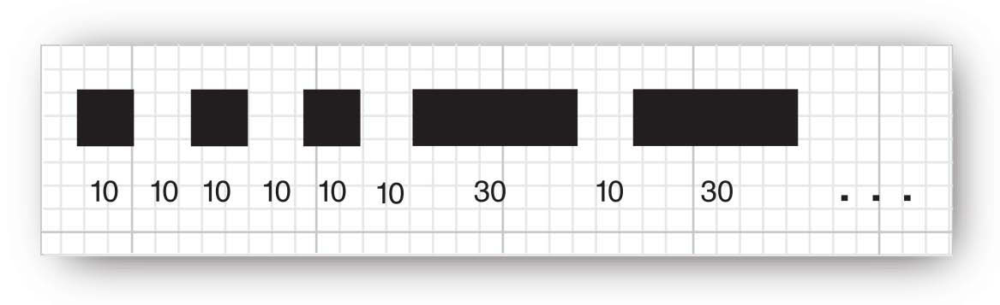

在构造 BasicStroke 时可以指定 dashPattern 和 dashPhase。dashPhase 表示在 dashPattern 中线段开始的位置，一般为 0.

```java
float[] dashPattern = { 10, 10, 10, 10, 10, 10, 30, 10, 30, . . . };
g2.setStroke(new BasicStroke(10.0F, BasicStroke.CAP_BUTT, BasicStroke.JOIN_MITER,
 10.0F /* miter limit */, dashPattern, 0 /* dash phase */));
```

**示例：** 

演示 capStyles, joinStryle 以及 dashLines。可以移动线段末端来测试 miterLimit：选择 miterJoin，然后移动线段，形成一个小角度。

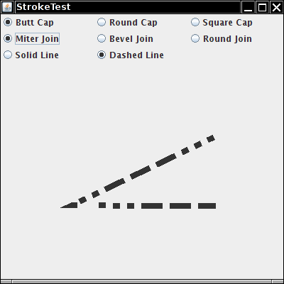

该程序和上例类似，mouseListener 会记住线段端点，mouseMotionListener 监听拖动端点。

```java
import javax.swing.*;
import java.awt.*;
import java.awt.event.MouseAdapter;
import java.awt.event.MouseEvent;
import java.awt.event.MouseMotionAdapter;
import java.awt.geom.GeneralPath;
import java.awt.geom.Point2D;
import java.awt.geom.Rectangle2D;

/**
 * This program demonstrates different stroke types.
 */
public class StrokeTest
{
    public static void main(String[] args) {
        EventQueue.invokeLater(() ->
        {
            var frame = new StrokeTestFrame();
            frame.setTitle("StrokeTest");
            frame.setDefaultCloseOperation(JFrame.EXIT_ON_CLOSE);
            frame.setVisible(true);
        });
    }
}

/**
 * This frame lets the user choose the cap, join, and line style, and shows the resulting stroke.
 */
class StrokeTestFrame extends JFrame
{
    private StrokeComponent canvas;
    private JPanel buttonPanel;

    public StrokeTestFrame() {
        canvas = new StrokeComponent();
        add(canvas, BorderLayout.CENTER);

        buttonPanel = new JPanel();
        buttonPanel.setLayout(new GridLayout(3, 3));
        add(buttonPanel, BorderLayout.NORTH);

        var group1 = new ButtonGroup();
        makeCapButton("Butt Cap", BasicStroke.CAP_BUTT, group1);
        makeCapButton("Round Cap", BasicStroke.CAP_ROUND, group1);
        makeCapButton("Square Cap", BasicStroke.CAP_SQUARE, group1);

        var group2 = new ButtonGroup();
        makeJoinButton("Miter Join", BasicStroke.JOIN_MITER, group2);
        makeJoinButton("Bevel Join", BasicStroke.JOIN_BEVEL, group2);
        makeJoinButton("Round Join", BasicStroke.JOIN_ROUND, group2);

        var group3 = new ButtonGroup();
        makeDashButton("Solid Line", false, group3);
        makeDashButton("Dashed Line", true, group3);
    }

    /**
     * Makes a radio button to change the cap style.
     *
     * @param label the button label
     * @param style the cap style
     * @param group the radio button group
     */
    private void makeCapButton(String label, final int style, ButtonGroup group) {
        // select first button in group
        boolean selected = group.getButtonCount() == 0;
        var button = new JRadioButton(label, selected);
        buttonPanel.add(button);
        group.add(button);
        button.addActionListener(event -> canvas.setCap(style));
        pack();
    }

    /**
     * Makes a radio button to change the join style.
     *
     * @param label the button label
     * @param style the join style
     * @param group the radio button group
     */
    private void makeJoinButton(String label, final int style, ButtonGroup group) {
        // select first button in group
        boolean selected = group.getButtonCount() == 0;
        var button = new JRadioButton(label, selected);
        buttonPanel.add(button);
        group.add(button);
        button.addActionListener(event -> canvas.setJoin(style));
    }

    /**
     * Makes a radio button to set solid or dashed lines.
     *
     * @param label the button label
     * @param style false for solid, true for dashed lines
     * @param group the radio button group
     */
    private void makeDashButton(String label, final boolean style, ButtonGroup group) {
        // select first button in group
        boolean selected = group.getButtonCount() == 0;
        var button = new JRadioButton(label, selected);
        buttonPanel.add(button);
        group.add(button);
        button.addActionListener(event -> canvas.setDash(style));
    }
}

/**
 * This component draws two joined lines, using different stroke objects, and allows the user to drag the three points
 * defining the lines.
 */
class StrokeComponent extends JComponent
{
    private static final Dimension PREFERRED_SIZE = new Dimension(400, 400);
    private static int SIZE = 10;

    private Point2D[] points;
    private int current;
    private float width;
    private int cap;
    private int join;
    private boolean dash;

    public StrokeComponent() {
        addMouseListener(new MouseAdapter()
        {
            public void mousePressed(MouseEvent event) {
                Point p = event.getPoint();
                for (int i = 0; i < points.length; i++) {
                    double x = points[i].getX() - SIZE / 2;
                    double y = points[i].getY() - SIZE / 2;
                    var r = new Rectangle2D.Double(x, y, SIZE, SIZE);
                    if (r.contains(p)) {
                        current = i;
                        return;
                    }
                }
            }

            public void mouseReleased(MouseEvent event) {
                current = -1;
            }
        });

        addMouseMotionListener(new MouseMotionAdapter()
        {
            public void mouseDragged(MouseEvent event) {
                if (current == -1) return;
                points[current] = event.getPoint();
                repaint();
            }
        });

        points = new Point2D[3];
        points[0] = new Point2D.Double(200, 100);
        points[1] = new Point2D.Double(100, 200);
        points[2] = new Point2D.Double(200, 200);
        current = -1;
        width = 8.0F;
    }

    public void paintComponent(Graphics g) {
        var g2 = (Graphics2D) g;
        var path = new GeneralPath();
        path.moveTo((float) points[0].getX(), (float) points[0].getY());
        for (int i = 1; i < points.length; i++)
            path.lineTo((float) points[i].getX(), (float) points[i].getY());
        BasicStroke stroke;
        if (dash) {
            float miterLimit = 10.0F;
            float[] dashPattern = {10F, 10F, 10F, 10F, 10F, 10F, 30F, 10F, 30F, 10F, 30F, 10F,
                    10F, 10F, 10F, 10F, 10F, 30F};
            float dashPhase = 0;
            stroke = new BasicStroke(width, cap, join, miterLimit, dashPattern, dashPhase);
        } else stroke = new BasicStroke(width, cap, join);
        g2.setStroke(stroke);
        g2.draw(path);
    }

    /**
     * Sets the join style.
     *
     * @param j the join style
     */
    public void setJoin(int j) {
        join = j;
        repaint();
    }

    /**
     * Sets the cap style.
     *
     * @param c the cap style
     */
    public void setCap(int c) {
        cap = c;
        repaint();
    }

    /**
     * Sets solid or dashed lines.
     *
     * @param d false for solid, true for dashed lines
     */
    public void setDash(boolean d) {
        dash = d;
        repaint();
    }

    public Dimension getPreferredSize() {return PREFERRED_SIZE;}
}
```

组件绘制和事件处理的核心代码都在 `StrokeComponent` 中。

## Paint

`paint` 指定填充形状的颜色。`setPaint` 方法设置填充样式，Java 2D 提供了三个 `Paint` 接口实现：

- `Color`

`Color` 为纯色。调用 setPaint 时用 Color 参数，即可使用纯色填充：

```java
g2.setPaint(Color.red);
```

- `GradientPaint`

`GradientPaint` 通过在两个颜色之间插值来实现渐变色。

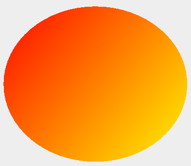

- `TexturePaint`

TexturePaint 用图形重复填充一个区域：

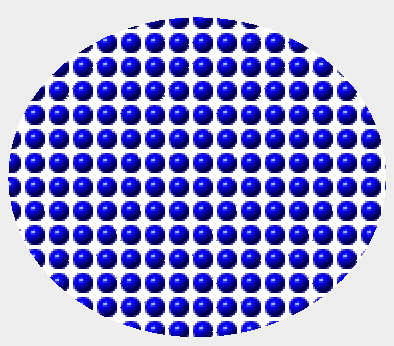

通过指定两个点和这两个点的颜色创建 GradientPaint：

```java
g2.setPaint(new GradientPaint(p1, Color.RED, p2, Color.YELLOW));
```

颜色沿着连接这两个点的线进行插值。在垂直连接线上的直线颜色不变。超出端点的点则用端点颜色填充。

在创建 GradientPaint 时将 cyclic 参数设置为 true：

```java
g2.setPaint(new GradientPaint(p1, Color.RED, p2, Color.YELLOW, true));
```

这样在超出端点后，颜色循环渐变。

指定 BufferedImage 和 anchor 矩形创建 TexturePaint：

```java
g2.setPaint(new TexturePaint(bufferedImage, anchorRectangle));
```

获取 BufferedImage 的最简单方式是读取图像文件：

```java
bufferedImage = ImageIO.read(new File("blue-ball.gif"));
```

图像被缩放以平铺 `anchor` 矩形，然后在 x 和 y 方向重复 anchor 矩形。

## Coordinate Transformations

假设你要绘制一辆汽车。从制造商的规则知道汽车高度、轴距和总长度。你可以算出所有像素的位置，但更简单的方法是，要求 Graphics 执行转换：

```java
g2.scale(pixelsPerMeter, pixelsPerMeter);
g2.draw(new Line2D.Double(coordinates in meters)); // converts to pixels and 
 // draws scaled line
```

`Graphics2D` 的 `scale` 方法将 graphics-context 的坐标转换（coodrinate-transformation）设置为缩放转换。该转换将用户坐标（用户指定的单位）转换为设备坐标（像素）。如下图所示：

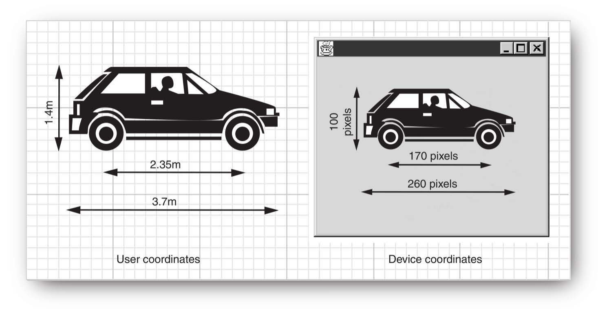

坐标变换在实践中非常有用。它们允许你使用方便的坐标值，graphcs-context 负责将它们转换为像素。

有 4 个基本转换：

- 缩放
- 渲染
- 平移
- 剪切：将一条线固定，并将与之平行的线按与该线的距离成比例滑动

如下图所示：

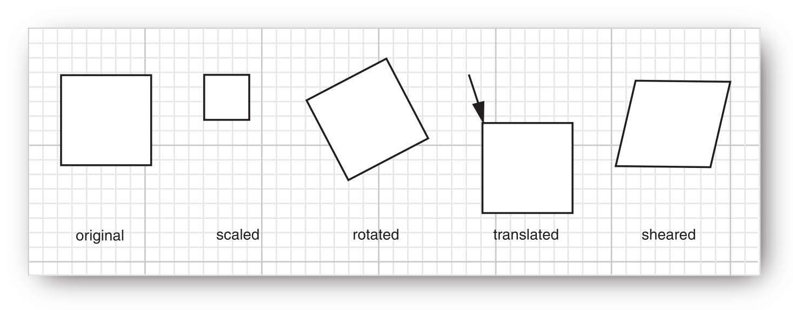

`Graphics2D` 的 `scale`, `rotate`, `translate` 和 `shear` 方法设置 graphics-context 的坐标转换。

这些坐标转换可以组合起来。例如，旋转和再缩放：

```java
g2.rotate(angle);
g2.scale(2, 2);
g2.draw(. . .);
```

对该情况，不同转换顺序结果相同。然而，对大多数转换，顺序很重要。graphics-context 将采用你提供顺序的相反顺序应用转换，即最先应用最后一个转换。

可以提供任何多的转换，例如：

```java
g2.translate(x, y);
g2.rotate(a);
g2.translate(-x, -y);
```

最后一个转换（最先应用）将点 (x, y) 移动到原点 (0, 0)，第二个转换绕原点旋转角度 `a`。最后一个变换将原点移到 (x, y)。总体效果是以 (x,y) 为中心选择角度 `a`。如下图所示。由于围绕原点以外的点旋转很常见，因此有专门的方法：

```java
g2.rotate(a, x, y);
```

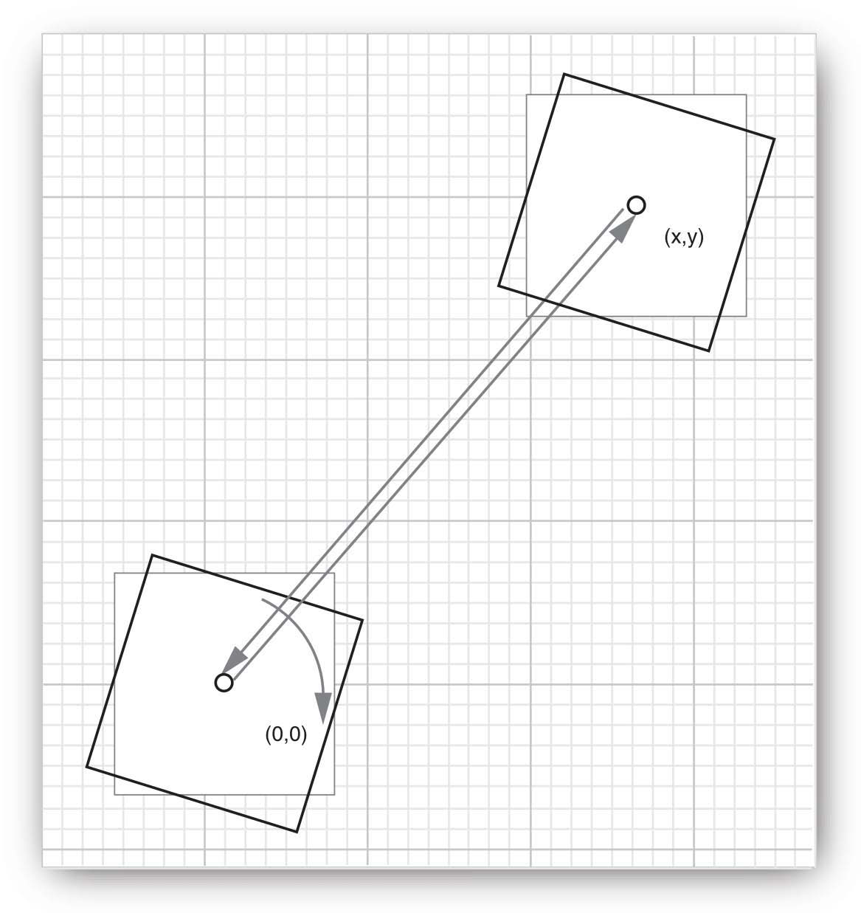

所有的旋转、平移、缩放、切剪和它们的组合都是用变换矩形实现的：

$$
\begin{bmatrix}
    x_{new}\\
    y_{new}\\
    1
\end{bmatrix}=\begin{bmatrix}
    a & c & e\\
    b & d & f\\
    0 & 0 & 1
\end{bmatrix}\cdotp\begin{bmatrix}
    x\\
    y\\
    1
\end{bmatrix}
$$

这种变换称为仿射变换（affine transformation）。在 Java 2D 中，`AffineTransform` 类实现仿射变换。如果你知道特定变换矩阵的分量，可以直接构造 AffineTransform：

```java
var t = new AffineTransform(a, b, c, d, e, f);
```

另外， `getRotateInstance`, `getScaleInstance`, `getTranslateInstance` 和 `getShearInstance` 工厂方法构造对应的变换：

```java
t = AffineTransform.getScaleInstance(2.0F, 0.5F);
```

得到如下变换矩阵：

$$
\begin{bmatrix}
    2 & 0 & 0 \\
    0 & 0.5 & 0\\
    0 & 0 & 1
\end{bmatrix}
$$

实例方法 `setToRotation`, `setToScale`, `setToTranslation`, `setToShear` 将转换设置为新类型：

```java
t.setToRotation(angle); // sets t to a rotation
```

可以将 graphics-context 的坐标转换设置为：

```java
g2.setTransform(t); // replaces current transformation
```

但是，在实践中，不推荐调用 `setTransform`，因为它会替换 graphics-context 可能已有的转换。例如，在横向打印模式的 graphics-context 已经包含 90° 旋转变换，如果调用 setTransform，会消除这个旋转。推荐使用 `transform`：

```java
g2.transform(t); // composes current transformation with t
```

它将现有转换与新的 AffineTransform 对象组合。

如果只想临时应用一个转换，可以先获得旧的转换，将它与新的转换组合，使用后再恢复到旧的转换：

```java
AffineTransform oldTransform = g2.getTransform(); // save old transform
g2.transform(t); // apply temporary transform 
draw on g2
g2.setTransform(oldTransform); // restore old transform
```

**java.awt.geom.AffineTransform**

```java
AffineTransform(double a, double b, double c, double d, double e, double f)
AffineTransform(float a, float b, float c, float d, float e, float f)
```

构造如下矩阵的仿射变换：

$$
\begin{bmatrix}
    a & c & e\\
    b & d & f\\
    0 & 0 & 1
\end{bmatrix}
$$

```java
AffineTransform(double[] m)
AffineTransform(float[] m)
```

$$
\begin{bmatrix}
    m[0] & m[2] & m[4]\\
    m[1] & m[3] & m[5]\\
    0 & 0 & 1
\end{bmatrix}
$$

## Clipping

剪辑（clipping）将绘图操作约束到剪辑内部。

```java
g2.setClip(clipShape); // but see below
g2.draw(shape); // draws only the part that falls inside the clipping shape
```

和变换一样，也不推荐调用 `setClip`，而是用 `clip`。在用于打印的 graphics-context 中，可以用 clip 确保绘制不会到 margins 上。

```java
g2.clip(clipShape); // better
```

`clip` 取现有 clipping-shape 与新的 clipping-shape 的交集。

如果只是想临时用一下 clipping-area，可以先获取旧的 clip，然后添加新的 clip，用完后还原到旧的 clip：

```java
Shape oldClip = g2.getClip(); // save old clip
g2.clip(clipShape); // apply temporary clip
// draw on g2
g2.setClip(oldClip); // restore old clip
```

下图用复杂的 clipping-shape 剪辑字母轮廓，展示 clipping 功能：

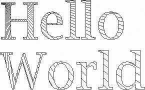

要获得字符轮廓，首先需要一个 font-render-context。使用 Graphics2D 的 `getFontRenderContext` 获得：

```java
FontRenderContext context = g2.getFontRenderContext();
```

然后，使用字符串、字体和 `FontRenderContext` 创建 `TextLayout`：

```java
var layout = new TextLayout("Hello", font, context);
```

`TextLayout` 描述字符串在特定字体下的 layout。layout 取决于 render-context，相同字符在屏幕和打印机上看起来也不会一样。

对此应用来说，关键是返回 `Shape` 的 `getOutline`方法，该 Shape 包含 textLayout 中字符的轮廓。该轮廓 Shape 从 (0, 0) 开始，可能不是我们想要的。我们可以在此基础上应用放射转换，`getOutline` 提供该重载方法：

```java
AffineTransform transform = AffineTransform.getTranslateInstance(0, 100);
Shape outline = layout.getOutline(transform);
```

然后，将 outline 附件到 clipping-shape：

```java
var clipShape = new GeneralPath();
clipShape.append(outline, false);
```

最后，设置 clipping-shape 并绘制一组线，这些线只出现在字符边界内：

```java

```