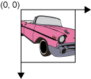

# Java 2D 基本概念

- [Java 2D 基本概念](#java-2d-基本概念)
  - [Java 2D API](#java-2d-api)
  - [坐标系](#坐标系)
  - [矢量图](#矢量图)
  - [绘图机制](#绘图机制)
  - [示例](#示例)

2023-12-26, 15:12⭐
***
## Java 2D API

Java 2D API 扩展 AWT 包，对二维图形、文本及成像功能提供了支持，可用于开发复杂的界面、绘图软件和图像编辑器。可用于：

- 绘制线、矩形等几何图形
- 以纯色、渐变或纹理填充几何图形
- 绘制文本，控制字体和渲染过程
- 绘制图像，可进行过滤操作
- 以上操作的合成和转换等
- 对图形旋转、缩放和扭曲等

Java 2D API 加强了 AWT 的图形文本功能，可以将 Java 2D 看做 AWT 的超集。功能：

- 为显示设备和打印机等提供了统一的渲染模型；
- 提供了大量的几何图元(geometric primitive)，如曲线(curves)、方形(rectangle)、椭圆(ellipse)，
- 并包含几乎可生成任何几何图形的机制；
- 图形、文本和图像的 hit detection 机制；
- 用于重叠图像对象渲染的混合模型；
- 增强颜色支持；
- 打印复杂的文档；
- 渲染的质量控制。

## 坐标系

Java 2D 对象位于用户坐标空间，当对象呈现在屏幕或打印机，用户空间坐标转换为设备空间坐标。

- 用户空间(User space)：绘制图形区域坐标系统
- 设备空间(Device space)：输出设备如屏幕、窗口或打印机的坐标系统

用户空间是编程时所使用的坐标空间，该坐标体系是与设备无关的逻辑坐标系统。

用户空间坐标的原点在左上角，x 坐标向右递增，y 向下递增，如下图所示。所有的坐标以整数指定(大多时候使用整数就足够了，也支持 float 和 double)。



设备空间与具体设备相关，虽然屏幕坐标系统和打印机的坐标系统相差很大，但是对 Java 程序没有任何影响，编程时不用考虑。

## 矢量图

有两种计算机图片：

- 矢量图（vector）：以点、线、曲线等基本几何图形表示图片，这些几何图元通过数学方程创建
- 光栅图（raster）：光栅图(位图)以像素点表示图片

两种类型的图片各有优缺点，矢量图的优点：

- 更小
- 不限制缩放
- 移动、缩放、填充、旋转等操作不降低图片质量

Java 2D API 提供了两种图片的处理工具。

## 绘图机制

自定义的绘制代码应该放在 `paintComponent()` 方法中，该方法在绘制时自动被调用。绘制系统会先调用 `paint()` 方法，该方法依次调用下面三个方法：

```java
paintComponent()
paintBorder()
paintChildren()
```

少数情况可能需要重写 `paintBorder()` 或 `paintChildren()` 方法，不过大多时候都只用覆盖 `paintComponent()` 方法。

渲染的基本步骤：

1. 获取一个 `Graphics` 对象
2. 设置该 `Graphics` 的属性
3. 用 `Graphics` 绘图

## 示例

```java
import javax.swing.*;
import java.awt.*;

class Surface extends JPanel { // 在 JPanel 上绘制文本

    private void doDrawing(Graphics g) {
        Graphics2D gd = (Graphics2D) g; // Graphics2D 是绘制的基本类
        gd.drawString("Java 2D", 50, 50); // 在 panel 上绘制字符串
    }

    @Override
    protected void paintComponent(Graphics g) { // 自定义绘制都在 paintComponent 中
        super.paintComponent(g); // 这个大部分时候是必须的
        doDrawing(g);
    }
}

public class SimpleEx extends JFrame {

    public SimpleEx() {
        initUI();
    }

    private void initUI() {
        add(new Surface());
        setTitle("Simple Java 2D example");
        setSize(300, 200);
        setLocationRelativeTo(null);
        setDefaultCloseOperation(WindowConstants.EXIT_ON_CLOSE);
    }

    public static void main(String[] args) {
        EventQueue.invokeLater(() -> {
            SimpleEx ex = new SimpleEx();
            ex.setVisible(true);
        });
    }
}
```


