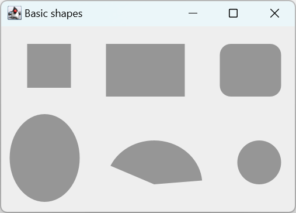

# 形状和填充

## 基本形状

```java
import javax.swing.*;
import java.awt.*;
import java.awt.geom.Ellipse2D;

class BasicShapesSurface extends JPanel {

    private void doDrawing(Graphics g) {
        Graphics2D gd = (Graphics2D) g;
        // 填充色：灰色
        gd.setPaint(new Color(150, 150, 150));

        RenderingHints rh = new RenderingHints(RenderingHints.KEY_ANTIALIASING, RenderingHints.VALUE_ANTIALIAS_ON);
        rh.put(RenderingHints.KEY_RENDERING, RenderingHints.VALUE_RENDER_QUALITY);
        gd.setRenderingHints(rh);

        // 绘制 6 个图形
        gd.fillRect(30, 20, 50, 50); // 正方形和矩形都用 fillRect
        gd.fillRect(120, 20, 90, 60); // 矩形
        gd.fillRoundRect(250, 20, 70, 60, 25, 25); // 圆角矩形

        gd.fill(new Ellipse2D.Double(10, 100, 80, 100)); // 椭圆
        gd.fillArc(120, 130, 110, 100, 5, 150); // 弧线
        gd.fillOval(270, 130, 50, 50); // 圆
    }

    @Override
    protected void paintComponent(Graphics g) {
        super.paintComponent(g);
        doDrawing(g);
    }
}

public class BasicShapesEx extends JFrame {

    public BasicShapesEx() {
        initUI();
    }

    private void initUI() {
        add(new BasicShapesSurface());

        setTitle("Basic shapes");
        setSize(350, 250);
        setLocationRelativeTo(null);
        setDefaultCloseOperation(JFrame.EXIT_ON_CLOSE);
    }

    public static void main(String[] args) {

        EventQueue.invokeLater(() -> {
            BasicShapesEx ex = new BasicShapesEx();
            ex.setVisible(true);
        });
    }
}
```



## GeneralPath

`GeneralPath` 可用于绘制任意复杂的图形。

```java

```