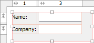
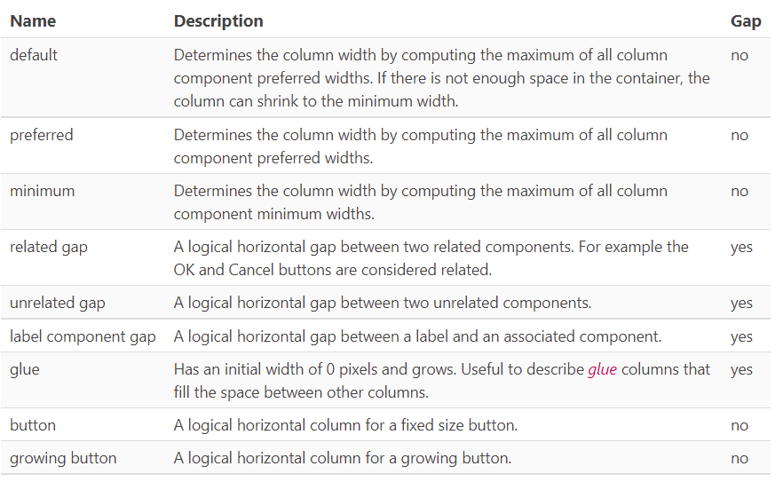

# JGoodies FormLayout

## 简介

JGoodies `FormLayout` 将组件放在由行和列组成的网格中，允许组件跨多个行和列。行可以有不同高度，列可以有不同宽度。

和常规网格布局不同：

- JGoodies FormLayout 索引以 1 开始；
- 将真实的 column/row 作为 gap，所以在可视化界面会发现编号总会出现空缺；
- 支持不同的单位：Dialog units, Pixel, Point, Millimeter, Centimeter 以及 Inch。特别是 Dialog units，用于创建于分辨率成比例的布局非常有用。

## 属性

|属性名称|描述|
|---|---|
|columnSpecs|用逗号分隔的 column 信息，不用直接编辑，可视化工具提供编辑功能|
|rowSpecs|用逗号分隔的 row 信息|

## Column/row 属性

下图是 WindowBuilder 编辑 Columns 的视图：

- 第一列 `#` 指定列编号；
- `Template` 预定义模板；
- `Alignment` 指定对齐方式；
- Size 指定 column 宽度，可以使用组件的 default, preferred 或 minimum size。也可以指定常量值；
- Resizing，指定 resize weight。

## Layout constraints properties

## Column templates

|Name|Description|Gap|
|---|---|---|
|related gap|另个相关组件之间的 gap。如 OK 和 Cancel 两个按钮|yes|
|unrelated gap|两个无关组件之间的 gap|yes|
|label component gap|标签和其相关组件之间的 gap|yes|

## Row templates

|Name|Description|Gap|
|---|---|---|
|default|通过计算所有行组件高度的最大值确定行高度，如果空间不足，行可以缩小到 minimum 高度|no|
|preferred|以行里所有组件的 preferred height 的最大值确定行高|no|
|minimum|以行里所有组件的 minimum height 的最大值确定行高|no|
|related gap|两个相关组件之间的垂直 gap|yes|
|unrelated gap|两个不相关组件之间的垂直 gap|yes|
|label component gap|标签和其相关组件之间的垂直 gap|yes|
|narrow line gap|两行之间窄间距。适用于垂直空间不足或单个垂直间隙小于默认行间隙|yes|
|line gap|两行之间默认间距，比 narrow line gap 略大|yes|
|paragraph gap|两个段落之间的默认间距，比 line gap 大|yes|
|glue|初始高度为 0 pixel，可不断增长|用于填充两行之间|

## 参考

- https://www.formdev.com/jformdesigner/doc/layouts/formlayout/
- http://www.jgoodies.com/freeware/libraries/forms/
