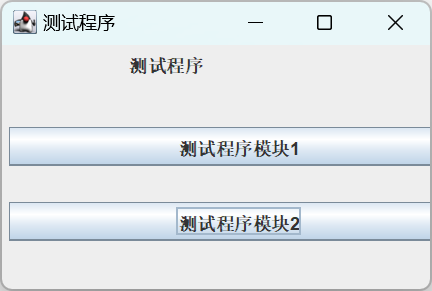

# SpringLayout

- [SpringLayout](#springlayout)
  - [简介](#简介)
  - [示例](#示例)

2023-12-22, 11:23
****

## 简介

`SpringLayout` 通过定义组件的边距实现布局。边距使用 `Spring` 对象表示，每个 Spring 对象具有 4 个属性值：minimum, maximum, preferred, value，其中 value 是真实值。

| 常量 | 说明 |
| ---- | ---- |
|`String NORTH  = "North";`|指定组件的上边距|
|`String SOUTH  = "South";`|指定组件的下边距|
|`String EAST   = "East";`|指定组件的右边距|
|`String WEST   = "West";`|指定组件的左边距|

`SpringLayout` 使用起来相对 GridBagLayout 和 BoxLayout 更复杂一些。

## 示例

```java
public class SpringLayoutDemo1 {

    public static void main(String[] args) {
        JFrame jf = new JFrame("测试程序");
        jf.setSize(300, 200);
        jf.setDefaultCloseOperation(JFrame.EXIT_ON_CLOSE);
        jf.setVisible(true);

        JPanel contentPane = new JPanel();
        jf.setContentPane(contentPane);

        //创建了两个普通按钮组件、一个标签组件，将它们添加到中间容器中
        JButton b1 = new JButton("测试程序模块1");
        JButton b2 = new JButton("测试程序模块2");
        JLabel l = new JLabel("测试程序");
        contentPane.add(l);
        contentPane.add(b2);
        contentPane.add(b1);

        // 创建一个 SpringLayout布局管理器，并且将之作为中间容器的布局方式
        SpringLayout lay = new SpringLayout();
        contentPane.setLayout(lay);

        //针对每个组件设置其与边界的距离
        lay.putConstraint(SpringLayout.NORTH, l, 5, SpringLayout.NORTH, contentPane);
        lay.putConstraint(SpringLayout.WEST, l, 85, SpringLayout.WEST, contentPane);
        lay.putConstraint(SpringLayout.EAST, l, 85, SpringLayout.EAST, contentPane);

        lay.putConstraint(SpringLayout.NORTH, b1, 55, SpringLayout.NORTH, contentPane);
        lay.putConstraint(SpringLayout.WEST, b1, 5, SpringLayout.WEST, contentPane);
        lay.putConstraint(SpringLayout.EAST, b1, 25, SpringLayout.EAST, contentPane);

        lay.putConstraint(SpringLayout.NORTH, b2, 105, SpringLayout.NORTH, contentPane);
        lay.putConstraint(SpringLayout.WEST, b2, 5, SpringLayout.WEST, contentPane);
        lay.putConstraint(SpringLayout.EAST, b2, 25, SpringLayout.EAST, contentPane);
    }
}
```


