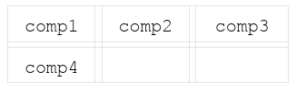
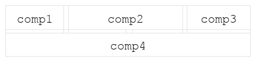
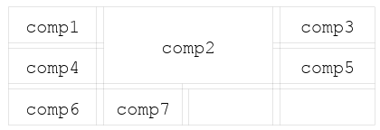
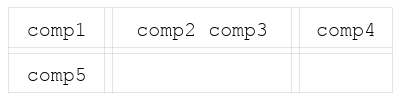

# MigLayout 快速入门

## 向网格添加组件

向容器内添加组件，操作非常简单，且遵循相同的基础规则。直接添加组件时，所有组件默认排列在同一行。若需要换行，只需设置约束指令 **wrap**，后续添加的组件便会自动排布至下一行。示例：

```java
panel.add(comp1)
panel.add(comp2)
panel.add(comp3, "wrap")   // Wrap to next row
panel.add(comp4)
```



也可以在创建 `MigLayout` 时指定换行的 column-index。例如，指定 3 个 columns 后换行（效果同上）：

```java
MigLayout layout = new MigLayout("wrap 3");
```

还可以在 `wrap` 关键字后指定下一行的间距（gap）：

```java
panel.add(comp3, "wrap 15")
```

该代码会将行间距设置为 15 pixel。还可以设置弹性填充间距，将其设置为 `wrap push` 即可。


## 合并与拆分 cell

```java
panel.add(comp1)
panel.add(comp2, "span 2") // The component will span two cells.
panel.add(comp3, "wrap")   // Wrap to next row 
panel.add(comp4, "span")   // Span without "count" means span whole row.
```



`span` 可以带两个参数 `x` 和 `y`，对应水平和垂直的 cell 数。例如：

```java
panel.add(comp1);
panel.add(comp2, "span 2 2");  // The component will span 2x2 cells.
panel.add(comp3, "wrap");      // Wrap to next row 
panel.add(comp4);
panel.add(comp5, "wrap");      // Note that it "jumps over" the occupied cells.
panel.add(comp6);
panel.add(comp7);
```



拆分 cell：

```java
 panel.add(comp1);
 panel.add(comp2, "split 2");  // Split the cell in two
 panel.add(comp3);             // Will be in same cell as previous
 panel.add(comp4, "wrap");     // Wrap to next row
 panel.add(comp5);
```



也可以同时执行单元格**合并**与**拆分**操作。例如，可以先跨格合并三个单元格，再将这个横跨三列的单元格拆分为两部分。

## 使用绝对 cell 坐标

使用坐标指定组件位置：

```java
 panel.add(comp1, "cell 0 0"); // "cell column row"
 panel.add(comp2, "cell 1 0");
 panel.add(comp3, "cell 2 0");
 panel.add(comp4, "cell 0 1");
```


这里也可以指定 span 和 split。将组件放入一个已有组件的 cell，cell 会自动拆分会导致该 cell split。示例：

```java
panel.add(comp1, "cell 0 0");
panel.add(comp2, "cell 1 0 2 1");  // "cell column row width height"
panel.add(comp3, "cell 3 0");
panel.add(comp4, "cell 0 1 4 1");
```


## 间距设置

通常情况下，miglayout 会在合理位置自动添加间距，且不同操作系统平台的默认间距各不相同。例如，macOS 的默认间距整体大于 Windows 与 Linux 系统。MigLayout 包含两种间距类型：

- **网格行间距**
- 组件间距

二者均配有合理的默认参数，同时支持自定义修改，可按需自由调整。

默认 gap 具有平台依赖性，对应 `"related"` gap 默认值。例如，Mac OS X 的 gap 通常比 Windows 和 Linux 要大。可以在 layout 约束中覆盖整个 layout 的默认 gap，也可以在 row/column 约束中分别指定。

gap 不会累加，例如，如果组件 1 后面的 gap 为 10px，下一个组件 2 前面的 gap 为 20px，那么最终的 gap 为 20px，而不是 30px。

gap 可以按照 min/pref/max 格式指定，使得它们可以随着可用空间的变化而变化。

gap 后添加 `:push`，表示 gap 占据余下所有空间：

- cell 中的 pushing-gap 使得 cell 不会过大；
- columns/rows 中的 pushing-gap 使得布局填充整个容器。

### grid gap

在创建 `MigLayout` 时，可以在 column/row 约束中指定 gap。例如：

```java
MigLayout layout = new MigLayout(
    "",           // Layout Constraints
    "[][]20[]",   // Column constraints
    "[]20[]");    // Row constraints
```


其中较大的 gap 为 20px。这里也可以使用其它单位，如 20mm。

#### component gap

当一个 cell 里有多个组件，才会用到组件 gap。gap 是到最近边缘的距离，可以是 cell 的边界，也可以是到相同 cell 里其它组件的距离。

在添加组件时指定组件 gap。例如：

```java
 panel.add(comp1)
 panel.add(comp2, "gapleft 30")
 panel.add(comp3, "wrap")   // Wrap to next row
 panel.add(comp4)
```


有许多 gap 相关约束，可以查询[组件约束](#组件约束)。