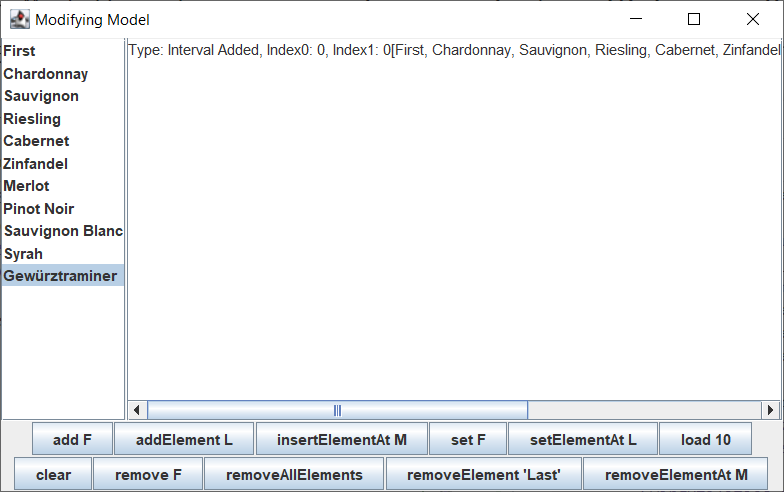

# 列表类型控件

2024-01-02, 20:10⭐
@author Jiawei Mao
***
## 简介

Swing 提供两个显示列表数据的控件：`JList` 和 `JComboBox`。两者的主要区别在于 `JList` 支持多选，而 `JComboBox` 占用空间小。此外，`JComboBox` 允许提供可用选项之外的选择。如下所示：


## ListModel 接口

`JComboBox` 和 `JList` 共享数据模型接口 `ListModel`。`AbstractListModel` 实现了一组 `ListDataListener` 对象的管理和通知，提供了一个实现基础。

- 对 `JList`，其默认数据模型为 `DefaultListModel`，内部以 `Vector` 存储数据
- 对 `JComboBox`，其数据模型接口 `ComboBoxModel` 扩展 `ListModel`，添加了选择元素的概念，`MutableComboBoxModel` 进一步扩展 `ComboBoxModel`，支持添加和删除元素，默认实现为 `DefafultComboBoxModel`。

> [!NOTE]
>
> `BasicDirectoryModel` 也实现了 `ListModel`，在 `JFileChooser` 中使用。

`ListModel` 接口十分简单：

```java
public interface ListModel<E>{

  int getSize();

  E getElementAt(int index);

  void addListDataListener(ListDataListener l);

  void removeListDataListener(ListDataListener l);
}
```

## AbstractListModel

`AbstractListModel` 提供了 `ListModel` 接口的 `ListDataListener` 实现。扩展该类只需要提供数据结构和**数据**。该类提供 `ListDataListener` 对象的列表管理，以及在数据更改时通知 listeners。

- 返回注册到 `AbstractListModel` 的所有 `ListDataListener`

```java
public ListDataListener[] getListDataListeners()
```

在修改数据后，需要调用合适的方法通知 listeners，通知的方法包括：

> [!WARNING]
>
> 下面方法中 `index0` 和 `index1` 都是闭区间索引，即包含索引对应的元素。而且 `index0` 不需要比 `index1` 小，它们只是指定两个端点。

- 添加一个或多个元素到模型后，调用该方法。这里 `index0` 和 `index1` 为闭区间。

```java
protected void fireIntervalAdded(Object source, int index0, int index1)
```

- 删除一个或多个元素之后，调用该方法。

```java
protected void fireIntervalRemoved(Object source, int index0, int index1)
```

- 元素内容发生改变后调用该方法。

```java
protected void fireContentsChanged(Object source, int index0, int index1)
```

对已有数据，需要将其转换为 Swing 组件支持的数据结构，或者自定义实现 `ListModel` 接口。`JList` 和 `JComboBox` 直接支持数组和 `Vector`。对其它数据结构，如 `ArrayList`，可以按如下方式扩展 `AbstractListModel`：

```java
final List arrayList = ...;
ListModel model = new AbstractListModel() {
    public int getSize() {
        return arrayList.size();
    }
    public Object getElementAt(int index) {
        return arrayList.get(index);
    }
}
```

或者，将 `List` 转换为数组或 `Vector`，效果一样。

## DefaultListModel 类

`DefaultListModel` 内部以 `Vector` 存储数据，相对 `AbstractListModel` 只额外加了一个字段：

```java
private Vector<E> delegate = new Vector<E>();
```

`AbstractListModel` 已实现 `ListDataListener`，所以使用 `DefaultListModel` 只需要添加数据。

首先，使用默认构造函数创建 `DefaultListModel`：

```java
DefaultListModel model = new DefaultListModel()
```

`DefaultListModel` 只有两个属性：

|属性|类型|权限|
|---|---|---|
|empty|boolean|read-only|
|size|int|read-write|

添加元素操作：

```java
public void add(int index, E element)
public void addElement(E element)
public void insertElementAt(E element, int index)
```

设置元素操作：

```java
public E set(int index, E element) 
public void setElementAt(E element, int index)
```

删除元素操作：

```java
public void clear()
public E remove(int index)
public void removeAllElements()
public boolean removeElement(Object obj)
public void removeElementAt(int index)
public void removeRange(int fromIndex, int toIndex)
```

当你的数据不在现有数据结构中，`DefaultListModel` 是很好的选择。例如，以 JDBC `ResultSet` 返回的数据库检索结果，如果希望在 JList 中显示查询内容，那么必须将它们存储在某个地方，DefaultListModel 是个选择：

```java
ResultSet results = aJDBCStatement.executeQuery("SELECT columnName FROM tableName");
DefaultListModel model = new DefaultListModel();
while (results.next()) {
    model.addElement(result.getString(1));
}
```

## ListDataListener 接口

如果需要监听列表内容的变换，可以向 `ListModel` 注册 `ListDataListener`，这是一个很简单的接口，监听元素的添加、删除和更改事件：

```java
public interface ListDataListener extends EventListener {

    void intervalAdded(ListDataEvent e);

    void intervalRemoved(ListDataEvent e);

    void contentsChanged(ListDataEvent e);
}
```

`ListDataEvent` 包含事件信息，该类含有三个属性值：

|属性|类型|权限|说明|
|---|---|---|----|
|index0|int|read-only|列表更改的起始位置|
|index1|int|read-only|列表更改的结束位置
|type|int|read-only|事件类型|

对单个元素，`index0` 等于 `index1`，两者无需有序，只是指定改变的区间。

`type` 指定事件类型，三个类型与 `ListDataListener` 的三个方法一一对应：

|类型|方法|
|---|---|
|`CONTENTS_CHANGED`|`contentsChanged`|
|`INTERVAL_ADDED`|`intervalAdded`|
|`INTERVAL_REMOVED`|`intervalRemoved`|

**示例：** 演示 `ListDataListener` 的用法，调用 `DefaultListModel` 的修改方法，将事件和 list 内容输出到 `JTextArea`

```java
import javax.swing.*;
import javax.swing.event.ListDataEvent;
import javax.swing.event.ListDataListener;
import java.awt.*;
import java.io.PrintWriter;
import java.io.StringWriter;

public class ModifyModelSample {

    static String[] labels = {"Chardonnay", "Sauvignon", "Riesling", "Cabernet",
            "Zinfandel", "Merlot", "Pinot Noir", "Sauvignon Blanc", "Syrah",
            "Gewürztraminer"};

    public static void main(String[] args) {
        Runnable runner = () -> {
            JFrame frame = new JFrame("Modifying Model");
            frame.setDefaultCloseOperation(JFrame.EXIT_ON_CLOSE);
            // 填充数据
            final DefaultListModel<String> model = new DefaultListModel<>();
            for (String label : labels) {
                model.addElement(label);
            }
            JList<String> jlist = new JList<>(model);
            JScrollPane scrollPane1 = new JScrollPane(jlist);
            frame.add(scrollPane1, BorderLayout.WEST);

            final JTextArea textArea = new JTextArea();
            textArea.setEditable(false);
            JScrollPane scrollPane2 = new JScrollPane(textArea);
            frame.add(scrollPane2, BorderLayout.CENTER);

            ListDataListener listDataListener = new ListDataListener() {
                public void contentsChanged(ListDataEvent listDataEvent) {
                    appendEvent(listDataEvent);
                }

                public void intervalAdded(ListDataEvent listDataEvent) {
                    appendEvent(listDataEvent);
                }

                public void intervalRemoved(ListDataEvent listDataEvent) {
                    appendEvent(listDataEvent);
                }

                private void appendEvent(ListDataEvent listDataEvent) {
                    StringWriter sw = new StringWriter();
                    PrintWriter pw = new PrintWriter(sw);
                    switch (listDataEvent.getType()) {
                        case ListDataEvent.CONTENTS_CHANGED -> pw.print("Type: Contents Changed");
                        case ListDataEvent.INTERVAL_ADDED -> pw.print("Type: Interval Added");
                        case ListDataEvent.INTERVAL_REMOVED -> pw.print("Type: Interval Removed");
                    }
                    pw.print(", Index0: " + listDataEvent.getIndex0());
                    pw.print(", Index1: " + listDataEvent.getIndex1());
                    DefaultListModel<String> theModel = (DefaultListModel) listDataEvent.getSource();
                    pw.println(theModel);
                    textArea.append(sw.toString());
                }
            };
            model.addListDataListener(listDataListener);

            // Set up buttons
            JPanel jp = new JPanel(new GridLayout(2, 1));
            JPanel jp1 = new JPanel(new FlowLayout(FlowLayout.CENTER, 1, 1));
            JPanel jp2 = new JPanel(new FlowLayout(FlowLayout.CENTER, 1, 1));
            jp.add(jp1);
            jp.add(jp2);
            JButton jb = new JButton("add F");
            jp1.add(jb);
            jb.addActionListener(actionEvent -> model.add(0, "First"));
            jb = new JButton("addElement L");
            jp1.add(jb);
            jb.addActionListener(actionEvent -> model.addElement("Last"));
            jb = new JButton("insertElementAt M");
            jp1.add(jb);
            jb.addActionListener(actionEvent -> {
                int size = model.getSize();
                model.insertElementAt("Middle", size / 2);
            });
            jb = new JButton("set F");
            jp1.add(jb);
            jb.addActionListener(actionEvent -> {
                int size = model.getSize();
                if (size != 0)
                    model.set(0, "New First");
            });
            jb = new JButton("setElementAt L");
            jp1.add(jb);
            jb.addActionListener(actionEvent -> {
                int size = model.getSize();
                if (size != 0)
                    model.setElementAt("New Last", size - 1);
            });

            jb = new JButton("load 10");
            jp1.add(jb);
            jb.addActionListener(actionEvent -> {
                for (String label : labels) {
                    model.addElement(label);
                }
            });
            jb = new JButton("clear");
            jp2.add(jb);
            jb.addActionListener(actionEvent -> model.clear());
            jb = new JButton("remove F");
            jp2.add(jb);
            jb.addActionListener(actionEvent -> {
                int size = model.getSize();
                if (size != 0)
                    model.remove(0);
            });
            jb = new JButton("removeAllElements");
            jp2.add(jb);
            jb.addActionListener(actionEvent -> model.removeAllElements());
            jb = new JButton("removeElement 'Last'");
            jp2.add(jb);
            jb.addActionListener(actionEvent -> model.removeElement("Last"));
            jb = new JButton("removeElementAt M");
            jp2.add(jb);
            jb.addActionListener(actionEvent -> {
                int size = model.getSize();
                if (size != 0)
                    model.removeElementAt(size / 2);
            });
            jb = new JButton("removeRange FM");
            jp2.add(jb);
            jb.addActionListener(actionEvent -> {
                int size = model.getSize();
                if (size != 0)
                    model.removeRange(0, size / 2);
            });
            frame.add(jp, BorderLayout.SOUTH);
            frame.setSize(640, 300);
            frame.setVisible(true);
        };
        EventQueue.invokeLater(runner);
    }
}
```



- 左侧显示列表；
- 右侧 `TextArea` 显示事件；
- 下面的按钮用于修改列表，从而产生事件；
- `listDataListener` 监听列表，并将时间信息输出到右侧的 `TextArea`。

## ComboBoxModel 接口

`ComboBoxModel` 接口扩展 `ListModel` 接口，主要添加选择元素功能：

```java
public interface ComboBoxModel<E> extends ListModel<E> {

  void setSelectedItem(Object anItem);

  Object getSelectedItem();
}
```

这两个方法便于使用 `selectedItem` 属性管理选中的项目。

## MutableComboBoxModel 接口

`MutableComboBoxModel` 扩展 `ComboBoxModel`，增加修饰数据模型的功能。`JComboBox` 默认实现该接口。

```java
public interface MutableComboBoxModel<E> extends ComboBoxModel<E> {

    public void addElement( E item );

    public void removeElement( Object obj );

    public void insertElementAt( E item, int index );

    public void removeElementAt( int index );
}
```

## DefaultComboBoxModel 类

`DefaultComboBoxModel` 类扩展 `AbstractListModel`，为 `JComboBox` 提供数据模型,并且实现了 `MutableComboBoxModel` 接口，因此是可修改的。与 `DefaultListModel` 一样，`DefaultComboBoxModel` 内部以 `Vector` 存储数据，其内部实现有两个关键字段：

```java
Vector<E> objects;
Object selectedObject;
```

`objects` 存储数据，`selectedObject` 存储选择的数据。

余下部分和 `DefaultListModel` 基本一致。

另外，如果从数组创建 `DefaultComboBoxModel`，数组元素将被复制到内部的 `Vector`；如果使用 `Vector`，则不复制，而是直接使用该 `Vector`。

`DefaultComboBoxModel` 构造函数：

```java
public DefaultComboBoxModel()
public DefaultComboBoxModel(final E[] items) {
public DefaultComboBoxModel(Vector<E> v)
```

`DefaultComboBoxModel` 足够灵活，一般**不需要自定义** `ComboBoxModel` 实现，只需要创建 `DefaultComboBoxModel` 并填充数据。

### 自定义 ComboBoxModel

如果要自定义模型，比如已有自己的数据结构，可以和 `DefaultComboBoxModel` 一样，扩展 `AbstractListModel`，并实现 `MutableComboBoxModel` 或 `ComboBoxModel` 接口，然后只需要提供数据结构存储数据，以及一个单独的字段保存选择的元素。

**示例：** 使用 `ArrayList` 作为数据结构自定义实现 `ComboBoxModel`

```java
import javax.swing.*;
import java.awt.*;
import java.util.ArrayList;
import java.util.Collection;

public class ArrayListComboBoxModel extends AbstractListModel implements ComboBoxModel {

    private Object selectedItem;
    private ArrayList anArrayList;

    public ArrayListComboBoxModel(ArrayList arrayList) {
        anArrayList = arrayList;
    }

    @Override
    public Object getSelectedItem() {
        return selectedItem;
    }

    @Override
    public void setSelectedItem(Object newValue) {
        selectedItem = newValue;
    }

    @Override
    public int getSize() {
        return anArrayList.size();
    }

    @Override
    public Object getElementAt(int i) {
        return anArrayList.get(i);
    }

    public static void main(String[] args) {
        Runnable runner = () -> {
            JFrame frame = new JFrame("ArrayListComboBoxModel");
            frame.setDefaultCloseOperation(JFrame.EXIT_ON_CLOSE);

            Collection<Object> col = System.getProperties().values();
            ArrayList<Object> arrayList = new ArrayList<>(col);
            ArrayListComboBoxModel model = new ArrayListComboBoxModel(arrayList);
            JComboBox comboBox = new JComboBox(model);
            frame.add(comboBox, BorderLayout.NORTH);
            frame.setSize(300, 225);
            frame.setVisible(true);
        };
        EventQueue.invokeLater(runner);
    }
}
```


相对 `DefaultComboBoxModel`，已实现的方法主要有三点：

- 底层数据从 `Vector` 变为 `ArrayList`；
- 修改元素没有发出事件；
- 没有了边界检查。

### 相同元素处理

大多时候使用 `DefaultComboBoxModel` 就够了，不过有一个例外，如果你想支持同个元素出现多次，但是模型中设置选择元素时有 `equals` 判定，如下：

```java
public void setSelectedItem(Object anObject) {
    if ((selectedObject != null && !selectedObject.equals( anObject )) ||
        selectedObject == null && anObject != null) {
        selectedObject = anObject;
        fireContentsChanged(this, -1, -1);
    }
}
```

此时就无法从一个元素跳转到和它相同的元素，如果需要该功能，就需要自定义模型了。
