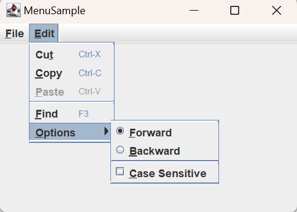

# 菜单

- [菜单](#菜单)
  - [简介](#简介)
  - [菜单相关类](#菜单相关类)
    - [JMenuBar](#jmenubar)
      - [JMenuBar 属性](#jmenubar-属性)
    - [SingleSelectionModel](#singleselectionmodel)
    - [JMenuItem](#jmenuitem)
    - [JMenu](#jmenu)

2024-03-29
@author Jiawei Mao
***

## 简介

菜单的基本结构如下所示：


菜单栏从上到下分为三部分：

- 菜单栏（`JMenuBar`）
- 菜单（`JMenu`）：如 `File`, `Edit`
- 菜单项（`JMenuItem`）：如 `Cut`, `Copy`, `Close` 等
- 除了 `JSeparator` 和 `JPopupMenu` 组件，其它菜单组件都可以设置 icon

其它特点：

- `JSeparator` 用于将选项分为不同分组。
- 每个菜单选项都有一个关联的**助记符**（mnemonic），以支持键盘导航和选择。
- 还可以为菜单选项设置**快捷键**（keystroke），与助记符不同的是，快捷键可以直接激活菜单选项，即使菜单选项不可见。

**例 1：** 下面只是创建菜单，没有赋予任何功能，点击菜单选项只是打印名称

```java
import javax.swing.*;
import java.awt.*;
import java.awt.event.ActionEvent;
import java.awt.event.ActionListener;
import java.awt.event.KeyEvent;

public class MenuSample {

    static class MenuActionListener implements ActionListener {
        @Override
        public void actionPerformed(ActionEvent e) {
            System.out.println("Selected: " + e.getActionCommand());
        }
    }

    public static void main(String[] args) {
        Runnable runner = new Runnable() {
            @Override
            public void run() {
                ActionListener menuListener = new MenuActionListener();
                JFrame frame = new JFrame("MenuSample");
                frame.setDefaultCloseOperation(JFrame.EXIT_ON_CLOSE);

                JMenuBar menuBar = new JMenuBar();

                // File Menu, F-Mnemonic
                JMenu fileMenu = new JMenu("File");
                fileMenu.setMnemonic(KeyEvent.VK_F);
                menuBar.add(fileMenu);

                // File->New, N-Mnemonic
                JMenuItem newMenuItem = new JMenuItem("New", KeyEvent.VK_N);
                newMenuItem.addActionListener(menuListener);
                fileMenu.add(newMenuItem);

                // File->Open, O-Mnemonic
                JMenuItem openMenuItem = new JMenuItem("Open", KeyEvent.VK_O);
                openMenuItem.addActionListener(menuListener);
                fileMenu.add(openMenuItem);

                // File->Close, C-Mnemonic
                JMenuItem closeMenuItem = new JMenuItem("Close", KeyEvent.VK_C);
                closeMenuItem.addActionListener(menuListener);
                fileMenu.add(closeMenuItem);

                // Separator
                fileMenu.addSeparator();

                // File->Exit, X-Mnemonic
                JMenuItem exitMenuItem = new JMenuItem("Exit", KeyEvent.VK_X);
                exitMenuItem.addActionListener(menuListener);
                fileMenu.add(exitMenuItem);

                // Edit Menu, E-Mnemonic
                JMenu editMenu = new JMenu("Edit");
                editMenu.setMnemonic(KeyEvent.VK_E);
                menuBar.add(editMenu);

                // Edit->Cut, T - Mnemonic, CTRL-X - Accelerator
                JMenuItem cutMenuItem = new JMenuItem("Cut", KeyEvent.VK_T);
                cutMenuItem.addActionListener(menuListener);
                KeyStroke ctrlXKeyStroke = KeyStroke.getKeyStroke("control X");
                cutMenuItem.setAccelerator(ctrlXKeyStroke);
                editMenu.add(cutMenuItem);

                // Edit->Copy, C - Mnemonic, CTRL-C - Accelerator
                JMenuItem copyMenuItem = new JMenuItem("Copy", KeyEvent.VK_C);
                copyMenuItem.addActionListener(menuListener);
                KeyStroke ctrlCKeyStroke = KeyStroke.getKeyStroke("control C");
                copyMenuItem.setAccelerator(ctrlCKeyStroke);
                editMenu.add(copyMenuItem);

                // Edit->Paste, P - Mnemonic, CTRL-V - Accelerator, Disabled
                JMenuItem pasteMenuItem = new JMenuItem("Paste", KeyEvent.VK_P);
                pasteMenuItem.addActionListener(menuListener);
                KeyStroke ctrlVKeyStroke = KeyStroke.getKeyStroke("control V");
                pasteMenuItem.setAccelerator(ctrlVKeyStroke);
                pasteMenuItem.setEnabled(false);
                editMenu.add(pasteMenuItem);

                // Separator
                editMenu.addSeparator();

                // Edit->Find, F - Mnemonic, F3 - Accelerator
                JMenuItem findMenuItem = new JMenuItem("Find", KeyEvent.VK_F);
                findMenuItem.addActionListener(menuListener);
                KeyStroke f3KeyStroke = KeyStroke.getKeyStroke("F3");
                findMenuItem.setAccelerator(f3KeyStroke);
                editMenu.add(findMenuItem);

                // Edit->Options Submenu, O - Mnemonic, at.gif - Icon Image File
                JMenu findOptionsMenu = new JMenu("Options");
                Icon atIcon = new ImageIcon("at.gif");
                findOptionsMenu.setIcon(atIcon);
                findOptionsMenu.setMnemonic(KeyEvent.VK_O);

                // ButtonGroup for radio buttons
                ButtonGroup directionGroup = new ButtonGroup();

                // Edit->Options->Forward, F - Mnemonic, in group
                JRadioButtonMenuItem forwardMenuItem =
                        new JRadioButtonMenuItem("Forward", true);
                forwardMenuItem.addActionListener(menuListener);
                forwardMenuItem.setMnemonic(KeyEvent.VK_F);
                findOptionsMenu.add(forwardMenuItem);
                directionGroup.add(forwardMenuItem);

                // Edit->Options->Backward, B - Mnemonic, in group
                JRadioButtonMenuItem backwardMenuItem =
                        new JRadioButtonMenuItem("Backward");
                backwardMenuItem.addActionListener(menuListener);
                backwardMenuItem.setMnemonic(KeyEvent.VK_B);
                findOptionsMenu.add(backwardMenuItem);
                directionGroup.add(backwardMenuItem);

                // Separator
                findOptionsMenu.addSeparator();

                // Edit->Options->Case Sensitive, C - Mnemonic
                JCheckBoxMenuItem caseMenuItem =
                        new JCheckBoxMenuItem("Case Sensitive");
                caseMenuItem.addActionListener(menuListener);
                caseMenuItem.setMnemonic(KeyEvent.VK_C);
                findOptionsMenu.add(caseMenuItem);
                editMenu.add(findOptionsMenu);

                frame.setJMenuBar(menuBar);
                frame.setSize(350, 250);
                frame.setVisible(true);
            }
        };
        EventQueue.invokeLater(runner);
    }
}
```



助记符通常与 Alt 联用，例如 Alt+E 激活 Edit 菜单，然后按 C 或 Alt+C 触发 Copy 菜单。

快捷键的优势就是不需要先激活 Edit 菜单，直接 Ctrl+C 就可以触发 Copy 菜单。

辅助键（meta-key）：

- Windows, Alt
- UNIX, Alt
- Mac, Command

> [!TIP]
>
> 助记符不区分大小写。当按钮的 label 的第一个字符和助记符相同，则它在刚显示时会带下划线，提示用户该字符为助记符。

## 菜单相关类


如图所示，`JMenuItem` 及其子类继承自 `AbstractButton`，因此支持 icon 和 HTML 文本标签。当激活菜单，menu-item 自动弹出一个弹出式菜单。

另外，菜单相关类：`JMenuBar`, `JPopupMenu`, `JMenuItem` 及其子类都实现了 `MenuElement` 接口， 以支持键盘和鼠标导航。

**创建菜单**分三步：

1. 先创建 `JMenuBar`
2. 再创建 `JMenu`，添加到 `JMenuBar`
3. 最后创建 `JMenuItem`，添加到对应 `JMenu`

### JMenuBar

`JMenuBar` 为菜单栏组件，通过 `SingleSelectionModel` 确定选择的 `JMenu`。

**创建 JMenuBar**

`JMenuBar` 只有一个构造函数：

```java
JMenuBar()
```

创建 `JMenuBar` 后，可以使用 `setJMenuBar` 将其添加到 `JDialog`, `JFrame`, `JInternalFrame` 或 `JRootPane`。

```java
JMenuBar menuBar = new JMenuBar();
// Add items to it
...
JFrame frame = new JFrame("MenuSample Example");
frame.setJMenuBar(menuBar);
```

系统默认的 laf 将菜单放在窗口顶部，窗口标题下方。其它 laf 可能将菜单栏放在其它地方。

也可以使用 `Container.add()` 将 `JMenuBar` 添加到窗口，此时 `JMenuBar` 由 `Contianer` 的 layout-manager 管理。

**添加 JMenu**

`JMenuBar` 必须填充 `JMenu` 才有意义，否则只有边框没有内容。将 `JMenu` 添加到 `JMenuBar` 只有一个方法：

```java
public JMenu add(JMenu menu)
```

添加的 `JMenu` 按照添加顺序从左到右显示。

`JMenuBar` 还重载 `Container` 的几个 `add` 方法，提供了更灵活添加 `JMenu` 的方法。例如 `add(Component component, int index)` 可以添加 `JMenu` 到指定位置。

另外，可以使用下面两个 `remove` 方法从 `JMenuBar` 移除 `JMenu`：

```java
bar.remove(edit);
bar.remove(0);
```

> [!TIP]
>
> 移除 `JMenu` 有其应用场景，例如，实现普通模式和专家模式，在普通模式下移除某些菜单。需要注意，添加或删除 `JMenuItem` 或 `JMenu` 后，需要调用 `JMenuBar` 的 `revalidate()` 以显示更改后的内容。
>
> 当然，实现该模式的更有效的方式是将部分 `JMenuItem` 或整个 `JMenu` 禁用/启用。

#### JMenuBar 属性

**selected**

`selected` 和 selectionModel 控制菜单栏上当前选中的 `JMenu`。选中的 `JMenu` 以弹窗形式显示。

**layout**

如果希望菜单栏垂直显式，而不是水平显式，只需更改菜单栏的 `LayoutManager`。例如，采用 0 行 1 列的 `GridLayout` 即可完成该任务。如下：

```java
import java.awt.*;
import javax.swing.*;
public class VerticalMenuBar extends JMenuBar {
  private static final LayoutManager grid = new GridLayout(0,1);
  public VerticalMenuBar() {
    setLayout(grid);
  }
}
```


> [!NOTE]
>
> 将 `JMenuBar` 的 layout 转换为垂直的，弹窗会遮挡菜单栏，如果要避免该问题，需要扩展 `JMenu` 并覆盖其 `getPopupMenuOrigin()` 方法。

### SingleSelectionModel

`SingleSelectionModel` 接口定义最多一个索引选择的选择模型。`JMenuBar` 和 `JPopupMenu` 均采用该选择模型。对 `JMenuBar`，该接口定义当前选择的 `JMenu`；对 `JPopupMenu`，该接口定义当前选择的 `JMenuItem`。

> [!NOTE]
>
> `JTabbedPane` 也采用 `SingleSelectionModel` 作为选择模型。

`SingleSelectionModel` 的定义如下：

```java
public interface SingleSelectionModel {

    // 当前索引，-1 表示无选择
    public int getSelectedIndex();
    public void setSelectedIndex(int index);
    // 索引是否为 -1
    public boolean isSelected();
    // 清除选择，即索引设为 -1
    public void clearSelection();

    void addChangeListener(ChangeListener listener);
    void removeChangeListener(ChangeListener listener);
}
```

除了索引，该接口要求维护 `ChangeListener` list，在索引发生变化时触发事件。

`SingleSelectionModel` 的默认实现为 `javax.swing.DefaultSingleSelectionModel`。对 `JMenuBar` 和 `JPopupMenu`，使用该默认实现就足够了。

## JMenuItem

作为 `AbstractButton` 的子类，`JMenuItem` 的行为与 `JButton` 类似，且采用 `JButton` 的数据模型 `BUttonModel` 接口 `DefaultButtonModel` 实现。

**创建 JMenuItem**

`JMenuItem` 提供了 6 个构造函数，用于 label, icon, mnemonic 的初始化。

```java
public JMenuItem()
JMenuItem jMenuItem = new JMenuItem();

public JMenuItem(Icon icon)
Icon atIcon = new ImageIcon("at.gif");
JMenuItem jMenuItem = new JMenuItem(atIcon);

public JMenuItem(String text)
JMenuItem jMenuItem = new JMenuItem("Cut");

public JMenuItem(String text, Icon icon)
Icon atIcon = new ImageIcon("at.gif");
JMenuItem jMenuItem = new JMenuItem("Options", atIcon);

public JMenuItem(String text, int mnemonic)
JMenuItem jMenuItem = new JMenuItem("Cut", KeyEvent.VK_T);

public JMenuItem(Action action)
Action action = ...;
JMenuItem jMenuItem = new JMenuItem(action);
```

### JMenuItem 属性

**accelerator**

快捷键属性。`KeyStroke` 是一个工厂类，可以根据键和修饰符创建 `KeyStroke`。例如，将 Ctrl-X 设置快捷键：

```java
KeyStroke ctrlXKeyStroke=KeyStroke.getKeyStroke("control X");
cutMenuItem.setAccelerator(ctrlXKeyStroke);
```

### JMenuItem Event

处理 `JMenuItem` 事件的方法有多种：

- 注册 `ChangeListener` 监听 `ChangeEvent`
- 注册 `ActionListener` 监听 `ActionEvent`
- 注册 `MenuKeyListener` 监听 `MenuKeyEvent`
- 注册 `MenuDragMouseListener` 监听 `MenuDragMouseEvent`

最后，可以将 `Action` 传递给 `JMenuItem` 构造函数，这类似使用 `ActionListener`。下面会专门讨论。

**ChangeListener**

通常不会向 `JMenuItem` 注册 `ChangeListener`。下面通过一个示例来说明 `JMenuItem` 相对 `ButtonModel` 数据模型的变化。

- 经过：当鼠标经过 `JMenuItem`，`JMenuItem` 被激活 (**armed**)
- 点击鼠标：当用户在 `JMenuItem` 上释放鼠标按钮，该 `JMenuItem` 被 **pressed**
  - pressed 之后，`JMenuItem` 立即变为 unpressed, unarmed
  - 在 pressed 和 unpressed 之间，`AbstractButton` 收到模型更改通知，通知注册的 `ActionListener`
- 普通 `JMenuItem` 的模型不会报告 armed 事件，当将鼠标移到另一个 `JMenuItem`，第一个 `JMenuItem` 自动变为 unarmed。

**ActionListener**

`ActionListener` 更适合 `JMenuItem`，或者使用 `Action` 来创建 `JMenuItem`。不管是点击鼠标是使用键盘，注册的 `ActionListener` 都会收到通知。

对每个 `JMenuItem`，需要单独添加 `ActionListener` 以实现对应功能。例 1 中创建的 `ActionListener`：

```java
class MenuActionListener implements ActionListener {
    public void actionPerformed(ActionEvent e) {
    	System.out.println("Selected: " + e.getActionCommand());
    }
}
```

**MenuKeyListener**

`MenuKeyEvent` 是一种特殊的 `KeyEvent`，在 `JMenu` 和 `JMenuItem` 内部使用，用于支持键盘助记符。为了监听键盘输入，每个菜单组件都会注册一个 `MenuKeyListener` 来关注相应的按键。如果按下的是助记符，该事件被菜单消耗，不会传递给其它监听器；如果按下的不是助记符，则通知其它注册的 keyListener。

`MenuKeyListener` 接口定义如下：

```java
public interface MenuKeyListener extends EventListener {
    void menuKeyTyped(MenuKeyEvent e);
    void menuKeyPressed(MenuKeyEvent e);
    void menuKeyReleased(MenuKeyEvent e);
}
```

通常不需要注册这类监听器。如果注册了，并且发生了 `MenuKeyEvent`，

由 `MenuSelectionManager` 确定当前选择路径。选择路径是从 `JMenuBar` 上的顶级 `JMenu` 到所选组件的菜单元素集合。大多数情况下，它在幕后工作，无须担心。

**MenuDragMouseListener**

基本操作：

- setJMenuBar 为 JFrame 设置菜单栏
- add(JMenu) 为 JMenuBar 添加 JMenu
- add(JMenuItem) 为 JMenu 添加 JMenuItem

> JMenuItem 和其它组件一样，只能在一个容器中，将 JMenuItem 添加到第二个 JMenu，会自动从第一个 JMenu 移除。

下面创建下图所示菜单：


```java
// 创建 GUI
JMenuBar menuBar;
JMenu menu, submenu;
JMenuItem menuItem;
JRadioButtonMenuItem rbMenuItem;
JCheckBoxMenuItem cbMenuItem;

// 创建 menu-bar
menuBar = new JMenuBar();

// 创建第一个 menu
menu = new JMenu("A Menu");
menu.setMnemonic(KeyEvent.VK_A);
menu.getAccessibleContext().setAccessibleDescription(
        "The only menu in this program that has menu items");
menuBar.add(menu);

// a group of JMenuItems
menuItem = new JMenuItem("A text-only menu item",
                         KeyEvent.VK_T);
menuItem.setAccelerator(KeyStroke.getKeyStroke(
        KeyEvent.VK_1, ActionEvent.ALT_MASK));
menuItem.getAccessibleContext().setAccessibleDescription(
        "This doesn't really do anything");
menu.add(menuItem);

menuItem = new JMenuItem("Both text and icon",
                         new ImageIcon("images/middle.gif"));
menuItem.setMnemonic(KeyEvent.VK_B);
menu.add(menuItem);

menuItem = new JMenuItem(new ImageIcon("images/middle.gif"));
menuItem.setMnemonic(KeyEvent.VK_D);
menu.add(menuItem);

//a group of radio button menu items
menu.addSeparator();
ButtonGroup group = new ButtonGroup();
rbMenuItem = new JRadioButtonMenuItem("A radio button menu item");
rbMenuItem.setSelected(true);
rbMenuItem.setMnemonic(KeyEvent.VK_R);
group.add(rbMenuItem);
menu.add(rbMenuItem);

rbMenuItem = new JRadioButtonMenuItem("Another one");
rbMenuItem.setMnemonic(KeyEvent.VK_O);
group.add(rbMenuItem);
menu.add(rbMenuItem);

//a group of check box menu items
menu.addSeparator();
cbMenuItem = new JCheckBoxMenuItem("A check box menu item");
cbMenuItem.setMnemonic(KeyEvent.VK_C);
menu.add(cbMenuItem);

cbMenuItem = new JCheckBoxMenuItem("Another one");
cbMenuItem.setMnemonic(KeyEvent.VK_H);
menu.add(cbMenuItem);

//a submenu
menu.addSeparator();
submenu = new JMenu("A submenu");
submenu.setMnemonic(KeyEvent.VK_S);

menuItem = new JMenuItem("An item in the submenu");
menuItem.setAccelerator(KeyStroke.getKeyStroke(
        KeyEvent.VK_2, ActionEvent.ALT_MASK));
submenu.add(menuItem);

menuItem = new JMenuItem("Another item");
submenu.add(menuItem);
menu.add(submenu);

//Build second menu in the menu bar.
menu = new JMenu("Another Menu");
menu.setMnemonic(KeyEvent.VK_N);
menu.getAccessibleContext().setAccessibleDescription(
        "This menu does nothing");
menuBar.add(menu);

...
frame.setJMenuBar(theJMenuBar);
```
## JMenu

```java
public JMenu()
JMenu jMenu = new JMenu();

public JMenu(String label)
JMenu jMenu = new JMenu("File");

public JMenu(String label, boolean useTearOffs)

public JMenu(Action action)
Action action = ...;
JMenu jMenu = new JMenu(action);
```

说明：

- `javax.swing.Action` 提供创建 `JMenu` 的属性；
- `label` 指定菜单的名称；
- `useTearOffsb` 表示是否为下拉式菜单。

**示例：** 创建 `JMenu`

```java
import javax.swing.*;
import java.awt.*;

public class JMenuDemo extends JFrame {
    public JMenuDemo() throws HeadlessException {
        super("菜单测试");
        JRootPane rp = new JRootPane();
        setContentPane(rp);

        JMenuBar menuBar = new JMenuBar();
        rp.setJMenuBar(menuBar);

        JMenu menu1 = new JMenu("文件");
        JMenu menu2 = new JMenu("编辑");
        JMenu menu3 = new JMenu("视图");
        JMenu menu4 = new JMenu("运行");
        JMenu menu5 = new JMenu("工具");
        JMenu menu6 = new JMenu("帮助");

        menuBar.add(menu1);
        menuBar.add(menu2);
        menuBar.add(menu3);
        menuBar.add(menu4);
        menuBar.add(menu5);
        menuBar.add(menu6);

        setVisible(true);
    }

    public static void main(String[] args) {
        new JMenuDemo();
    }
}
```


### 添加 menu-item

`JMenu` 提供了 5 种添加 menu-item 的方法，以及 1 种添加分隔符的方法：

```java
public JMenuItem add(JMenuItem menuItem);
public JMenuItem add(String label);
public Component add(Component component);
public Component add(Component component, int index);
public JMenuItem add(Action action);
public void addSeparator();
```

第一种为常见方式。

第二个种直接使用 `JMenuItem` 标签，内部将创建 `JMenuItem`，设置 `label`，返回新建的 `JMenuItem`。可以通过返回的 `JMenuItem` 添加事件处理。

除了在末尾添加 menu-item，还可以在特定位置插入，例如：

```java
public JMenuItem insert(JMenuItem menuItem, int pos);
public JMenuItem insert(Action a, int pos);
public void insertSeparator(int pos);
```

### Action

`Action` 接口扩展 `ActionListener`，包含
