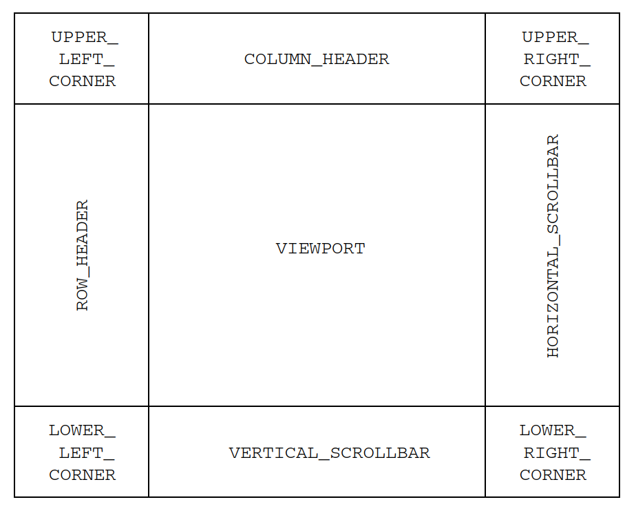

# JScrollPane

## 简介

`JScrollPane` 提供在较小区域内显示大型组件的功能，通过滚动条显示当前不可见的部分。

`JScrollPane` 的结构如下所示：



- 2 个 `JScrollBar` 用于滚动；
- 2 个 `JViewport` 用于 row 和 column 标题；
- 4 个在角落显示的 `Component` 对象；
- 1 个中心的 `JViewport`。

所有这些组件由 `ScrollPaneLayout` 管理。

!!! caution
    `JScrollPane` 只支持滚动轻量级组件。不应该向容器添加重量级 AWT 组件。

## 创建 JScrollPane

`JScrollPane` 有 4 个构造函数：

```java
public JScrollPane()
JScrollPane scrollPane = new JScrollPane();

public JScrollPane(Component view)
Icon icon = new ImageIcon("largeImage.jpg");
JLabel imageLabel = new JLabel(icon);
JScrollPane scrollPane = new JScrollPane(imageLabel);

public JScrollPane(int verticalScrollBarPolicy, int horizontalScrollBarPolicy)
JScrollPane scrollPane = new 
    JScrollPane(JScrollPane.VERTICAL_SCROLLBAR_ALWAYS,
    JScrollPane.HORIZONTAL_SCROLLBAR_ALWAYS);

public JScrollPane(Component view, int verticalScrollBarPolicy,
    int horizontalScrollBarPolicy)
JScrollPane scrollPane = new JScrollPane(imageLabel,
    JScrollPane.VERTICAL_SCROLLBAR_ALWAYS,
    JScrollPane.HORIZONTAL_SCROLLBAR_ALWAYS);
```

构造函数提供了指定组件、水平和垂直滚动策略。

默认情况下，滚动条只在需要时显示。下表是 JScrollPane 中用于设置滚动策略的常量：

|策略|说明|
|---|---|
|VERTICAL_SCROLLBAR_AS_NEEDED|需要时才显示垂直滚动条|
|HORIZONTAL_SCROLLBAR_AS_NEEDED|需要时才显示水平滚动条| 
|VERTICAL_SCROLLBAR_ALWAYS|总是显示垂直滚动条|
|HORIZONTAL_SCROLLBAR_ALWAYS|总是显示水平滚动条|
|VERTICAL_SCROLLBAR_NEVER|从不显示滚动条|
|HORIZONTAL_SCROLLBAR_NEVER| 从不显示滚动条|

## 修改 Viewport view

如果在创建 `JScrollPane` 时指定了需要滚动的组件，那么只需显示 `JScrollPane`。如果在创建时没有关联组件，或者稍后向更改组件，那么有两种方式可以关联新的组件。

首先，可以通过修改 `viewportView` 属性设置：

```java
scrollPane.setViewportView(dogLabel);
```

第二种，先获取 JViewport 引用，然后设置其 view 属性：

```java
scrollPane.getViewport().setView(dogLabel);
```

两种方式本质相同、

## Scrollable 接口

当选项太多而无法一次显示时，AWT 组件，如 `List` 会自动一个可滚动区域，而 Swing 组件，如 `JList`, `JTable`, `JTextComponent` 和 `JTree`，不会自动提供滚动支持。必须创建组件，然后将其添加到 `JScrollPane`：

```java
JList list = new JList(...);
JScrollPane scrollPane = new JScrollPane(list);
aFrame.add(scrollPane, BorderLayout.CENTER);
```

这样处理的原因是，很多 Swing 组件都可能太大而不能一次显示。对所有实现 `Scrollable` 接口的组件，将其添加到 `JScrollPane`，当拖动滚动条，`JScrollPane` 会查询 `Scrollable` 组件的尺寸信息，以便根据当前滚动条位置定位组件。

使用内置组件不需要用到 `Scrollable` 接口，当需要创建自定义组件支持滚动是则需要实现该接口。`Scrollable` 定义如下：

```java
public interface Scrollable{

    Dimension getPreferredScrollableViewportSize();

    int getScrollableUnitIncrement(Rectangle visibleRect, 
                                int orientation, int direction);
    int getScrollableBlockIncrement(Rectangle visibleRect, 
                                int orientation, int direction);

    boolean getScrollableTracksViewportWidth();
    boolean getScrollableTracksViewportHeight();
}
```

## JScrollPane 属性

下表为 `JScrollPane` 的 19 个属性：

|属性名|数据类型|权限|
|---|---|---|
|accessibleContext |AccessibleContext |Read-only|
|columnHeader* |JViewport |Read-write bound|
|columnHeaderView |Component| Write-only|
|componentOrientation |ComponentOrientation| Write-only bound|
|horizontalScrollBar* |JScrollBar |Read-write bound|
|horizontalScrollBarPolicy* |int| Read-write bound|
|layout |LayoutManager| Write-only|
|rowHeader* |JViewport| Read-write bound|
|rowHeaderView| Component| Write-only|
|UI| ScrollPaneUI| Read-write bound|
|UIClassID |String |Read-only|
|validateRoot |boolean |Read-only|
|verticalScrollBar* |JScrollBar| Read-write bound|
|verticalScrollBarPolicy* |int| Read-write bound|
|viewport* |JViewport |Read-write bound|
|viewportBorder| Border| Read-write bound|
|viewportBorderBounds |Rectangle| Read-only|
|viewportView |Component| Write-only|
|wheelScrollingEnabled| boolean |Read-write bound|

> `*` 这些属性直接映射到 `ScrollPaneLayout`。

## ScrollPaneLayout

JScrollPane 通过 ScrollPaneLayout 定位容器内的组件。尽管大多数布局管理器被设计为可以管理所有类型组件，但 ScrollPaneLayout 对组件类型有要求。

下表是 ScrollPaneLayout 各区域接受的组件类型。

|位置|数据类型|说明|
|---|---|---|
|COLUMN_HEADER |JViewport|通常为空。如果 main-content 是一个表格，则作为列标题，不会随着垂直滚动条滚动|
|HORIZONTAL_SCROLLBAR| JScrollBar|main-content 的水平滚动条|
|LOWER_LEFT_CORNER| Component|通常为空。左下角的图形|
|LOWER_RIGHT_CORNER |Component|右下角图形|
|ROW_HEADER| JViewport|通常为空。如果 main-content 是一个表格，则作为行标题，不会随着水平滚动条滚动|
|UPPER_LEFT_CORNER| Component|左上角图形|
|UPPER_RIGHT_CORNER|Component |右上角图形|
|VERTICAL_SCROLLBAR |JScrollBar|main-content 的垂直滚动条|
|VIEWPORT |JViewport|main-content 区域|

## JScrollPane Headers and Corners

