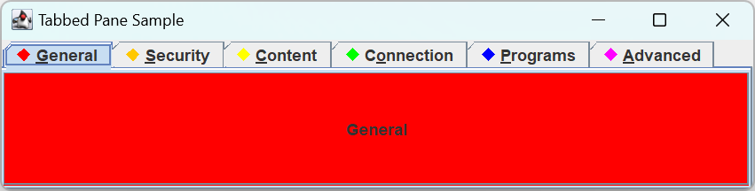

# JTabbedPane

2024-04-11
@author Jiawei Mao
***
## 简介

选项卡面板。

为了帮助 `JTabbedPane` 管理哪个 tab (`Component`) 被选中，`JTabbedPane` 实现了 `SingleSelectionModel` 模型。

## 创建 JTabbedPane

`JTabbedPane` 提供了三个构造函数：

```java
public JTabbedPane()
JTabbedPane tabbedPane = new JTabbedPane();

public JTabbedPane(int tabPlacement)
JTabbedPane tabbedPane = new JTabbedPane(JTabbedPane.RIGHT);

public JTabbedPane(int tabPlacement, int tabLayoutPolicy)
JTabbedPane tabbedPane = 
    new JTabbedPane(JTabbedPane.RIGHT, JTabbedPane.SCROLL_TAB_LAYOUT);
```

构造函数参数包括设置 tab 位置，以及选项卡太多时应采用的布局策略。

选项卡默认在容器顶部，当 tabs 数目超过容器宽度，tabs 将换行。

tab 位置常量：

```java
public static final int TOP     = 1;*
public static final int LEFT    = 2;
public static final int BOTTOM  = 3;
public static final int RIGHT   = 4;
```

布局策略：

-  `JTabbedPane.WRAP_TAB_LAYOUT`
-  `JTabbedPane.SCROLL_TAB_LAYOUT`

## 添加和删除 tabs

创建 `JTabbedPane` 后，下一步就是添加 panels。添加 panels 有两种方式。

如果使用 Eclipse 等可视化工具创建界面，这些工具通常使用 `Container.add()` 方法添加 `Component` 到 panel。标题默认为 `component.getName()`。如果通过编程方式，就有更多选择。

使用 `addTab()` 或 `insertTab()` 添加选项卡更合适。除了待添加的组件和 `insertTab()` 中的索引，其它参数都可以为 `null`。

```java
public void addTab(String title, Component component)
public void addTab(String title, Icon icon, Component component)
public void addTab(String title, Icon icon, Component component, String tip)
public void insertTab(String title, Icon icon, Component component, 
    String tip, int index)
```

`addTab()` 将选项卡添加到末尾。

添加 panel 后，可以修改其 title, icon, 助记符，tooltip，以及该 tab 的组件：

```java
public void setTitleAt(int index, String title)
public void setIconAt(int index, Icon icon)
public void setMnemonicAt(int index, int mnemonic)
public void setDisplayedMnemonicIndexAt(int index, int mnemonicIndex)
public void setToolTipTextAt(int index, String text)
public void setComponentAt(int index, Component component)
```

!!! tip
    设置助记符后，标题的特定字符高亮显示。例如，如果希望第二个 tab 的 title 突出显示助记符，可以使用 `setMnemonicAt()` 将助记符设置 `KeyEvent.VK_T`。

此外，可以改变特定 tab 的背景、前景、禁用或启用等，以及禁用时显示不同的 icon：

```java
public void setBackgroundAt(int index, Color background)
public void setForegroundAt(int index, Color foreground)
public void setEnabledAt(int index, boolean enabled)
public void setDisabledIconAt(int index, Icon disabledIcon)
```

删除选项卡：

```java
removeTabAt(int index)
remove(Component component)
removeAll()
```

## JTabbedPane 属性

`JTabbedPane` 的 11 个属性如下所示。因为许多 `JTabbedPane` 的 getter/setter 方法需要 index 参数，所以严格说来不是属性。

|属性名|数据类型|权限|
|---|---|---|
|accessibleContext|AccessibleContext |Read-only|
|changeListeners |ChangeListener[ ] |Read-only|
|model |SingleSelectionModel |Read-write bound|
|selectedComponent |Component| Read-write|
|selectedIndex| int |Read-write|
|tabCount| int |Read-only|
|tabLayoutPolicy| int |Read-write-bound|
|tabPlacement |int| Read-write bound|
|tabRunCount| int| Read-only|
|UI |TabbedPaneUI |Read-write bound|
|UIClassID |String |Read-only|

通过 `selectedComponent` 或 `selectedIndex` 属性更改选择的选项卡。

`tabRunCount` 属性表示显示所有选项卡所需的 row 或 column 数。

!!! caution
    `JTabbedPane` 不能修改 `LayoutManager`。

## Listening for Changing Tab Selection

通过监听 `model` 可以知道选择的选项卡的变化。即为 `JTabbedPane` 添加 `ChangeListener`，或直接添加到 `SingleSelectionModel`。

**示例：** 监听选项卡的改变，并显示新选中选项卡的标题。

```java
import mjw.swing.DiamondIcon;

import javax.swing.*;
import javax.swing.event.ChangeListener;
import java.awt.*;
import java.awt.event.KeyEvent;

public class TabSample {

    static Color[] colors = {Color.RED, Color.ORANGE, Color.YELLOW,
            Color.GREEN, Color.BLUE, Color.MAGENTA};

    static void add(JTabbedPane tabbedPane, String label, int mnemonic) {
        int count = tabbedPane.getTabCount();
        JButton button = new JButton(label);
        button.setBackground(colors[count]);
        tabbedPane.addTab(label, new DiamondIcon(colors[count]), button, label);
        tabbedPane.setMnemonicAt(count, mnemonic);
    }

    public static void main(String[] args) {

        Runnable runner = () -> {
            JFrame frame = new JFrame("Tabbed Pane Sample");
            frame.setDefaultCloseOperation(JFrame.EXIT_ON_CLOSE);

            JTabbedPane tabbedPane = new JTabbedPane();
            tabbedPane.setTabLayoutPolicy(JTabbedPane.SCROLL_TAB_LAYOUT);
            String[] titles = {"General", "Security", "Content", "Connection",
                    "Programs", "Advanced"};
            int[] mnemonic = {KeyEvent.VK_G, KeyEvent.VK_S, KeyEvent.VK_C,
                    KeyEvent.VK_O, KeyEvent.VK_P, KeyEvent.VK_A};
            for (int i = 0, n = titles.length; i < n; i++) {
                add(tabbedPane, titles[i], mnemonic[i]);
            }

            ChangeListener changeListener = changeEvent -> {
                JTabbedPane sourceTabbedPane = (JTabbedPane) changeEvent.getSource();
                int index = sourceTabbedPane.getSelectedIndex();
                System.out.println("Tab changed to: " +
                        sourceTabbedPane.getTitleAt(index));
            };
            tabbedPane.addChangeListener(changeListener);

            frame.add(tabbedPane, BorderLayout.CENTER);
            frame.setSize(400, 150);
            frame.setVisible(true);
        };
        EventQueue.invokeLater(runner);
    }
}
```



## JTabbedPane laf

每个 laf 都为 `JTabbedPane` 提供了不同的外观和 `UIResource` 值。

`JTabbedPane` 的 UIResource 相关属性如下表所示。

|属性名称|对象类型|
|---|---|
|TabbedPane.actionMap|ActionMap|
|TabbedPane.ancestorInputMap| InputMap|
|TabbedPane.background |Color|
|TabbedPane.borderHightlightColor |Color|
|TabbedPane.contentAreaColor| Color|
|TabbedPane.contentBorderInsets| Insets|
|TabbedPane.contentOpaque| Boolean|
|TabbedPane.darkShadow| Color|
|TabbedPane.focus| Color|
|TabbedPane.focusInputMap| InputMap|
|TabbedPane.font| Font|
|TabbedPane.foreground| Color|
|TabbedPane.highlight| Color|
|TabbedPane.light |Color|
|TabbedPane.opaque |Boolean|
|TabbedPane.selected| Color|
|TabbedPane.selectedForeground |Color|
|TabbedPane.selectedTabPadInsets| Insets|
|TabbedPane.selectHighlight |Color|
|TabbedPane.selectionFollowsFocus| Boolean|
|TabbedPane.shadow| Color|
|TabbedPane.tabAreaBackground| Color|
|TabbedPane.tabAreaInsets |Insets|
|TabbedPane.tabInsets |Insets|
|TabbedPane.tabRunOverlay |Integer|
|TabbedPane.tabsOpaque| Boolean|
|TabbedPane.tabsOverlapBorder| Boolean|
|TabbedPane.textIconGap |Integer|
|TabbedPane.unselectedBackground Color|
|TabbedPane.unselectedTabBackground| Color|
|TabbedPane.unselectedTabForeground| Color|
|TabbedPane.unselectedTabHighlight |Color|
|TabbedPane.unselectedTabShadow| Color|
|TabbedPaneUI |String|
