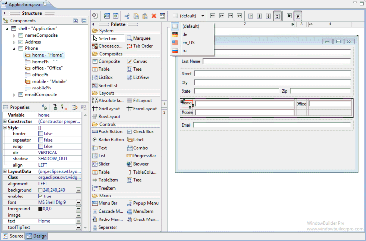

# WindowBuilder 简介

- [WindowBuilder 简介](#windowbuilder-简介)
  - [概述](#概述)
  - [使用 WindowBuilder 流程](#使用-windowbuilder-流程)

## 概述

WindowBuilder 是一个功能强大且易于使用的双向 Java GUI 设计器，可以直接拖动组件设计界面，实时生成代码。

WindowBuilder 以插件的形式在基于 Eclipse 的 IDE 中使用，如 RAD、RSA、MyEclipse、JBuilder 等。WindowBuilder 构建一个抽象语法树（abstract syntax tree, AST）来导航源代码，并使用 GEF 显示和管理可视化表示。

使用 WYSIWYG 布局工具，不需要写任何一行代码，WindowBuilder 会根据设计的界面自动生成代码。生成的代码不需要额外的自定义库编译和运行。WindowBuilder 几乎可以读写任何格式和反向工程的手写 Java GUI 代码。

## 使用 WindowBuilder 流程

1. 安装 WindowBuilder Pro；
2. 创建项目；
3. 创建 GUI 窗口；
4. 选择合适的 Layout manager；
5. 从组件面板（Palette）中添加各种组件，使用 Property Pane 编辑组件属性；
6. 创建和编辑菜单栏；
7. 添加事件处理；
8. 