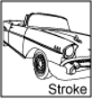
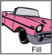
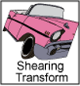

# Graphics

## 属性

Java 2D API为不同设备提供了统一的渲染模型，不管目标设备是打印机还是屏幕，渲染过程在API层次都是一样的。当需要显示某个组件，其 `paint()` 或 `update()` 方法都能以配置合适的 `Graphics` 调用。

`Graphics` 属性：

- Color: 当前绘制颜色(`java.awt.Color)`，所有的绘制，着色和纯文本输出都将以指定的颜色显示；
  - 前景色，用户绘制基本元素的颜色
  - 背景色，当抹去某一区域时使用的颜色
- Font：当前字体(`java.awt.Font`)。用于所有纯文本输出的字体。
- Clip：`java.awt.Shape` 类型，限制画图所在的区域。该特性定义进行绘制的区域。通常这一形状与整个图形环境相同，但也不一定如此。
- ClipBounds：`java.awt.Rectangle` 对象，表示包围Clip属性所需的Shape类型的最小矩形。只读属性。
- FontMetrics：`java.awt.FontMetrics` 只读特性。该对象包含关于图形环境中当前起作用的Font的信息。获取该信息的机制被LineMetrics类取代。
- Paint Mode：该特性控制环境使用当前颜色的方式。

`Graphics2D` 类扩展 `Graphics` 类，提供了更多的图形绘制功能。包括：

- stroke 和 paint属性(draw 方法)，用于渲染几何图元的边框；
- paint 属性 (fill 方法)，使用特定颜色或图案填充图形；
- font 属性，(drawString 方法)渲染文本，通过font属性将字符串转换为字形(glyph)，然后通过paint属性填充颜色或图形；
- 渲染图像(drawImage 方法)。
- 渲染提示(Rendering hint)：Java 2d 用来确定各种渲染基本元素的品质和性能的信息。
- 合成(Composite)，把图像基本元素的颜色数据和目标中的颜色数据合成起来的方法
- 转换(Transform)，制图基本元素的大小、位置和方向

另外，`Graphics2D` 还包含 `Graphics` 的方法，如 `drawOval`, `fillRect`。

以上所有方法可以分为两类：

1. 绘制图形的方法
2. 渲染图形的方法

第二类方法通过设置 `Graphics2D` 的属性值实现以下渲染功能：

- 改变笔画宽度
- 改变笔画之间的连接方式
- 指定需要渲染的区域
- 对图形进行平移、旋转、缩放等
- 设置图形填充的颜色和图案
- 设置多个图形组合的方式

要使用 `Graphics2D` 的功能，需要对 `Graphics` 进行强制转换：

```java
public void paint(Graphics g){
    Graphics2D g2 = (Graphics2D) g;
    ……
}
```

下面以具体图形展示 Graphics2D 的不同特性：

|图示|属性|说明|
|---|---|---|
||pen|应用于图形边框。该 `stroke` 属性允许以任意的点尺寸(point size)、虚线模式(dashing pattern) 、末端链接方式绘制线条|
||fill|用于图形内部，该 `paint` 属性支持纯色、渐变色以及图纹等不同方式填充图形|
||compositing|用于重合对象的渲染|
||transform|将渲染对象从用户空间转换为设备空间时应用的属性，包括平移、旋转、缩放等|
||渲染提示（renderinghints）|在渲染速度和质量之间进行取舍，如是否使用反锯齿|

### RenderingHints

