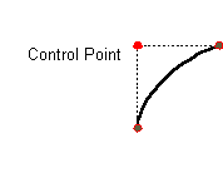

# 图形

- [图形](#图形)
  - [简介](#简介)
  - [图形类](#图形类)
    - [Points](#points)
    - [Lines](#lines)
    - [Rectangle](#rectangle)
    - [二次曲线和三次曲线](#二次曲线和三次曲线)
    - [任意形状](#任意形状)
    - [Area](#area)
  - [绘制图形](#绘制图形)

## 简介

核心内容，使用 `Graphics2D` 类绘制几何图形：

- 绘制标准几何图形，如点、直线、曲线、弧线、矩形和椭圆等。
- 绘制任意图形：通过 `GeneralPath` 类实现。
- 自定义：通过 `stroke` 和 `paint` 属性，设置图形的边框和填充风格。

Java 2D API提供了点、线、矩形、弧线、椭圆、曲线等一套标准的几何图形。这些基本图形都定义在 `java.awt.gemo` 包中。任何其他的形状都可以通过这些基本图形进行组合获得。

## 图形类

`Shape` 接口表示一个几何图形，包含边框和内部区域。该接口定义的方法功能包括：描述和检查二维几何对象，支持曲线片段和图形子片段，而 `Graphics` 类只支持直线片段。

下面是对java.awt.geom 包中各个类的简介。

(AffineTransform, Arc2D, Area, CubicCurve, Dimension2D, Ellipse2D, FlatteningPathIterator, GeneralPath, Line2D, Path2D, QuadCurve, Rectangle2D, RectangularShape, RoundRectangle2D)

黄色部分是遗留类。

### Points

最基本的几何图元是点，`Point2D` 类定义了一个 (x,y) 坐标空间的点。

`Point` 类创建一个点，子类 `Point2D.Float` 和 `Point2D.Double` 提供了对应的 float 和 double 精度的实现。

在Java 2D API中 "point"不等价于 pixel。"point" 没有面积，不包含颜色，并且不能被渲染。

Points 用于创建其他的图形。 `Point2D中` 包含一个计算两点之间距离的方法

绘制方法：

1. Graphics.drawLine(x, y, x, y)，采用drawLine方法，设置起始点和末端点相同。
2. Point2D.Double point = new Point2D.Double(x, y);

### Lines

`Line2D` 是用于表示“线”的抽象类。线的坐标可以用 double 表示。`Line2D` 类包含多个用于设置“线”终点的方法。也可以使用 `GeneralPath` 类创建直线。

### Rectangle

`Rectangle2D`, `RoundRectangle2D`, `Arc2D` 和 `Ellipse2D` 都扩展自 `RectangularShape` 类，该类实现了 `Shape` 接口。

### 二次曲线和三次曲线

`QuadCurve2D` 用于创建二次曲线。二次曲线通过两个端点和一个控制点定义，如下：

`CubicCurve2D` 类用于创建三次曲线。三次曲线通过两个端点和两个控制点定义。

### 任意形状

`GeneralPath` 类可用于创建任意形状。该类通过指定图形的边框创建任意形状。如，下图用三条直线和一条三次曲线创建曲线：

### Area

通过 `Area` 类，可以对两个 `Shape` 对象执行布尔操作，如(合并、交叉、相减)。该技术，也被称为区域几何学(Constructive area geometry)，可用来迅速创建复杂的图形。

## 绘制图形

