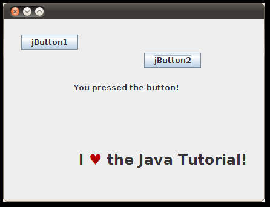
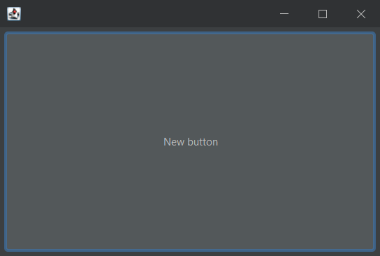
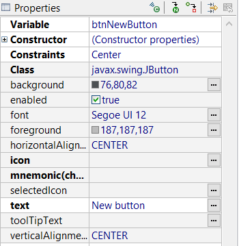
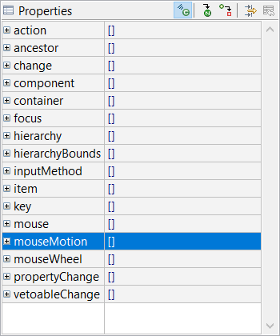
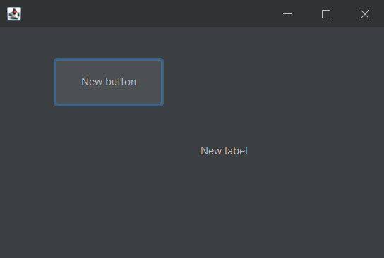
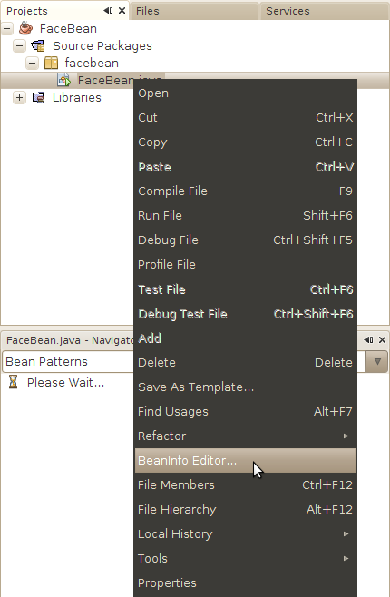
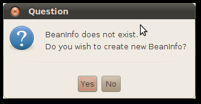
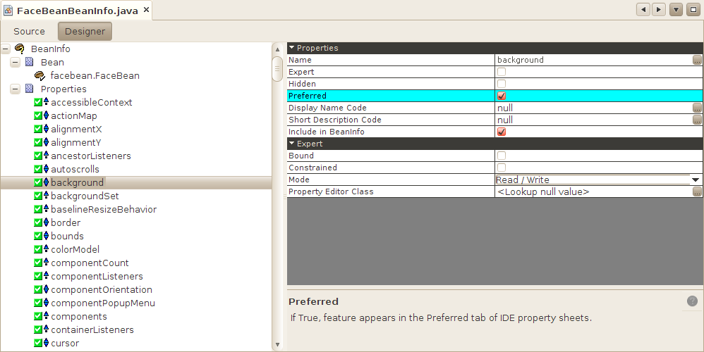

# JavaBeans

2025-07-30
@author Jiawei Mao

***
## 入门

下面构建一个简单的程序，使用 JavaBeans 组件构建如下的图像应用。



### 创建项目

首先创建一个 Java 项目，在其中创建 `JFrame`，下面用 Eclipse 的 WindowBuilder 创建，如下：

```java
public class SnapFrame extends JFrame{

    private JPanel contentPane;

    /**
     * Launch the application.
     */
    public static void main(String[] args){
        EventQueue.invokeLater(new Runnable(){
            public void run(){
                try {
                    SnapFrame frame = new SnapFrame();
                    frame.setVisible(true);
                } catch (Exception e) {
                    e.printStackTrace();
                }
            }
        });
    }

    /**
     * Create the frame.
     */
    public SnapFrame(){
        setDefaultCloseOperation(JFrame.EXIT_ON_CLOSE);
        setBounds(100, 100, 450, 300);
        contentPane = new JPanel();
        contentPane.setBorder(new EmptyBorder(5, 5, 5, 5));
        contentPane.setLayout(new BorderLayout(0, 0));
        setContentPane(contentPane);
    }
}
```

### Button 是 Bean

所有的 Swing 组件都是 bean。添加一个 `JButton` 到按钮，如下：



### 属性



更改 bean 的属性，可以更改其外观或内部属性。`JButton` 是 bean，其属性包括前景色、字体、出现在按钮上的文本等。

### Event

Bean 可以触发事件。在事件窗口可以看到按钮能触发的事件列表：



我们继续下一步事件处理，添加一个 `JLabel` 到 UI 中，如下：



## 写 JavaBean

bean 就是一个 Java 类，它的方法名遵循 JavaBeans 的指导原则。bean 构建工具使用 introspection 检查 bean 类，确定 bean 的属性、方法和事件。

### Properties

在 bean 类中定义属性，提供 public 的 getter 和 setter 方法。例如，下面定义了一个 `int` 属性 `mouthWidth`：

```java
public class FaceBean {
    private int mMouthWidth = 90;

    public int getMouthWidth() {
        return mMouthWidth;
    }
    
    public void setMouthWidth(int mw) {
        mMouthWidth = mw;
    }
}
```

像 NetBeans 这样的构建工具可以识别方法名，并在其属性列表中显示 `mouthWidth` 属性，并识别其类型为 `int`，提供适当的编辑工具，以便在设计时对属性进行操作。

`FaceBean` 展示了一个支持读写的属性。还有只读属性（只有 getter 方法）和只写属性（只有 setter 方法）。

`boolean` 属性比较特殊，可以用 `is` 而不是 `get` 来定义 `getter` 方法。例如，对一个 boolean 类型 `running` 属性的 getter 方法可以按如下定义：

```java
public boolean isRunning() {
    // ...
}
```

**Indexed 属性**

`indexed` 属性是数组，而不是单个值。此时，bean 类提供 get 和 set 整个数组的方法。例如：

```java
public int[] getTestGrades() {
    return mTestGrades;
}

public void setTestGrades(int[] tg) {
    mTestGrades = tg;
}
```

对 `indexed` 属性，bean 类还提供单个元素的 getter 和 setter 方法：

```java
public int getTestGrades(int index) {
    return mTestGrades[index];
}

public void setTestGrades(int index, int grade) {
    mTestGrades[index] = grade;
}
```

### Bound Properties

绑定属性（`bound property`）在值发生变化时通知监听器。即：

- bean 类包含 `addPropertyChangeListener` 和 `removePropertyChangeListener` 用来管理 bean 类的 listener；
- 当绑定属性发生改变时，bean 将一个 `PropertyChangeEvent` 发送到注册的 listener。

`PropertyChangeEvent` 和 `PropertyChangeListener` 在 `java.beans` 包中。

`java.beans` 包中的 `PropertyChangeSupport` 类负责绑定属性的大部分工作。该类可以跟踪 property listeners，包含向所有注册的 listener 触发属性更好的事件。

下面展示如何使用 `PropertyChangeSupport` 将 `moustWidth` 属性设置为绑定属性。

```java
import java.beans.*;

public class FaceBean {
    private int mMouthWidth = 90;
    private PropertyChangeSupport mPcs = new PropertyChangeSupport(this);

    public int getMouthWidth() {
        return mMouthWidth;
    }
    
    public void setMouthWidth(int mw) {
        int oldMouthWidth = mMouthWidth;
        mMouthWidth = mw;
        mPcs.firePropertyChange("mouthWidth", oldMouthWidth, mw);
    }

    public void addPropertyChangeListener(PropertyChangeListener listener) {
        mPcs.addPropertyChangeListener(listener);
    }
    
    public void removePropertyChangeListener(PropertyChangeListener listener) {
        mPcs.removePropertyChangeListener(listener);
    }
}
```

使用 NetBeans 这样的构建工具可以直接将绑定属性和其它 bean 属性绑定。

### Constrained Properties

约束属性（Constrained Properties）是一种特殊的绑定属性。bean 跟踪一组否决（veto）监听器。当约束属性准备更改时，会先咨询监听器，监听器都有机会否决更改，否决后属性更改拒绝，保持原值。

否决监听器和 property change 监听器是分开的。`java.beans` 中包含的 `VetoableChangeSupport`类简化了约束属性。

例如：

```java
import java.beans.*;

public class FaceBean {
    private int mMouthWidth = 90;
    private PropertyChangeSupport mPcs =
        new PropertyChangeSupport(this);
    private VetoableChangeSupport mVcs =
        new VetoableChangeSupport(this); // 约束属性支持

    public int getMouthWidth() {
        return mMouthWidth;
    }
    
    public void setMouthWidth(int mw) throws PropertyVetoException {
        int oldMouthWidth = mMouthWidth;
        // 发出更改事件
        mVcs.fireVetoableChange("mouthWidth", oldMouthWidth, mw);  
        mMouthWidth = mw;
        mPcs.firePropertyChange("mouthWidth", oldMouthWidth, mw);
    }

    public void addPropertyChangeListener(PropertyChangeListener listener) {
        mPcs.addPropertyChangeListener(listener);
    }
    
    public void
    removePropertyChangeListener(PropertyChangeListener listener) {
        mPcs.removePropertyChangeListener(listener);
    }

    // 添加监听器
    public void
    addVetoableChangeListener(VetoableChangeListener listener) {
        mVcs.addVetoableChangeListener(listener);
    }
    
    public void
    removeVetoableChangeListener(VetoableChangeListener listener) {
        mVcs.removeVetoableChangeListener(listener);
    }
}
```

## 事件

bean 类可以触发任何类型的事件，包括自定义事件。与属性一样，事件由特定模式的方法名标识。

```java
public void add<Event>Listener(<Event>Listener a)
public void remove<Event>Listener(<Event>Listener a)
```

监听器必须为 `java.util.EventListener` 的子类。

例如，Swing `JButton` 在用户点击时触发 `action` 事件。`JButton` 包含如下bean 模式的事件方法：

```java
public void addActionListener(ActionListener l);
public void removeActionListener(ActionListener l);
```

## 使用 BeanInfo

beans，尤其是图形组件，往往包含数量惊人的属性。如继承自 `Component`, `JComponent` 或其它 Swing 类，有超过 100 个属性。尽管像 NetBeans 这样的构建工具使编辑 bean 属性更容易，但是找到要编辑的属性很难。

### BeanInfo

`BeanInfo` 是一个改变 bean 在构建工具中显示方式的类。构建工具可以通过查询 `BeanInfo` 确定应该首先显示哪些属性，应该隐藏哪些属性。

bean 的 `BeanInfo` 类应该与其有相同的名字，附加 `BeanInfo` 后缀。例如，`FaceBean` 对应的 `BeanInfo` 类应该命名为 `FaceBeanBeanInfo`。

### 使用 NetBeans 创建 BeanInfo

在项目面板，右键单击 bean 类，选择 BeanInfo Editor...



NetBeans 提示没有 `BeanInfo`，询问是否创建，点击 **Yes**



NetBeans 创建一个心累，此时在源码视图，单击 Designer 切换到可视化编辑器：



