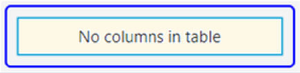
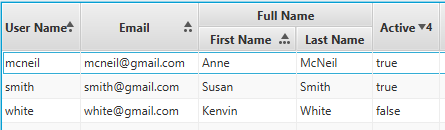

# TableView

- [TableView](#tableview)
  - [简介](#%e7%ae%80%e4%bb%8b)
- [基本使用](#%e5%9f%ba%e6%9c%ac%e4%bd%bf%e7%94%a8)
  - [创建 `TableView`](#%e5%88%9b%e5%bb%ba-tableview)
  - [`TableView` 数据选择和聚焦](#tableview-%e6%95%b0%e6%8d%ae%e9%80%89%e6%8b%a9%e5%92%8c%e8%81%9a%e7%84%a6)
  - [自定义 `TableView` 外观](#%e8%87%aa%e5%ae%9a%e4%b9%89-tableview-%e5%a4%96%e8%a7%82)
- [排序](#%e6%8e%92%e5%ba%8f)
  - [用户排序](#%e7%94%a8%e6%88%b7%e6%8e%92%e5%ba%8f)
  - [编程排序](#%e7%bc%96%e7%a8%8b%e6%8e%92%e5%ba%8f)
    - [设置列可排序](#%e8%ae%be%e7%bd%ae%e5%88%97%e5%8f%af%e6%8e%92%e5%ba%8f)
    - [设置排序类型](#%e8%ae%be%e7%bd%ae%e6%8e%92%e5%ba%8f%e7%b1%bb%e5%9e%8b)
    - [禁用 TableView 排序](#%e7%a6%81%e7%94%a8-tableview-%e6%8e%92%e5%ba%8f)
- [TableColumn](#tablecolumn)
  - [自定义单元格](#%e8%87%aa%e5%ae%9a%e4%b9%89%e5%8d%95%e5%85%83%e6%a0%bc)
  - [Resizing a TableColumn](#resizing-a-tablecolumn)
- [添加数据](#%e6%b7%bb%e5%8a%a0%e6%95%b0%e6%8d%ae)
  - [JavaFX 属性数据](#javafx-%e5%b1%9e%e6%80%a7%e6%95%b0%e6%8d%ae)
  - [使用 Map 作为数据源](#%e4%bd%bf%e7%94%a8-map-%e4%bd%9c%e4%b8%ba%e6%95%b0%e6%8d%ae%e6%ba%90)
- [添加和删除行](#%e6%b7%bb%e5%8a%a0%e5%92%8c%e5%88%a0%e9%99%a4%e8%a1%8c)
- [TableRow](#tablerow)
- [TableCell](#tablecell)
- [编辑](#%e7%bc%96%e8%be%91)
  - [CheckBox 实现](#checkbox-%e5%ae%9e%e7%8e%b0)
  - [ChoiceBox 实现](#choicebox-%e5%ae%9e%e7%8e%b0)
  - [任意组件编辑](#%e4%bb%bb%e6%84%8f%e7%bb%84%e4%bb%b6%e7%bc%96%e8%be%91)

## 简介

`TableView` 用于显示表格数据，具有如下特征：

- `TableColumn`  功能强大
  - 支持 cell factories 自定义 cell 的显示
  - 支持 minWidth, prefWidth, maxWidth 以及 fixed width column。
  - 运行时 column 大小设置
  - column 排序
  - column 嵌套
- 多种可选的调整大小策略
- 可以对多列同时排序（按住 shift 键的同时，点击对应列的标题）

> 注意：`TableView` 用于可视化数据，而不是用于布局界面。对表格式布局，可以用 `GridPane`。

`TableView` 使用涉及到 `TableView`, `TableColumn`, `TableRow`, `TableCell`, `TablePosition`, `TableView.TableViewFocusModel`, `TableView.TableViewSelectionModel` 等类，使用起来较为复杂。

`TableView` 一次只显示部分内容，通过滚动条来查看余下内容，以节省内存占用。

# 基本使用
`TableView` 的属性：
|类型|属性|说明|
|---|---|---|
|Callback<TableView, ResizeFeatures, Boolean>|columnResizePolicy|执行 column-resize 操作时，该函数被调用|
|Comparator<S>|comparator|`sort order` 列表当前状态|
|Boolean|editable|该 TableView 是否可编辑-必须 TablewView, TableColumn 以及 TableCells 都是可编辑才可|
|TablePosition<S, ?>|editingCell|当前被编辑的 cell，或 null 如果无 cell 被编辑|
|double|fixedCellSize|固定高度|
		
## 创建 `TableView`
创建 `TableView` 需要多步，而且依赖于底层的数据模型。其中最简单的方式是使用 `ObservableList`。

首先定义要显示的对象：
```java
public class Person{

    private StringProperty firstName;
    private StringProperty lastName;
    public Person(String firstName, String lastName){
        this.firstName.set(firstName);
        this.lastName.set(lastName);
    }
    public String getFirstName() { 
        return firstNameProperty().get(); 
    }
    public void setFirstName(String value) { 
        firstNameProperty().set(value); 
    }
    public StringProperty firstNameProperty(){
        if (firstName == null)
            firstName = new SimpleStringProperty(this, "firstName");
        return firstName;
    }

    public String getLastName() { 
        return lastNameProperty().get(); 
    }
    public void setLastName(String value) { 
        lastNameProperty().set(value); 
    }
    public StringProperty lastNameProperty(){
        if (lastName == null)
            lastName = new SimpleStringProperty(this, "lastName");
        return lastName;
    }
}
```

`TableView` 为参数化类，参数为要显示的数据类型。也可以将数据模型传递给构造函数。即：
```java
TableView<Person> table = new TableView<>();
```
如果 `TableView` 没有数据，则显示如下内容：



为其设置数据：
```java
 ObservableList<Person> teamMembers = getTeamMembers();
 table.setItems(teamMembers);
```
`TableView` 在数据改变时，会自动更新。

然后定义 TableColumn：
```java
 TableColumn<Person,String> firstNameCol = new TableColumn<Person,String>("First Name");
 firstNameCol.setCellValueFactory(new PropertyValueFactory("firstName"));
 TableColumn<Person,String> lastNameCol = new TableColumn<Person,String>("Last Name");
 lastNameCol.setCellValueFactory(new PropertyValueFactory("lastName"));
 
 table.getColumns().setAll(firstNameCol, lastNameCol);
```
以上，是定义一个 TableView 的最简单的形式。

## `TableView` 数据选择和聚焦
要跟踪对表格的选择和聚焦操作，必须熟悉 `SelectionModel` 和 `FocusModel` 类。一个 `TableView` 最多只有一个  `SelectionModel` / `FocusModel`，两者可以通过 `selectionModel` 和 `focusModel` 属性访问。
可以使用相应的 API 设置新的选择模型，不过大多时候不需要，默认模型足够使用。

默认的 `SelectionModel` 实现 `MultipleSelectionModel` 抽象类。不过 `selectionMode` 的默认值为 `SelectionMode.SINGLE`，即单行选择，设置多行选择的方法：
```java
 tableView.getSelectionModel().setSelectionMode(SelectionMode.MULTIPLE);
```

表格默认选择第一行，去除选择方法：
```java
table.getSelectionModel().clearSelection();
```

## 自定义 `TableView` 外观
`TableView` 的外观可以通过替换默认的 `row factory` 完整的自定义。`row factory` 用于生成 `TableRow` 实例，表示 TableView 的一行。

不过，为每一列设置不同的外观更为常见。另外，`TableRow` 只是 `TableCell` 的容器。通过 `TableColumn` 的 `cell factory` 属性可以为每列自定义 `TableCell` 外观。

# 排序
`TableColumn` 内置有排序功能。默认用户通过点击每一列都标题都可以排序。也可以通过编程排序。也可以禁用部分或全部列都排序功能。

## 用户排序
`TableColumn` 默认带有排序功能，通过点击标题即可排序。通过下面的两个方法，可以设置排序的方式，以及是否可排序。

点击标题次数：
- 1次，升序
- 2次，降序
- 3次，不以该 column 排序

默认支持单列排序，即单击一列时，`TableView` 仅根据该列的值进行排序。如果要多列排序，在点击列标题时，按住 Shift 键。

`TableView` 在列标题会显示排序都类型和顺序。默认用一个三角形指示排序类型：
- 三角形角向上，表示升序
- 三角形角向下，表示降序

列的排序顺序由点或数字指定：
- 前三列的顺序使用点指示，如排序都第一列一个点，第二列两个点，第三列三个点；
- 后面使用数字指示，如第四列使用 4。

如下所示：



按住 Shift 键分别点击 "User Name", "Email", "First Name" 一下，"Active" 两下的效果。

## 编程排序
`TableView` 和 `TableColumn` 提供类强大都排序 API，排序的每一部分几乎都可以自定义。

### 设置列可排序
`TableColumn` 默认是可排序的，可以设置不可排序：
```java
firstNameCol.setSortType(TableColumn.SortType.DESCENDING);
lastNameCol.setSortable(false);
```

### 设置排序类型


在 JavaFX 8.0 之前，`TableView` 将 `items` 列表作为视图模型，列表的任何改变都会可视化表示出来。可以通过修改 list 中元素的顺序进行排序，但是 TableView 就无法回到初始未排序状态。

JavaFX 8.0 后，TableView 可以恢复到原来未排序状态，只要 TableView 的 `sort order`无任何 column 即可。为了实现该目的，首先要创建 `SortedList` 实例，并为TableView 的 `comparator` 属性设置相应的 `comparator` 。

```java
 // create a SortedList based on the provided ObservableList
 SortedList sortedList = new SortedList(FXCollections.observableArrayList(2, 1, 3));

 // create a TableView with the sorted list set as the items it will show
 final TableView<Integer> tableView = new TableView<>(sortedList);

 // bind the sortedList comparator to the TableView comparator
 sortedList.comparatorProperty().bind(tableView.comparatorProperty());

 // Don't forget to define columns!
```

### 禁用 TableView 排序
禁用 `TableView` 排序的方式有多种：
- 设置 `TableColumn` 的 `sortable` 属性可以禁用该列排序，设置所有的列就实现类禁用整个表格排序。
- 设置 `TableView` 的 sort 策略为 null。
- 提前耗掉 `TableVIew` 的 `SortEvent`。
- 从技术上来说，可以覆盖 `TableView`的`sort()`方法，提供一个空实现，不过不推荐。

推荐的都方式是第一种：依次禁用所有列的排序。

# TableColumn
|方法|功能|
|---|---|
|setVisible(boolean value)|隐藏 TableColumn，例如，用户想隐藏部分 Column，可以为该方法添加事件处理|
|setTableMenuButtonVisible(boolean value)|在表格上额外添加一个按钮，用于选择显示的 Column|
|setSortable(boolean value)|是否可排序|
|setSortType(TableColumn.SortType type)|设置排序类型|
|setCellValueFactory()|设置数据填充的 Factory|
|setCellFactory()|设置 cell 的渲染和数据的 Factory|

`TableColumn` 用于显示、编辑单元格里的数据。
- `TableColumn` 有一个标题，该标题可以显示文本及图形。
- `contextMenu` 属性用于设置标题的上下文菜单。
- `TableColumn` 下可以添加子 Column。

TableColumn 包含两个重要属性： 
- `cellValueFactory` 用于填充值，必须指定
- `cellFactory` 用于渲染数据，包含默认值

`TableColumn<S, T>` 也是泛型类，其中 `S` 和 TableView 的类型相同，`T` 为该列显示的数据类型。如
```java
TableColumn firstNameCol = new TableColumn("First Name");
TableColumn lastNameCol = new TableColumn("Last Name");
TableColumn emailCol = new TableColumn("Email");

table.getColumns().addAll(firstNameCol, lastNameCol, emailCol);
```

## 自定义单元格
`TableColumn` 里的单元格是 `TableCell` 类的实例，`TableCell` 是 `Labeled` 控件，可用于显示文本、图形，或者两者同时显示。

`TableColumn`包含一个 `Callback` 类型的`cellFactory` 属性，`TableColumn` 通过该属性的 `call()` 方法获得 `TableCell` 对象。覆盖 `TableCell` 的 `updateItem()` 方法可实现自定义渲染。

`TableColumn`的默认 `cellFactory` 根据数据类型实现渲染，如果数据为 `Node` 类型，则在 `graphic` 属性中显示数据，否则调用数据的 `toString()` 方法，然后在 `text` 属性中显示数据。


## Resizing a TableColumn
`TableColumn` 默认可调整大小，调整大小属性 `resizable` 由`ResizeFeatures` 类定义。

`TableView` 类提供了两个内置的 resize 策略：
- CONSTRAINED_RESIZE_POLICY, 所有 leaf column宽度加和等于 TableView 宽度
- UNCONSTRAINED_RESIZE_POLICY.

# 添加数据
TableColumn 通过 cellValueFactory 提供数据。cellValueFactory 是 `Callback` 对象，将 TableColumn.CellDataFeatures 对象转化为 ObservableValue. CellDataFeatures 类是 TableColumn 的静态内部类，包含对 TableView, TableColumn 以及所在行的引用。

当 TableView 需要值时，调用 cellValueFactory 的 call() 方法，call() 方法返回 `ObservableValue` 类型对象的引用。 ObservableValue 可以包含任意类型的对象，如 Node, 用于在 cell 中显示图形；否则，调用对象的 `toString()` 方法获得值的字符串表示。

## JavaFX 属性数据
PropertyValueFactory 实现 `Callback` 接口，即可以作为 cellValueFactory 。
```
TableColumn<Person, String> fNameCol = new TableColumn<>("First Name");
fNameCol.setCellValueFactory(new PropertyValueFactory<>("firstName"));
```
其中，`firstName`是 `Person` 类中 `firstNameProperty()` 方法的引用，其返回类型必须为 `javafx.beans.property.Property`。如果满足这些条件，`TableCell` 使用该 `ObservableValue` 数据。另外，`TableView` 对该值自动添加 `observer`，在该值被修改后，TableView 会自动更新数据。

如果查找 `firstNameProperty()` 失败，则 PropertyValueFactory 会查找 `get<property>()` 或 `is<property>()` 方法，即将对象作为 POJO (Plain Old Java Object) 。如果有方法匹配该特征，PropertyValueFactory 以 `ReadOnlyObjectWrapper` 包装数据，返回 TableCell。此时的缺点是，当对象值改变，cell 值不会自动更新。

上面的代码等效于：
```java
TableColumn<Person,String> firstNameCol = new TableColumn<Person,String>("First Name");
    firstNameCol.setCellValueFactory(new Callback<CellDataFeatures<Person, String>, ObservableValue<String>>() {
        public ObservableValue<String> call(CellDataFeatures<Person, String> p) {
            // p.getValue() returns the Person instance for a particular TableView row
            return p.getValue().firstNameProperty();
        }
     });
}
```

也可以使用计算值：
```java
TableColumn<Person, String> ageCol = new TableColumn<>("Age");
ageCol.setCellValueFactory(cellData -> {
	Person p = cellData.getValue();
	LocalDate dob = p.getBirthDate();
	String ageInYear = "Unknown";
	if (dob != null) {
		long years = YEARS.between(dob, LocalDate.now());
		if (years == 0) {
			ageInYear = "< 1 year";
		} else if (years == 1) {
			ageInYear = years + " year";
		} else {
			ageInYear = years + " years";
		}
	}
	return new ReadOnlyStringWrapper(ageInYear);
});
```

## 使用 Map 作为数据源
并非所有数据都方便每行显示一个实例，`MapValueFactory` 通过从 Map 获取数据，从而可以很自由的定义每列的数据。基本过程如下：
```java
TableView<Map> table = new TableView<>();

// Define the column, its cell value factory and add it to the TableView
String idColumnKey = "id";
TableColumn<Map, Integer> idCol = new TableColumn<>("Id");
idCol.setCellValueFactory(new MapValueFactory<>(idColumnKey));
table.getColumns().add(idCol);

// Create and populate a Map an item
Map row1 = new HashMap();
row1.put(idColumnKey, 1);

// Add the Map to the TableView items list
table.getItems().add(row1);
```

# 添加和删除行


# TableRow
表示 TableView 的一行，很少用到，除非要自定义行的显示。

# TableCell
表示TableView 中的单个单元格。 `TableCell` 包含一个 `index` 属性，一个 `tableColumn` 用于指定其位置，并且包含 TableRow 引用。


TableCell 包含多个子类：
|子类|特征|
|---|---|
|CheckBoxTableCell||
|ChoceBoxTableCell||
|ComboBoxTableCell||
|ProgressBarTableCell||	
|TextFieldTableCell||
	
# 编辑
`TableView` 的单元格是可编辑的，单元格有可编辑和不可编辑两种状态。

在编辑模式，`TableView`、`TableColumn`和 `TableCell` 都必须是可编辑的。这三个类都有 `editable` 属性，通过 `setEditable(true)` 可设置为可编辑模式。`TableColumn`和 `TableCell` 默认可编辑，因此设置单元格可编辑，只需设置 `TableView` 可编辑：
```java
TableView<Person> table = ...
table.setEditable(true);
```

`TableColumn` 支持三种事件：
- `onEditStart`，列中单元格进入编辑模式触发该事件；
- `onEditCommit`，用户成功提交编辑结果时触发该事件；
- `onEditCancel`，取消编辑时触发该事件，如在 `TextField` 中按 Esc 键。

事件由 `TableColumn.CellEditEvent` 类表示。该事件对象包含很多信息：
- 单元格旧值和新值；
- 单元格所在行的对象值；
- 单元格的位置信息：TableColumn, TablePosition；
- 以及对 TableView 都引用；

通过 `CellEditEvent` 相应方法可以获得所有这些信息。

除了让单元格可编辑还不够。首先，单元格编辑，相对未编辑单元格，需要一个不同的界面。这个功能由 `TableCell` 的实现提供。对 `TableView`，强烈建议按照每列（`TableColumn`）提供编辑功能，因为每列的数据类型相同。单元格是否一直存于编辑状态（如 CheckBox cell 就是如此），或者编辑时采用不同的UI，都是可自定义的。

JavaFX 提供类部分实现，包括：
- `CheckBoxTableCell`
- `ChoiceBoxTableCell`
- `ComboBoxTableCell`
- `TextFieldTableCell`


通过覆盖 `Cell.startEdit()` 方法即可知道单元格何时请求编辑，对值进行更新。
通过覆盖 `Cell.cancelEdit()` 即可重置UI，恢复到初识状态。
在覆盖这两个方法时，要记得调用 super 方法，以保证其他的功能的实现。

在 Cell 处于编辑状态后，接下来是如何提交或取消编辑操作。
`Cell.commitEdit(Object)`，调用该方法时，会生成一个事件，使用 `TableColumn.setOnEditCommit(EventHandler)` 可以监听该事件。

`Cell.calcelEdit()`

## CheckBox 实现
`CheckBoxTableCell` 在表格单元格中提供了复选框实现。一般用于在 Column 中表示 boolean 值，该类也提供类 `Callback` 对象将其它类型的值转换为 boolean 值都功能。

例如，先设置 cellValueFactory：
```java
TableColumn<Person, Boolean> babyCol = new TableColumn<>("Baby?");
babyCol.setCellValueFactory(cellData -> {
    Person p = cellData.getValue();
    Boolean v = (p.getAgeCategory() == Person.AgeCategory.BABY);
    return new ReadOnlyBooleanWrapper(v);
});
```

然后设置 cell factory:
```java
// Set a CheckBoxTableCell to display the value
babyCol.setCellFactory(CheckBoxTableCell.<Person>forTableColumn(babyCol));
```

`CheckBoxTableCell` 不会触发 CellEditEvent 事件，其值和 `ObservableValue` 绑定。

## ChoiceBox 实现
`ChoiceBoxTableCell` 通过下拉框中的值填充单元格。下拉框中的值必须和 `TableColumn` 泛型类型相同。在显示状态，单元格的值通过 `Label` 显示，在编辑状态，切换为 `ChoiceBox`。

例如，为 Person 添加一个 gender 列：
```java
// Gender is a String, editable, ComboBox column
TableColumn<Person, String> genderCol = new TableColumn<>("Gender");
// Use an appropriate cell value factory.
// For now, set all cells to an empty string
genderCol.setCellValueFactory(cellData -> new ReadOnlyStringWrapper(""));
```

然后通过 cellFactory 提供下拉框的值：
```java
// Set a cell factory, so it can be edited using a ChoiceBox
genderCol.setCellFactory(
ChoiceBoxBoxTableCell.<Person, String>forTableColumn("Male", "Female"));
```

在下拉框选择值后，其值更新到底层都数据模型。

点击选择都单元格进行编辑状态，或者双击未选择都单元格。焦点移到其它单元格或从下拉框中选择值后，从编辑状态切换到非编辑状态。

## 任意组件编辑 
通过扩展 `TableCell` 类可以实现使用任意组件编辑单元格数据。例如，通过 `DatePicker` 选择日期，或者通过`RadioButtons` 选择，可以实现各种可能。

自定义 `TableCell` 需要覆盖下面四个方法：
- `startEdit()`
- `commitEdit()`
- `cancelEdit()`
- `updateItem()`


`startEdit()` 将单元格从显示模式切换到编辑模式，一般你需要将自定义组件设置为单元格的 `graphic` 属性，并设置当前数据。

`commitEdit()` 在用户修改数据之后触发，需要将单元格都数据更新到底层数据模型。一般来说不覆盖覆盖该方法，因为 `TableColumn` 是基于 `Writable ObservableValue`，修改的数据会自动提交。

`cancelEdit()` 在用户取消修改后触发，单元格切换回显示状态。你需要覆盖该方法，将值设置回原来都值。

`updateItem()` 在需要重新渲染单元格时调用。
