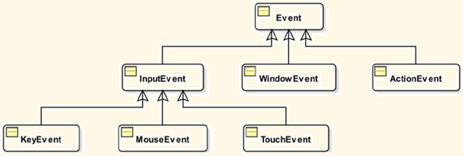
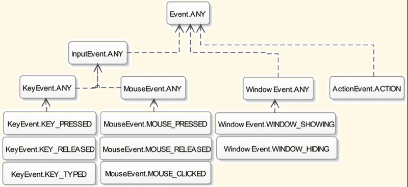
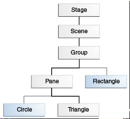

# JavaFX Events

- [JavaFX Events](#javafx-events)
  - [简介](#简介)
    - [事件类型](#事件类型)
  - [事件传递过程](#事件传递过程)
    - [Target Selection](#target-selection)
    - [构建路径](#构建路径)
  - [便捷方法](#便捷方法)
  - [Event Filter](#event-filter)
  - [鼠标事件](#鼠标事件)
    - [鼠标位置](#鼠标位置)
    - [鼠标按钮类型](#鼠标按钮类型)

2020-05-22, 10:15
***

## 简介

JavaFX 的事件由 `javafx.event.Event` 类表示。每个事件至少包含三个属性：

- 事件源（Event Source）
- 事件目标（Event Target）
- 事件类型（Event Type）

当事件发生时，一般要执行某一段代码，响应事件执行的代码称为事件处理程序（EventHandler）。

调用 EventHandler 的UI元素称为事件源，事件沿着时间调度链传递，随着事件的传递，事件源也随之改变。事件源类图：

### 事件类型

- 事件目标（Event Target）

事件目标可以是任何实现 `EventTarget` 接口的类。 `Window`, `Scene`, `Node` 都实现了该接口。`buildEventDispatchChain` 方法为事件目标创建 `Event dispath chain`。

## 事件传递过程

事件传递包含如下几步：

1) 目标（Target）选择
2) 构建路径（Route）
3) 捕获事件
4) 事件排序（Event bubbling）

### Target Selection

当一个事件发生，系统根据如下规则确定事件目标 Node：

- 对 key event, 目标是具有焦点的 node
- 对 mouse event, 目标光标下的 node。对合成鼠标时间，光标位置为触点。
- 对触屏上的连续手势事件，目标是手势开始处所有触点的中间位置的 node。
- …

### 构建路径

初识的事件路径由事件目标的 `buildEventDispatchChain()` 方法创建的 event dispatch chain 确定。

如图所示，事件传递路径，和图层类似。

- 从上到下传递，为事件捕获阶段，执行事件过滤。
- 从下到上传递，为 event bubbling 阶段，执行事件处理。
- 通过 consume() 方法，消耗事件，不再继续传递。
- Event Filter 和 Event Handler 都可以处理事件，两者都实现了 EventHandler 接口。两者的差别在于执行的时间不同。

## 便捷方法

大多数方法在 `Node` 中定义。

| 动作                                               | 事件类型                                                        | 类                                                         |
| -------------------------------------------------- | --------------------------------------------------------------- | ---------------------------------------------------------- |
| 键盘按键                                           | KeyEvent                                                        | Node, Scene                                                |
| 点击或移动鼠标                                     | MouseEvent                                                      | Node, Scene                                                |
| 拖动鼠标                                           | MouseDragEvent                                                  | Node, Scene                                                |
| 使用其他方法输入，用于字符的生成、修改、删除或提交 | InputMethodEvent                                                | Node, Scene                                                |
| 平台支持的拖放操作                                 | DragEvent                                                       | Node, Scene                                                |
| 滚动                                               | ScrollEvent                                                     | Node, Scene                                                |
| 旋转手势                                           | RotateEvent                                                     | Node, Scene                                                |
| 滑动手势                                           | SwipeEvent                                                      | Node, Scene                                                |
| 接触                                               | TouchEvent                                                      | Node, Scene                                                |
| 缩放手势                                           | ZoomEvent                                                       | Node, Scene                                                |
| 请求上下文菜单                                     | ContextMenuEvent                                                | Node, Scene                                                |
| 按下按钮、ComboBox 显示或隐藏、选择菜单            | ActionEvent                                                     | ButtonBase, ComboBoxBase, ContextMenu, MenuItem, TextField |
| List, table 或 tree 中的 item 被编辑               | ListView.EditEvent TableColumn.CellEditEvent TreeView.EditEvent | ListView  TableColumn  TreeView                            |
| 媒体播放器遇到错误                                 | MediaErrorEvent                                                 | MediaView                                                  |
| 菜单的显示或隐藏                                   | Event                                                           | Menu                                                       |
| 弹窗隐藏                                           | Event                                                           | PopupWindow                                                |
| Tab 的选择或关闭                                   | Event                                                           | Tab                                                        |
| Window 的关闭、显示或隐藏                          | WindowEvent                                                     | Window                                                     |

## Event Filter

Event Filter 在事件捕获阶段执行。

注册 Event Filter

- `addEventFilter()`
- `removeEventFilter()`

## 鼠标事件

### 鼠标位置

- getX(), getY(), 获得鼠标相对事件源的位置。
- getSceneX(), getSceneY(), 获得鼠标相对 Scene 的位置。
- getScreenX(), getScreenY(), 获得鼠标相对 screen 的位置。

### 鼠标按钮类型

鼠标按钮（MouseButton）enum 值：
| MouseButton | 功能                     |
| ----------- | ------------------------ |
| NONE        | 表示无按钮               |
| PRIMARY     | 鼠标主按钮，一般为左按钮 |
| MIDDLE      | 中间键                   |
| SECONDARY   | 鼠标副按钮，一般为右按钮 |

获得鼠标按钮状态（MouseEvent 方法）
| 方法                           | 功能                         |
| ------------------------------ | ---------------------------- |
| MouseButton getButton()        | 鼠标事件对应的按钮           |
| int getClickCount()            | 鼠标点击次数                 |
| boolean isPrimaryButtonDown()  | 鼠标主按钮按下               |
| boolean isMiddleButtonDown()   | 鼠标中间按钮按下             |
| bolean isSecondaryButtonDown() | 鼠标副按钮按下               |
| boolean isPopupTrigger()       | 鼠标事件为平台的弹出菜单触发 |
| boolean isStillSincePress()    | 鼠标保持在某个位置没变       |
