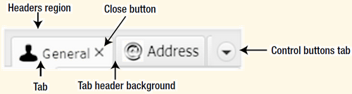

## HBox

默认采用子节点的 prefWidth, preHeight。当 Parent 不是 resizable（如 Group），HBox 采用最高子节点的高度。

|属性|类型|说明|
|---|---|---|
|alignment|`ObjectProperty<Pos>`|子节点相对 HBox 的内容区域的对齐方式。如果垂直对齐方式为 BASELINE，fillHeight 被忽略，默认为 Pos.TOP_LEFT|
|fillHeight|BooleaProperty|resizable 子节点是否 resize 以填充 HBox 的高度，默认为true，alignment=BASELINE 该属性被忽略|
|spacing|DoubleProperty|水平相邻子节点之间的空隙|


## GridPane

`GridPane` 是最强大的布局管理器之一。

属性：

|属性|说明|取值|
|---|---|---|
|alignment||		|
|gridLinesVisible|网格线可见性|true, false|
|nodeOrientation|网格编号顺序|LEFT_TO_RIGHT, RIGHT_TO_LEFT|

方法：

|方法|说明|
|---|---|
|new GridPane()|创建GridPane|
|static void setColumnIndex(Node child, Integer value)|设置 colum index|
|static void setRowIndex(Node child, Integer value)|设置 row index|
|static void setCOlumnSpan(Node child, Integer value)||	
|static void setConstraints(Node child, int columnIndex, int rowIndex)|设置位置|
|void add(Node child, int columnIndex, int rowIndex)|添加控件到指定位置|
|void add(Node child, int columnIndex, int rowIndex, int colspan, int rowspan)|添加控件，并指定位置|
|void addRow(int rowIndex, Node... children)|添加一行控件，每个控件占一个网格|
|void addColumn(int columnIndex, Node... children)|添加一列控件，每个占一个网格|

设置node占有的水平和垂直网格数

node占有的网格数，可以添加node时设置后，也可以之后修改：

- void add(Node child, int columnIndex, int rowIndex, int colspan, int rowspan)
- static void setColumnSpan(Node child, Integer value)
- static void setConstraints(Node child, int columnIndex, int rowIndex, int columnspan, int rowspan)

修改 node 占用网格数的方法：

- setRowSpan(Node child, Integer value)
- setColumnSpan(Node child, Integer value)

## TextFlow

TextFlow 用于显示富文本。
多个 Text 节点添加到 TextFlow 中，TextFlow 将这些 Text 合并显示。`Text` 有其位置，大小，换行宽度等，添加到 TextFlow后，这些属性均被忽略。

虽然TextFlow 是为显示文本而设计，不过其他 Node，如 Buttons, TextFields 等都可添加其中，大小以 preferred size 显示。

可以将 TextFlow 看做 FlowPane  的修改版，只是对 Text 特殊对待。

## TabPane

`TabPane`包含两部分：标题和内容。标题包含多个组成部分，如下图所示：



说明：

- "Headers region" 是标题全部区域
- Tabheaderbackground为标题背景
- Controlbuttons则是在分栏太多无法显示时，用于选择特定tab
- tab区域包含一个`Label`和一个closebutton，Label用于显示tab的标题和图标，closebutton为关闭tab的按钮

### 设置 Tab 大小

`TabPane` 将其区域分为两部分：

- 标题区
- 内容区

标题区显示 tab 的标题，内容区显示当前选择的 tab 的内容。

内容区的大小根据其内容自动计算大小，`TabPane` 包含如下属性用于设置标题区的尺寸：

- `tabMinHeight`
- `tabMaxHeight`
- `tabMinWidth`
- `tabMaxWidth`

默认宽度和高度的最小值为0，最大值为 `Double.MAX_VALUE`。而默认尺寸则是根据内容自动计算。如果你希望所有 tab 具有相同大小的标题区，可以将高度和宽度的最小值和最大值设置为相同值。如下所示：

```java
TabPane tabPane = new TabPane();
tabPane.setTabMinHeight(30);
tabPane.setTabMaxHeight(30);
tabPane.setTabMinWidth(100);
tabPane.setTabMaxWidth(100);
```
