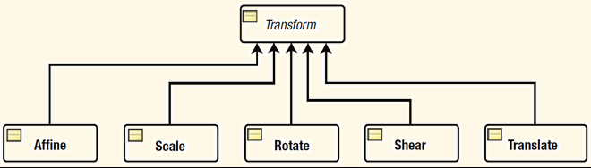
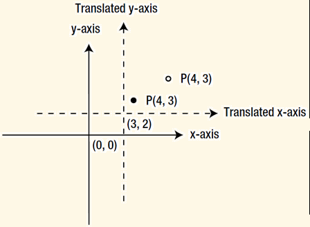
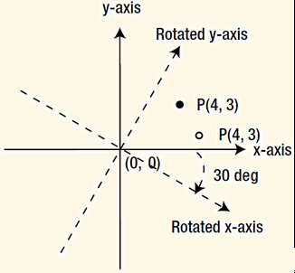

# Transformation

- [Transformation](#transformation)
  - [概述](#概述)
  - [平移（Translation）](#平移translation)
  - [旋转（Rotation）](#旋转rotation)
  - [缩放（Scale）](#缩放scale)
  - [剪切变换（Shear）](#剪切变换shear)

## 概述

转换（Transformation）是将一个坐标系的点映射到另一个坐标系的过程，映射后，点与点之间的距离和方向保持不变。JavaFX 支持以下几种转换：

| 转换操作    | 说明                               |
| ----------- | ---------------------------------- |
| Translation | 平移                               |
| Rotation    | 旋转                               |
| Shear       | 剪切                               |
| Scale       | 缩放                               |
| Affine      | 仿射变换，保留点、线和面的广义变换 |

JavaFX 中的类图如下：



`Affine` 是最强大的变换，不过要求的矩阵变换比较了解，用起来略微复杂。其他转换的使用方法很简单，创建和使用变换的方式有多种。

创建 `Transform` 实例的方法有两种：

- 使用 `Transform` 类的工厂方法
- 使用特定类的构造函数创建，如使用 `Rotate` 类创建旋转变换

下面两种方法创建的变换相同：

```java
double tx = 20.0;
double ty = 10.0;

// Using the factory method in the Transform class
Translate translate1 = Transform.translate(tx, ty);

// Using the Translate class constructor
Translate translate2 = new Translate(tx, ty);
```

应用变换的方法也有两种：

- 使用 `Node` 类的属性。如，使用 `Node` 的`translateX`, `translateY`, `translateZ` 实现变换，不过该方法不能实现 shear 变换
- 使用 `Node` 类的 `transforms` 列表。通过 `getTransforms()` 方法获得 `ObservableList<Transform>` 的引用，添加转换到该列表即可

这两种应用转换的方法略微有所不同。还可以同时使用这两种方式，使用 `transforms` 列表会先被应用，随后应用 node 的转换属性。

## 平移（Translation）

将 node 的坐标系原点从移到一个新的位置。下图是转换示意图：



平移由 `Translate` 类表示，该类包含三个属性值：x, y, z，用于表示平移后新的原点坐标。
`Node` 的 `layoutX`, `layoutY`, `translateX`, `translateY` 属性实现方式则不改变原点位置，而是改变 `Node` 所有点的坐标位置。

一般来说 `layoutX` 和 `layoutY` 用于将 node 放在 `Scene` 指定地方，平移转换则是为了实现动画效果。如果同时使用了这两种方式，node 的本地坐标系被平移，然后根据 `layoutX` 和 `layoutY` 将node放在一个新的坐标系。

## 旋转（Rotation）

在旋转变换中，坐标轴以一个点为中心进行转换，坐标系中的点映射到新的坐标系。绕 Z 轴旋转30°的示意图：



`Rotate` 类通过如下五个属性控制旋转：

- angle，旋转的角度，默认为0.0，正值表示顺时针旋转
- axis，旋转的轴，可取值 `Rotate.Z_AXIS`, `Rotate.X_AXIS`, `Rotate.Y_AXIS`，默认为 `Z_AXIS`
- pivotX, pivotY, pivotZ

`pivotX`, `pivotY`, `pivotZ` 定义了旋转的点，默认值均为 0.0.

也可以使用 `Node` 的 `rotate` 和 `rotationAxis` 属性进行旋转操作，两者分别指定旋转的角度和坐标轴，原始的 `layoutBounds` 的中心作为旋转中心。

## 缩放（Scale）

缩放转换通过对坐标系的单位刻度乘以特定的参数实现缩放。

`Scale` 类通过六个属性描述转换：x, y, z, pivotX, pivotY, pivotZ。x, y, z 之定义不同轴上的缩放参数，默认为 1.0. pivotX, pivotY, pivotZ 定义缩放的中心点。

通过 `Scale` 类或 `Node` 类的 `scaleX`, `scaleY`, `scaleZ` 属性可以均可以实现缩放。`Scale`的默认缩放中性点为 (0, 0, 0)，`Node` 的默认缩放中心点为该节点的中心。

## 剪切变换（Shear）

剪切变换通过坐标轴绕中心点转换实现，所以，坐标轴之间不再垂直。变换后，矩形称为了平行四边形。

`Shear` 类通过四个属性定义剪切变换：x, y, pivotX, pivotY.

- x 属性指定坐标系中的点的 y 值沿着 x 轴移动的参数，默认为0.0
- y 属性指定坐标系中的点的 x 值沿着 y 轴移动的参数，默认为0.0
- pivotX 和 pivotY 为中心点坐标。

对点 (x1, y1)，剪切变换后的点为：

```java
x2 = x1 + x * (y1 - pivotY)
x2 = y1 + y * (x1 - pivotX)
```
