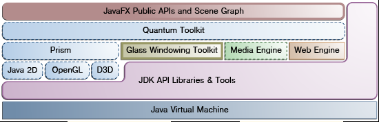
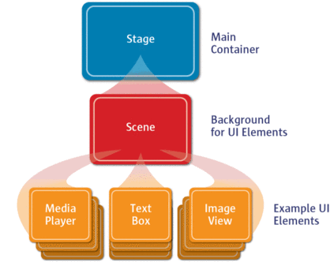

# Introduction

- [Introduction](#introduction)
  - [概述](#概述)
  - [JavaFX API 框架](#javafx-api-框架)
  - [JavaFX 程序结构](#javafx-程序结构)
    - [Scene Graph](#scene-graph)
  - [更新 java11](#更新-java11)

## 概述

JavaFX 是继 AWT 和 Swing 后，Java 平台的下一代开源 GUI 工具包。JavaFX 包含如下特性：

- 纯 Java 编写。
- JavaFX 支持数据绑定。
- JavaFX 提供了两种构建 UI 的方式：Java 代码或FXML。FXML是一个基于XML的标记语言，以声明的方式定义UI。Oracle 提供的 Scene Builder支持以可视化的方式编辑FXML文件。
- JavaFX 支持多媒体。
- JavaFX 可以内嵌网页。
- JavaFX 提供了开箱即用的特效和动画，这对开发游戏很重要，通过几行代码就可以实现复杂的动画。

## JavaFX API 框架

JavaFX API 框架如下图所示：



核心API主要包括四个部分：
| 组件                    | 说明                                                                                                                                                                          |
| ----------------------- | ----------------------------------------------------------------------------------------------------------------------------------------------------------------------------- |
| Prism                   | 用于渲染图形的图形引擎，如果特定平台的硬件加速渲染不可用(Windows上的 DirectX, Mac Linux 上 的 OpenGL)，则使用 Java2D                                                          |
| Glass Windowing Toolkit | 链接本地OS和 JavaFX，提供窗口管理、时间等服务。同时负责管理事件线程。JavaFX 由操作系统级线程 JavaFX Application Thread 管理事件队列，所有用户输入事件和UI修改都必须通过该线程 |
| Media Engine            | 为JavaFX提供多媒体支持，media engine 使用单独的线程处理 media frames，使用 JavaFX 应用线程进行同步。media engine 是基于开源的 GStreamer 框架构建                              |
| Web Engine              | 用于处理 scene graph 中内嵌的HTML内容。Prism 负责渲染网页内容。web engine 基于开源的 WebKit 构建，支持HTML5,CSS,JavaScript,DOM和AVG                                           |

Glass Windowing Toolkit 功能

- 主要用于提供操作系统服务，如管理窗口，Timers and surfaces。
- 作为独立于平台的包装层，链接JavaFX平台和本地OS。
- 管理事件队列，AWT使用其自身的事件队列，而Glass toolkit使用本地OS的事件队列

JavaFX 系统至少同时运行2个线程：
JavaFX application thread, 所有UI相关的更新必须在该线程执行；
Prism render thread, 单独用于渲染的线程；

## JavaFX 程序结构



JavaFX 程序结构如图所示：

- `Stage` 是程序的主窗口（对内嵌在浏览器中的应用，是主矩形区域），在`Stage` 中，可以放置一个 `Scene`中。
- `Scene` 是顶层容器，放置 `Stage` 的各种可视控件，这些控件以 `Scene graph` 的形式组织。

### Scene Graph

JavaFX 的所有可视化控件以分层树的结构组织起来，构成 `Scene graph`。`Scene graph` 中的单个UI元素称为 `Node`，一个`Node` 要么是叶节点(leaf node)，要么是分支节点(branch node)。分支节点可以包含其他节点，即子节点。

`Node` 的具体实现有多种，包括基本的几何形状、布局管理器、图形、多媒体等，还可以对节点属性进行修改，如添加特效、修改透明度、转换等。

Scene Graph 特征：

- Scene Graph 以树结构组织 UI 的所有可视化组件。
- Scene Graph 中的元素称为 Node.
- 每个Node都有响应的ID, style class, bounding volumn；
- 每个节点有一个母节点和[0, ∞]子节点(根结点除外)，还可能包含如下的特性
  - 特效(如模糊、阴影)
  - 透明度
  - 变形转换
  - 事件处理

javafx.scene API 可用于创建如下内容：

- Nodes: Shapes (2-D and 3-D), images, media, embedded web browser, text, UI controls, charts, groups, and containers.
- State: Transforms (positioning and orientation of nodes), visual effects, and other visual state of the content.
- Effects: simple objects that change the appearance of scene graph nodes, such as blurs, shadows, and color adjustment.

## 更新 java11

如果要使用 java 9 及以后的 javafx，可以使用 `javafx-maven-plugin` maven 插件：

```xml
<plugin>
    <groupId>org.openjfx</groupId>
    <artifactId>javafx-maven-plugin</artifactId>
    <version>0.0.3</version>
    <configuration>
        <options>
            <option>--add-opens</option>
            <option>javafx.graphics/com.sun.javafx.css=org.controlsfx.controls</option>
        </options>
        <jlinkImageName>pdk</jlinkImageName>
        <compress>0</compress>
        <mainClass>omics.pdk.gui.SearchWindow</mainClass>
    </configuration>
    <!--command: mvn javafx:run-->
</plugin>
```

这样可以比较方便的运行 javafx 程序。
